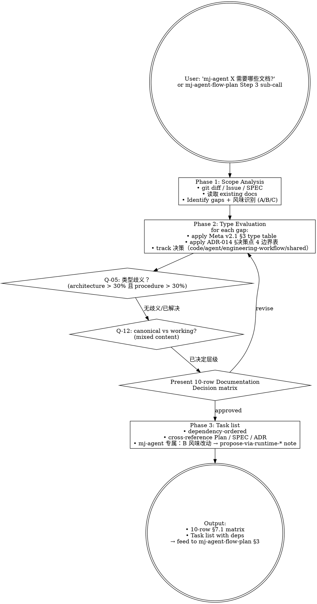

# mj-agent Doc Planner

## 本技能的执行约定

执行前读取 [共用执行边界](../../references/execution-boundaries.md)。独立调用只完成本技能；委派时记录调用者与返回阶段，同阶段必要校验完成后返回。下游 Handoff 均为建议，不能自动跨阶段或发布。受保护动作先完成可审阅草案；Owner 批准与宿主执行能力分开，hook 硬阻断时返回 `BLOCKED_EXECUTION_ROUTE`。


## 触发与职责详述

This skill evaluates what documentation is needed for an mj-agent topic, module, or change scope by analyzing diff/Issue/SPEC scope against Meta v2.2 + Code_Side v1.1 + Agent_Side v1.1 requirements (12 canonical types + tri-track classification + 项目根 markdown 5 件治理例外 per §2.6). Make sure to use this skill whenever the user says "评估文档需求", "文档规划", "需要哪些文档", "documentation gap analysis", "evaluate documentation for", "plan docs for", "what documentation does X need", "Documentation Decision", "§7.1 矩阵", "doc gap" in the mj-agent context. ⚠ Direction-distinct from mj-agent-flow-plan: this skill evaluates **what documentation is needed** (§7.1 Documentation Decision matrix sub-set only); flow-plan authors the **full working Plan body** (HITL Stage 4) and sub-calls this skill for the §7.1 sub-section. Outputs a 10-row Documentation Decision matrix + dependency-ordered task list. Identifies 3 new file types (CONTRIBUTING.md / GLOSSARY.md / Quick_Start_Setup.md) introduced by PR #171-#174. Do not use for: writing a single known document (use mj-agent-doc-author), full Plan body authoring (use mj-agent-flow-plan, this skill is its sub-routine), or validating a written document (use mj-agent-doc-validate).


## Overview

按 mj-agent 项目 scope 评估需要哪些文档（10 类 × Action 决策矩阵：Plan / SPEC / ADR / RUNBOOK / GUIDE / STANDARD / Local ISSUE / ASSESSMENT / CHANGELOG / INDEX）。**Stage 4 sub** of HITL_Prompt 17-stage 闭环；典型由 `mj-agent-flow-plan` Step 3 嵌套调用。

**Reference**:
- `repo:sdd/workflows/execution-loop.md` §1（Stage 4 Plan + Stage 3 Repo Scan 在 17-stage loop 的位置；Documentation Decision 矩阵 §7.1）
- `repo:policies/documentation.md` §2.1（12 canonical 类型 + 默认 track）+ §3（tri-track 分类）+ §2.6（项目根 markdown 5 件治理例外）
- `repo:docs/rule/[STANDARD]_GitHub_Markdown.md` §14（项目根 README 与 Markdown 特例；PR #173 新加）

## When to Use

**MUST run when**：
- Stage 4 Plan body 编写中 Step 3 Documentation Decision sub-section（被 mj-agent-flow-plan 嵌套调）
- 用户明确"评估文档需求 / 缺哪些文档 / Documentation Decision"
- 多 PR / 多模块工作启动前的 doc gap 分析

**MAY skip**：
- 单 typo / 单文件 trivial 改动
- Plan body 已有完整 §7.1 矩阵且不需重新评估

**MUST NOT use for**：
- 写单个已知类型文档 → `mj-agent-doc-author`
- 写完整 Plan body → `mj-agent-flow-plan`（本 skill 是其 Step 3 子例程）
- 验证已写文档 → `mj-agent-doc-validate`

## Workflow



## Phase 1: Scope Analysis

```bash
# 1. Issue body
branch=$(git branch --show-current)
issue=$(echo "$branch" | grep -oE '[0-9]+' | head -1)
[ -n "$issue" ] && gh issue view "$issue" --json title,body

# 2. 当前 diff
git diff --name-only HEAD
git diff --stat HEAD

# 3. 已有 docs（按 mj-agent 模块定位）
git diff --name-only HEAD | grep -oE 'src/mj_agent/[a-z_]+/' | sort -u | \
  while read mod; do ls "docs/design/$(basename "$mod")"/*.md 2>/dev/null; done
ls docs/rule/*.md docs/adr/*.md docs/guide/*.md docs/runbook/*.md docs/infrastructure/**/*.md 2>/dev/null

# 4. 风味识别（per ADR-015 §决策点 3）
# A 纯代码 / B in-source canonical 永远 HITL / C infra
```

输出：
- 已 documented vs 缺失清单
- 每个 gap 的 mj-agent 模块（agent/llm/prompt/skill/sql/db/config/biz_catalog/...）
- 每个 gap 的风味（A/B/C）

## Phase 2: Type Evaluation（10 类决策）

### 类型决策树（Meta v2.2 §3 + ADR-014 §决策点 4 边界表 + §2.6 项目根例外）

| 内容性质 | 类型 | 默认 track | 目录 |
|---|---|---|---|
| **项目根 5 件**（项目入口/协作/版本日志/术语索引/AI 缓存） | **不入 canonical 治理表**（per Meta v2.2 §2.6 例外；不写 frontmatter；A1-A3 不适用；不入本 Documentation Decision matrix；语法约束见 GitHub_Markdown §14） | — | 项目根：README.md / CONTRIBUTING.md / CHANGELOG.md / GLOSSARY.md / AGENTS.md |
| 短期任务执行计划（怎么推进） | `[PLAN]` | working layer 不需 track | `plans/` |
| 接口契约 / 行为不变量 / 数据 schema | `[SPEC]` | shared / agent / code 按主题 | `docs/design/{module}/` |
| 架构决策 / 长期约束 / 备选方案对比 | `[ADR]` | shared / engineering-workflow 按主题 | `docs/adr/` |
| 运维 / 故障恢复 / 部署 / 回滚操作 | `[RUNBOOK]` | code | `docs/runbook/` 或 `docs/infrastructure/{domain}/` |
| 开发者上手 / 操作流程 / 工具使用 | `[GUIDE]` | code | `docs/guide/` 或 `docs/infrastructure/{domain}/` |
| 长期规则 / 命名 / 工程流程 | `[STANDARD]` | code / engineering-workflow / shared | `docs/rule/` 或 `docs/infrastructure/{domain}/` |
| 长期问题锚点（中高风险延后处理） | `[ISSUE]` | shared | `docs/issues/` |
| 优化前后对比 / 改造效果评估 | `[ASSESSMENT]` | shared | `docs/assessments/` |
| 用户可见行为变更（feat/fix/perf）记录 | CHANGELOG | — | `CHANGELOG.md` |
| canonical 入口同步（文档目录变化） | INDEX | — | `docs/INDEX.md` 或 `docs/**/INDEX.md` |

### Track 决策（v2.1 4 值）

per `repo:decisions/ADR-014_Tri_Track_Documentation_Governance.md` §决策点 4 边界表：

| Artifact 类型 / 范例 | track |
|---|---|
| `src/mj_agent/skills/**/SKILL.md` 改动 / `prompts/*.md` 改动 | `agent`（B 风味） |
| `src/mj_agent/{tools,memory,integrations,server,...}/` + `tests/` | `code`（A 风味） |
| `docker/` / `pyproject.toml` / `qcm_catalog.yaml` / `.env.example` | `code`（C 风味） |
| `.agents/skills/` / `.codex/hooks.json` / `.codex/config.toml` / HITL_Prompt 类 STANDARD | `engineering-workflow` |
| ADR / SPEC / STANDARD 跨多 track | `shared`（PR body 论证） |

### Q-05 类型歧义触发

若某 gap 内容兼含架构（>30%）+ 操作指导（>30%）→ 触发 Q-05 询问用户：

```
观察到 <topic> 同时含：
- 架构决策 / 长期约束（>30%）
- 操作步骤 / 故障恢复（>30%）
推荐拆分：(1) [ADR] 记录决策 + [RUNBOOK] 记录步骤（推荐）/ (2) 单一 [GUIDE]（兼容架构 + 步骤）/ (3) 用户决定具体类型
```

### Q-12 canonical vs working 歧义

若某 gap 内容兼含长期参考（canonical）+ 短期执行（working）→ 询问：

```
观察到 <topic> 同时含：
- 长期参考材料（canonical 候选：SPEC/ADR/RUNBOOK/GUIDE）
- 短期执行步骤（working 候选：plans/[PLAN]_*.md）
推荐：长期 canonical 单独建；短期执行 plan 单独建；不混在一起
```

## Phase 3: Task List

按 dependency 排序输出 §7.1 矩阵 + Task List：

```markdown
## Documentation Decision Matrix

| Type | Action | Path | Existing Target | Reason | Evidence | Track | Required Before |
|---|---|---|---|---|---|---|---|
| Plan | Create | `plans/[PLAN]_<id>_<desc>.md` | — | <为什么需要> | <Issue/diff/Issue> | — | SPEC / Implementation |
| SPEC | Create / Update / None | `docs/design/{module}/[SPEC]_*.md` | <现有路径或无> | ... | ... | shared/agent/code | Implementation |
| ADR | Create / Update / None | `docs/adr/[ADR]_*.md` | ... | ... | ... | shared/engineering-workflow | SPEC / Implementation |
| RUNBOOK | Create / Update / None | `docs/runbook/[RUNBOOK]_*.md` 或 `docs/infrastructure/**/[RUNBOOK]_*.md` | ... | ... | ... | code | PR / Release |
| GUIDE | Create / Update / None | `docs/guide/` 或 `docs/infrastructure/**` | ... | ... | ... | code | PR |
| STANDARD | Create / Update / None | `docs/rule/[STANDARD]_*_v1.0.md` | ... | ... | ... | code/engineering-workflow/shared | PR |
| Local ISSUE | Create / Update / None | `docs/issues/[ISSUE]_*.md` | ... | ... | ... | shared | Plan |
| ASSESSMENT | Create / Update / None | `docs/assessments/[ASSESSMENT]_*_v1.0.md` | ... | ... | ... | shared | Post-implementation |
| CHANGELOG | Update / None | `CHANGELOG.md` | ... | <user-visible / release> | ... | — | Commit / PR |
| INDEX | Update / Regenerate / None | `docs/INDEX.md` 或局部 INDEX.md | ... | <canonical 入口变化> | ... | — | PR |

## Task List
1. Create [doc1] — depends on: none
2. Create [doc2] — depends on: doc1
3. Update INDEX.md — depends on: all above

## mj-agent 专属备注
- B 风味（src/mj_agent/{skills,prompts}/）改动 → 建议先用 mj-agent-runtime-* propose diff（PR-C2）；§3.1 必停 HITL 项 10/11 触发
- biz_catalog drift（src/mj_agent/biz_catalog/qcm_catalog.yaml）→ scripts/diff_biz_schema.py 比对 mj-system 上游 STANDARD §2-§4
- engineering-workflow track 文档（.codex/** 或 HITL_Prompt 类 STANDARD）→ A12-A14 PR 门禁
```

## Key Principles

- **Always present 10-row matrix before writing tasks**：让用户看完整 evaluation 再确认
- **Update existing 优先于 Create new**：检查现有 SPEC / GUIDE / RUNBOOK 是否能扩展
- **每个 mj-agent 模块**应有 ≥1 SPEC + 相关 RUNBOOK
- **每个基础设施域**应有 ≥1 GUIDE（参 docs/infrastructure/git/ 4 GUIDE 范例）
- **每个 optimization round**应有 ≥1 ASSESSMENT（per ADR-010 + Code_Side §3.8）
- **跨模块延迟问题**应有 [ISSUE]（>10 行分析时）
- **B 风味改动**触发 EVAL backlog ticket（per HITL_Prompt §4.15 Rule 11；准备 follow-up Issue 草案（发布须明确授权））

## What This Skill DOES NOT DO

- ❌ 不直接写文档（仅输出 §7.1 matrix + task list；user 决定后调 mj-agent-doc-author）
- ❌ 不替代 mj-agent-flow-plan（本 skill 是其 Step 3 子例程；flow-plan 写完整 Plan body 8 段）
- ❌ 不替代 mj-agent-flow-repo-scan（repo-scan 是 Stage 3 事实核查，含 §7.1 矩阵作为其 Step 5；本 skill 是 Stage 4 Plan body 内的 §7.1 子例程）
- ❌ 不写 Plan 文件（仅 §7.1 matrix；Plan body 完整 8 段由 flow-plan 写）
- ❌ 不验证文档格式（用 mj-agent-doc-validate）

## Sub-skill / Tool Calls

| Tool | 用途 |
|---|---|
| shell `gh issue view` | Phase 1 fetch Issue |
| shell `git diff` / `git status` | Phase 1 capture diff |
| 文件枚举 / 读取 | Phase 1 已有 docs 扫描 + Phase 2 type 决策依据 |
| 向 Owner 询问 | Phase 2 Q-05 / Q-12 歧义解决 |

## Reference Files

- `repo:sdd/workflows/execution-loop.md` §1（Stage 4 / Stage 3 在 17-stage loop 的位置）
- `repo:policies/documentation.md` §2.1（12 类 + track 默认）+ §3（track 决策树）
- `repo:decisions/ADR-014_Tri_Track_Documentation_Governance.md` §决策点 4 边界表
- `repo:sdd/workflows/execution-loop.md`（有效三风味/停点规则；旧 ADR-015 路径基线缺失，仅作历史来源） §决策点 3（3 风味）

## Anti-patterns

- **不要** 直接写完整 Plan body（那是 flow-plan 的职责；本 skill 仅 §7.1 子集）
- **不要** 跳过 Q-05/Q-12 歧义判断（混合内容会导致 reviewer 反复挑战类型）
- **不要** 在 B 风味改动场景跳过 EVAL backlog 备注（违反 execution-loop §7.3 Rule 11 开单草案及明确发布授权）
- **不要** 把 mj-agent 模块 boundary 跨越当作"shared"track（默认应优先按 mj-agent 7 模块分类）

## Handoff

```
§7.1 Documentation Decision Matrix 已输出。
下一步：
- mj-agent-flow-plan Step 3 嵌套调用本 skill 的输出 → 写 Plan body §3
- 或 user 直接 mj-agent-doc-author 起草具体文档（按 task list 顺序）
```
