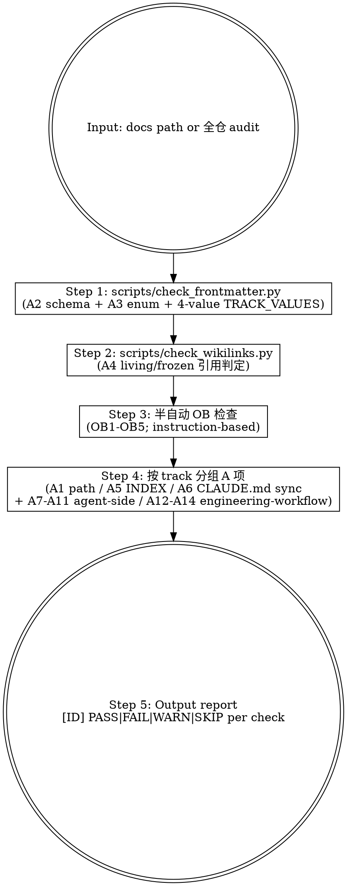

# Codex carrier preface

> **This file is a generated artifact.** It is a deterministic translation of
> `.claude/skills/<this-skill>/SKILL.md` produced by `scripts/sdd/agents_sync.py`;
> never edit it — edit the source through its own gates and re-run sync.
>
> **Semantic difference declaration.** The Claude Code harness primitives this
> body references — `ask`-gates, permission prompts, protected-path prompts,
> `PreToolUse` hooks, `.claude/settings.json`, `guard-git-workflow` — are NOT
> present under your harness. Read every such reference as an AGENTS.md
> self-enforced duty (repo-root `AGENTS.md`, "Self-enforced boundaries"): the
> stop points themselves are tool-neutral; only the carrier differs. Claude
> tool names (Edit / Write / Read / Bash and friends) and Claude
> self-references likewise read as "your own equivalent tool / yourself".
> `OWNER_APPROVAL_REQUIRED` stop points bind you exactly as written.
>
> **Optional skill calls.** Before following any `superpowers:*` or other
> optional-skill reference, run your CURRENT capability discovery: if the skill
> is discoverable, invoke it (`$skill-name` or an explicit "use skill-name");
> if it is not, perform the manual equivalent the body describes. These
> references are not Claude-only and must not be skipped on the assumption
> that they are.
>
> **Peer skills.** `$mj-agent-*` names and `.agents/skills/<name>/SKILL.md`
> paths refer to your native carriers of the same shared skills; dependency
> routes annotated as `codex-route:<edge-id>` blocks carry the registered
> substitute when a target has no carrier.

# mj-agent Doc Validator

## Overview

包装 mj-agent 已有的 2 个 validator 脚本（`scripts/check_wikilinks.py` + `scripts/check_frontmatter.py`）+ instruction-based 半自动检查。返回 `PASS / FAIL / WARN / SKIP` per check。

> mj-agent **不**像 mj-system 有统一 `validate_doc.py`；本 skill 编排两个脚本 + 半自动 OB 检查 + A6/A12-A14 PR-mode 选项。

**Direction-distinct from `/mj-agent-flow-verify`**：
- **本 skill** (`mj-agent-doc-validate`)：单文档 / docs/ 子集 schema / wikilinks 校验；调 2 个 scripts；交互流程（指引 user 跑 / 解释 fail）
- **mj-agent-flow-verify** (Stage 10)：多域命令矩阵（lint / mypy / pytest / docker compose / Studio probe / docs validate）；把 2 scripts 作为 Level A 命令直接跑，**不**进入本 skill 交互

## When to Use

**MUST run after**：
- 创建 / 编辑任何 `docs/**/*.md`
- 提 PR 含 docs 改动前
- Stage 11 self-review 本地验证段（mj-agent-flow-self-review Step 3）
- v2.1 promote / archive workflow 后的全仓 audit（如 PR-B3c-promote 末次自检）

**MAY skip**：
- 仅 typo 修正（user 决定跳过）
- `.claude/skills/**` 改动（不在 SCAN_ROOTS；ADR-013 native schema 不走本 skill）

## Workflow



## Step 1: scripts/check_frontmatter.py

```bash
# 全仓
uv run python scripts/check_frontmatter.py

# 单文件 / 子集（脚本内部 SCAN_ROOTS 决定；目前不支持 path 参数，全仓扫）
```

校验内容（v2.1 起）：
- **A2** Frontmatter schema：required fields {type / summary / owner / created / updated / state / track}
- **A3** state enum：{draft / active / deprecated / completed}
- **A3** track enum：4 值 {code / agent / engineering-workflow / shared}（v2.1 promote 后启用）

输出：`OK: N canonical docs all pass` 或 `FAIL: N of M docs have violations` + per-doc 违规原因。

## Step 2: scripts/check_wikilinks.py

```bash
uv run python scripts/check_wikilinks.py
```

校验：
- **A4** 内部 wikilink `[[...]]` target 在仓库中存在
- 触及历史 v1.1 / v2.0 archive 路径时按 ADR-011 §5.6 living vs frozen 判定（living refs 必须迁到最新；frozen pin via archive 路径 OK）
- 跨文档相对路径解析（`../`、`../../` 等）

输出：`OK: 0 violations` 或具体未解析 wikilink 列表 + 文件 + 行号。

## Step 3: 半自动 OB 检查（instruction-based）

mj-agent 当前 OB1-OB5 阈值未完全定稿（per Code_Side v1.1 §7.2 TODO Phase 1）；本 skill 输出建议性 WARN：

| OB# | 维度 | 检查方法 | 阈值（建议） |
|---|---|---|---|
| OB1 | 文档长度区间 | wc -l | GUIDE 100-500；RUNBOOK 100-300；ADR 80-300；SPEC 200-600；STANDARD 200-1500；SKILL 150-450 |
| OB2 | 时态一致性 | 扫"将"vs"已"vs"正在"动词比例 | 主观自评 |
| OB3 | 内容边界 | 对照 type's MUST NOT list（per Code_Side §3.x / Agent_Side §2-§5） | 边界 → WARN；明显违 → FAIL |
| OB4 | summary 质量 | summary 字段非空 + 20-60 字符 + 无含糊词 | 自评 |
| OB5 | 内部一致性 | 同文档不同段落陈述不矛盾 | 自评 |

详见 mj-system `[STANDARD]_Documentation_Management_Framework.md` §7.2（Lite Phase A 占位上游）。

## Step 4: 按 track 分组 A 项

剩余 A 项校验需 manual / PR-mode 判断：

### Code-Side（A1-A6 + OB1-OB5；全部 track 共享）

- **A1** Path + filename 合法（per [TYPE]_Description[_vX.Y].md 模式）
- **A5** `docs/INDEX.md` 已同步（人工对照新增 canonical doc 是否在 INDEX 表中）
- **A6** allowlist 文档变更 → CLAUDE.md sync（**触发轴**：Meta v2.2 §6.4 **4 类 allowlist** —— 类 1 全局高频标准 / 类 2 高频运行信息 / 类 3 项目目录入口 / 类 4 mj-agent 特化 runtime 语义；**落位轴**：v2.2 §6.4.1 三段分流）：
  - `track: code` → CLAUDE.md `## Code-Side Documentation` 段
  - `track: agent` → `## Agent-Side Documentation` 段
  - `track: engineering-workflow` → `## Engineering-Workflow Documentation` 段
  - `track: shared` → 元规则段
  - 项目根 markdown（无 track）触发 §6.4 任一类时 → 元规则段或对应主题段（per Meta v2.2 §2.6）

### Agent-Side（A7-A11；仅 track: agent 时触发）

- **A7** SKILL 路径与目录一致；Python 实现存在
- **A8** PROMPT `state: active` 时 `eval_references` 非空（Phase 2 起强制；当前 transitional waiver）
- **A9** EVAL `state: active` 时 `dataset_path` + `baseline_metric` + `baseline_value` 必填（Phase 2 起强制）
- **A10** CONTRACT `state: active` 时 `schema_ref` 存在
- **A11** SKILL `state: active` 时 `eval_references` 非空（Phase D 起强制）

### Engineering-Workflow（A12-A14；v2.1 promote 后启用，仅 track: engineering-workflow）

- **A12** `.claude/skills/<name>/SKILL.md`：ADR-013 native 2 字段；description ≥ 200 chars + 正向触发 + `Do not use for:` 反向触发段
- **A13** `.claude/settings.json` allowlist diff 评审（无裸 Bash 通配；secret pattern 在 deny；enabledPlugins 改 PR body 论证）
- **A14** `.mcp.json` server 增删声明 trust posture + credential mode

> **注**：A12-A14 校验当前是 manual review；自动校验留给 Phase 2 CI 实现。

## 项目根 markdown 例外（Meta v2.2 §2.6 + GitHub_Markdown §14.5）

如校验目标是项目根 5 件之一（README / CONTRIBUTING / CHANGELOG / GLOSSARY / CLAUDE.md），自动 emit：

```
[A1]  SKIP — 项目根 markdown 不强制 [TYPE]_ 前缀（per Meta v2.2 §2.6）
[A2]  SKIP — 项目根 markdown 不要求 frontmatter（per Meta v2.2 §2.6）
[A3]  SKIP — 项目根 markdown 无 state/track 字段
[A4]  CHECK — wikilink 完整性仍校验（项目根 markdown 仍受 A4 约束）
[A5]  CHECK — docs/INDEX.md 同步仍校验（如适用）
[A6]  CHECK — §6.4 4 类 allowlist 仍触发（CLAUDE.md sync 仍受约束）
```

GitHub_Markdown §14 项目根特例语法（badges / 行内 HTML / ASCII 架构图 / 多语言 README）适用 — 当前 manual review，未自动化。

## Output Format

```
[A1]  PASS — Path and filename valid for [GUIDE] in docs/guide/
[A2]  PASS — 7/7 required frontmatter fields present (含 track)
[A3]  PASS — state=active, track=code, type=guide all valid
[A4]  PASS — 0 wikilink violations (scripts/check_wikilinks.py)
[A5]  WARN — docs/INDEX.md 未含本新文档；建议补行
[A6]  SKIP — 不在 allowlist（仅 framework / 架构 / 核心运行入口触发）
[A7]  SKIP — track ≠ agent
[A8]  SKIP — 不是 PROMPT
[A9]  SKIP — 不是 EVAL
[A10] SKIP — 不是 CONTRACT
[A11] SKIP — track ≠ agent
[A12] SKIP — track ≠ engineering-workflow / 不在 .claude/skills/
[A13] SKIP — 不动 .claude/settings.json
[A14] SKIP — 不动 .mcp.json
[OB1] WARN — 长度 612 行，超 GUIDE 推荐区间 100-500（建议拆分或参考长 GUIDE 范例）
[OB2] PASS — 时态一致
[OB3] PASS — 内容在 GUIDE MUST list 内
[OB4] PASS — summary 字段 35 字符
[OB5] PASS — 内部一致

总判断: PASS（1 WARN，无 FAIL；可继续 commit）
```

## Running Full Audit（全仓）

```bash
# Stage 11 self-review 或 Phase B end 自检
uv run python scripts/check_frontmatter.py && uv run python scripts/check_wikilinks.py
```

期望：
- `OK: 58 canonical docs all pass frontmatter schema check`
- `OK: 0 violations`

如失败：阅读输出 → 修复 → 重跑。

## What This Skill DOES NOT DO

- ❌ 不写 / 修改文档（仅校验；fix 由 user 决定后用 /mj-agent-doc-author / Edit）
- ❌ 不替代 `/mj-agent-flow-verify`（flow-verify 是 Stage 10 多域命令矩阵；本 skill 仅 docs schema/wikilinks，作为 flow-verify Level A 命令池子集）
- ❌ 不替代 `/mj-agent-flow-self-review`（self-review 是 Stage 11 双段 + 12-item checklist；本 skill 仅 docs 校验，是 self-review §3 本地验证段子项）
- ❌ 不 auto-fix（仅报告 + 修复指引）
- ❌ 不强制 OB 阈值（mj-agent v2.1 起首期 OB1-OB5 是 WARN-only；Phase 1 阈值定稿后升级）

## Sub-skill / Tool Calls

| Tool | 用途 |
|---|---|
| Bash `uv run python scripts/check_frontmatter.py` | Step 1 schema + 4 值 TRACK_VALUES |
| Bash `uv run python scripts/check_wikilinks.py` | Step 2 内部 wikilink |
| Read | Step 3 OB 检查（文档内容） / Step 4 INDEX/CLAUDE allowlist 比对 |
| Glob | Step 4 A1 path 模式校验 |
| Bash `wc -l` | OB1 长度估算 |

## Reference Files

- [[../../../scripts/check_frontmatter.py|scripts/check_frontmatter.py]]（A2 + A3 + 4 值 TRACK_VALUES enum；v2.1 起首）
- [[../../../scripts/check_wikilinks.py|scripts/check_wikilinks.py]]（A4 wikilink；含 living/frozen archive 判定）
- [[../../../policies/documentation|policies/documentation]] §2.6（项目根 markdown 例外）+ §6（frontmatter / state）+ §7.1（4 类 allowlist）+ §7.2（三段分组）+ §5.1（A1-A6）+ §5.2（OB1-OB5）
- [[../../../policies/documentation|policies/documentation]] §5.1（A1-A6）+ §5.2（OB1-OB5 适用 全 track）
- [[../../../policies/documentation|policies/documentation]] §5.3（A7-A11 仅 agent track 跨轨门禁）+ [[../../../sdd/adapters/runtime-skill|sdd/adapters/runtime-skill]] / [[../../../sdd/adapters/prompt|sdd/adapters/prompt]] / [[../../../sdd/adapters/contract|sdd/adapters/contract]]
- A12-A14（engineering-workflow）：A12 → [[../../../sdd/adapters/claude-code-skill|sdd/adapters/claude-code-skill]] §Standards/§CI Gate；A13 → [[../../../policies/ci-gates|policies/ci-gates]] §5.1；A14 → [[../../../policies/ai-agent|policies/ai-agent]] §4
- [[../../../docs/rule/[STANDARD]_GitHub_Markdown|GitHub_Markdown v1.1]] §14（项目根 README 与 Markdown 特例；语法约束 manual review）
- mj-system `.claude/skills/mj-sys-doc-validate/SKILL.md`（直接派生源；mj-agent 改用 2 scripts 包装而非 mj-system 单 validate_doc.py；mj-agent 加项目根例外）

## Anti-patterns

- **不要** 把 OB 阈值当 FAIL（Phase 1 之前是 WARN-only；硬阻断会误伤）
- **不要** 跳过 A4 wikilinks（v2.1 promote 后历史路径可能 break；必跑）
- **不要** 在 .claude/skills/ 子目录跑本 skill（不在 SCAN_ROOTS；ADR-013 native schema 由 mj-agent-git-review-pr D9 校验）
- **不要** auto-fix CLAUDE.md sync（A6 是 manual review；自动 sync 会破坏 Meta v2.2 §6.4 4 类 allowlist + §6.4.1 三段分流意图）
- **不要** 对项目根 markdown 5 件强制 A1-A3 检查（per Meta v2.2 §2.6 例外；emit SKIP）

## Handoff

```
Validate 完成。
PASS → 可继续 $mj-agent-git-commit
FAIL / WARN → 阅读修复指引 → Edit / Codex substitute edge-doc-validate-doc-author 修 → 重跑本 skill 直至 PASS
全仓 audit PASS（58 docs all pass + 0 wikilinks）→ 可入 Stage 11 self-review
```

<!-- codex-route:edge-doc-validate-doc-author -->
> Codex route: No native Codex carrier for the doc family: follow the shared documentation semantics (sdd/adapters/development-agent.md + docs/_templates), propose the document body in conversation, obtain Owner approval, then write it and run the repo doc validators.

<!-- codex-route:edge-doc-validate-git-commit -->
> Codex route: invoke `$mj-agent-git-commit` (native carrier; handoff, conditional)
