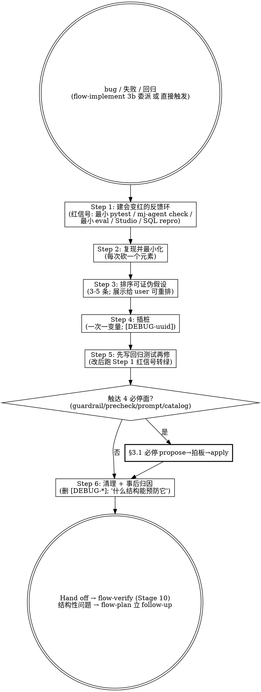

# mj-agent Flow — Diagnose (HITL Stage 8/10 邻接)

## Overview

硬 bug / 性能回归 / flaky 的**纪律化诊断**子流程。工作位置：被 `/mj-agent-flow-implement` Step 3b 委派（难复现 / perf / flaky / 查不出根因），或用户直接触发。核心信条——**90% 在于先建一个会对"这个 bug"变红的 tight / 确定性反馈环（红信号），再谈假设**；修复后红信号转绿即闭环。与 `evidence-before-assertion` 同源：红信号就是实证。

> **leading word「红信号」**（per [[../../../docs/rule/[STANDARD]_MJ_Agent_Skill_Authoring_Craft|技能写作工艺规范]] §6）= 会对当前 bug 确定性变红、修复后转绿的最小信号。

**Reference**：[[../../../sdd/workflows/execution-loop|execution-loop]] §5（Level A/B 矩阵——红信号常落在 Level A 一条最小检查）。

## Workflow



## When to Run This Skill

| 判定 | 场景 |
|---|---|
| **MUST** | 难复现 bug / 性能回归 / flaky（时好时坏）/ 查不出根因；被 flow-implement Step 3b 委派 |
| **MAY skip** | 简单显见 bug（typo / 明确单点）→ 仍在 `/mj-agent-flow-implement` Step 3b 内按 Rule 7 解决 |
| **MUST NOT** | 当通用编码方法论（用 flow-implement）/ 当验证矩阵（用 flow-verify）/ 当自检（用 flow-self-review） |

## Step 1: 建"会变红"的反馈环（红信号）

先建一个**确定性、最小、对当前 bug 变红**的信号——越快越确定越好。mj-agent 常见映射：

| 红信号载体 | 适用 |
|---|---|
| 最小 `uv run --frozen --no-sync python scripts/sdd/run_offline_pytest.py tests/unit/...::test_x` | 逻辑 / guardrail / precheck / 工具行为 bug |
| `uv run mj-agent check` | DB / LLM 凭证 / 连接 / 配置 drift |
| 最小 eval case（`tests/eval/`） | SQL 生成 / skill routing / LLM 行为质量 bug |
| Studio repro（`/mj-agent-infra-studio-probe`）/ curl | 端到端 graph / 中间件 / envelope bug |
| 最小 SQL repro（只读账号） | 数据边界 / 时间谓词 / row_count bug |
| `git bisect` | "之前好、现在坏"的回归——二分定位引入 commit |

**判据（checkable）**：能用一条命令稳定让信号变红（同输入必现）；不能稳定复现 → 不能声称定位/修复。

## Step 2: 复现并最小化

从能复现的最大场景出发，**每次砍掉一个元素**重跑红信号——仍红则该元素无关、可删；转绿则该元素 load-bearing、保留。收敛到剩下的每个元素都必要的最小复现。

## Step 3: 排序可证伪假设（3-5 条）

列 3-5 条**可证伪**假设，每条写成"若 X 是因，则改 Y 信号转绿 / 改 Z 更糟"。按"最可能 × 最易验"排序，**展示给 user 可重排**（一次一问式，对齐 `/mj-agent-flow-intake` 逼问纪律）。❌ 不要不建红信号就直接跳到某个假设动手改。

## Step 4: 插桩（一次一变量）

按假设排序逐条验，**一次只动一个变量**：debugger / REPL 优于散弹式日志；必须加日志时用 `[DEBUG-<uuid>]` 前缀便于 Step 6 清理。每动一次重跑 Step 1 红信号观察变化。

## Step 5: 先在正确缝写回归测试，再修

定位 root cause 后，**先在正确架构缝写一条会红的回归测试**（缝优先复用既有、放最高合理层——常 = 一条 unit 或一条 eval），再从根修复（不加掩盖症状的防御层；遵 flow-implement Rule 7）。修后跑 Step 1 红信号 + 新回归测试**双双转绿**。

> **必停不可绕**：若修复触达 4 必停面（`tools/sql/guardrail.py` / `precheck.py` / `prompts/system.md` / `src/mj_agent/skills/*` body / `qcm_catalog.yaml`）→ 走 [[../../../policies/ai-agent|ai-agent]] §8/§9 propose→拍板→apply（经对应 `/mj-agent-runtime-*`），不被本 skill 绕过。

## Step 6: 清理 + 事后归因

删除全部 `[DEBUG-*]` 插桩；commit message 写明中选假设 + root cause；问一句"**什么结构能预防它**"——若答案是结构性的（缺测试缝 / 缺守卫 / 缺类型），**回 `/mj-agent-flow-plan` 立 follow-up**（不在本次强行扩 scope）。

## What This Skill DOES NOT DO

- ❌ 不替代 `/mj-agent-flow-implement`（编码方法论 + 简单 bug 的 Step 3b）。
- ❌ 不替代 `/mj-agent-flow-verify`（Stage 10 完整验证矩阵）。
- ❌ 不直接改 4 必停面（走 `/mj-agent-runtime-*` propose→拍板→apply）。
- ❌ 不 auto-commit（修复 commit 由 `/mj-agent-git-commit`）。

## Anti-patterns

- ❌ 没建红信号就跳假设动手改（违反 feedback-loop-first 核心）。
- ❌ 一次动多变量——无法归因哪个变量起效。
- ❌ 先修后补测试（或不补）——回归网漏。
- ❌ "我机器上能跑" / 关闭 flaky 测试当修复。
- ❌ 留 `[DEBUG-*]` 插桩未清理。

## Reference Files

- [[../../../sdd/workflows/execution-loop|sdd/workflows/execution-loop]] §5（Level A/B 矩阵）+ §6（AI Self-review 检查清单；Stage 11 tie-in）
- [[../../../docs/rule/[STANDARD]_MJ_Agent_Skill_Authoring_Craft|技能写作工艺规范]] §6（leading word「红信号」）
- [[../../../policies/ai-agent|policies/ai-agent]] §8/§9（4 必停面 propose→拍板→apply）
- [CLAUDE.md "Commands"](../../../CLAUDE.md)（uv-based 红信号命令）

## Direction Matrix vs Companion mj-agent-flow-* Skills

| Skill | Stage | 职责 | 触发关键词 |
|---|---|---|---|
| **mj-agent-flow-diagnose**（本 skill） | **8/10 邻接** | **硬/flaky/perf bug 的 feedback-loop-first 诊断** | "排查 bug" / "复现" / "flaky" / "性能回归" / "查不出原因" |
| mj-agent-flow-implement | 8 | 编码方法论 + 简单 bug Step 3b | "implement" / "TDD" / "root cause" |
| mj-agent-flow-verify | 10 | 验证命令矩阵 | "本地验证" / "跑测试" / "Level A/B" |
| mj-agent-flow-self-review | 11 | 11 项自检清单 | "声称完成前" / "self-review" |

## Handoff

```
诊断闭环（红信号转绿 + 回归测试绿）。下一步：
- 进 Stage 10 本地验证（sdd/workflows/execution-loop.md §5 验证矩阵）跑完整验证确认无回归
- 结构性预防项 → Stage 4 计划环节（execution-loop §4 映射表）立 follow-up
- 修复 commit → /mj-agent-git-commit
```
