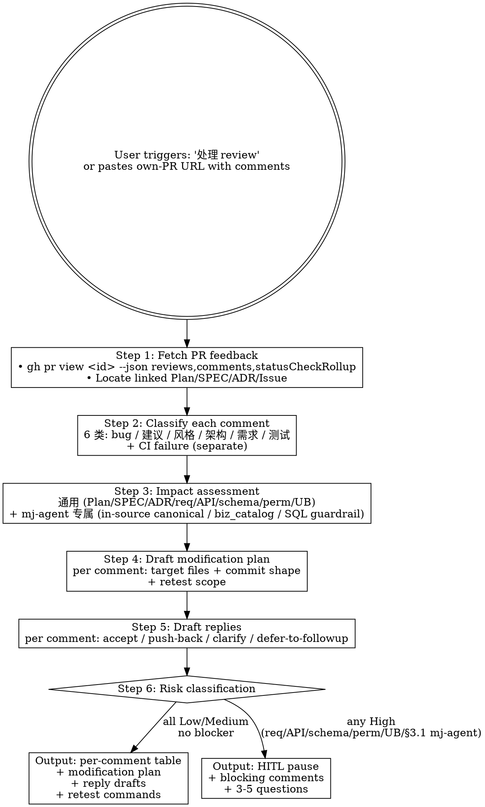

# Codex carrier preface

> **This file is a generated artifact.** It is a deterministic translation of
> `.claude/skills/<this-skill>/SKILL.md` produced by `scripts/sdd/agents_sync.py`;
> never edit it — edit the source through its own gates and re-run sync.
>
> **Semantic difference declaration.** The Claude Code harness primitives this
> body references — `ask`-gates, permission prompts, protected-path prompts,
> `PreToolUse` hooks, `.claude/settings.json`, `guard-git-workflow` — are NOT
> present under your harness. Read every such reference as an AGENTS.md
> self-enforced duty (repo-root `AGENTS.md`, "Self-enforced boundaries"): the
> stop points themselves are tool-neutral; only the carrier differs. Claude
> tool names (Edit / Write / Read / Bash and friends) and Claude
> self-references likewise read as "your own equivalent tool / yourself".
> `OWNER_APPROVAL_REQUIRED` stop points bind you exactly as written.
>
> **Optional skill calls.** Before following any `superpowers:*` or other
> optional-skill reference, run your CURRENT capability discovery: if the skill
> is discoverable, invoke it (`$skill-name` or an explicit "use skill-name");
> if it is not, perform the manual equivalent the body describes. These
> references are not Claude-only and must not be skipped on the assumption
> that they are.
>
> **Peer skills.** `$mj-agent-*` names and `.agents/skills/<name>/SKILL.md`
> paths refer to your native carriers of the same shared skills; dependency
> routes annotated as `codex-route:<edge-id>` blocks carry the registered
> substitute when a target has no carrier.

# mj-agent Flow — Respond to Review Comments (HITL Stage 15)

## Overview

处理自己 PR 的 review feedback。分类每条 comment，评估对 linked Plan / SPEC / ADR 的影响 + mj-agent 专属高风险面（in-source canonical / biz_catalog / SQL guardrail / system.md version），起草修改计划 + 回复。

**Direction-critical**：

| Skill | Direction | When |
|---|---|---|
| `/mj-agent-git-review-pr`（PR-B3） | **审别人 PR** | Architecture / design / merge-readiness review |
| `/mj-agent-flow-review-respond`（本 skill） | **回应自己 PR comments** | Stage 15 of HITL flow — 处理收到的 feedback |

**Reference**: [[../../../sdd/workflows/execution-loop|execution-loop]] §4.1（Stage 13/15 → 本 skill 映射；per-stage prompt 未 re-port，历史源 HITL_Prompt §4.13 Rules + Output 6 字段）+ [[../../../sdd/workflows/execution-loop|execution-loop]] §6（AI Self-review 双段约束；修复后须出双段证据；实操矩阵见 §5）.

## Workflow



## When to Run This Skill

**MUST run when**：
- 自己 PR 有新 review comments 待回应
- CI 失败需分析
- 用户粘 PR URL 问怎么回
- 收到 review 后修代码前（避免漫无目的改）

**MAY skip when**：
- PR 还没 review（直接进 Stage 16 Merge Gate）
- 全是 "LGTM" / "approve"（不需 classify）
- 用户明确"我直接改了"（仍记跳过原因）

**MUST NOT use for**：
- 审**别人**的 PR → `/mj-agent-git-review-pr`（PR-B3 落地）
- Pre-commit self-check → `/mj-agent-flow-self-review`（Stage 11）
- Pre-merge readiness → `/mj-agent-git-check-merge`（PR-B3 落地）

## Step 1: Fetch PR Feedback

```bash
# Fetch reviews + per-line comments + CI status
gh pr view <pr-id> --json reviews,comments,statusCheckRollup,headRefName,baseRefName,number,title

# 或 comment list
gh api repos/MJ-AgentLab/mj-agent/pulls/<pr-id>/comments    # per-line review comments
gh api repos/MJ-AgentLab/mj-agent/issues/<pr-id>/comments   # PR-level conversation
gh pr checks <pr-id>                                         # CI status detail
```

定位 linked artifacts（同 mj-agent-flow-scope-drift Step 1）：
- Plan: `plans/[PLAN]_*.md` / `[INTAKE]_*.md`
- SPEC: `docs/design/{module}/[SPEC]_*.md`
- ADR: `docs/adr/[ADR]_*.md`
- Issue: 从 PR body / branch name 解析

如 PR ID 未给 → 从当前 branch 推断（`gh pr list --head $(git branch --show-current)`）。

## Step 2: Classify Each Comment

按 [[../../../sdd/workflows/execution-loop|execution-loop]] §4.1 的 Stage 13/15 映射（历史源 HITL_Prompt §4.13 Rules 2），每条 comment 归类（一条可多类）：

| 类别 | 触发特征 | 例 |
|---|---|---|
| **bug** | reviewer 指错代码 / 边界 case / 数据错误 | "list 空时这里会 IndexError" |
| **建议** | 优化 / 重构 / 替代实现 | "考虑用 dataclass 替代 dict" |
| **风格** | 命名 / 格式 / lint | "应用 snake_case" |
| **架构** | mj-agent 模块边界 / 依赖方向 | "这个逻辑应该在 tools/ 而非 server/" |
| **需求** | 行为 / 输入输出 / 边界改变 | "should also handle org_id=null" |
| **测试** | 缺测试 / 测试覆盖 / 测试数据 | "missing test for invalid input" |
| **CI failure** | CI / Action / 自动检查失败 | "ruff failed", "mypy strict 不通过" |

每类标 **优先级**：
- P0 — 必须改（bug / CI failure / 安全 / 架构破坏 mj-agent 模块边界）
- P1 — 建议改（需求澄清 / 重要建议 / 测试覆盖）
- P2 — 可选改（风格 / 微优化 / 个人偏好）

## Step 3: Impact Assessment

每条 comment（尤其 P0/P1）评估：

### 通用维度（沿用 mj-system）

| 维度 | 检查 | 升档 |
|---|---|---|
| Plan / SPEC / ADR | comment 暴露假设错误 / SPEC 缺漏 | 同步更新对应文档 |
| 需求 | 改可见行为 / 输入输出 / 边界 | **HITL High** |
| API | 公共接口签名 / 字段语义 / 响应结构 | **HITL High** |
| Schema | DB 列 / 表 / 索引（mj-agent 是消费者，触发上游 mj-system 调整诉求） | **HITL High** |
| 权限 | 认证 / 授权 / 角色 / 数据可见性（analyst RO 角色） | **HITL High** |
| 用户可见行为 | 报错信息 / 状态码 / Studio UI 文案 | **HITL High** |
| 测试覆盖 | 缺关键路径 / 边界 case | P1，必补 |
| 内部实现 | 重构 / 命名 / 内联抽取 | 按 reviewer 偏好 |

### mj-agent 专属维度（升档强）

| 维度 | 检查 | 升档 |
|---|---|---|
| **in-source canonical** | comment 触及 src/mj_agent/skills/**/SKILL.md 或 system.md body | **HITL High**（§3.1 必停面 runtime-skill-content-change / prompt-version-or-body-change） |
| **biz_catalog** | comment 触及 qcm_catalog.yaml 镜像（与 mj-system STANDARD §2-§4 漂移） | **HITL High**（§3.1 必停面 biz-catalog-sync） |
| **SQL guardrail / precheck** | comment 触及 tools/sql/{guardrail,precheck}.py 放宽规则 | **HITL High**（§3.1 必停面 sql-guardrail-relax） |
| **system.md `version` bump** | comment 触及 system.md frontmatter `version` 字段 | **HITL High**（§3.1 必停面 prompt-version-or-body-change） |

> **High 触发不可绕过**：即便 reviewer 是项目负责人，需求/API/schema/权限/用户行为/§3.1 4 项 mj-agent 专属变更也要在 PR description 显式记录决策。

## Step 4: Draft Modification Plan

per comment（P0/P1）：

```markdown
- Comment 来源：reviewer @<user>, file `<path>:<line>` / PR-level
- 类别：<bug/建议/...>
- 优先级：<P0/P1/P2>
- 影响：<Plan §X / SPEC §Y / 仅本 PR 局部 / mj-agent §3.1 必停项 N>
- 修改文件：
  - `path/to/file.py` 第 X 行：<具体改动>
  - 新增文件：<如需要>
- 是否新 commit：是 / 否（合入既有 fixup commit）
- 重测命令：<offline pytest runner / ruff / mypy / Studio probe / etc.>
```

整批 modifications 汇总后 **commit shape recommendation**：
- 单 fixup commit（少量小改 + 同主题）
- 多 commit（每类 P0 一个 commit，P1/P2 合并）
- amend 既有 commit（仅在不影响 review history 时）

## Step 5: Draft Replies

| 决策 | 模板 | 何时用 |
|---|---|---|
| **accept** | "Good catch. Fixed in <commit-hash>." | 同意且已改 |
| **accept-pending** | "Agreed. Will fix in next push." | 同意但还没改 |
| **push-back** | "I'd argue X because Y. <reasoning>." | 不同意，需 reviewer reconsider |
| **clarify** | "Could you elaborate on Z? My understanding is W." | 不确定 reviewer 意图 |
| **defer-to-followup** | "Out of scope for this PR. Tracking in #<follow-up-id>." | 同意但本 PR 不做 |
| **CI-fix** | "<root cause>. Fixed by <commit/config-change>." | CI failure 解释 |

> **push-back 必须有理由**——不能只说 "no"。reasoning 必须是技术性的（性能 / 兼容 / scope / API 稳定性 / mj-agent 数据边界 / §3.1 必停规则）。

## Step 6: Risk Classification & Output

```text
Risk = max(per-comment risk)

Risk = High  → HITL pause（任一 High-impact comment：req/API/schema/perm/UB 或 mj-agent §3.1 必停 4 项）
Risk = Medium → continue + 提示用户重点核对 P0 项
Risk = Low   → continue（auto-applicable per-comment plan）
```

## Output Format Example

```markdown
## Review Response Report — PR #<id>

### Linked Artifacts
- Plan: `plans/[PLAN]_xxx.md`
- SPEC: `docs/design/<module>/[SPEC]_xxx.md`
- Issue: #<id>

### PR Status
- Reviews: 1 (changes_requested by @reviewer)
- Per-line comments: 4
- PR-level comments: 1
- CI: 1 failed check (mypy strict)

### Per-Comment Table

| # | Reviewer | Location | 类别 | P级 | 影响 | 决策 |
|---|---|---|---|---|---|---|
| 1 | @rev | service.py:142 | bug | P0 | 仅本 PR | accept |
| 2 | @rev | (PR-level) | 需求 | P0 | **API change** | **HITL** |
| 3 | @rev | tests/ | 测试 | P1 | 仅本 PR | accept |
| 4 | @rev | naming | 风格 | P2 | 仅本 PR | accept |
| 5 | CI | mypy | CI failure | P0 | 仅本 PR | accept |
| 6 | @rev | system.md:5 | bug | P0 | **in-source canonical**（§3.1 必停面 runtime-skill-content-change） | **HITL** |

### Risk: **High**（Comment #2 API change + #6 in-source canonical）

### HITL Questions
1. **Comment #2: reviewer 要 API 也接受 `org_id=null`**
   - 当前观察：API 签名固定 `org_id: int`
   - 不确定点：扩展 vs 拒绝 vs 拆 follow-up
   - 为什么重要：API 兼容性 + 文档一致性 + 测试覆盖
   - 选项：A. 接受 → 改 SPEC + impl + test / B. push-back → 解释为何不接受 / C. defer → 建 follow-up Issue
   - 推荐：A（reviewer 是 domain expert，需求合理）
   - 默认假设：A
   - 必须 HITL：是

2. **Comment #6: reviewer 要改 system.md system prompt body**
   - 当前观察：本 PR 是 documentation/* PR，未在 scope 内动 system.md
   - 不确定点：扩 scope 改 system.md vs 拒绝 vs follow-up
   - 为什么重要：B 风味 in-source canonical 改动是 §3.1 必停面 runtime-skill-content-change / prompt-version-or-body-change；version bump 必同步 eval_references；建议走 /mj-agent-runtime-prompt-version-bump（PR-C2）
   - 选项：A. 接受扩 scope（变 feature/* PR；本 PR rebase）/ B. defer → follow-up PR / C. 改 SPEC 重对齐
   - 推荐：B（B 风味单独 PR + Domain Expert review）
   - 默认假设：B

### Modification Plan（待 HITL 后展开）
- Comment #1 (bug): 改 service.py:142 boundary check
- Comment #3 (test): 补 test invalid input case
- Comment #4 (style): 重命名变量 X → Y
- CI fix: mypy 报 unused import → 删

### Reply Drafts
- #1: "Good catch. Will fix in next push."
- #2: ⏳ HITL 后回（A → "Accepted; updating SPEC + impl"；B → "I'd argue API stability matters; would push to follow-up Issue if needed"）
- #3: "Agreed. Adding test for invalid input case."
- #4: "Renamed for consistency."
- #5: "mypy unused import. Fixed."
- #6: ⏳ HITL 后回（B 风味专属流程；建议 follow-up PR）

### Retest Commands
- `uv run --frozen --no-sync python scripts/sdd/run_offline_pytest.py tests/unit -k <test_name>`
- `uv run ruff check src/mj_agent/<module>/`
- `uv run mypy src/mj_agent`
- 涉及 #2 → offline runner 收集相应 regression；live 证据走 Owner-approved sanctioned probe
```

## What This Skill DOES NOT DO

- ✅ 拍板后 auto-reply（Owner 拍板后 AI 经 gh / mcp__github__ 自动发 reply 到 GitHub；不再要 user 手动 paste）
- ❌ 不 auto-commit / auto-push 修改
- ❌ 不修改 Plan / SPEC / ADR（仅建议；user 决定后调 /mj-agent-doc-sync 或 /mj-agent-doc-author，PR-B4/C1）
- ❌ 不替代 `/mj-agent-git-review-pr`（方向相反——本 skill 处理 own PR comments；review-pr 审别人 PR）
- ❌ 不替代 `/mj-agent-flow-self-review`（self-review = Stage 11 commit 前自检；本 skill = Stage 15 处理外部 reviewer feedback）
- ❌ 不替代 `/mj-agent-git-check-merge`（check-merge = Stage 16 技术合并门）
- ❌ 不直接调 GitHub API 修 PR（add comment / dismiss review / approve / merge 仍需 user 操作）
- ❌ B 风味 comment **不**在本 stage 改 src/mj_agent/{skills,prompts}/（建议 follow-up PR + /mj-agent-runtime-* propose→拍板→apply）

## Sub-skill / Tool Calls

| Tool / Skill | 用途 |
|---|---|
| Bash `gh pr view --json reviews,comments` | Step 1 fetch feedback |
| Bash `gh pr checks` | Step 1 CI status |
| Bash `gh api repos/.../pulls/.../comments` | Step 1 per-line |
| Read | 读 Plan / SPEC / ADR / Issue body |
| Grep | 在 Plan / SPEC 搜 reviewer 提到的文件路径 |
| `$mj-agent-flow-scope-drift` | reviewer 提"scope 越界"comment 时复用做 drift 判断 |
| `$mj-agent-git-issue` | defer-to-followup 决策建 Issue 时复用 |

<!-- codex-route:edge-flow-review-respond-flow-scope-drift -->
> Codex route: invoke `$mj-agent-flow-scope-drift` (native carrier; call, conditional)

<!-- codex-route:edge-flow-review-respond-git-issue -->
> Codex route: invoke `$mj-agent-git-issue` (native carrier; call, conditional)

## Reference Files

- [[../../../sdd/workflows/execution-loop|execution-loop]] §4.1（Stage 13/15 映射；历史源 HITL_Prompt §4.13 Rules 1-7 + Output 6 字段）+ §3.1 必停 4 项 mj-agent 专属
- [[../../../sdd/workflows/execution-loop|execution-loop]] §6（修复后须出双段证据；AI Self-review 双段约束；实操矩阵见 §5）
- [[../../../docs/infrastructure/git/[GUIDE]_PR_Description_Convention|PR_Description_Convention]]（PR description / 回复规范）
- `.claude/skills/mj-agent-git-review-pr/SKILL.md`（PR-B3 落地，方向相反对照）
- `.agents/skills/mj-agent-flow-self-review/SKILL.md`（Stage 11 commit 前自检；与本 skill 时序衔接）
- `.agents/skills/mj-agent-flow-scope-drift/SKILL.md`（Stage 9 子例程）
- `.agents/skills/mj-agent-git-issue/SKILL.md`（defer 时建 follow-up issue 子例程）
- mj-system `.claude/skills/mj-sys-flow-review-respond/SKILL.md`（直接派生源）

## Anti-patterns

- **不要** 在 B 风味 comment 触发时自动接受改动（强制 HITL；建议 follow-up PR）
- **不要** push-back 不给理由（必须技术性）
- 拍板后由 AI 经 gh / mcp__github__ 发 reply 到 GitHub（Owner 拍板 = 发帖授权；不再要 user 手动 paste）
- **不要** 跳过 §3.1 必停 4 项 mj-agent 专属维度判断
- **不要** 在 #2 类需求 / #6 类 in-source canonical comment 上给 GO（必 HITL）

## Handoff

```
Review Response Report 已输出（对话）。
HITL 通过 → user 决定每条 comment 处理后：
  → 改代码 → $mj-agent-flow-implement (Stage 8 重新走)
  → 文档同步 → Codex substitute edge-flow-review-respond-doc-sync (PR-C1) 或手工 Edit
  → 重测 → $mj-agent-flow-verify (Stage 10) 跑相关命令
  → 新 commit → $mj-agent-git-commit + $mj-agent-git-push
  → 回复 GitHub → Owner 拍板后 AI 经 gh / mcp__github__ 发 reply
  → 等 reviewer 重审 → Codex substitute edge-flow-review-respond-git-check-merge (Stage 16)
```

<!-- codex-route:edge-flow-review-respond-doc-sync -->
> Codex route: No native Codex carrier for the doc family: follow the shared documentation semantics (sdd/adapters/development-agent.md + docs/_templates), propose the document body in conversation, obtain Owner approval, then write it and run the repo doc validators.

<!-- codex-route:edge-flow-review-respond-flow-implement -->
> Codex route: invoke `$mj-agent-flow-implement` (native carrier; handoff, conditional)

<!-- codex-route:edge-flow-review-respond-flow-verify -->
> Codex route: invoke `$mj-agent-flow-verify` (native carrier; handoff, conditional)

<!-- codex-route:edge-flow-review-respond-git-check-merge -->
> Codex route: Merge readiness and the merge itself are Owner actions: report CI/review state, stop at AWAITING_HUMAN_MERGE, and never merge.

<!-- codex-route:edge-flow-review-respond-git-commit -->
> Codex route: invoke `$mj-agent-git-commit` (native carrier; handoff, conditional)

<!-- codex-route:edge-flow-review-respond-git-push -->
> Codex route: invoke `$mj-agent-git-push` (native carrier; handoff, conditional)
