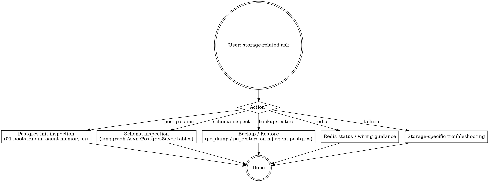

# mj-agent Infra — Storage Stack

## 本技能的执行约定

执行前读取 [共用执行边界](../../references/execution-boundaries.md)。独立调用只完成本技能；委派时记录调用者与返回阶段，同阶段必要校验完成后返回。下游 Handoff 均为建议，不能自动跨阶段或发布。受保护动作先完成可审阅草案；Owner 批准与宿主执行能力分开，hook 硬阻断时返回 `BLOCKED_EXECUTION_ROUTE`。


## 触发与职责详述

This skill walks through mj-agent owned storage stack (mj-agent-postgres + mj-agent-redis containers; per ADR-008 standalone) — postgres init bootstrap (`docker/postgres-init/01-bootstrap-mj-agent-memory.sh` auto-creates mj_agent_memory database for langgraph AsyncPostgresSaver), schema inspection, redis client status (no Python client wired yet — reserved for session cache / streaming buffer / rate limit), backup/restore guidance, and storage-only troubleshooting (separate from compose lifecycle). Make sure to use this skill whenever the user says "mj-agent-postgres", "mj-agent-redis", "memory checkpointer", "AsyncPostgresSaver", "langgraph memory", "mj_agent_memory database", "postgres init", "01-bootstrap-mj-agent-memory.sh", "storage stack", "storage 备份", "checkpointer schema", "redis future use", "session cache wiring" in the mj-agent context. Do not use for: full compose lifecycle (use mj-agent-infra-docker-compose); env / secret setup (use mj-agent-infra-env-setup); Studio probe (use mj-agent-infra-studio-probe); modifying mj-agent-postgres init script structure (A flavor pure code; use mj-agent-flow-implement); or accessing mj-system biz pg (out of scope — mj-agent is consumer-only per ADR-009).


## Overview

mj-agent **owned storage stack**（独立于 mj-system biz pg；ADR-008）：

- **mj-agent-postgres** — langgraph `AsyncPostgresSaver` 后端 store（memory checkpointer）
- **mj-agent-redis** — reserved（未 wire Python client；候选用途：session cache / streaming buffer / rate limit）

**Stage 8 sub C-flavor** of the 17-stage 执行闭环；与 `mj-agent-infra-docker-compose`（lifecycle）+ `mj-agent-infra-env-setup`（creds）+ `mj-agent-infra-studio-probe`（runtime）互补。

**Why this skill exists**：

- mj-agent-postgres 含 langgraph checkpointer 数据（agent 对话状态）—— 备份 / 排错 / schema 演进有专属约束
- mj-agent-redis 当前未 wire；当 Phase 1+ wire 时（如 Chainlit session 持久化），相关 wiring + schema 演进进本 skill 范围
- postgres init script `01-bootstrap-mj-agent-memory.sh` 是首次启动 hook：自动创建 `mj_agent_memory` 数据库 + RW user（per storage-stack PR 引入）—— 启动失败时常需排错此脚本
- 与 mj-system biz pg **物理 / 逻辑双隔离**（不同容器 / 不同网络段 / 不同凭据）—— 红线不可跨

## When to Use

**MUST run when**：
- 用户说"mj-agent-postgres / langgraph memory / checkpointer"
- 用户排查 postgres init 失败
- 用户问 "redis 现在用了吗 / 怎么 wire redis client"
- 用户备份 / 还原 mj-agent memory（dev 调试 / PR 验证）
- 用户问 "AsyncPostgresSaver 数据 schema 长什么样"

**MAY skip when**：
- 仅 lifecycle（up / down / ps / logs）→ mj-agent-infra-docker-compose
- 仅 env / creds → mj-agent-infra-env-setup
- 仅 Studio probe → mj-agent-infra-studio-probe

**MUST NOT use for**：
- ❌ 修改 `01-bootstrap-mj-agent-memory.sh` 结构 / Dockerfile / compose.yaml（C 风味；mj-agent-flow-implement Step 3c）
- ❌ 操作 mj-system biz pg（ADR-006 / ADR-009 红线；mj-agent 仅 consumer）
- ❌ Wire 新 Redis Python client（A 风味纯代码；mj-agent-flow-implement Step 3a；本 skill 仅说明 wiring 缺口 + 候选方案）

## Architecture（per ADR-008 + storage-stack PR）

```text
mj-agent project (independent compose, name: mj-agent)
├── mj-agent                  ← Chainlit UI + agent runtime
│   └── consumer-only access to:
│       └── mj-system-backend-network  ← external; mj-system 拥有
│           └── mj-postgres            ← mj-system 拥有；biz_dws / biz_dwd allowlist
│
└── mj-agent-storage          ← private bridge network；mj-agent 拥有
    ├── mj-agent-postgres     ← langgraph AsyncPostgresSaver checkpointer
    │   └── volumes: mj-agent-postgres-data
    │   └── init: postgres-init/01-bootstrap-mj-agent-memory.sh
    │       (创建 mj_agent_memory 数据库 + RW user)
    └── mj-agent-redis        ← reserved；no Python client wired
        └── volumes: mj-agent-redis-data
```

**双隔离硬约束**：
- `mj-agent-postgres` 不在 `mj-system-backend-network` 上 → mj-system 不可见
- `mj-agent` 不在 `mj-agent-storage` 之外的 mj-system net 段上写 biz pg → 仅 RO consumer
- mj-agent-postgres 凭据（`MJ_AGENT_MEMORY_USER` / `MJ_AGENT_MEMORY_PASSWORD`）≠ mj-system biz pg analyst 凭据
- 红线（per ADR-006 / ADR-009）：跨方向 schema mutation 任何一方都禁止

## Workflow



## Postgres Init Inspection

`docker/postgres-init/01-bootstrap-mj-agent-memory.sh` 是 mj-agent-postgres 容器**首次启动**自动执行的 init script（postgres docker image 标准 entrypoint hook：`/docker-entrypoint-initdb.d/*.sh`）。

### 期望行为

```bash
# 容器首次启动（vol 空）→ pg 自动跑：
# 1. 创建 mj_agent_memory 数据库
# 2. 创建 RW user（MJ_AGENT_MEMORY_USER）+ 授权 mj_agent_memory 读写
# 3. langgraph AsyncPostgresSaver 首次连接时自动建表（checkpoints / writes 等）
```

### 验证 init 成功

先审阅 init 脚本结构及经脱敏的容器状态。禁止直接 psql 或从应用变量构造连接。
已确认项目 memory MCP 可用且用途获授权时，先发现其真实工具/schema，再只读确认数据库、角色和表；
本候选没有真实服务验证，缺工具时记 `UNMET_DEPENDENCY: memory inspection`，不假造调用名或结果。
业务库不能通过该服务访问。

### Init failure 处理

| 症状 | 原因 | 修复 |
|---|---|---|
| `permission denied: ./01-bootstrap-mj-agent-memory.sh` | Linux 上 init 脚本无 exec 权限 | 提出具名文件权限差异，交 implement 审阅；本技能不修改 init 脚本 |
| `database "mj_agent_memory" does not exist` | init 没跑 / volume 残留旧状态 | `docker compose down -v`（**HITL-confirm**！丢数据）+ 重 up |
| `password authentication failed for user <MJ_AGENT_MEMORY_USER>` | .env 中 `MJ_AGENT_MEMORY_PASSWORD` 与容器内 user 密码不一致；通常因 vol 残留旧密码 | `docker compose down -v`（**HITL**）+ 由 Owner 核对凭据状态 + 重 up |
| `01-bootstrap-mj-agent-memory.sh` 报 syntax error | 编辑脚本时换行符 CRLF / Linux 不识 | 提出换行符差异并交 implement 审阅，不在本技能改脚本或 Git 配置 |

> init 脚本只在**首次启动**（volume 空）跑；vol 已存在时跳过 → 改 init 脚本后先评估 migration/备份方案；不得自动用删卷重建代替恢复。

## Schema Inspection（langgraph AsyncPostgresSaver tables）

通过已发现、已授权的项目 memory 接口核对实际 schema，预期概念为 checkpoints、checkpoint_writes、checkpoint_blobs；版本不同先核对 `repo:src/mj_agent/memory/checkpointer.py` 与锁定依赖。
查 thread 聚合前确认列名、时间列和输出范围；不假设 `created_at` 存在，不打印会话正文或业务派生结果。缺等价只读工具时返回未满足依赖，禁止转 shell/DB 客户端。

## Backup / Restore（dev 调试 / PR 验证）

保留能力目标：备份 mj-agent 自有 memory，恢复前核对数据库/环境/备份身份并防止丢失现有 checkpointer 数据。
Agent 不执行 pg_dump/psql/pg_restore，不获取数据库凭据；当前 8 项 MCP 未验证等价备份恢复能力，登记 `UNMET_DEPENDENCY: backup/restore execution`。
交 Owner 基础设施流程处理：确认 dev 目标、备份时间与完整性、恢复演练记录、数据损失范围和回退来源，再由 Owner 决策执行。
不能把源码恢复当作数据恢复；不承诺按 thread 的 pg_dump 过滤选项或未经实测的 SQL 列。生产只交基础设施 snapshot 流程，不由本技能执行。
返回备份/恢复计划、已收到的脱敏证据与未执行状态。部分恢复失败时保留现场，对账后再由 Owner 处理，不能自动 DROP/重灌/重复恢复。

## Redis Status / Wiring Guidance

### 当前状态（Phase 1）

```text
mj-agent-redis: container provisioned (compose 内已起；host port 6379)
但 Python client: NO（src/mj_agent/integrations/ 不含 redis 接入）
```

### 候选用途（待 Phase 1+ 决议）

per `repo:docker/compose.yaml` 与 `repo:src/mj_agent/memory/checkpointer.py`：

1. **session cache** — Chainlit / Studio 多会话状态
2. **streaming buffer** — LangGraph astream / async generator 中间结果
3. **rate limit** — Ark API call 限流（避免突发触限额）

### 何时 wire（决议触发条件）

- **触发 1（session cache）**：Chainlit UI Phase 1 终态启用 + 多 user 状态隔离需求
- **触发 2（streaming buffer）**：长 reply 频繁断流 / 重连需求
- **触发 3（rate limit）**：Ark API 限流告警出现

任一触发 → 开 issue / PR 设计 → mj-agent-flow-implement Step 3a wire 客户端 + 配置加 .env 字段（`MJ_AGENT_REDIS_HOST/PORT/PASSWORD`，已在 .env.example 占位）+ src/mj_agent/integrations/ 加 redis client。

> **Profile 注解（ADR-026 + ADR-027）**：mj-agent-postgres + mj-agent-redis 在所有 4 profile (dev/test/prod) 下都是 mj-agent-owned；每次操作都必须确认实际 profile、资源所有者和 -f 链— 仅 docker-compose lifecycle 命令需要按 profile 选 -f 链（详见 mj-agent-infra-docker-compose）。DGX 不部署 mj-agent，故无 DGX-specific storage 操作。

## Storage-specific Troubleshooting

| 症状 | 修复 |
|---|---|
| Studio 报 `langgraph: aget_tuple not implemented` | 检查 checkpointer 类型：必须是 `AsyncPostgresSaver`，**不**是 `PostgresSaver`（同步版无 aget_tuple，Chainlit 异步驱动会失败）。详见 src/mj_agent/memory/checkpointer.py + bugfix/async-checkpointer commit |
| `mj-agent: connection refused on mj-agent-postgres:5432` | mj-agent-postgres 没起 / 没 healthy → mj-agent-infra-docker-compose ps 检查 |
| `psycopg.OperationalError: SSL connection has been closed` | mj-agent-postgres OOM / 重启 → docker logs 看 / 增 host memory |
| volume 数据 corrupt | `down -v` + 重 up（**HITL**：丢数据）；推荐用 `mj-agent-infra-env-teardown` Level 2 走 H3 hard-confirm；prod 场景走 vol snapshot 还原 |
| DGX-mode session 报 connection refused 但 mj-agent-postgres 健康 | DGX 不部署 mj-agent；用户实际跑的是 dev/test/prod profile + LLM_BASE_URL 指向 DGX vLLM。storage 与 DGX 无关；此处 connection refused 是 mj-system biz pg 路径问题（per ADR-027 §D.2）→ mj-agent-infra-llm-endpoint-probe 检查 LLM endpoint，或 mj-agent-infra-docker-compose ps 检查 mj-system biz pg |

## What This Skill DOES NOT DO

- ❌ 不替代 mj-agent-infra-docker-compose（compose lifecycle up/ps/logs/down）
- ❌ 不替代 mj-agent-infra-env-setup（env / secret）
- ❌ 不替代 mj-agent-infra-studio-probe（H1/H2/H3/R1/R2 矩阵）
- ❌ 不修改 `01-bootstrap-mj-agent-memory.sh` / Dockerfile / compose.yaml 结构（C 风味 → mj-agent-flow-implement Step 3c）
- ❌ 不 wire Redis Python client（A 风味纯代码 → mj-agent-flow-implement Step 3a）
- ❌ 不操作 mj-system biz pg（ADR-006 / ADR-009 红线）
- ❌ 不替代 langgraph 项目本身的 checkpointer schema 演进（schema 归 langgraph upstream）
- ❌ 不自动 `down -v`（HITL-confirm only；丢 checkpointer 数据）

## Sub-skill / Tool Calls

| Tool | 用途 |
|---|---|
| 已发现且获授权的项目 memory 只读接口 | Schema inspection；不可用则未满足依赖 |
| shell `docker compose logs mj-agent-postgres` | Init / runtime troubleshooting |
| Owner 基础设施备份恢复流程 | 只交计划与证据，不由 agent 执行 |
| 读取 | `01-bootstrap-mj-agent-memory.sh` / `compose.yaml` 结构理解 |
| 向 Owner 询问 | `down -v` Level C HITL-confirm |

## Reference Files

- `repo:docker/compose.yaml`（mj-agent-postgres + mj-agent-redis 服务定义；mj-agent-storage network）
- `repo:docker/postgres-init/01-bootstrap-mj-agent-memory.sh`（postgres 首次启动 hook；自动创建 mj_agent_memory 数据库 + RW user）
- src/mj_agent/memory/checkpointer.py（langgraph AsyncPostgresSaver 接入；bugfix/async-checkpointer 引入）
- `repo:decisions/ADR-008_Co_Deployment_With_Upstream_Warehouse.md`（独立 compose project + 双隔离边界）
- `repo:decisions/ADR-009_Biz_Domain_As_Primary_Data_Source.md`（mj-agent 仅 consumer mj-system biz pg；不可跨写 schema）
- `repo:decisions/ADR-006_Fail_Safe_Reads.md`（4 层 guardrail；mj-agent-postgres 与 biz pg 双隔离）
- `repo:docker/compose.yaml` 与 `repo:src/mj_agent/memory/checkpointer.py`（mj-agent-postgres + mj-agent-redis 职责说明）
- `repo:config/README.md`（应用配置）与 `repo:.env.example`（仅公开变量名）（MJ_AGENT_MEMORY_HOST/PORT + MJ_AGENT_REDIS_HOST/PORT/PASSWORD 字段）
- `.env.example`（MJ_AGENT_MEMORY_* + MJ_AGENT_REDIS_* 字段占位）

## Anti-patterns

- ❌ **不**操作 mj-system biz pg（ADR-006 / ADR-009 红线；任何 mj-agent skill 都不允许跨；本 skill 范围严格限于 mj-agent-postgres + mj-agent-redis）
- ❌ 不在 prod profile 跑 `down -v`（仅 dev / test profile）
- ❌ 不 expose mj-agent-postgres 到 mj-system-backend-network（双隔离硬约束）
- ❌ 不在 init script 写硬编码密码（用 env var；详见 .env.example）
- ❌ 不修改 langgraph upstream schema（schema 归 langgraph；mj-agent 不自定义）
- ❌ 不替代 langgraph version bump（pyproject.toml 改归 A 风味；通过 mj-agent-flow-implement + Step 3a A flavor）

## Handoff

```
Storage 操作完成。
下一步：
- compose lifecycle → mj-agent-infra-docker-compose
- Studio probe（验证 mj-agent 服务行为）→ mj-agent-infra-studio-probe
- Redis wiring（如触发条件达标）→ mj-agent-flow-implement Step 3a A flavor
- init script 修改 → mj-agent-flow-implement Step 3c C flavor
- 进入 17-stage 闭环 → mj-agent-flow-intake
```
