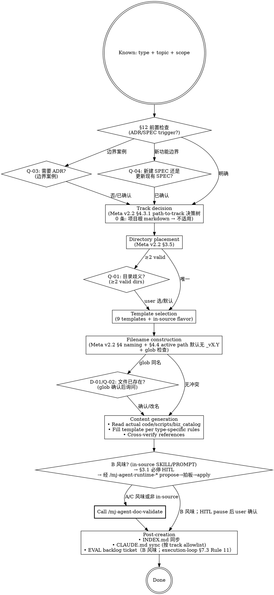

# mj-agent Doc Author

## Overview

按已知文档类型 + scope 起草单份 Meta v2.2 + Code_Side v1.1 + Agent_Side v1.1 兼容文档。Code 是 source of truth — 始终 verify against 真实文件，不轻信旧文档。**Track-aware dispatch**：按 Meta v2.2 §4.3.1 路径决策树自动选 track（含 v2.2 加 0 条：项目根 markdown → 不适用 track），按 ADR-014 §决策点 4 边界表确定归属。**Active path stability**（Meta v2.2 §4.4）：active canonical 文件名默认无 `_vX.Y` 后缀，version 仅在 frontmatter；例外仅"多 active 主版本并存"。

**Stage 6 sub** of HITL_Prompt 17-stage 闭环；典型 by `/mj-agent-flow-plan` Step 3 task list 触发，或 user 直接调用。

> **项目根 markdown 例外**（Meta v2.2 §2.6 + GitHub_Markdown §14.5）：README / CONTRIBUTING / CHANGELOG / GLOSSARY / CLAUDE.md 5 件**不入本 skill scope**——不写 frontmatter；A1-A3 不适用；起草直接走 user-编辑或 git 操作，不调本 skill。

**Direction-critical**（与 marketplace plugin 共存；per ADR-016 §决策点 2）：

| Skill | Scope | When |
|---|---|---|
| `mj-agent-code-doc-author`（marketplace） | 通用 DDD 文档起草（跨 mj-agent-* 仓） | 标准 author 工作流 |
| `/mj-agent-doc-author`（本 skill） | **stage-aware** 文档起草，与 HITL_Prompt §4.6 stage 6 紧耦合（含 mj-agent 专属 in-source SKILL/PROMPT 等 12 类） | Stage 6 SPEC/ADR/RUNBOOK 编写阶段 |

允许 30% 概念重叠；marketplace 插件做 portability，in-tree 做 stage 集成。

## Prerequisite

- 文档类型 + scope 明确。如不明 → 先用 `/mj-agent-doc-plan`（PR-B4 落地）评估
- mj-agent 仓已 promote 到 v2.2（PR #173 sustained §2.6 / §4.3.1 0 条 / §6.4 4 类 / §修订记录）
- 已知 track 归属（or 由 path-to-track 决策树自动判定；项目根 markdown 走 §2.6 例外，不入本 skill）

## Workflow



## Quick Reference（mj-agent 12 类 + 9 templates）

| Type | Track 默认 | Directory | Template | Naming |
|---|---|---|---|---|
| `[GUIDE]` | code | `docs/guide/` 或 `docs/infrastructure/{domain}/` | `TEMPLATE_GUIDE.md` | `[GUIDE]_Description.md` |
| `[RUNBOOK]` | code | `docs/runbook/` 或 `docs/infrastructure/{domain}/` | `TEMPLATE_RUNBOOK.md`（PR-A3） | `[RUNBOOK]_Subject.md` |
| `[ADR]` | shared/eng-workflow（按主题） | `docs/adr/` | `TEMPLATE_ADR.md` | `[ADR]_NNN_Decision_Title.md` |
| `[SPEC]` | shared/agent/code（按主题） | `docs/design/{module}/` | `TEMPLATE_SPEC.md`（PR-A3） | `[SPEC]_Description.md`（默认无 `_vX.Y`，per Meta v2.2 §4.4 active path stability） |
| `[POSTMORTEM]` | shared | `docs/postmortem/` | `TEMPLATE_POSTMORTEM.md`（PR-D1） | `[POSTMORTEM]_Subject.md` |
| `[STANDARD]` | code/eng-workflow/shared（按主题） | `docs/rule/[STANDARD]_*.md` 或 `docs/infrastructure/{domain}/` | （type-specific；mj-agent 模板未独立） | `[STANDARD]_Description.md`（默认无 `_vX.Y`，per Meta v2.2 §4.4） |
| `[ISSUE]` | shared | `docs/issues/` | `TEMPLATE_ISSUE.md`（PR-D1） | `[ISSUE]_NNN_DomainAbbr_Description.md`（per Meta v2.2 §4.5）|
| `[ASSESSMENT]` | shared | `docs/assessments/` | `TEMPLATE_ASSESSMENT.md`（PR-D1） | `[ASSESSMENT]_Subject.md`（默认无 `_vX.Y`，per Meta v2.2 §4.4） |
| `[SKILL]`（in-source；Track B） | agent | `src/mj_agent/skills/<name>/` | `TEMPLATE_SKILL.md`（13 字段 + 五段式） | `<name>/SKILL.md` |
| `[PROMPT]`（in-source；Track B） | agent | `src/mj_agent/prompts/` | `TEMPLATE_PROMPT.md` | `<name>.md` |
| `[SKILL]`（in-tree；Track C） | engineering-workflow | `.claude/skills/mj-agent-<group>-<verb>/` | `TEMPLATE_WORKFLOW_SKILL.md`（PR-B1） | `<name>/SKILL.md` |
| `[CONTRACT]` | shared/agent | `docs/contracts/` | `TEMPLATE_CONTRACT.md` | `[CONTRACT]_Tool_Description.md` |

> **注**：含 `version` 字段的类型（STANDARD / SPEC / EVAL / CONTRACT / ASSESSMENT）filename **默认无 `_vX.Y` 后缀**（per Meta v2.2 §4.4 active path stability；ADR-018 partial supersede ADR-011 §4.2）。版本仅在 frontmatter `version` 字段。例外：多 active 主版本并存时才加（如 v1/v2 API 长期共存的 STANDARD）。Legacy 归档反向必带后缀（per §4.4.3）。

## Key Principles

1. **Code is source of truth** — Legacy docs may be outdated. Verify paths / params / secrets against actual files in mj-agent.
2. **RUNBOOK uses imperative mood** — Readers execute under pressure.
3. **Start as `state: draft`** — All new docs enter review before authoritative.
4. **Template adaptation allowed** — Sections rename/reorder OK，but **MUST** preserve: frontmatter / blockquote header / 关联文档段。
5. **B 风味 永远 HITL** — `src/mj_agent/skills/**/SKILL.md` 或 `prompts/*.md` body 起草 / 修改必须经 `/mj-agent-runtime-*` propose → Owner 拍板 → apply（拍板后由 runtime skill 经 `ask` 门落盘）。这是 §3.1 必停 + ADR-034 propose→拍板→apply 约束。
6. **Track-aware**：每文档 frontmatter 必填 `track`（v2.1 4 值；by Meta v2.2 §4.3.1 路径决策树）。项目根 markdown 5 件不写 frontmatter 不适用 track（per §2.6 例外 + §4.3.1 第 0 条）。

## Track Decision（Meta v2.2 §4.3.1 path-to-track 决策树）

```
0. 路径是项目根 markdown（README/CONTRIBUTING/CHANGELOG/GLOSSARY/CLAUDE.md）？
   → 不适用 track（per Meta v2.2 §2.6 例外；不写 frontmatter；A1-A3 不适用；本 skill 不处理）
1. 路径在 src/mj_agent/{skills,prompts}/** → agent
2. 路径在 src/mj_agent/{其他}/** → code
3. 路径在 .claude/** 或 .mcp.json → engineering-workflow
4. 路径在 docs/evaluation/ → agent
5. 路径在 docs/{infrastructure,runbook,api}/ → code
6. 路径在 docs/rule/ 但治"engineering 流程" → engineering-workflow
7. 路径在 docs/rule/ 治文档/代码/数据 → code 或 shared
8. 其他 → 默认 shared 并 PR body 论证
```

> **SoT = `policies/documentation.md` §3.1**（Meta v2.2 §4.3.1 是已归档的历史源）；本段是投影，
> 改判定必先改 kernel。规则 3 原列的 4 个 `docs/rule/` STANDARD 族 glob 已随 #449 删除 —— M6
> PR4 / X5 后全部落空，删除对现存文件零行为 delta。⚠ 本树**不覆盖** SDD kernel 四目录
> （`policies/` `sdd/` `decisions/` `capabilities/`），它们一律落规则 8 而实际按主题分流；
> 缺口处置见 #451。

## Directory Placement Rules（Meta v2.2 §3.5，加 0 号 + 项目根例外）

```
项目根例外（v2.2 §2.6；本 skill 不处理）→ README.md / CONTRIBUTING.md / CHANGELOG.md / GLOSSARY.md / CLAUDE.md

0. Engineering-workflow 专属（v2.1 引入） → .claude/skills/<name>/, .claude/scripts/, .mcp.json
1. Agent 专属 → src/mj_agent/skills/**/SKILL.md, prompts/*, docs/evaluation/, docs/contracts/（agent-facing）
2. 子系统专属 → docs/design/{agent|gateway|memory|prompts|skills|ui}/
3. 基础设施专属 → docs/infrastructure/{domain}/
4. 跨子系统 API 约定 → docs/api/
5. 跨领域通用规则 → docs/rule/
6. 跨领域操作指南 → docs/guide/
```

## STANDARD 归属判定（v2.2 §3.5 + Meta v2.2 §3.7）

| 范畴 | 目录 | 判定 |
|---|---|---|
| **全局规则** | `docs/rule/` | 跨领域、跨服务、跨工具的项目级规范 |
| **engineering-workflow STANDARD** | `docs/rule/` 下治工程流程者（判定走 Track Decision 规则 6） | 治 .claude/ + 工程流程；**现仓内无此类件**——原 HITL_Prompt 族已归档，活体后继是 SDD kernel（`sdd/workflows/` + `policies/`），非 STANDARD |
| **API 专属** | `docs/api/` | 跨服务的 API 约定 |
| **领域专属** | `docs/infrastructure/<domain>/` | 与具体技术领域绑定（git / cicd / database） |

## ADR 开列判据（何时才开 ADR）

> 配合 §12 前置检查 / Q-03。借「domain-modeling」**仅难逆决策才开 ADR** 的思路、按 mj-agent native 承载——防 ADR 泛滥。

仅当**三者皆真**才开 ADR（否则 inline 记录于 SPEC / glossary / catalog，不开 ADR）：
1. **难逆** —— 决策落地后回退成本高（schema / 数据边界 / 部署形态类）。
2. **反直觉** —— 选择非显而易见，未来读者会问"为什么不是另一种"。
3. **真权衡** —— 存在被放弃的合理替代方案，需记录取舍理由。

主动领域建模产物归属（**不引入 `CONTEXT.md`**，挂既有分布式工件）：术语 → `docs/glossary/` / `GLOSSARY.md`；业务指标 / 维度 → `biz_catalog/qcm_catalog.yaml`（**4 必停面之一** → `/mj-agent-runtime-biz-catalog-sync` propose→拍板→apply）；难逆决策 → `decisions/` ADR。

## ADR Numbering

Scan `docs/adr/` for max existing `[ADR]_NNN_*` number, new = max + 1（zero-padded 3 digits）。Start at 001 if empty。

> 当前 mj-agent ADR 编号：000 / 001 / 002 / 003 / 006 / 008 / 009 / 010 / 011 / 012 / 013 / 014 / 015 / 016（004/005/007 跳号）。新 ADR 起 017。

## ISSUE Numbering

Same convention：scan `docs/issues/` for max `[ISSUE]_NNN_*`，new = max + 1。Independent sequence。

> 当前 mj-agent issues/ 目录可能空（Phase D 起首 [ISSUE]）。

## Filename Construction — 文件冲突检查（必须）

构建目标 filename 后、生成内容前：

1. 拼出完整目标路径（目录 + 文件名）
2. 用 Glob 检查该路径是否已存在
3. 已存在 → 触发 **D-01/Q-02**
4. 不存在 → 直接进入内容生成

## 人工交互节点

| 时机 | 触发条件 | 抑制条件 | 问题 ID |
|---|---|---|---|
| §12 前置检查后（边界案例） | §12.2 有匹配项但非核心架构变更 | 用户说"不需要 ADR"或纯 bug fix | Q-03 |
| §12 前置检查后（新功能边界） | 变更含"新功能"但范围限于单模块内部 | 用户已确认"更新/创建 SPEC" | Q-04 |
| 目录确定前 | §3.5 规则映射出 ≥2 个有效目录 | 用户已在请求中指定路径 | Q-01 |
| 写文件前（文件已存在） | glob 检测到目标路径同名 | 用户说"覆盖/替换" | D-01/Q-02 |
| §12 前置检查后（问题文档） | 问题分析文档但发现方式不明确（主动 vs 被动） | 用户已指定"写 ISSUE"或"写 POSTMORTEM" | Q-10 |
| 目录确定前（层级歧义） | 内容同时含长期参考 + 短期执行 | 用户明确说"写 plan"或明确指定 canonical 类型 | Q-12 |
| **B 风味 in-source** | 检测到目标路径在 src/mj_agent/{skills,prompts}/** | 经 /mj-agent-runtime-* propose + 拍板 + apply | **Q-B1**（mj-agent 专属 §3.1 必停） |

### Q-B1（mj-agent 专属）

```
检测到目标路径 <path> 在 src/mj_agent/{skills,prompts}/**（B 风味 in-source canonical）。
§3.1 必停面 runtime-skill-content-change / prompt-version-or-body-change 触发；建议先：
(1) 用 /mj-agent-runtime-skill-doc-improve（如 SKILL.md）或 /mj-agent-runtime-prompt-version-bump（如 system.md）propose→拍板→apply
(2) Domain Expert + Prompt Engineer review
(3) Owner 拍板后由 runtime skill 经 `ask` 门落盘
(4) 同步 PR description 含 EVAL backlog ticket（execution-loop §7.3 Rule 11）

或：(A) 跳过 B 风味流程直接写（user 全责，不推荐）/ (B) 取消本次 doc-author 调用
```

## REQUIRED SUB-SKILL

`/mj-agent-doc-validate` — 写完文档前 / commit 前必跑。

## What This Skill DOES NOT DO

- ❌ 不替代 `/mj-agent-doc-plan`（doc-plan 评估"哪些 doc 缺"；本 skill 是"写一份具体的"）
- ❌ 不替代 `/mj-agent-flow-plan`（flow-plan 写完整 Plan body；本 skill 写其中某个 doc）
- ❌ 不直接写 in-source canonical（B 风味必走 propose-via-runtime 流程）
- ❌ 不 auto-commit（仅写文件；commit 由 /mj-agent-git-commit）
- ❌ 不替代 marketplace `mj-agent-code-doc-author`（共存；30% 重叠允许）

## Sub-skill / Tool Calls

| Tool | 用途 |
|---|---|
| Read / Glob | type 决策 + filename 冲突检查 + 已有 docs 引用 |
| Write | 写新文档（A/C 风味或非 in-source） |
| Edit | 更新已有文档 |
| AskUserQuestion | 7 个 Q-* 节点交互 |
| `/mj-agent-runtime-*` | B 风味 in-source 改动经 propose→拍板→apply |
| `/mj-agent-doc-validate` | 写完后 sub-call 验证 |

## Reference Files

- [[../../../policies/documentation|policies/documentation]] §2.6（项目根 markdown 例外）+ §2.1（12 类 types）/ §6（frontmatter / state）/ §3（track + §3.1 path-to-track 决策树含 0 条）（archive workflow → [[../../../policies/archive|policies/archive]] §1.2 active path stability）
- [[../../../policies/documentation|policies/documentation]] §8.1 / §8.2（8 类继承类 body authoring depth）+ §6.2（type-frontmatter）
- [[../../../sdd/adapters/runtime-skill|sdd/adapters/runtime-skill]] + [[../../../sdd/adapters/prompt|sdd/adapters/prompt]] + [[../../../sdd/adapters/contract|sdd/adapters/contract]]（4 类自有类 authoring + frontmatter strip 契约）
- [[../../../docs/rule/[STANDARD]_GitHub_Markdown|GitHub_Markdown v1.1]] §14（项目根 README 与 Markdown 特例；PR #173 新加）
- [[../../../docs/rule/[STANDARD]_MJ_Agent_Skill_Authoring_Craft|技能写作工艺规范]] §9（写 SKILL/STANDARD body 时过作者自检清单——可预测性 / 双负载权衡 / leading words / no-op 剪枝）
- [[../../../sdd/workflows/execution-loop|sdd/workflows/execution-loop]] §1（Stage 6 SPEC/ADR/RUNBOOK 在 17-stage loop 的位置）
- [[decisions/ADR-011_Doc_Versioning_And_Archive_Convention|ADR-011]]（version 必填类型 + archive workflow；§4.2 + §5.6.2 已被 ADR-018 partial supersede）
- [[decisions/ADR-014_Tri_Track_Documentation_Governance|ADR-014]] §决策点 4（边界 artifact 表）
- [[../../../docs/adr/[ADR]_015_HITL_Prompt_v1_0_Derivation|ADR-015]] §决策点 3（3 风味）+ §决策点 4（runtime 硬约束）
- 9 个 templates 全部在 `docs/_templates/`
- mj-system `.claude/skills/mj-sys-doc-author/SKILL.md`（直接派生源；mj-agent 加 track-aware + 风味识别 + Q-B1 + 项目根例外）

## Anti-patterns

- **不要** B 风味改动跳过 Q-B1（违反 §3.1 必停面 runtime-skill-content-change / prompt-version-or-body-change；ADR-015 §决策点 4 runtime 硬约束）
- **不要** 缺 frontmatter `track` 字段（v2.2 §4.3.1 必填；validate 阶段 A2 阻断；项目根 markdown 例外不在此约束）
- **不要** 在 docs/rule/ 下塞领域专属 STANDARD（违反 §3.5 就近原则；应进 docs/infrastructure/{domain}/）
- **不要** 跳过 ADR/SPEC §12 前置检查（边界案例可能漏建必要 ADR）
- **不要** 在 active canonical filename 加 `_vX.Y` 后缀（违反 Meta v2.2 §4.4 active path stability；ADR-018 partial supersede ADR-011 §4.2；除非"多 active 主版本并存"例外）
- **不要** 用本 skill 起草项目根 markdown 5 件（README/CONTRIBUTING/CHANGELOG/GLOSSARY/CLAUDE.md；per Meta v2.2 §2.6 例外，不入本 skill scope）

## Handoff

```
文档创建完成。下一步：
- /mj-agent-doc-validate 校验 frontmatter + wikilinks
- INDEX.md 同步（如新建 canonical doc）
- CLAUDE.md sync（如 allowlist 项；按 track 落入对应段）
- B 风味改动 → 自动开 EVAL backlog ticket（execution-loop §7.3 Rule 11）
- /mj-agent-git-commit 提交
```
