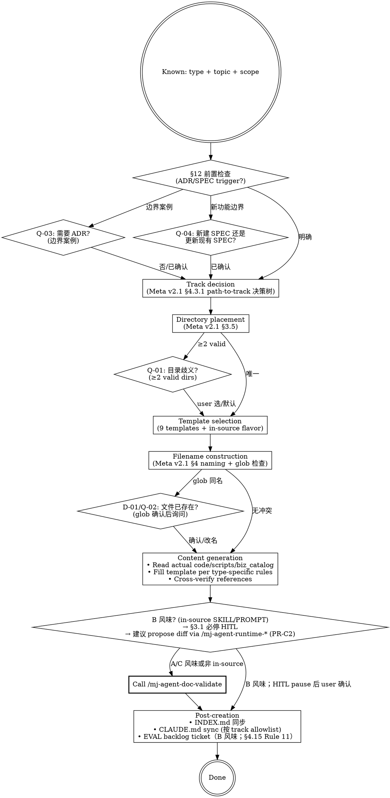

# mj-agent Doc Author

## Overview

按已知文档类型 + scope 起草单份 Meta v2.1 + Code_Side v1.1 + Agent_Side v1.1 兼容文档。Code 是 source of truth — 始终 verify against 真实文件，不轻信旧文档。**Track-aware dispatch**：按 Meta v2.1 §4.3.1 路径决策树自动选 track，按 ADR-014 §决策点 4 边界表确定归属。

**Stage 6 sub** of HITL_Prompt 17-stage 闭环；典型 by `/mj-agent-flow-plan` Step 3 task list 触发，或 user 直接调用。

**Direction-critical**（与 marketplace plugin 共存；per ADR-016 §决策点 2）：

| Skill | Scope | When |
|---|---|---|
| `mj-agent-code-doc-author`（marketplace） | 通用 DDD 文档起草（跨 mj-agent-* 仓） | 标准 author 工作流 |
| `/mj-agent-doc-author`（本 skill） | **stage-aware** 文档起草，与 HITL_Prompt §4.6 stage 6 紧耦合（含 mj-agent 专属 in-source SKILL/PROMPT 等 12 类） | Stage 6 SPEC/ADR/RUNBOOK 编写阶段 |

允许 30% 概念重叠；marketplace 插件做 portability，in-tree 做 stage 集成。

## Prerequisite

- 文档类型 + scope 明确。如不明 → 先用 `/mj-agent-doc-plan`（PR-B4 落地）评估
- mj-agent 仓已 promote 到 v2.1（Phase B PR-B3c-promote 完成）
- 已知 track 归属（or 由 path-to-track 决策树自动判定）

## Workflow



## Quick Reference（mj-agent 12 类 + 9 templates）

| Type | Track 默认 | Directory | Template | Naming |
|---|---|---|---|---|
| `[GUIDE]` | code | `docs/guide/` 或 `docs/infrastructure/{domain}/` | `TEMPLATE_GUIDE.md` | `[GUIDE]_Description.md` |
| `[RUNBOOK]` | code | `docs/runbook/` 或 `docs/infrastructure/{domain}/` | `TEMPLATE_RUNBOOK.md`（PR-A3） | `[RUNBOOK]_Subject.md` |
| `[ADR]` | shared/eng-workflow（按主题） | `docs/adr/` | `TEMPLATE_ADR.md` | `[ADR]_NNN_Decision_Title.md` |
| `[SPEC]` | shared/agent/code（按主题） | `docs/design/{module}/` | `TEMPLATE_SPEC.md`（PR-A3） | `[SPEC]_Description.md`（无 vX.Y）或 `_v1.0.md`（type-specific 含 version） |
| `[POSTMORTEM]` | shared | `docs/postmortem/` | `TEMPLATE_POSTMORTEM.md`（PR-D1，未落地，参 mj-system 上游） | `[POSTMORTEM]_Subject.md` |
| `[STANDARD]` | code/eng-workflow/shared（按主题） | `docs/rule/[STANDARD]_*_v1.0.md` 或 `docs/infrastructure/{domain}/` | （type-specific；mj-agent 模板未独立） | `[STANDARD]_Description_v1.0.md` |
| `[ISSUE]` | shared | `docs/issues/` | `TEMPLATE_ISSUE.md`（PR-D1，未落地） | `[ISSUE]_NNN_Description.md` |
| `[ASSESSMENT]` | shared | `docs/assessments/` | `TEMPLATE_ASSESSMENT.md`（PR-D1，未落地） | `[ASSESSMENT]_Subject_v1.0.md` |
| `[SKILL]`（in-source；Track B） | agent | `src/mj_agent/skills/<name>/` | `TEMPLATE_SKILL.md`（13 字段 + 五段式） | `<name>/SKILL.md` |
| `[PROMPT]`（in-source；Track B） | agent | `src/mj_agent/prompts/` | `TEMPLATE_PROMPT.md` | `<name>.md` |
| `[SKILL]`（in-tree；Track C） | engineering-workflow | `.claude/skills/mj-agent-<group>-<verb>/` | `TEMPLATE_WORKFLOW_SKILL.md`（PR-B1） | `<name>/SKILL.md` |
| `[CONTRACT]` | shared/agent | `docs/contracts/` | `TEMPLATE_CONTRACT.md` | `[CONTRACT]_Tool_Description.md` |

> **注**：含 `version` 字段的类型（STANDARD / SPEC / EVAL / CONTRACT / ASSESSMENT）filename 必须含 `_vX.Y`（per ADR-011）。

## Key Principles

1. **Code is source of truth** — Legacy docs may be outdated. Verify paths / params / secrets against actual files in mj-agent.
2. **RUNBOOK uses imperative mood** — Readers execute under pressure.
3. **Start as `state: draft`** — All new docs enter review before authoritative.
4. **Template adaptation allowed** — Sections rename/reorder OK，but **MUST** preserve: frontmatter / blockquote header / 关联文档段。
5. **B 风味 永远 HITL** — `src/mj_agent/skills/**/SKILL.md` 或 `prompts/*.md` body 起草 / 修改前必须用 `/mj-agent-runtime-*`（PR-C2 落地）propose diff，user 接受后再写盘。这是 §3.1 必停 10/11 + ADR-015 §决策点 4 硬约束。
6. **Track-aware**：每文档 frontmatter 必填 `track`（v2.1 4 值；by Meta v2.1 §4.3.1 路径决策树）。

## Track Decision（Meta v2.1 §4.3.1 path-to-track 决策树）

```
1. 路径在 src/mj_agent/{skills,prompts}/** → agent
2. 路径在 src/mj_agent/{其他}/** → code
3. 路径在 .claude/** 或 .mcp.json 或 docs/rule/[STANDARD]_*_HITL_Prompt*.md / _AI_Engineering_*.md / _Claude_Code_Settings_*.md / _MCP_Server_Governance_*.md → engineering-workflow
4. 路径在 docs/evaluation/ → agent
5. 路径在 docs/{infrastructure,runbook,api}/ → code
6. 路径在 docs/rule/ 但治"engineering 流程" → engineering-workflow
7. 路径在 docs/rule/ 治文档/代码/数据 → code 或 shared
8. 其他 → 默认 shared 并 PR body 论证
```

## Directory Placement Rules（Meta v2.1 §3.5，加 0 号）

```
0. Engineering-workflow 专属（v2.1 引入） → .claude/skills/<name>/, .claude/scripts/, .mcp.json
1. Agent 专属 → src/mj_agent/skills/**/SKILL.md, prompts/*, docs/evaluation/, docs/contracts/（agent-facing）
2. 子系统专属 → docs/design/{agent|gateway|memory|prompts|skills|ui}/
3. 基础设施专属 → docs/infrastructure/{domain}/
4. 跨子系统 API 约定 → docs/api/
5. 跨领域通用规则 → docs/rule/
6. 跨领域操作指南 → docs/guide/
```

## STANDARD 归属判定（v2.1 §3.5 + Meta v2.1 §3.6）

| 范畴 | 目录 | 判定 |
|---|---|---|
| **全局规则** | `docs/rule/` | 跨领域、跨服务、跨工具的项目级规范 |
| **engineering-workflow STANDARD** | `docs/rule/[STANDARD]_*_HITL_Prompt*.md` 等 | 治 .claude/ + 工程流程 |
| **API 专属** | `docs/api/` | 跨服务的 API 约定 |
| **领域专属** | `docs/infrastructure/<domain>/` | 与具体技术领域绑定（git / cicd / database） |

## ADR Numbering

Scan `docs/adr/` for max existing `[ADR]_NNN_*` number, new = max + 1（zero-padded 3 digits）。Start at 001 if empty。

> 当前 mj-agent ADR 编号：000 / 001 / 002 / 003 / 006 / 008 / 009 / 010 / 011 / 012 / 013 / 014 / 015 / 016（004/005/007 跳号）。新 ADR 起 017。

## ISSUE Numbering

Same convention：scan `docs/issues/` for max `[ISSUE]_NNN_*`，new = max + 1。Independent sequence。

> 当前 mj-agent issues/ 目录可能空（Phase D 起首 [ISSUE]）。

## Filename Construction — 文件冲突检查（必须）

构建目标 filename 后、生成内容前：

1. 拼出完整目标路径（目录 + 文件名）
2. 用 Glob 检查该路径是否已存在
3. 已存在 → 触发 **D-01/Q-02**
4. 不存在 → 直接进入内容生成

## 人工交互节点

| 时机 | 触发条件 | 抑制条件 | 问题 ID |
|---|---|---|---|
| §12 前置检查后（边界案例） | §12.2 有匹配项但非核心架构变更 | 用户说"不需要 ADR"或纯 bug fix | Q-03 |
| §12 前置检查后（新功能边界） | 变更含"新功能"但范围限于单模块内部 | 用户已确认"更新/创建 SPEC" | Q-04 |
| 目录确定前 | §3.5 规则映射出 ≥2 个有效目录 | 用户已在请求中指定路径 | Q-01 |
| 写文件前（文件已存在） | glob 检测到目标路径同名 | 用户说"覆盖/替换" | D-01/Q-02 |
| §12 前置检查后（问题文档） | 问题分析文档但发现方式不明确（主动 vs 被动） | 用户已指定"写 ISSUE"或"写 POSTMORTEM" | Q-10 |
| 目录确定前（层级歧义） | 内容同时含长期参考 + 短期执行 | 用户明确说"写 plan"或明确指定 canonical 类型 | Q-12 |
| **B 风味 in-source** | 检测到目标路径在 src/mj_agent/{skills,prompts}/** | 用户已通过 /mj-agent-runtime-* propose diff + 接受 | **Q-B1**（mj-agent 专属 §3.1 必停 10/11） |

### Q-B1（mj-agent 专属）

```
检测到目标路径 <path> 在 src/mj_agent/{skills,prompts}/**（B 风味 in-source canonical）。
§3.1 必停 10/11 触发；建议先：
(1) 用 /mj-agent-runtime-skill-doc-improve（如 SKILL.md）或 /mj-agent-runtime-prompt-version-bump（如 system.md）propose diff
(2) Domain Expert + Prompt Engineer review
(3) user 接受后才写盘
(4) 同步 PR description 含 EVAL backlog ticket（§4.15 Rule 11）

或：(A) 跳过 B 风味流程直接写（user 全责，不推荐）/ (B) 取消本次 doc-author 调用
```

## REQUIRED SUB-SKILL

`/mj-agent-doc-validate` — 写完文档前 / commit 前必跑。

## What This Skill DOES NOT DO

- ❌ 不替代 `/mj-agent-doc-plan`（doc-plan 评估"哪些 doc 缺"；本 skill 是"写一份具体的"）
- ❌ 不替代 `/mj-agent-flow-plan`（flow-plan 写完整 Plan body；本 skill 写其中某个 doc）
- ❌ 不直接写 in-source canonical（B 风味必走 propose-via-runtime 流程）
- ❌ 不 auto-commit（仅写文件；commit 由 /mj-agent-git-commit）
- ❌ 不替代 marketplace `mj-agent-code-doc-author`（共存；30% 重叠允许）

## Sub-skill / Tool Calls

| Tool | 用途 |
|---|---|
| Read / Glob | type 决策 + filename 冲突检查 + 已有 docs 引用 |
| Write | 写新文档（A/C 风味或非 in-source） |
| Edit | 更新已有文档 |
| AskUserQuestion | 7 个 Q-* 节点交互 |
| `/mj-agent-runtime-*`（PR-C2） | B 风味 in-source 改动前 propose diff |
| `/mj-agent-doc-validate` | 写完后 sub-call 验证 |

## Reference Files

- [[../../../docs/rule/[STANDARD]_MJ_Agent_Documentation_Meta_Framework|Meta v2.1]] §3 / §4 / §5 / §6（types / frontmatter / state / archive / index）
- [[../../../docs/rule/[STANDARD]_MJ_Agent_Code_Side_Documentation_Framework|Code_Side v1.1]] §3.1-§3.8（8 类继承类 authoring）
- [[../../../docs/rule/[STANDARD]_MJ_Agent_Agent_Side_Documentation_Framework|Agent_Side v1.1]] §2-§7（4 类自有类 authoring + frontmatter strip 契约）
- [[../../../docs/rule/[STANDARD]_MJ_Agent_AI_Engineering_Execution_HITL_Prompt|HITL_Prompt v1.0]] §4.6（Stage 6 SPEC/ADR/RUNBOOK 触发）
- [[../../../docs/adr/[ADR]_011_Doc_Versioning_And_Archive_Convention|ADR-011]]（version 必填类型 + archive workflow）
- [[../../../docs/adr/[ADR]_014_Tri_Track_Documentation_Governance|ADR-014]] §决策点 4（边界 artifact 表）
- [[../../../docs/adr/[ADR]_015_HITL_Prompt_v1_0_Derivation|ADR-015]] §决策点 3（3 风味）+ §决策点 4（runtime 硬约束）
- 9 个 templates 全部在 `docs/_templates/`
- mj-system `.claude/skills/mj-sys-doc-author/SKILL.md`（直接派生源；mj-agent 加 track-aware + 风味识别 + Q-B1）

## Anti-patterns

- **不要** B 风味改动跳过 Q-B1（违反 §3.1 必停 10/11；ADR-015 §决策点 4 runtime 硬约束）
- **不要** 缺 frontmatter `track` 字段（v2.1 §4.3.1 必填；validate 阶段 A2 阻断）
- **不要** 在 docs/rule/ 下塞领域专属 STANDARD（违反 §3.5 就近原则；应进 docs/infrastructure/{domain}/）
- **不要** 跳过 ADR/SPEC §12 前置检查（边界案例可能漏建必要 ADR）
- **不要** version 必填类型（STANDARD/SPEC/EVAL/CONTRACT/ASSESSMENT）filename 缺 `_vX.Y`（违反 ADR-011）

## Handoff

```
文档创建完成。下一步：
- /mj-agent-doc-validate 校验 frontmatter + wikilinks
- INDEX.md 同步（如新建 canonical doc）
- CLAUDE.md sync（如 allowlist 项；按 track 落入对应段）
- B 风味改动 → 自动开 EVAL backlog ticket（§4.15 Rule 11）
- /mj-agent-git-commit 提交
```
