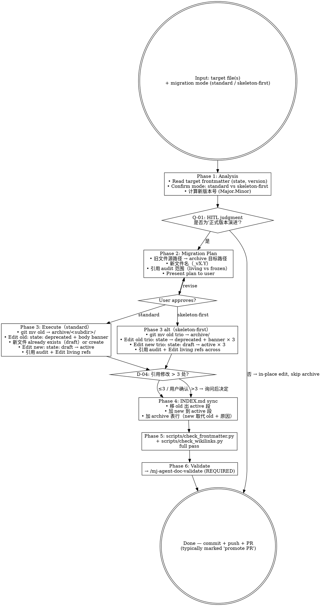

# mj-agent Doc Migrate（archive workflow）

## Overview

执行 mj-agent canonical docs 的 Major.Minor 版本归档流程。**Rare operation** — 仅在正式版本演进（HITL judgment at PR review）触发；日常 typo/measurement 修正 stay in-place。

**两种归档场景**：

1. **正式版本演进**（per ADR-011 §5.6.2 标准模式）：
   - v1.0 → v1.1 / v2.0 → v2.1 等正式版本 bump
   - HITL judgment 决定为"正式演进"时触发
   - 旧文件 git mv → archive；frontmatter state: active → deprecated；body banner；引用 audit

2. **Skeleton-first 延迟 promote**（per ADR-014 §决策点 3 + Meta v2.1 §5.8 mj-agent 专属变体）：
   - 新版本以 state: draft 入 docs/rule/，与旧 active 共存
   - 多 PR 期后（HITL_Prompt §5 矩阵不再指占位时）一次性 promote
   - PR-B3c-promote 是首例（v2.0 trio → archive；v2.1 trio + HITL_Prompt + ADR-014/015/016 → active）

**Reference**:
- [[decisions/ADR-011_Doc_Versioning_And_Archive_Convention|ADR-011]] §5.6.2 标准 archive workflow
- [[decisions/ADR-014_Tri_Track_Documentation_Governance|ADR-014]] §决策点 3 skeleton-first 变体
- [[../../../docs/rule/[STANDARD]_MJ_Agent_Documentation_Meta_Framework|Meta v2.1]] §5.6 + §5.8

> mj-agent 已有 **3 次** archive workflow 先例：
> - v1.0 → v1.1（initial, ADR-011 自身落地，2026-04）
> - v1.1 → v2.0 trio（dual-track 升级，2026-04 ADR-012）
> - v2.0 trio → v2.1 trio + HITL_Prompt（tri-track promote，2026-05 PR-B3c-promote ADR-014）

## When to Use

**MUST run when**：
- 正式版本演进（user / reviewer judgment at PR review HITL）
- skeleton-first delayed promote（多 PR draft 期结束）
- 新增类型变体（ADR/SPEC/STANDARD/EVAL/CONTRACT/ASSESSMENT 含 version 字段）的 minor/major bump

**MAY skip when**：
- 日常 typo / formatting / 小修订（per ADR-011 in-place edit；不触 archive）
- 仅 frontmatter 元数据微调（如 owner / tags）
- working layer plans/[PLAN]_*.md（不参与 archive workflow；用 §10.5 lifecycle 改 state: completed）

**MUST NOT use for**：
- 写新文档 → `/mj-agent-doc-author`
- 物理删 legacy → 不允许；archive 仅移动不删
- v4.5 → v5.x 之类跨主版本迁移 → mj-agent 无此场景（始于 v1.0）

## Workflow



## Phase 1: Analysis

```bash
# 读 target frontmatter
head -25 docs/rule/[STANDARD]_*.md
# 期望：state / version / track 字段
```

判断 mode：
- standard（per ADR-011 §5.6.2）：单文件 / 单类 minor.major bump；旧版直接 archive，新版同 PR 落地
- skeleton-first 延迟 promote（per Meta v2.1 §5.8）：新版本已以 state: draft 共存多 PR；本 PR 一次性 promote

计算新版本号（Major.Minor）：
- minor bump（v1.0 → v1.1）：兼容性变更（如 §0/§3.9/§7.3 加注、scope 明确）
- major bump（v1.x → v2.0）：架构变更（如新增 track 字段、双轨升三轨）
- patch（v1.0.1）：mj-agent 不用三段；只用 Major.Minor

## Phase 2: Migration Plan

per output doc：

| 维度 | 内容 |
|---|---|
| 旧路径 | `docs/<subdir>/[TYPE]_*_v<old>.md` |
| 归档路径 | `docs/archive/<subdir>/[TYPE]_*_v<old>.md`（保 _vX.Y 后缀） |
| 新文件名 | `[TYPE]_*_v<new>.md`（已 in `docs/<subdir>/` 或本 PR 创建） |
| 引用 audit 范围 | 整仓 grep `[[old_filename` + `[STANDARD]_X_v<old>` |
| Living vs Frozen 引用判定 | living: 描述 mj-agent 当前状态 → 升 v<new>；frozen: 描述事故时 / 历史规则 → pin v<old> |

**Present plan to user before executing**.

## Phase 3: Execute（standard mode）

```bash
# Step 1: git mv old → archive
git mv docs/rule/[STANDARD]_X_v<old>.md docs/archive/rule/[STANDARD]_X_v<old>.md

# Step 2: Edit archived old
#   frontmatter: state: active → deprecated
#   body 顶部加 archive banner（指向新 v<new> + 原因）
#   wikilinks 路径加 ../（多一层目录深度）

# Step 3: Edit new v<new>
#   frontmatter: state: draft → active（如 skeleton-first 模式）/ 直接 state: active 落地（如 standard）
#   supersedes: 加 archive 路径
#   body 顶部加 promote banner（指向 archive + 历史 banner 保留）

# Step 4: 引用 audit
#   grep -r '\[\[STANDARD\]_X_v<old>' docs/ src/ CLAUDE.md
#   per match：判 living vs frozen
#   - living → Edit 升 v<new>
#   - frozen → 加 archive 路径前缀 ../archive/rule/

# Step 5: scripts/check_wikilinks.py 验证
uv run python scripts/check_wikilinks.py
```

### Archive banner 模板

```markdown
# <Title>（archived）

> **归档状态（<PR-id> promote 完成后）**：本文档已 `state: deprecated`，被 [[../../<subdir>/[TYPE]_X_v<new>|<Title> v<new>]] 取代。归档原因：<v<new> 主要变更>；详见 [[../../adr/[ADR]_NNN_Decision|ADR-NNN]]。
>
> **历史状态（<原 banner 保留作 cite-by-vintage>）**：<原 banner 内容>
```

## Phase 3 alt: Execute（skeleton-first delayed promote）

参 PR-B3c-promote #67 实例：

- 一次性 git mv 多文件（如 v2.0 trio 3 文件 + HITL_Prompt 已存在不动 + ADR-014/015/016 已存在不动）
- 一次性 Edit：
  - 3 旧文件 state: active → deprecated + banner
  - 3 新文件 state: draft → active + supersedes 加 archive 路径 + banner 替换
  - HITL_Prompt + ADR-015 + ADR-016 reclassify track（per ADR-014 §决策点 4 边界表）
  - scripts/check_frontmatter.py 同期更新（如新 track 值如 engineering-workflow 加入 TRACK_VALUES）
- 一次性引用 audit + Edit + INDEX/CLAUDE sweep

## D-04: 引用修改 > 3 处

per ADR-011 §5.6.4 living vs frozen 判定：触发 D-04 询问：

```
检测到 N 处 wikilinks 引用 v<old>。
分类：
- living: <list> → 自动升 v<new>
- frozen: <list> → 保 v<old>（加 archive 路径）
- 模糊: <list> → 用户决定
确认继续 / 调整分类 / 取消？
```

## Phase 4: INDEX.md sync

按 mj-agent INDEX.md 现有结构：

1. **规则段**：移 old 出，加 new（标 active）
2. **架构决策段** / **评估段** / etc.：同上原则
3. **归档段**：加新行 `[[archive/rule/X_v<old>|X v<old>（archive）]] | [[rule/X_v<new>|X v<new>]] | <原因>`

## Phase 5: 验证

```bash
uv run python scripts/check_wikilinks.py     # 所有 wikilink resolve
uv run python scripts/check_frontmatter.py   # 58 docs all pass + new TRACK_VALUES（如适用）
```

## Phase 6: Validate

**REQUIRED SUB-SKILL**：`/mj-agent-doc-validate` — 全仓 audit。

## What This Skill DOES NOT DO

- ❌ 不删 legacy 文件（archive only； physical delete 是 ADR-011 § Negative consequences 之一拒绝）
- ❌ 不在日常 typo/measurement 触发（per ADR-011 in-place edit principle；HITL judgment 决定是否触本 skill）
- ❌ 不替代 `/mj-agent-doc-author`（写新文档；本 skill 仅迁移已有文档）
- ❌ 不替代 `/mj-agent-doc-validate`（per-file；本 skill 是 archive 流程编排）
- ❌ 不修 scripts/check_frontmatter.py 自动（如需扩 TRACK_VALUES，须 PR body 论证）
- ❌ 不替代 v4.5 → v5.x 跨主版本迁移（mj-agent 无此场景）

## Sub-skill / Tool Calls

| Tool / Skill | 用途 |
|---|---|
| Bash `git mv` | Phase 3 file move |
| Edit | Phase 3 frontmatter + body banner |
| Grep | Phase 4 wikilinks audit |
| AskUserQuestion | Q-01 mode confirm + D-04 引用修改 |
| Bash `scripts/check_frontmatter.py` / `check_wikilinks.py` | Phase 5 验证 |
| `/mj-agent-doc-validate` | Phase 6 sub-call |

## 人工交互节点

| 时机 | 触发条件 | 抑制条件 | 问题 ID |
|---|---|---|---|
| Phase 1 后 | mode 不明确（standard vs skeleton-first） | 用户已说"promote PR" or "v1.0 → v1.1" | Q-01 |
| Phase 2 制定方案后 | 文档 600-900 行且覆盖 ≥2 类型（mj-agent 无此场景；保留 Q-09） | 用户已指定"拆分"或"整体迁移" | Q-09（rarely触发） |
| Phase 4 前（Cleanup 开始前） | 迁移后引用修改 > 3 处 | 用户说"先不改引用"或"我来处理" | D-04 |

## Reference Files

- [[decisions/ADR-011_Doc_Versioning_And_Archive_Convention|ADR-011]] §5.6.1（PR review HITL trigger）+ §5.6.2（文件操作步骤）+ §5.6.3（archive 目录语义）+ §5.6.4（living vs frozen 引用）
- [[decisions/ADR-014_Tri_Track_Documentation_Governance|ADR-014]] §决策点 3（skeleton-first 延迟 promote 变体）
- [[../../../docs/rule/[STANDARD]_MJ_Agent_Documentation_Meta_Framework|Meta v2.1]] §5.6 + §5.7（双轨/三轨 archive 不变）+ §5.8（v2.0 → v2.1 升级路径，本 skill PR-B3c-promote 实例）
- mj-agent 历史 archive 实例：
  - `docs/archive/rule/[DEPRECATED]_[STANDARD]_MJ_Agent_Documentation_Management_Framework_v1.0.md`（v1.0 → v1.1，2026-04）
  - `docs/archive/rule/[DEPRECATED]_[STANDARD]_MJ_Agent_Documentation_Management_Framework_v1.1.md`（v1.1 → v2.0 trio，2026-04）
  - `docs/archive/rule/[DEPRECATED]_[STANDARD]_MJ_Agent_Documentation_Meta_Framework_v2.0.md`（v2.0 → v2.1，2026-05 PR-B3c-promote）
  - 同期 Code_Side v1.0 + Agent_Side v1.0 archive
- mj-system `.claude/skills/mj-sys-doc-migrate/SKILL.md`（直接派生源；mj-agent 加 skeleton-first 延迟 promote 变体 + 引用 audit living/frozen 显式分类）

## Anti-patterns

- **不要** physical 删 legacy（archive 是设计意图；ADR-011 §Negative consequences 拒绝物理删）
- **不要** 跳过 Q-01 mode 判断（standard vs skeleton-first 步骤不同）
- **不要** 跳过 D-04（>3 处引用 manual review；自动 update 可能错分 living/frozen）
- **不要** 在日常 typo 触发本 skill（违反 in-place edit principle）
- **不要** 在 archive banner 不指向取代者（违反 ADR-011 §5.6.3 archive 目录语义；reader 找不到下一版）

## Handoff

```
Migrate 完成（archive + promote 同 PR atomic）：
- /mj-agent-doc-validate 全仓 audit
- /mj-agent-flow-self-review 跑 Stage 11 双段 + 12-item checklist
- /mj-agent-git-commit + /mj-agent-git-push + /mj-agent-git-pr
- PR title 标"<scope> promote v<old> → v<new>"或"PR-XXX promote"
```
