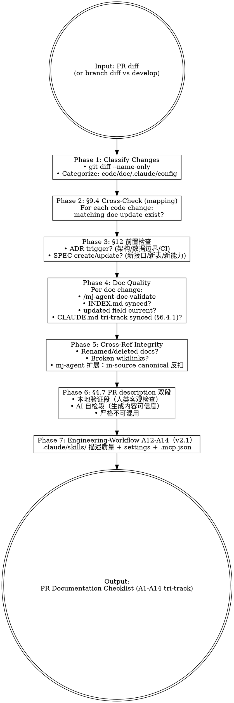

# mj-agent Doc Review

## Overview

PR-scope quality gate — 验 PR 是否满足 Meta v2.2 + Code_Side v1.1 + Agent_Side v1.1 文档要求。区别 `/mj-agent-doc-validate`（per-file）；本 skill 检查 PR holistically。**Stage 15 sub** of HITL_Prompt 17-stage 闭环。

**Direction-distinct（三角关系）**：

| Skill | Lens | When |
|---|---|---|
| `/mj-agent-doc-review`（本 skill） | **PR scope 文档完整性 checklist**（A1-A14 tri-track + §4.7 双段） | docs 改动 PR review |
| `/mj-agent-git-review-pr` | 他人 PR 架构 / 设计 / 数据边界 | review 别人 PR |
| `/mj-agent-flow-review-respond` | 自己 PR 上收到的 reviewer comments 处理 | Stage 15 |

"review PR docs" / "PR 文档检查" → 本 skill；"check PR architecture" → git-review-pr；"处理 review 回复" → flow-review-respond。

## Workflow



## Phase 1: Classify Changes

```bash
git diff --name-only develop...HEAD
```

按 mj-agent 路径分类：
- **Code**: `src/mj_agent/`、`tests/`、`scripts/`、`pyproject.toml` / `uv.lock`
- **In-source canonical**（B 风味）：`src/mj_agent/skills/**/SKILL.md`、`src/mj_agent/prompts/*.md`
- **biz_catalog**: `src/mj_agent/biz_catalog/qcm_catalog.yaml`
- **Config**: `.env.example`、`langgraph.json`、`infra/docker/`、`config/`、`.github/workflows/`
- **Docs**: `docs/`、`CLAUDE.md`、`CHANGELOG.md`、`README.md`、`CONTRIBUTING.md`
- **Engineering-workflow**: `.claude/skills/`、`.claude/settings.json`、`.mcp.json`

## Phase 2: §9.4 Cross-Check（mj-agent code-doc mapping）

按 `/mj-agent-doc-sync` SKILL.md mapping 表逐条检查。flag 缺失的 doc 更新。

## Phase 3: §12 前置检查

| 触发 | 类型 |
|---|---|
| 新模块 / 新 API / 新数据流 | **SPEC create** |
| Bug fix 改接口 / 模型 / 流程 | **SPEC update** |
| 架构 / 数据边界（ADR-006/009 影响）/ CI/CD 改动 | **ADR** |
| Meta/Code_Side/Agent_Side STANDARD 改动 | **STANDARD version bump**（per ADR-011） |

per HITL_Prompt §4.6 Rule 5（mj-agent 沿用 mj-system）：

- `代码优化 / 内部重构 / 性能改造（接口不变）` → 反扫现有 SPEC/GUIDE/RUNBOOK + ASSESSMENT 计划
- `新功能 / 新表` → SPEC create

## Phase 4: Doc Quality

per documentation change：

1. 跑 `/mj-agent-doc-validate` per file
2. 新建 docs 已加 INDEX.md entry?
3. 修改 docs `updated` field current?（per Meta v2.1 §5.4 substantive change rule）
4. CLAUDE.md sync — **触发轴**：Meta v2.2 §6.4 **4 类 allowlist**（类 1 全局高频标准 / 类 2 高频运行信息 / 类 3 项目目录入口 / 类 4 mj-agent 特化 runtime 语义；命中任一才触发 A6 sync）；**落位轴**：§6.4.1 三段分流：
   - `track: code` 改动 → CLAUDE.md `## Code-Side Documentation` 段
   - `track: agent` → `## Agent-Side Documentation`
   - `track: engineering-workflow` → `## Engineering-Workflow Documentation`
   - `track: shared` → 元规则段
   - **项目根 markdown**（无 track；per Meta v2.2 §2.6 例外）触发 §6.4 任一类时落 元规则段或主题段

## Phase 5: Cross-Reference Integrity（mj-agent 扩展）

1. 是否有 doc renamed/deleted？grep wikilinks 整仓
2. 改动 doc 内 broken internal links？scripts/check_wikilinks.py 跑
3. **mj-agent 扩展（per HITL_Prompt §4.9 Rule 5a）**：grep `src/mj_agent/skills/**/SKILL.md` + `prompts/*.md` 中是否引用 renamed 文件 / 列名 / 函数

## Phase 6: §4.7 PR Description 双段（Meta v2.2 §4.7 — 沿用 v2.0 §4 全部规则；实操 prompt 见 HITL_Prompt v1.1 §4.8 + §4.9）

PR description 必须按 §4.7 拆双段，**严格不可混用**：

**「本地验证」段** — 人类（或 CI）执行**客观可重复检查**：
- ✅ 接受：`uv run pytest tests/` / `uv run ruff check` / `uv run mypy src/mj_agent` / `python scripts/check_wikilinks.py` / `python scripts/check_frontmatter.py` / `uv run mj-agent check` / Studio probe / docker compose 启动 / mj-agent compose ps
- ❌ 拒绝："代码看起来正常" / "Claude 已检查" / "文档应该 OK"（属 AI 自检）

**「AI 自检」段** — AI Agent 对生成内容**可信度自查**：
- ✅ 接受：影响范围核对 / 无残留调试代码 / 硬编码 / 文档与实现一致 / 引用路径有效 / 与既有规范一致 / scope-drift Severity / 5a/5b/5c/5d 反向扫描结果（mj-agent 扩展含 in-source canonical 反扫）
- ❌ 拒绝："测试通过" / "Studio probe 5/5" / "scripts/check_*.py 0 violations"（属本地验证）

判定规则：
- 跨段（"diff 看着合理"放本地验证）→ WARN 让作者拆
- 缺失或空 → FAIL（PR description 不完整）
- mj-agent 5 PR templates 字段："变更摘要" / "影响范围" / "审核要点" / "本地验证" / "AI 自检" / "回滚" 等

## Phase 7: Engineering-Workflow A12-A14（v2.1，2026-05-08 PR-B3c-promote 后启用）

如 PR 含 `.claude/**` 改动：

- **A12** `.claude/skills/<name>/SKILL.md`：ADR-013 native schema（仅 name + description）；description ≥ 200 chars + 正向触发短语 + `Do not use for:` 反向触发段；name = 目录名 = `mj-agent-<group>-<verb>` 三段式
- **A13** `.claude/settings.json`：无裸 Bash 通配；secret pattern 在 deny；enabledPlugins 改 PR body 论证
- **A14** `.mcp.json`：server 增删声明 trust posture（first-party / third-party / community） + credential mode（none / OAuth / API key）

## Output Format

```markdown
## PR Documentation Review — PR #<id>

### Code-Side §7.1 (A1-A6 + OB1-OB5；全 track)
- [x] **A1** Path + filename 合法 — N/N docs pass
- [x] **A2** Frontmatter schema 完整 — N/N docs pass（含 track 字段 v2.2 4 值；项目根 markdown 例外 emit SKIP per §2.6）
- [x] **A3** state + enum 合法
- [ ] **A4** Wikilinks resolve — {N broken：xxx.md:line}
- [x] **A5** INDEX.md 同步
- [x] **A6** CLAUDE.md sync — §6.4 4 类 allowlist 触发判定 + §6.4.1 三段分组落位正确
- [ ] **OB1-OB5** 非阻塞观察项 — {WARN: doc 612 行超 GUIDE 推荐 100-500}

### Agent-Side §7.1 (A7-A11；仅 track: agent)
- [x] **A7** SKILL 路径 / Python 实现一致
- [x] **A8** PROMPT eval_references（Phase 2 起强制；当前 transitional waiver）
- [x] **A9** EVAL dataset_path（Phase 2 起强制）
- [x] **A10** CONTRACT schema_ref
- [x] **A11** SKILL eval_references（Phase D 起强制）

### Engineering-Workflow §7.7 (A12-A14；仅 track: engineering-workflow)
- [x] **A12** .claude/skills/<name> ADR-013 native + description 质量
- [x] **A13** .claude/settings.json allowlist 评审
- [x] **A14** .mcp.json server 声明

### §12 Pre-Check
- [x] No ADR trigger detected
- [ ] SPEC update needed — {ADR-006 影响 SQL guardrail 改动}

### Cross-References
- [x] No broken wikilinks
- [x] mj-agent 扩展（in-source canonical 反扫）：0 命中

### §4.7 PR Description 双段
- [x] 「本地验证」段存在且只含客观可重复检查
- [x] 「AI 自检」段存在且只含生成内容可信度自查
- [ ] 两段无混用 — {1 跨段条目需修正}

### Per-File Validation
| File | A1 | A2 | A3 | A4 | A5 | A6 | OB1-5 | Notes |
|---|---|---|---|---|---|---|---|---|
| docs/xxx.md | PASS | PASS | PASS | PASS | SKIP | SKIP | WARN | length 612 |

### Review Semantics
- `FAIL` — blocks merge
- `WARN` — requires reviewer comment but does not block
- `SKIP` — acceptable when check is not applicable

### 总判断: <Approve / Changes Requested / Comments>
```

## REQUIRED SUB-SKILL

`/mj-agent-doc-validate` — Phase 4 per-file 检查嵌套调用。

## What This Skill DOES NOT DO

- ❌ 不替代 `/mj-agent-git-review-pr`（架构 / 设计 review；本 skill 仅文档完整性）
- ❌ 不替代 `/mj-agent-flow-review-respond`（处理自己 PR comments；本 skill 是检查 PR 是否合 doc 标准）
- ❌ 不替代 `/mj-agent-doc-validate`（per-file；本 skill 是 PR scope 编排，sub-call validate）
- ❌ 不 auto-fix（仅报告）
- ❌ 不替代 mj-agent-flow-self-review（self-review 是 commit 前自检；本 skill 是 review 别人 / 自己 PR scope 文档完整性）

## Sub-skill / Tool Calls

| Tool / Skill | 用途 |
|---|---|
| Bash `git diff --name-only` / `gh pr diff` | Phase 1 |
| Bash `gh pr view --json` | Phase 1 PR metadata |
| Read | Phase 4 per-file + Phase 6 PR body |
| `/mj-agent-doc-validate` | Phase 4 sub-call per file |
| Grep | Phase 5 cross-ref scan |

## Reference Files

- [[../../../docs/rule/[STANDARD]_MJ_Agent_Documentation_Meta_Framework|Meta v2.2]] §2.6（项目根 markdown 例外）+ §4.7（双段约束；沿用 v2.0 §4 全部规则）+ §6.4（4 类 allowlist；PR #173 显式展开）+ §6.4.1（三段分组）+ §7.7（A12-A14）
- [[../../../docs/rule/[STANDARD]_MJ_Agent_Code_Side_Documentation_Framework|Code_Side v1.1]] §7.1（A1-A6 全 track）
- [[../../../docs/rule/[STANDARD]_MJ_Agent_Agent_Side_Documentation_Framework|Agent_Side v1.1]] §7.1（A7-A11 agent track）
- [[../../../docs/rule/[STANDARD]_GitHub_Markdown|GitHub_Markdown v1.1]] §14（项目根 README 与 Markdown 特例；PR #173 新加；语法 manual review）
- [[../../../docs/rule/[STANDARD]_MJ_Agent_AI_Engineering_Execution_HITL_Prompt|HITL_Prompt v1.1]] §4.6（§12 前置检查）+ §4.8（Local Verification）+ §4.9 Rule 5a-5d
- `.github/PULL_REQUEST_TEMPLATE/`（5 PR templates）
- mj-system `.claude/skills/mj-sys-doc-review/SKILL.md`（直接派生源；mj-agent 加 tri-track A12-A14 + mj-agent 扩展 §7.2.1 反扫 + 项目根 markdown 例外）

## Anti-patterns

- **不要** 跳过 Phase 7 A12-A14（v2.1 promote 后已正式启用）
- **不要** 用本 skill 评 PR 架构（用 git-review-pr）
- **不要** 跳过 §4.7 双段检查（混用条目会让 reviewer 反复 comment）
- **不要** 把 OB1-OB5 当 FAIL（Phase 1 之前 WARN-only）
- **不要** 跳过 mj-agent 扩展反扫（in-source canonical 是反扫目标）

## Handoff

```
PR Doc Review 输出后：
- Approve → /mj-agent-git-check-merge 接续 Stage 16 技术合并门
- Changes Requested → 提供 review comment 到 author；author 用 /mj-agent-flow-review-respond 处理
- Comments-only → 进入 review iteration
```
