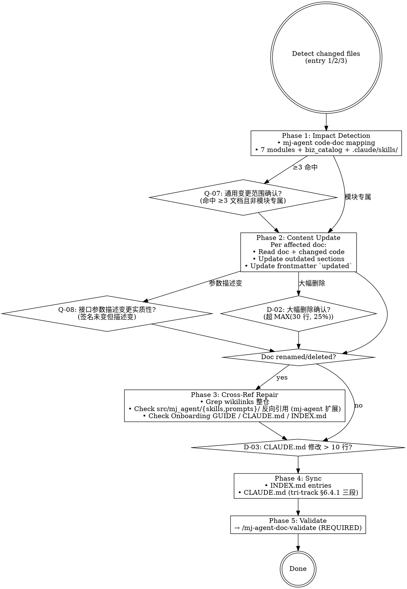

# mj-agent Doc Sync

## Overview

检测 mj-agent code 改动对 docs 的影响，执行更新，修复 cross-references，同步 INDEX.md + CLAUDE.md（tri-track 三段分组 + §6.4 **4 类 allowlist**）。**Stage 8 sub** of HITL_Prompt 17-stage 闭环。

> **§6.4 4 类 allowlist**（PR #173 v2.2 显式展开）：类 1 全局高频标准 / 类 2 高频运行信息 / 类 3 项目目录入口 / 类 4 **mj-agent 特化 runtime 语义**（LLM provider matrix + Data boundary L1-L4 + HITL gates）。命中任一类才触发 A6 sync 检查；其余 doc 改动默认不进 CLAUDE.md。

## Entry Points

1. **User-provided**: "我改了 X，更新文档" → 用提供的文件清单
2. **Git-based**: `git diff --name-only develop...HEAD` 检测改动文件
3. **Drift scan**: 周期性 audit doc 声明 vs 当前代码状态

## Workflow



## Phase 1: mj-agent Code-Doc Mapping

| Code 路径 | 影响的 docs |
|---|---|
| `src/mj_agent/agent.py` | `docs/design/agent/[SPEC]_*.md` / CLAUDE.md "Architecture" 段 / `README.md` "架构概览" 段（PR #171 起新加；ASCII 拓扑图，需保持简化版与 CLAUDE.md 同步）/ `docs/guide/[GUIDE]_Developer_Onboarding.md` §7 |
| `src/mj_agent/llm.py` | CLAUDE.md "LLM provider" 段 / `README.md` "LLM provider" 段（PR #171 保留；provider 表 + .env 配置）/ Studio walkthrough / **§6.4 类 4 命中**（runtime 语义）|
| `src/mj_agent/prompts/*.md` | **B 风味**：触发 §3.1 必停；经 /mj-agent-runtime-prompt-version-bump propose→拍板→apply |
| `src/mj_agent/skills/*/SKILL.md` | **B 风味**：触发 §3.1 必停；经 /mj-agent-runtime-skill-doc-improve propose→拍板→apply |
| `src/mj_agent/tools/sql/*.py` | `docs/design/agent/[SPEC]_*.md` / CLAUDE.md "Data boundary" 段 / `README.md` "Data boundary" 段（PR #171 保留）/ ADR-006 / **§6.4 类 4 命中** |
| `src/mj_agent/integrations/mj_system_db.py` | CLAUDE.md "Data boundary" / `README.md` "Data boundary" 段 / ADR-006 / ADR-009 / **§6.4 类 4 命中** |
| `src/mj_agent/biz_catalog/qcm_catalog.yaml` | `docs/design/agent/[SPEC]_biz_catalog_*.md` / `scripts/diff_biz_schema.py` 输出 |
| `src/mj_agent/config.py` | CLAUDE.md "Environment variables" / `.env.example` / `config/README.md` |
| `tests/{unit,eval,integration,smoke,contract}/` | CLAUDE.md "Commands" pytest 段 |
| `docker/` | CLAUDE.md "Commands" Docker 段 / `docs/guide/[GUIDE]_Developer_Onboarding.md` §7 / mj-agent-infra-docker-compose SKILL |
| `pyproject.toml` / `uv.lock` | CLAUDE.md "Commands" / CHANGELOG.md（如显著 dep 变化） |
| `.github/workflows/` | CLAUDE.md CI 段 / mj-agent-git-push GUIDE |
| `.env.example` | CLAUDE.md "Environment variables" / `config/README.md` |
| `langgraph.json` | `docs/guide/[GUIDE]_Developer_Onboarding.md` §7 |
| `.claude/skills/<name>/SKILL.md` 改动 | INDEX.md "工程编排技能" 段 / CLAUDE.md "Engineering-Workflow Documentation" 段 |
| `.claude/settings.json` 改动 | CLAUDE.md A13 自检（v2.1 §7.7） |
| `.mcp.json` 改动 | CLAUDE.md A14 自检 + 待落地 `[STANDARD]_MCP_Server_Governance_v1.0` |

> **§7.2.1 反向扫描**（mj-agent 扩展，per HITL_Prompt §4.9 Rule 5a）：除 5 类通用改动（rename / move / SQL-rename / DDD-restructure / internal-opt）外，加 in-source canonical body change（src/mj_agent/{skills,prompts}/）+ biz_catalog drift 反扫。

## Phase 2: Content Update

per affected doc：

1. side-by-side 读 doc + changed code
2. 找出 outdated sections
3. 更新 content 保持文档结构
4. 更新 frontmatter `updated`（实质改动时）；version bump（如适用）

**触发条件**：
- 接口参数描述变但函数签名未变 → **Q-08** 实质性判断
- 单文档预计删除超 MAX(30 行, 25%) → **D-02** 大幅删除确认

**Substantive change rule**: 仅在改动影响语义或行为指引时更新 `updated`。typo / formatting → **不**更新 `updated`。

## Phase 3: Cross-Reference Repair（mj-agent 扩展）

如有 doc renamed / deleted：

1. Grep wikilinks 整仓：`docs/`、`CLAUDE.md`、`README.md`、`CONTRIBUTING.md`、`.github/`
2. **mj-agent 扩展（per HITL_Prompt §4.9 Rule 5a）**：grep `src/mj_agent/skills/**/SKILL.md` + `src/mj_agent/prompts/*.md` body 中的 backtick 引用（in-source canonical 是反扫目标）
3. **Always check**: `docs/guide/[GUIDE]_Developer_Onboarding.md`（高频 cross-reference 目标）
4. 更新所有命中 references 到新名/位置

## Phase 4: Sync

**执行前 D-03 检查**：CLAUDE.md 需修改 > 10 行 → **D-03** 确认

1. **INDEX.md**：手动更新对应 section 的 entry（mj-agent 当前未有 validator-owned managed-block 自动重建；Phase 2+ 落地）
2. **CLAUDE.md sync 两轴**：
   - **触发轴**：§6.4 **4 类 allowlist**（Meta v2.2 §6.4，PR #173 显式展开）—— 类 1 全局高频标准 / 类 2 高频运行信息 / 类 3 项目目录入口 / 类 4 **mj-agent 特化 runtime 语义**；命中任一才触发 A6 sync
   - **落位轴**：tri-track 三段分组（Meta v2.2 §6.4.1）—— 按改动 doc 的 `track` 值落入对应段：
     - `track: code` → `## Code-Side Documentation` 段
     - `track: agent` → `## Agent-Side Documentation` 段
     - `track: engineering-workflow` → `## Engineering-Workflow Documentation` 段
     - `track: shared` → 元规则段（顶部）
   - **项目根 markdown 例外**：README/CONTRIBUTING/CHANGELOG/GLOSSARY/CLAUDE.md 改动（per Meta v2.2 §2.6）不进入 tri-track 落位轴（无 `track` 字段）；但若触发 §6.4 任一类（如 README "LLM provider" 段触类 4），仍需 A6 sync 检查

Sync 范围限于 canonical docs in `docs/**`。Working docs in `plans/**` 不 sync。

## Phase 5: Validate

**REQUIRED SUB-SKILL**：`/mj-agent-doc-validate` — 每个修改 doc 都跑。

## 人工交互节点

| 时机 | 触发条件 | 抑制条件 | 问题 ID |
|---|---|---|---|
| Phase 1 后 | 命中 ≥3 docs 且变更通用工具/配置 | 用户已提供受影响清单 | Q-07 |
| Phase 2 中（接口描述变） | 参数类型/名称描述变但函数签名未变 | 用户说"只改格式/注释" | Q-08 |
| Phase 2 中（大幅删除） | 单文档删除 > MAX(30 行, 25%) | 用户说"大幅修改/重写" | D-02 |
| Phase 4 前（CLAUDE.md > 10 行） | CLAUDE.md 需修改超 10 行 | 用户说"不用更新 CLAUDE.md" | D-03 |
| Phase 1 后（B 风味命中） | mapping 命中 src/mj_agent/{skills,prompts}/* | 经 /mj-agent-runtime-* propose + 拍板 + apply | **Q-B1**（mj-agent 专属 §3.1 必停） |

### Q-B1（mj-agent 专属）

```
检测到 code 改动触及 src/mj_agent/{skills,prompts}/**（B 风味 in-source canonical）。
§3.1 必停面 runtime-skill-content-change / prompt-version-or-body-change 触发；建议先：
(1) 用 /mj-agent-runtime-skill-doc-improve（如 SKILL.md）或 /mj-agent-runtime-prompt-version-bump（如 system.md）propose→拍板→apply
(2) Domain Expert + Prompt Engineer review
(3) Owner 拍板后 runtime skill 落盘 + 再同步 docs

或：(A) 仅 sync 非 in-source 部分（推荐；in-source 留给 runtime skill 单独处理）/ (B) 跳过 B 风味流程直接 sync（user 全责）
```

## What This Skill DOES NOT DO

- ❌ 不写新文档（用 /mj-agent-doc-author）
- ❌ 不替代 /mj-agent-flow-self-review（self-review §3 本地验证段嵌套调本 skill；本 skill 不输出 11/12-item checklist）
- ❌ 不直接改 in-source canonical（B 风味必走 propose-via-runtime 流程）
- ❌ 不删 legacy docs（用 /mj-agent-doc-migrate 走 archive workflow）
- ❌ 不 auto-fix CLAUDE.md（D-03 manual review；自动修改会破坏 §6.4.1 三段分流）

## Sub-skill / Tool Calls

| Tool | 用途 |
|---|---|
| Bash `git diff --name-only` | Phase 1 entry 2 |
| Read | Phase 2 doc + code side-by-side |
| Edit | Phase 2 / Phase 4 update |
| Grep | Phase 3 cross-ref + 反向扫描 |
| AskUserQuestion | Q-07/Q-08/D-02/D-03/Q-B1 |
| `/mj-agent-runtime-*` | Q-B1 触发；B 风味 propose→拍板→apply |
| `/mj-agent-doc-validate` | Phase 5 sub-call |

## Reference Files

- [[../../../sdd/workflows/execution-loop|sdd/workflows/execution-loop]] §1（Stage 8 在 loop 的位置；反向扫描含 in-source canonical）
- [[../../../policies/documentation|policies/documentation]] §2.6（项目根 markdown 治理例外）+ §7.1（4 类 allowlist；PR #173 显式展开）+ §7.2（CLAUDE.md tri-track 三段分组）
- [[../../../docs/rule/[STANDARD]_GitHub_Markdown|GitHub_Markdown v1.1]] §14（项目根 README 与 Markdown 特例；PR #173 新加）
- [[../../../CLAUDE.md|CLAUDE.md]] "Architecture" / "Data boundary" / "Commands" / "LLM provider" 段（high-frequency sync 目标；§6.4 类 1-4 全覆盖）
- mj-system `.claude/skills/mj-sys-doc-sync/SKILL.md`（直接派生源；mj-agent 加 mapping 表 + Q-B1 + tri-track CLAUDE.md sync + 项目根例外）

## Anti-patterns

- **不要** 绕过 runtime skill 直改 src/mj_agent/{skills,prompts}/（B 风味必经 /mj-agent-runtime-* propose→拍板→apply）
- **不要** 未经 Owner 拍板 auto-edit CLAUDE.md（§6.4.1 三段分流需 Owner 拍板；拍板后 AI 落盘）
- **不要** 跳过 §7.2.1 反扫的 mj-agent 扩展（in-source canonical body 是反扫目标）
- **不要** 在 D-02/D-03 触发时跳过用户确认
- **不要** 主动维护项目根 markdown 5 件的 frontmatter（README/CONTRIBUTING/CHANGELOG/GLOSSARY/CLAUDE.md）—— per Meta v2.2 §2.6 例外，项目根 markdown 不写 frontmatter；A1-A3 不适用；本 skill 仅在「项目根 markdown 段内容反映了 §6.4 4 类某项」时同步内容，不补 frontmatter

## Handoff

```
Sync 完成 → /mj-agent-doc-validate 全跑 → PASS 后 /mj-agent-git-commit
B 风味场景 → 先 /mj-agent-runtime-* propose → 拍板 → apply → 再 sync
```
