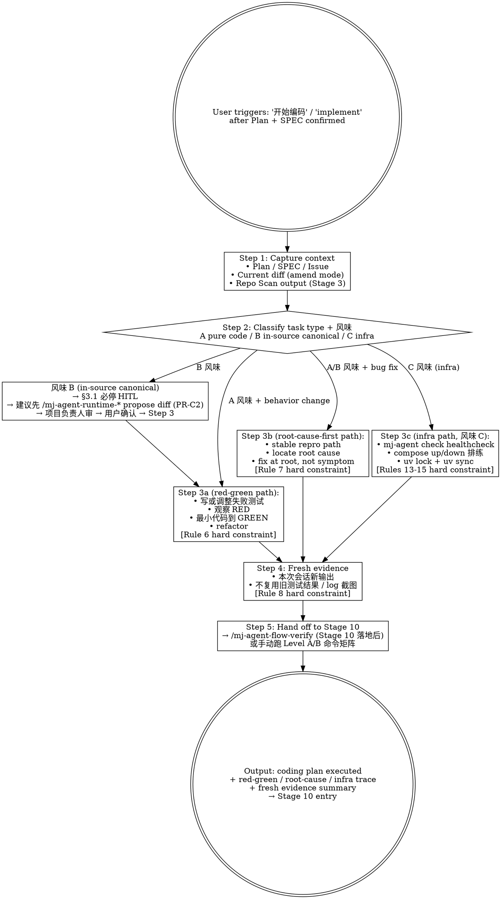

# mj-agent Flow — Implementation (HITL Stage 8 编码段)

## Overview

The 4th orchestrator in `mj-agent-flow-*` family — operationalizes [[../../../docs/rule/[STANDARD]_MJ_Agent_AI_Engineering_Execution_HITL_Prompt|HITL_Prompt v1.0]] §4.7 Rules 1-15 hard constraints. Runs **during** coding (after Plan/SPEC confirmed, before Stage 10 verification), enforcing 4 methodology pillars:

1. **Red-green-refactor** for behavior changes (Rules 6, 风味 A/B applicable)
2. **Root-cause-first** for bug fixes (Rule 7, no bypass / no try-except 吞错)
3. **Fresh evidence** before claiming completion (Rule 8)
4. **mj-agent-specific 3-flavor discipline**（Rules 9-15）：A 纯代码 / B in-source canonical **永远 HITL** / C infra

The skill is **the in-tree first preference** for §4.7 Implementation Skill Hint. When `superpowers:*` skills available, can be invoked as optional sub-call enhancers; when unavailable, falls back to manual execution.

**Reference**:
- [[../../../docs/rule/[STANDARD]_MJ_Agent_AI_Engineering_Execution_HITL_Prompt|HITL_Prompt v1.0]] §4.7（Stage 8 Implementation, Rules 1-15）
- mj-system `.claude/skills/mj-sys-flow-implement/SKILL.md`（直接派生源；mj-agent 加 3 风味 + Rules 9-15）

## Workflow



## When to Run This Skill

**MUST run when**：
- Stage 5/6/7 (HITL Gates) 通过，用户准备写代码
- 用户："开始编码" / "implement" / "实现 SPEC" / "Stage 8" / "TDD" / "先写测试"
- Bug fix 触发（test failure / crash / 异常输出）— 强制 root-cause-first
- 声称完成前（"done" / "完成了"）— 强制 fresh-evidence 检查（进 §4.8 前）

**MAY skip when**：
- 纯 docs 拼写 / 措辞修改 — 直接编辑无方法学开销
- 用户明确"skip TDD, just write the code"（仍记跳过原因；遵 user instruction-priority rule）
- 单文件 trivial refactor 已有测试覆盖 — fresh-evidence 仍适用，red-green 略显多余

**MUST NOT use for**：
- 命令矩阵执行 → `mj-agent-flow-verify`（Stage 10）
- pre-commit 11-item checklist → `mj-agent-flow-self-review`（Stage 11）
- diff vs Plan drift → `mj-agent-flow-scope-drift`（Stage 9）
- Repo state 事实核查 → `mj-agent-flow-repo-scan`（Stage 3）
- Plan body authoring → `mj-agent-flow-plan`（Stage 4）

## Step 1: Capture Context

```bash
# Linked artifacts
branch=$(git branch --show-current)
issue=$(echo "$branch" | grep -oE '[0-9]+' | head -1)
[ -n "$issue" ] && gh issue view "$issue" --json title,body

ls plans/[PLAN]_*.md 2>/dev/null               # Plan body (Stage 4)
ls docs/design/*/[SPEC]_*.md 2>/dev/null       # SPEC (Stage 6)

# Worktree state
git status --short
git diff --name-only HEAD
git diff --stat $(git merge-base develop HEAD)..HEAD
```

如 Plan / SPEC 缺失（非 trivial 任务）→ STOP，提示先跑 `/mj-agent-flow-plan` 或 `/mj-agent-doc-author`。无 plan 编码违反 §4.7 Rule 1（保持改动范围最小）。

## Step 2: Classify Task Type + 风味

**3 风味判定**（mj-agent 专属，参 [[../../../docs/rule/[STANDARD]_MJ_Agent_AI_Engineering_Execution_HITL_Prompt|HITL_Prompt]] §4.7 + ADR-015 §决策点 3）：

| 修改路径 | 风味 | 强约束 |
|---|---|---|
| `src/mj_agent/{config,server,memory,integrations,tools,...}/` + `tests/` | **A 纯代码** | TDD red-green；ruff/mypy strict；Rules 1-8 |
| `src/mj_agent/skills/**/SKILL.md` 或 `src/mj_agent/prompts/*.md` | **B in-source canonical** | **永远 HITL**；A11 EVAL 门禁；frontmatter strip 契约不破坏；五段式 body 保持；Rules 9-12 |
| `infra/docker/` + `pyproject.toml` + `langgraph.json` + `qcm_catalog.yaml` + `.env.example` + `scripts/` | **C infra** | mj-agent check healthcheck；compose 排练；uv lock；Rules 13-15 |

| Task 信号 | 路径 | 硬约束 |
|---|---|---|
| 新功能 / 行为变更 / 重构（含行为暗示） | **Step 3a** red-green | Rule 6 |
| Bug 报告 / 测试失败 / crash / 错输出 | **Step 3b** root-cause-first | Rule 7 |
| Plan 已拆 bite-sized confirmed steps | **Step 3a/3b per step**；Step 4 仍适用 | Rules 6/7/8 per step |
| 纯 config / metadata 改无行为影响 | 跳 Step 3（red-green N/A）；Step 4 仍适用 | Rule 8 |

**B 风味专属流程**（Rules 9-12 强约束）：

1. 检测到 `src/mj_agent/skills/**/SKILL.md` 或 `src/mj_agent/prompts/*.md` body 改动
2. **HITL 必停**：输出"检测到 B 风味 in-source canonical 改动；§3.1 必停项 10/11 触发"
3. 建议先用 `/mj-agent-runtime-skill-doc-improve` 或 `/mj-agent-runtime-prompt-version-bump`（PR-C2 落地后）propose diff
4. 项目负责人 review diff → 用户确认接受 → 才进 Step 3
5. PR description 必须含 EVAL backlog ticket 自动开单声明（§4.15 Rule 11）

不分类错误 → 走错方法学路径，浪费工作。如不清晰，问用户。

## Step 3a: Red-green-refactor (Behavior Change Path)

**Rule 6（hard）**：行为变更（feature / bugfix / refactor）先写或先调整失败测试，再写实现使其通过。

执行纪律：

1. **先写失败测试** — 按行为命名，不按实现命名
2. **跑测试，观察 RED** — 立即通过则测试不验证新行为；重写或加强
3. **最小代码到 GREEN** — 不投机性扩展
4. **绿态下 refactor** — 仅当改善清晰；保持绿态

**为什么观察重要**：写但没看红的测试不证明它声称的事。Rule 6 显式要求"先写或先调整失败测试" + Step 3a 强制观察 RED。

**Sub-call (optional)**：`superpowers:test-driven-development` — 节奏更严格。不可用时 4 步手动等价。

## Step 3b: Root-cause-first (Bug Fix Path)

**Rule 7（hard）**：修 bug 前先稳定复现路径并定位 root cause，不可用绕过 / 关闭测试 / 加 try-except 吞错替代修复。

执行纪律：

1. **建立稳定 repro** — 确定性命令 / 输入触发 bug；不能复现就不能声称修复
2. **追溯 root cause** — 跟随失败回溯到真实缺陷，不是第一个看起来可改的位置
3. **从根修** — 改真正错的代码；不加掩盖症状的防御层
4. **验证修复** — 重跑 repro；bug 不再发生。Bonus: 写 regression test（折回 Step 3a）

**Anti-patterns to refuse**：
- `try: ... except: pass` 吞错
- 关闭失败测试
- `if condition_that_triggers_bug: return early` 不解释为何
- "我机器上能跑" — 不是修复

**Sub-call (optional)**：`superpowers:systematic-debugging`。手动等价：写假设 → 测 → 收窄 → 重复。

## Step 3c: Infra Path（C 风味，mj-agent 专属，Rules 13-15）

**Rule 13（hard）**：compose 改动后必须手动 `docker compose -f infra/docker/docker-compose.mj-agent.yml up -d` + `down` 排练，记录在 PR description。

**Rule 14（hard）**：`pyproject.toml` 增依赖必须 `uv lock` + `uv sync`，确认 lock 文件 commit 同 PR。

**Rule 15（hard）**：`.env.example` 改动需在 `secrets.enc` 同步加密（如涉及 secret），更新 `config/README.md`。

执行纪律：

1. **healthcheck 必过**：`uv run mj-agent check`（DB + LLM creds 健康）
2. **compose lifecycle 排练**：up → 验证容器 status → down → 验证清理
3. **依赖 lock**：每次 pyproject.toml 修改后 `uv lock` 必跑，lock 同 PR commit
4. **secret 同步**：`.env.example` 加新字段时 `secrets.enc` 同步（用 `scripts/encrypt-secrets.ps1`）+ `config/README.md` 文档更新

## Step 4: Fresh Evidence

**Rule 8（hard）**：声称"实现完成"前必须运行新证据（本次会话新输出），不可复用旧测试结果或旧 log 截图。

声称 done 或交接 Stage 10 前：

1. **本次会话重跑相关测试** — 输出必须新鲜，不能粘贴旧的
2. **捕获新 logs / screenshots / DB 查询** — 改动有 runtime 效果时
3. **验证新输出符合期望** — 不止"跑过没报错"

**为什么重要**：陈旧证据曾让本项目踩过坑——3 commit 前过的测试在当前 diff 上崩。Fresh evidence 廉价且确定。

**Sub-call (optional)**：`superpowers:verification-before-completion`。手动等价：显式列验证命令现在跑（不是"它们应该还过"）。

## Step 5: Hand Off to Stage 10

Steps 3 + 4 完成后交接 `/mj-agent-flow-verify`（PR-B3 落地后；Stage 10 Local Verification 跑 Level A/B 命令矩阵）。本 skill 工作到此结束——不亲跑矩阵。

handoff 输出：

```markdown
## Implementation Trace
- Task type: <behavior change | bug fix | plan execution | config>
- 风味: <A 纯代码 | B in-source canonical | C infra>
- Methodology path: <red-green | root-cause-first | infra | mixed>

### B 风味 HITL trace（如适用）
- §3.1 必停项: <runtime-skill-content-change | prompt-version-bump>
- 已 propose diff via: </mj-agent-runtime-skill-doc-improve | -prompt-version-bump>
- 项目负责人 review: <date / 接受>
- EVAL backlog ticket: <issue # / 待开>

### Red-green log（如适用）
- Failing test: <name + 观察 RED>
- Implementation: <files changed, why minimal>
- Refactor: <什么清理，或 "skipped">

### Root-cause log（如适用）
- Repro: <command / input>
- Root cause: <一句诊断 + file:line>
- Fix: <files changed; why root-level not symptom-level>
- Regression test: <name, or "deferred to follow-up because ...">

### Infra log（如适用）
- mj-agent check: <pass / fail>
- compose up/down 排练: <log / failed>
- uv lock 已同 PR: <yes / no>
- secret 同步: <secrets.enc 已同步 / N/A>

### Fresh evidence
- <list of rerun commands and what they output, in this session>

### Handoff
- → /mj-agent-flow-verify for Stage 10 Level A/B/C 命令矩阵（PR-B3 落地）
```

## Sub-skill / Tool Calls

| Sub-skill | Source | When | Manual equivalent if unavailable |
|---|---|---|---|
| `superpowers:test-driven-development` | user-global `~/.claude/` | Step 3a 严格节奏 | Rule 6 manual: write test → run → see red → minimal impl → refactor |
| `superpowers:systematic-debugging` | user-global | Step 3b 结构化 frame | Rule 7 manual: hypothesis → test → narrow → root cause |
| `superpowers:verification-before-completion` | user-global | Step 4 pre-completion check | Rule 8 manual: list commands, run them now, capture fresh output |
| `superpowers:executing-plans` / `subagent-driven-development` | user-global | Step 2 → confirmed plan with bite-sized steps | Manual: walk through plan step by step, applying Step 3a/3b/3c/4 to each |
| `mj-agent-runtime-skill-doc-improve`（PR-C2） | in-tree | B 风味 SKILL.md body 改动前 propose diff | 直接 Edit 但 §3.1 必停 HITL |
| `mj-agent-runtime-prompt-version-bump`（PR-C2） | in-tree | B 风味 system.md `version` bump propose | 直接 Edit 但 §3.1 必停 HITL |

> **Why optional superpowers**：user-global 插件，非每个贡献者都装。本 skill Step 3a/3b/3c/4 散文设计为 standalone 工作。

## Domain Companion Skills

| Companion | Trigger |
|---|---|
| `mj-agent-runtime-{skill-doc-improve, prompt-version-bump, biz-catalog-sync}`（PR-C2） | B 风味或 biz_catalog drift |
| `mj-agent-doc-sync`（PR-C1） | 代码改动隐含的文档更新超出 Plan §7.1 已声明范围 |
| `mj-agent-doc-author`（PR-B4） | 编码同时需要写 SPEC/RUNBOOK/GUIDE |
| `mj-agent-infra-{docker-compose, storage-stack, env-setup}`（PR-C3） | C 风味 infra |

并行 skills，不是 sub-call。

## What This Skill DOES NOT DO

- ❌ 不执行 Stage 10 命令矩阵 → `mj-agent-flow-verify`
- ❌ 不产 Stage 11 11-item checklist → `mj-agent-flow-self-review`
- ❌ 不比 diff vs Plan drift → `mj-agent-flow-scope-drift`（Stage 9）
- ❌ 不自动 commit/push → `mj-agent-git-commit` / `mj-agent-git-push`
- ❌ 不替代 Rules 1-15——operationalizes 它们。本 skill 不可用时仍须手动遵 Rules 1-15
- ❌ 不硬要 superpowers:*——sub-call 是 optional enhancer，非依赖
- ❌ B 风味时 **不**自动 Edit/Write src/mj_agent/{skills,prompts}/—— §3.1 必停 HITL；建议先 propose diff via mj-agent-runtime-*

## Direction Matrix vs Companion mj-agent-flow-* Skills

| Skill | Stage | Lens | Trigger keywords |
|---|---|---|---|
| **mj-agent-flow-implement**（本 skill） | **5-8** | **Coding-process methodology** | "implement" / "TDD" / "red-green" / "test first" / "复现 bug" / "root cause" / "声称完成前" |
| mj-agent-flow-scope-drift（PR-B3） | 9 | diff vs Plan/SPEC | "scope drift" / "drift check" / "diff vs plan" |
| mj-agent-flow-verify（PR-B3） | 10 | 命令矩阵执行 | "跑测试" / "执行命令矩阵" / "Level A/B" |
| mj-agent-flow-self-review（PR-B3） | 11 | 11-item checklist + commit msg | "commit 前" / "pre-commit" / "AI 自检" / "self review" |
| mj-agent-flow-repo-scan | 3 | Repo 事实核查 | "repo scan" / "8-dim" / "反向扫描" |
| mj-agent-flow-plan | 4 | Plan body 编写 | "写 plan" / "plan body" / "任务拆解" |

边界：本 skill 治"代码怎么写"；其他 governs"代码写完后怎么验证 / 框架"。

## Reference Files

- [[../../../docs/rule/[STANDARD]_MJ_Agent_AI_Engineering_Execution_HITL_Prompt|HITL_Prompt v1.0]] §4.7（Stage 8 Implementation Rules 1-15）
- [[../../../docs/adr/[ADR]_015_HITL_Prompt_v1_0_Derivation|ADR-015]] §决策点 3（3 风味决策） + §决策点 4（runtime 类目硬约束）
- mj-system `.claude/skills/mj-sys-flow-implement/SKILL.md`（直接派生源；mj-agent 加 3 风味 + Rules 9-15）
- `.claude/skills/mj-agent-flow-verify/SKILL.md`（PR-B3 落地，Stage 10 hand-off）
- `.claude/skills/mj-agent-flow-self-review/SKILL.md`（PR-B3 落地，Stage 11 successor）
- `.claude/skills/mj-agent-flow-plan/SKILL.md`（Stage 4 predecessor）
- `~/.claude/plugins/cache/claude-plugins-official/superpowers/5.1.0/skills/{test-driven-development,systematic-debugging,verification-before-completion,executing-plans}/SKILL.md`（optional sub-call sources）

## Anti-patterns

- **不要** 在 §3.1 必停项触发后还自动 Edit src/mj_agent/{skills,prompts}/（违反 Rule 9-12）
- **不要** 跳过 Step 4 fresh evidence 直接声称 done（违反 Rule 8；PR review 阶段会被挑战）
- **不要** 用 `try: except: pass` 吞错替代 root cause 修复（违反 Rule 7）
- **不要** 立即过的"测试"作 red-green 证据（违反 Rule 6 观察 RED 强约束）
- **不要** 在 C 风味改 pyproject.toml 不跑 `uv lock`（违反 Rule 14；PR 会有未 lock 文件）
- **不要** 在跨风味改动（A + B + C 混）时不拆 commit（违反 mj-agent-git-commit Step 5；混合提交难 review）
