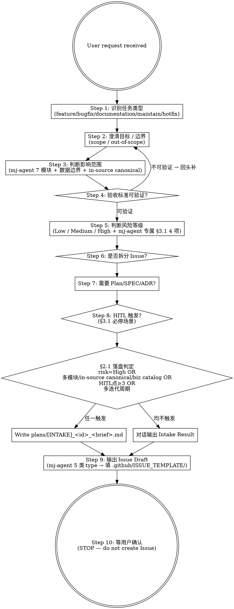

# mj-agent Flow — Task Intake (HITL Stage 0)

## Overview

Authoritative entry point for the 17-stage mj-agent AI Engineering Execution flow. Converts user intent (natural language) into a structured Intake Result before any code, branch, or document is created.

**Key constraint**: this skill **only outputs** Intake Result + Issue Draft + HITL Questions. It does NOT create Issues, branches, worktrees, or files (except optionally `plans/[INTAKE]_<id>_<brief>.md` when §2.1 落盘判定 triggers).

**Workflow position**:

```text
[user request] -> [mj-agent-flow-intake] -(HITL Gate confirmed)-> [mj-agent-git-issue] -> [mj-agent-git-branch] -> ...
```

**Reference**:
- `mj-system@docs/rule/[STANDARD]_AI_Engineering_Intake.md` v1.0（Lite Phase A 占位；mj-agent 调版 Phase B+ 派生）
- [[../../../sdd/workflows/execution-loop|execution-loop]] §3.1（必停规则，含 4 项 mj-agent 专属）+ §4.1（Stage 0 → 本 skill 映射；⚠ §4.1 是 Stage→Skill 映射表**不是** Stage 0 prompt——per-stage prompt 未 re-port，历史源 HITL_Prompt §4.1 Intake Prompt）

## Workflow



## When to Run This Skill

**MUST run intake**：
- 用户要求"创建 GitHub Issue / 发布 Issue / 基于需求生成 Issue"
- 用户"根据想法启动新任务 / 根据描述开始开发 / 修复 / 维护 / 文档更新"
- 用户把"plan / spec / 聊天记录 / 问题描述"转成工程任务
- 用户提到改动 in-source canonical（src/mj_agent/skills/**/SKILL.md 或 system.md）/ biz catalog（qcm_catalog.yaml）/ SQL guardrail / system prompt version bump（这些都是 §3.1 必停 trigger）

**MAY skip full intake**（仍做最小判断）：

| 场景 | 处理方式 |
|---|---|
| 用户明确指定已有 Issue 并要求继续执行 | 读 Issue + 相关上下文 → 进 Repo Scan |
| 用户只问概念 / 解释代码 | 不 Intake，不创建 Issue |
| 用户要求纯查看状态 / 运行命令（uv run / docker compose ps） | 直接执行 |
| 用户明确"不要创建 Issue" | 轻量分析，不输出 Issue Draft |
| `documentation/*` 分支的纯文档拼写 / 链接修正 | 跳过 Intake，直接编辑 |

## Step 1: 识别任务类型

mj-agent 5 type（参 [[../../../docs/rule/[STANDARD]_MJ_Agent_Commit_Message_Convention|Commit Convention]] §5）：

| Type | Description | Base Branch | PR Target |
|---|---|---|---|
| feature | 新功能 / 新 skill / 新 tool / 重构 | develop | develop |
| bugfix | develop 上发现 bug | develop | develop |
| documentation | 仅文档 | develop | develop |
| maintain | CI/CD / Docker / deps / scripts / 配置 | develop | develop |
| hotfix | 生产紧急 | **main** | **main** |

> mj-agent **不**用 `optimization/`（与 mj-system 差异）。

## Step 2: 澄清 scope / out-of-scope

明确：
- 包含 / 不包含的具体动作
- 前置依赖（已有 ADR / SPEC / 上游 Issue）
- 后续独立 PR（避免 scope 膨胀）

## Step 2b: Grilling 逼问纪律（仅前期真歧义）

> **leading word「逼问」**（per [[../../../docs/rule/[STANDARD]_MJ_Agent_Skill_Authoring_Craft|技能写作工艺规范]] §6）。**仅对前期真歧义开**、用于把模糊需求逼清——**不是执行门**。

**何时触发**（任一）：需求含**未决分支** / **新颖**（无既有 ADR/SPEC/catalog 对位） / **真歧义**（同一描述 ≥2 种合理解读）。已定方向的任务**不触发** → 直接进 Step 3。

**逼问纪律**：
- **一次一问** —— 一次抛多问令人迷失；逐题推进。
- **每问附推荐答案锚点** —— 给出你的首选答案 + 理由，用户只需 同意 / 改正（对齐 mj-agent `AskUserQuestion`「(Recommended) 首选项放第一」惯例；离散单点用 `AskUserQuestion`，连续追问走对话）。
- **沿 design tree 逐依赖下钻** —— 上层决定锁定后再问其依赖项。
- **能查代码 / glossary / catalog 就别臆测** —— 先 `find_biz_context` / 读 `qcm_catalog.yaml` / glossary，查不到再问。
- **停止判据（checkable）** —— design-tree 每分支标 `resolved` 或 `defer(M-FU)`；全标完即停，进 Step 3。

**校准（关键，防违背「方向明确就执行」偏好）**：**逼问 ≠ 执行门**。仅在前期把模糊需求逼清，**不**对已定方向的执行段加门。方向一旦明确，立即停问、进 Step 3，不空转。

❌ Anti-patterns：
- 把逼问用于**已定方向**的执行段（= 过度 gate；违反偏好）。
- 一次抛多问；不给推荐答案、让用户从零回答。
- 能查 catalog / 代码却臆测发问。

## Step 2c: 术语主动锐化（ubiquitous language）

> 借「domain-modeling」**主动**锐化领域语言的思路、按 mj-agent native 承载（**不引入 `CONTEXT.md`**——挂既有分布式工件：glossary / catalog / decisions）。

- **当场挑战**：intake 遇术语与既有 [[../../../docs/glossary/upstream_business_warehouse|glossary]] / `qcm_catalog.yaml` **冲突或模糊** → 不放过，当场厘清。
- **边界场景压测**：用具体 edge case 逼出概念边界（"X 算不算 Y？这种情况归哪类？"）。
- **即时更新工件**：术语一旦敲定**立即** inline 更新对应工件——术语 → glossary；指标 / 维度 → `qcm_catalog.yaml`（**4 必停面之一**，改动走 `/mj-agent-runtime-biz-catalog-sync` propose→拍板→apply，**不被本纪律绕过**）；难逆决策 → `decisions/` ADR（开列判据见 `/mj-agent-doc-author`）。
- 跨上游仓术语：走 attribution → glossary 元文档 wikilink（跨仓解耦规约）。

## Step 3: 影响范围（mj-agent 7 模块 + 跨边界）

| 范畴 | 检查重点 | 涉及时升档 |
|---|---|---|
| **agent** | `src/mj_agent/agent.py` / graph 装配 / `_ACTIVE_SKILLS` 列表 | Medium 起 |
| **llm** | `src/mj_agent/llm.py` / Ark client 工厂 / 模型配置 | Medium 起 |
| **prompt** | `src/mj_agent/prompts/*.md`（in-source canonical） | **High** + §3.1 必停 |
| **skill** | `src/mj_agent/skills/*/SKILL.md`（in-source canonical） | **High** + §3.1 必停 |
| **sql** | `src/mj_agent/tools/sql/{guardrail,execute,introspect,precheck}.py` | **High** + §3.1 必停（guardrail/precheck 放宽） |
| **db** | `src/mj_agent/integrations/mj_system_db.py` / 连接池 / role | Medium 起 |
| **config** | `src/mj_agent/config.py` / pydantic-settings | Medium 起 |
| **biz_catalog** | `src/mj_agent/biz_catalog/qcm_catalog.yaml` 镜像 | **High** + §3.1 必停 |
| 跨边界 | mj-system biz pg consumer（ADR-008 / ADR-009 数据边界） | Medium 起；触红线 → High |
| 跨边界 | mj-agent-postgres / mj-agent-redis 容器（storage stack） | Medium 起 |
| infra | `docker/` / `pyproject.toml` / `langgraph.json` | Low / Medium |
| **docker 供应链** | `docker/Dockerfile` 外部 registry 镜像引用（`FROM <image>` + `COPY --from=<registry image>`；内部 `COPY --from=<stage>` **不**在内） | **High** + 改前 Owner 拍板（canonical `secrets-grants-or-prod-config`；规则体 `policies/docker-runtime.md` §4。**不在** execution-loop §3.1 的 4 项 in-source 必停之列——那 4 项是 `src/mj_agent/` 面）。Dockerfile 其余行仍 Low / Medium |
| docs | `docs/` / `CLAUDE.md` / `INDEX.md` | Low（纯 docs）/ Medium（含 STANDARD/ADR） |

## Step 4: AC 可验证性（gate）

每条 AC 必须能：

| 验证手段 | 例 |
|---|---|
| pytest 命令 | `uv run pytest tests/unit -k test_xxx` |
| ruff / mypy | `uv run ruff check` / `uv run mypy src/mj_agent` |
| Studio 探针 | `uv run langgraph dev` + H1/H2/H3/R1/R2 矩阵 |
| `mj-agent check` | DB + LLM creds 健康 |
| 文档 grep 校验 | `python scripts/check_wikilinks.py` / `check_frontmatter.py` |
| 业务样本对比 | smoke test（needs Ark + biz DB） |
| Studio + LangSmith trace | LLM 行为质量评估（B 风味 in-source canonical 改动） |

如某条 AC 无法对应任一手段 → 回到 Step 2 重新拆解。

## Step 5: 风险等级（含 mj-agent 专属 §3.1 4 项）

| 档位 | 通用触发（沿用 mj-system §8 Low/Medium/High） | mj-agent 专属升档 |
|---|---|---|
| Low | 局部、可逆；不动 schema/secret/prod | — |
| Medium | 改服务内部行为 / 多模块 / 非生产配置 | — |
| **High** | DB schema / migration / secret / prod / public API / new dep / 范围过大 | **§3.1 必停 4 项**：runtime-skill-content-change / prompt-version-bump / biz-catalog-sync / sql-guardrail-relax；**任一触及自动升 High** |

## Step 6 / 7: Issue 拆分 + 文档需求评估

### 拆分信号

- 单个 PR > 500 LOC 跨 5+ 文件
- 跨 ≥ 2 个无关 mj-agent 模块（如 agent + sql）
- 含 in-source canonical 改动 + 纯代码（必拆：B 风味永远 HITL）
- 多个独立 AC 互不依赖

### 文档需求

按 [[../../../sdd/workflows/execution-loop|execution-loop]] §4.1（Stage 3 → /mj-agent-flow-repo-scan · Stage 6 → /mj-agent-doc-author；per-stage prompt 未 re-port，历史源 HITL_Prompt §4.4 / §4.6）+ Repo Scan §7.1 决定（10 类：Plan/SPEC/ADR/RUNBOOK/GUIDE/STANDARD/Local ISSUE/ASSESSMENT/CHANGELOG/INDEX）。Stage 3 Repo Scan 会输出完整 §7.1 矩阵；Intake 阶段先做粗略评估。

## Step 8: HITL 触发

按 [[../../../sdd/workflows/execution-loop|execution-loop]] §3.1 必停规则（通用 12 + mj-agent 专属 4；条数以 kernel §3.1 与 `policies/ai-agent.md` §4 canonical enum 为准，勿硬记位号）：

通用必停：
1. 任务目标/范围/AC 不清楚
2. Issue/Plan/SPEC 与代码现状冲突
3. DB schema / migration / 回滚（mj-agent 是只读消费者，但仍可触发上游诉求）
4. 真实字段/列名未验证
5. 权限/认证/secret
6. 生产配置/CI-CD/部署
7. 公共 API / 用户可见行为
8. 删除数据/文件/不可逆操作
9. 引入新依赖（pyproject.toml / uv.lock）
10. 实现中 scope 明显扩大
11. 测试失败且原因不明确
12. Review comment 会改变需求、API、schema、权限或用户行为

mj-agent 专属（按 canonical enum 名引用，不用位号）：
- **runtime-skill-content-change**（src/mj_agent/skills/**/SKILL.md body）
- **prompt-version-or-body-change**（system.md `version` 字段 / body）
- **biz-catalog-sync**（qcm_catalog.yaml）
- **sql-guardrail-relax**（tools/sql/{guardrail,precheck}.py）

## Step 9: Issue Draft

Issue body 的结构**来自 `.github/ISSUE_TEMPLATE/`**（8 个模板，`6c84efc` / 2026-05-20 起在仓）
——intake **不另造结构**。按 branch type 路由到模板，填好后交 `/mj-agent-git-issue` Step 2 落盘：

| Branch type | Template | Title prefix | Label |
|---|---|---|---|
| feature | `feature_request.md` | `[Feature]` | `enhancement` |
| bugfix | `bug_report.md` | `[Bugfix]` | `bug` |
| documentation | `documentation.md` | `[Documentation]` | `documentation` |
| maintain | `maintenance.md` | `[Maintain]` | `maintain` |
| hotfix | `hotfix.md` | `[Hotfix]` | `bug` |

专题模板（无 1:1 分支类型，按主题选；分支类型仍取上表）：`agent.md` → `[Agent]` /
`runtime.md` → `[Runtime]` / `archive.md` → `[Archive]`。

填写要点（完整规则见 `/mj-agent-git-issue` Step 2b）：

- 剥掉模板 YAML frontmatter；`<...>` 占位全部替换。
- **`HITL Trigger Check` 必逐条作答** —— Step 8 的必停判定在这里落成可查证据；不适用标 `— No`，
  不要删行。有 harness / CI gate 兜底的面漏答还能补救；`docker/Dockerfile` 外部 registry 镜像引用
  一类**既无 harness 载体又无审批类 CI gate** 的面，这份勾选是唯一载体。
- `Acceptance Criteria` 每条须对应 Step 4 表中的一种验证手段。

> **别与 `docs/_templates/TEMPLATE_ISSUE.md` 混淆**：那是 `docs/issues/` 下*本地* `[ISSUE]`
> 文档的骨架（doc track；Phase D-1 / #90 已落地），不是 GitHub issue 表单，与本步无关。

## Output Format

```markdown
## Intake Result

### Task Classification
- Type: feature / bugfix / documentation / maintain / hotfix
- Base branch: develop / main
- 估计影响范围: <list 7 模块 + 跨边界>

### Risk Assessment
- Level: Low / Medium / High
- Triggered §3.1 必停项: <list；mj-agent 专属 4 项注明>
- 升档原因: <如 High 因 biz_catalog 改动>

### Documentation Decision (粗评，Stage 3 Repo Scan 细化)
- Plan: Create / Update / None
- SPEC: Create / Update / None
- ADR: Create / Update / None
- RUNBOOK: Create / Update / None
- 其他: ...

### Issue Draft
<inline body 见 Step 9>

### Verification Plan
- Level A read-only: <commands>
- Level B side-effects: <commands；HITL 确认后跑>

### HITL Questions
<§3.3 7-段格式，0-5 个>

### §2.1 落盘判定
- 是否落盘 plans/[INTAKE]_*.md: 是 / 否
- 落盘原因: <若是>
- 建议路径: plans/[INTAKE]_<id>_<brief>.md

### Next Step
- HITL 确认后调 /mj-agent-git-issue 创建 GitHub Issue
- 或调 /mj-agent-git-branch 直接进 Stage 2（issue-id optional）
```

## What This Skill DOES NOT DO

- ❌ 不创建 GitHub Issue（那是 `/mj-agent-git-issue` Stage 1）
- ❌ 不创建 branch / worktree（那是 `/mj-agent-git-branch` Stage 2）
- ❌ 不写代码 / 改 src/ / 改 docs/
- ❌ 不进入 Repo Scan / Plan / SPEC（那些是 Stage 3 / 4 / 6）
- ❌ 不替代 `/mj-agent-flow-repo-scan`（intake 是 Stage 0 准入；repo-scan 是 Stage 3 事实核查）
- ❌ 不自动落盘 plans/[INTAKE]_*.md（仅在 §2.1 触发 + 用户确认后由用户用 Write 落盘）

## Sub-skill / Tool Calls

| Tool | 用途 |
|---|---|
| Read | 用户提供的描述 / 现有 Plan / Issue 链接 |
| Bash `gh issue view <num>` | 用户引用已有 Issue 时核对 |
| Bash `git status` / `git branch --show-current` | Step 1 当前上下文 |
| Glob / Grep | Step 3 影响范围粗扫（不深入；深度扫给 Stage 3 Repo Scan） |

无 sub-skill；本 skill 是 17-stage 闭环的源头，不调用其他 skill。

## Reference Files

- [[../../../sdd/workflows/execution-loop|execution-loop]] §3.1 + §4.1（Stage 0 → 本 skill 映射；per-stage prompt 未 re-port，历史源 HITL_Prompt §4.1 Intake Prompt）
- `mj-system@docs/rule/[STANDARD]_AI_Engineering_Intake.md` v1.0（Lite Phase A 占位上游）
- [[../../../docs/rule/[STANDARD]_MJ_Agent_Commit_Message_Convention|Commit Convention]]（type/scope）
- [[decisions/ADR-006_Fail_Safe_Reads|ADR-006]] / [[decisions/ADR-009_Biz_Domain_As_Primary_Data_Source|ADR-009]]（数据边界）
- mj-system `.claude/skills/mj-sys-flow-intake/SKILL.md`（直接派生源）

## Anti-patterns

- **不要** 跳过 Step 5 风险评估（缺少风险信息会让下游 Stage 5/7/9/11 HITL Gate 误放过）
- **不要** 在 Intake 阶段写完整 SPEC / 实现计划（那是 Stage 4/6 的职责）
- **不要** 自动调用 /mj-agent-git-issue（HITL Gate 1 在 Stage 5；intake 后必须等用户确认）
- **不要** 为 in-source canonical 改动跳过 §3.1 trigger 10/11/12/13（mj-agent 专属硬约束）

## Handoff to mj-agent-git-issue

```
Intake 完成
HITL Gate（用户确认）通过后：
  → /mj-agent-git-issue 创建 GitHub Issue（用 Step 9 Issue Draft）
  → /mj-agent-git-branch 创建 worktree（issue-id 可选）
  → /mj-agent-flow-repo-scan 进 Stage 3 事实核查
```
