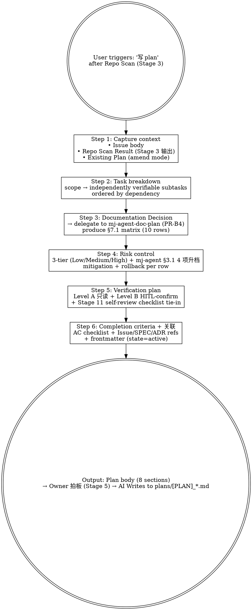

# mj-agent Flow — Plan Body Authoring (HITL Stage 4)

## Overview

Authors full mj-agent working Plan body — `plans/[PLAN]_*.md` content covering linked artifacts / context / scope / task breakdown / execution order / risk control / verification / AC / cross-references. Combines Stage 3 Repo Scan output with Documentation Decision (sub-call `mj-agent-doc-plan` once it lands in PR-B4) into a coherent Plan ready for Stage 6 SPEC / Stage 8 Implementation.

**Direction-critical**：

| Skill | Scope | When |
|---|---|---|
| `mj-agent-doc-plan`（PR-B4） | **WHAT documentation is needed** | Doc evaluation only — Action=Create/Update/None per type |
| `mj-agent-flow-plan`（本 skill） | **HOW the work proceeds** (full Plan body) | Stage 4 — orchestrates 8 plan sections; sub-calls doc-plan for doc-decision sub-section |

**Reference**: [[../../../sdd/workflows/execution-loop|execution-loop]] §4.1（Stage 4 → 本 skill 映射；per-stage prompt 未 re-port，历史源 HITL_Prompt §4.5 Plan Rules）+ Phase A PR-A3 落地的 mj-agent 现存 `plans/[PLAN]_*.md` 范例（如 `plans/[PLAN]_mj-agent-data-agent-mvp-framework.md`）。

> mj-agent 当前**没有 TEMPLATE_PLAN.md**（Phase D 起首份；当前用现存 plans/ 范例作为 reference style）。

## Workflow



## When to Run This Skill

**MUST run**：
- Stage 4 plan authoring after Stage 3 Repo Scan
- 用户："写 plan body" / "draft plan" / "执行计划主体" / "任务拆解"
- Amending 现有 Plan 反映 Repo Scan 修正（Plan Verdict = needs update）

**MAY skip**：
- Trivial single-file change（typo / docstring）— 直接 commit 不写 Plan
- 用户已有完整外部 Plan 仅要执行（直接 Stage 8）
- 纯文档需求评估 → 用 `mj-agent-doc-plan`（PR-B4 落地后）

**MUST NOT use for**：
- Documentation gap 分析 → `mj-agent-doc-plan`（PR-B4，本 skill Step 3 子例程）
- Repo state 事实核查 → `mj-agent-flow-repo-scan`（Stage 3，本 skill 之前）
- Stage 8 实施 → `mj-agent-flow-implement`
- SPEC / ADR 编写 → `mj-agent-doc-author`（PR-B4，Stage 6）

## Step 1: Capture Context

```bash
# Issue body
branch=$(git branch --show-current)
issue=$(echo "$branch" | grep -oE '[0-9]+' | head -1)
[ -n "$issue" ] && gh issue view "$issue" --json title,body

# Repo Scan Result (Stage 3 output)，通常在对话；如重跑请用户粘贴 §7.1 矩阵
# Existing Plan (amend mode)
ls plans/[PLAN]_*.md plans/[INTAKE]_*.md 2>/dev/null
```

如 Stage 3 Repo Scan **未运行** → 提示先用 `/mj-agent-flow-repo-scan`，再回本 skill；或低风险任务下显式跳过（记录跳过理由）。

**逼问回流（leading word「逼问」）**：若 context 里仍有**未决分支 / 真歧义**（Stage 0 未逼清，或 plan 期才浮现）→ 先回 `/mj-agent-flow-intake` Step 2b 的逼问纪律（**一次一问 + 推荐答案锚点**）逼清，再进 Step 2 拆解。**校准**：逼问只对前期真歧义；方向已明确 → 直接进 Step 2，不加门（与 `/mj-agent-flow-scope-drift` Stage 9「实现中查偏离」分工不同）。**术语锐化回流**：plan 期遇术语与 glossary/catalog 冲突或模糊 → 回 `/mj-agent-flow-intake` Step 2c 主动锐化（挑战 + 边界场景压测 + 即时更新工件；catalog 改动走 biz-catalog-sync 必停）。

## Step 2: Task Breakdown

| 拆解原则 | 说明 |
|---|---|
| 单一职责 | 每个子任务专注一个目标（不混"加 X + 改 Y"） |
| 可独立验证 | 每子任务有 grep / pytest / `mj-agent check` / Studio 探针命令验证 |
| 依赖排序 | 拓扑顺序，前置先做 |
| 命名一致 | Stage 8a / 8b / 8c... 编号便于跟踪 |
| **风味识别**（mj-agent 专属） | 标注每子任务属于哪个实现风味（execution-loop §5 实现 3 风味）：A 纯代码 / B in-source canonical 永远 HITL / C infra |
| **纵切优先**（leading word「纵切」/ tracer-bullet） | 拆多 PR/issue 时优先**端到端纵切**而非按层水平切——见下「纵切纪律」 |

**纵切纪律（leading word「纵切」，per [[../../../docs/rule/[STANDARD]_MJ_Agent_Skill_Authoring_Craft|技能写作工艺规范]] §6）**：
- 每片**端到端穿透相关层**且**自身可验、可独立 review-合**（如新增一业务指标：`qcm_catalog.yaml` 条目 → `find_biz_context`/tool → guardrail/precheck 放行 → 一条 eval case），按 **blocked-by 依赖序**发布。
- 先 **prefactoring**：make the change easy（必要预重构单独成片），then make the easy change。
- ❌ **水平切**（先全 catalog → 再全 tool → 再全 test）——单片不可独立验、强层间耦合。
- 切片落 issue 时继承该片 AC + blocked-by 序（→ `/mj-agent-git-issue` Scope 纵切片归属）。

**输出格式**（写入 Plan §3 任务拆解）：

```markdown
### 3.1 <子主题（风味 A/B/C）>
- 含: <具体动作>
- 不含: <边界外的事项>
- 风味: A 纯代码 / B in-source canonical 永远 HITL / C infra
- 验证: <grep / pytest / Studio 探针 / mj-agent check>

### 3.2 <下一子主题>
...
```

## Step 3: Documentation Decision (Sub-call mj-agent-doc-plan，PR-B4 落地后)

**Delegate to mj-agent-doc-plan**：根据 scope 评估 10 类文档（Plan / SPEC / ADR / RUNBOOK / GUIDE / STANDARD / Local ISSUE / ASSESSMENT / CHANGELOG / INDEX）每类 Action（Create / Update / None） + Path + Reason。

PR-B4 之前：手工填 §7.1 矩阵，参 [[../../../sdd/workflows/execution-loop|execution-loop]] §4.1（Stage 3 / Stage 4 映射；per-stage prompt 未 re-port，历史源 HITL_Prompt §4.4 / §4.5）+ Stage 3 Repo Scan §7.1 同款表。

输出嵌入 Plan §3 任务拆解末尾或单独 §3.X 子段。**不**直接写 doc 内容（那是 Stage 6 / Stage 8 by mj-agent-doc-author / mj-agent-flow-implement）。

## Step 4: Risk Control（含 mj-agent 专属升档）

| Risk | 触发条件（任一升档） | Plan §5 内容 |
|---|---|---|
| Low | 局部、可逆；不动 schema/secret/prod；不触 §3.1 必停 | 1-3 行风险表 + 简要缓解 |
| Medium | 改服务内部行为 / 多模块影响 / 非生产配置 | 风险表 + 详细缓解 + 监控点 |
| **High** | DB schema（mj-agent 是只读消费者）/ secret / prod / public API / new dep；**或 §3.1 必停 4 项任一**：runtime-skill-content-change / prompt-version-bump / biz-catalog-sync / sql-guardrail-relax | 风险表 + 缓解 + rollback 计划 + Stage 6 ADR/RUNBOOK 链接 + **B 风味永远 HITL** 显式标注 |

**输出格式**（写入 Plan §5）：

```markdown
| 风险 | 等级 | 风味 | 缓解 / Rollback |
|---|---|---|---|
| <风险描述> | Low/Medium/High | A/B/C | <缓解措施 / Rollback / monitoring> |
```

## Step 5: Verification Plan

按 scope 列出 Stage 10 Level A（read-only）+ Level B（HITL-confirm）命令：

```markdown
### 6.1 Stage 10 本地验证（Level A 只读 / 必跑）

uv run ruff check
uv run mypy src/mj_agent
uv run pytest tests/unit
uv run pytest tests/eval
python -m compileall src
python scripts/check_wikilinks.py     # 文档变更
python scripts/check_frontmatter.py   # 文档变更

### 6.2 Stage 10 Level B（HITL-confirm 后跑）

uv run pytest tests/integration       # 需 POSTGRES_ANALYST_USER
uv run pytest tests/smoke -m smoke    # 需 ARK_API_KEY
uv run pytest tests/contract -m contract
uv run mj-agent check
uv run langgraph dev                  # Studio H1/H2/H3/R1/R2 探针
docker compose -f docker/compose.yaml up -d / down

### 6.3 Stage 11 AI 自检 tie-in

- execution-loop §6 检查项 5a/5b/5c/5d 反向扫描判断
- mj-agent 扩展：runtime SKILL.md / system.md / qcm_catalog.yaml 反向扫描
- scope-drift Severity 预期值
```

**Testing-seam-first（借 to-prd）**：列验证命令前先定**测试缝**——①优先复用既有缝；②**最小化新缝（理想 1 个）**；③缝放最高合理架构层。mj-agent 缝常 = 一条 `tests/eval` case 或一条 `tests/unit`；纵切片（Step 2）的"可验"判据就挂在该缝上。

## Step 6: Completion Criteria + 关联

**完成标准**（Plan §7）：

```markdown
- [ ] <每条 = scope §2 包含的一项动作 + 验证证据>
- [ ] PR 通过 CI + review + merge
- [ ] CHANGELOG.md [Unreleased] 已更新（feat/fix 时）
- [ ] B 风味改动同步 EVAL backlog ticket（in-source canonical 改动；execution-loop §7.3 Rule 11 自动开单）
```

**关联**（Plan §8）：

```markdown
- Issue: #<id>
- 前置 PR: #<id>（如有）
- 依据: Repo Scan Result / 评估对话 / 历史 ADR
- 目标文件: <list>
- 不动文件: <list>（特别标 src/mj_agent/{skills,prompts,agent.py,tools}/ 如本 PR 不动）
- 后续独立 PR: <list>（follow-up issues）
```

**frontmatter**：

```yaml
---
summary: "<一句话本 PR 主旨>"
owner: "<github-handle>"
created: "<yyyy-mm-dd>"
updated: "<yyyy-mm-dd>"
state: "active"
---
```

## Output Format Example

```markdown
## Plan Body Draft — Issue #<id>

### Section 1 — Linked Artifacts
- Issue: #<id> "<title>"
- Repo Scan Result: <Stage 3 conversation output / Plan Verdict>
- 前置 PR: #<id>（hash）
- 关联 ADR / SPEC / GUIDE: <wikilinks>

### Section 2 — Context
<3-5 段 background + why now + expected outcome>

### Section 3 — Scope
- 包含: <list>
- 不包含: <list>
- 前置依赖: <list>

### Section 4 — 任务拆解（Step 2 + Step 3 output）
<subtasks，每个标 Stage 8a/8b/... 编号 + 风味 A/B/C>
<Documentation Decision sub-section per Step 3>

### Section 5 — 风险（Step 4，含 mj-agent §3.1 升档）
<risk + 风味表>

### Section 6 — 验证（Step 5）
<Level A / Level B / Self-review tie-in>

### Section 7 — 完成标准（Step 6 AC）
<checklist>

### Section 8 — 关联（Step 6 refs）
<Issue / PR / docs cross-ref>

### Suggested write path
- `plans/[PLAN]_<issue-id>_<short-desc>.md`

### Next Action
- [ ] Owner 拍板 Plan body (Stage 5 Gate 1)
- [ ] 拍板后 AI Writes to suggested path
- [ ] Continue to Stage 6 (SPEC) or Stage 8 (Implementation)
```

## What This Skill DOES NOT DO

- ❌ 未经 Owner 拍板（Stage 5 Gate 1）就写 `plans/[PLAN]_*.md`（拍板后 AI 直接 Write）
- ❌ 不替代 `mj-agent-doc-plan`（doc-plan 仅 §7.1 子集；本 skill 上位）
- ❌ 不替代 `mj-agent-flow-repo-scan`（repo-scan 是 Stage 3 事实核查；本 skill 是 Stage 4 plan 编写，需 repo-scan 输出）
- ❌ 不替代 `mj-agent-doc-author`（author 是 Stage 6 SPEC/ADR/RUNBOOK；本 skill 仅产 working Plan body）
- ❌ 不实施 Plan（Stage 8 by mj-agent-flow-implement / Edit / Write）
- ❌ 不修改 Issue / branch / SPEC / ADR
- ❌ 不跑测试 / 验证（仅在 Plan §6 列命令；Stage 10 才执行）

## Sub-skill / Tool Calls

| Tool / Skill | 用途 |
|---|---|
| Bash `gh issue view` | Step 1 fetch Issue body |
| Bash `git branch` / `ls plans/` | Step 1 locate context |
| Read | Step 1 Plan / Repo Scan Result |
| `mj-agent-doc-plan`（PR-B4） | **Step 3 sub-call**：§7.1 Documentation Decision matrix |
| `mj-agent-flow-repo-scan` | Step 1 prerequisite（建议先 Stage 3） |
| `mj-agent-doc-author`（PR-B4） | 后续 Stage 6 接力（Documentation Decision Action=Create 时） |
| `mj-agent-flow-implement` | 后续 Stage 8 接力 |
| Write | Owner 拍板（Stage 5 Gate 1）后 AI 把 Plan body 落盘到 plans/ |

## Reference Files

- [[../../../sdd/workflows/execution-loop|execution-loop]] §4.1（Stage 4 → 本 skill 映射；per-stage prompt 未 re-port，历史源 HITL_Prompt §4.5 Plan Rules + Output 字段）
- `mj-system@docs/rule/[STANDARD]_AI_Engineering_Repo_Scan.md` §7.1（Lite Phase A 占位）
- 现存 `plans/[PLAN]_*.md` 范例（mj-agent 当前 Plan 风格 reference）
- [[../../../sdd/lifecycle|lifecycle]] §2（working vs canonical 边界）
- `.claude/skills/mj-agent-doc-plan/SKILL.md`（PR-B4 落地，Step 3 子例程）
- `.claude/skills/mj-agent-flow-repo-scan/SKILL.md`（Stage 3 前置）
- `.claude/skills/mj-agent-doc-author/SKILL.md`（PR-B4 落地，Stage 6 接力）
- mj-system `.claude/skills/mj-sys-flow-plan/SKILL.md`（直接派生源）

## Anti-patterns

- **不要** 跳过 Stage 3 Repo Scan 直接写 Plan（缺事实输入会导致 Plan 不成立）
- **不要** 把 SPEC 内容塞进 Plan（Plan 写"怎么推进"，SPEC 写"具体接口契约"）
- **不要** 在 Plan 里写实现代码（实施在 Stage 8）
- **不要** 在 §3.1 必停 4 项触发后还判 Risk = Medium（自动 High）
- **不要** 把 documentation/* PR 的 Plan 做得跟 feature/* 一样大（doc PR 通常 2-3 段足够）

## Handoff

```
Plan body 已输出（对话）。
Owner 拍板（HITL Gate 1 / Stage 5）后由 AI Write 落到 plans/[PLAN]_<issue-id>_<short-desc>.md。
HITL Gate 1（Stage 5）通过后下一步：
  → Stage 6 /mj-agent-doc-author 写 SPEC/ADR/RUNBOOK（PR-B4 落地）
  → Stage 8 /mj-agent-flow-implement 直接实施（如不需新 SPEC）
```
