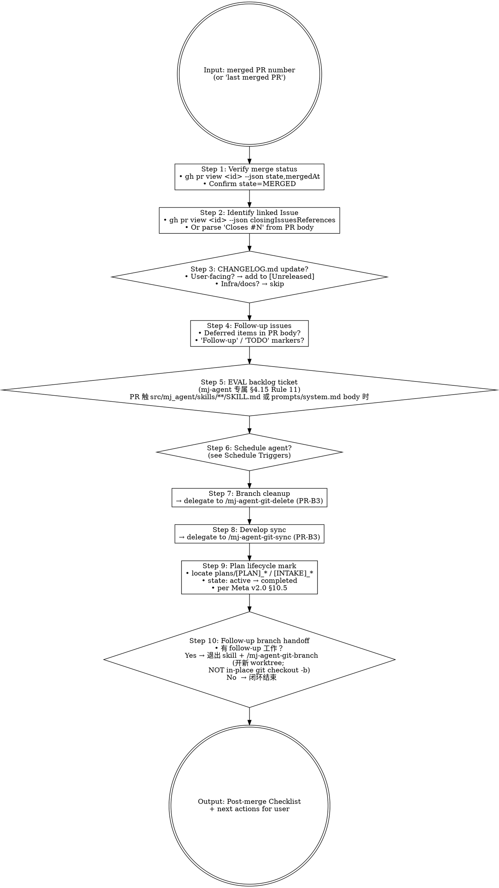

# mj-agent Flow — Post-merge Cleanup (HITL Stage 17)

## Overview

17-stage 闭环最终 stage。PR 合并后，本 skill 编排 10 项 post-merge 动作：

1. 状态校验
2. Issue 关闭
3. CHANGELOG 更新
4. follow-up issue 创建
5. **EVAL backlog ticket 自动开单**（mj-agent 专属，§4.15 Rule 11）
6. schedule 决策
7. branch 清理
8. develop 同步
9. **plan 生命周期标记**（per Meta v2.2 §5.11；ADR-021；自动 active → completed）
10. **follow-up branch handoff**（如本次有 follow-up 工作 → 退出 skill + 委派 `/mj-agent-git-branch` 开**新 worktree**；NOT in-place `git checkout -b` 在当前 worktree）

**Reference**: [[../../../docs/rule/[STANDARD]_MJ_Agent_AI_Engineering_Execution_HITL_Prompt|HITL_Prompt v1.0]] §4.15（Rules 1-11，Rule 11 EVAL backlog 是 mj-agent 专属）+ Meta v2.0 §10.5 + Git Branch Strategy + PR Description Convention.

## Workflow



## When to Run This Skill

**MUST run after**：
- PR merge（user 报"PR #X merged" 或 gh pr view 显 MERGED）
- 一系列相关 PR 全部 merge（清理整 chain）

**MAY skip**：
- Hotfix 急需 develop 同步（直接 `/mj-agent-git-sync`）
- branch 已被 GitHub auto-delete-on-merge

## Step 1: Verify Merge Status

```bash
gh pr view <pr-id> --json state,mergedAt,mergeCommit,baseRefName,headRefName,closingIssuesReferences
```

期望：
- `state = "MERGED"` — 否则 abort + 提示 "PR not merged yet"
- `mergedAt != null` — post-merge 时间戳
- `mergeCommit.oid` — 用于 CHANGELOG / git log 引用

## Step 2: Identify Linked Issue

按优先级：

1. `gh pr view <id> --json closingIssuesReferences` — GitHub 自动检测 Closes #N
2. 解析 PR body 找 `Closes #N` / `Refs #N` / `Fixes #N`
3. 解析 branch name 找 `<type>/<issue-id>-<desc>` 中 issue id
4. 如全无 → 提示"PR 未关联 Issue，跳过 Step 2"

## Step 3: CHANGELOG.md `[Unreleased]` 更新

| 情况 | CHANGELOG? | 示例 |
|---|---|---|
| 用户可感知功能改动 | ✅ 必须 | `feat(skill): add biz-domain-context` |
| 用户可感知 bug 修复 | ✅ 必须 | `fix(memory): AsyncPostgresSaver leak` |
| 性能可量化提升 | ✅ 必须 | `perf(sql): execute_sql 12s → 2s` |
| 仅 CI / Docker / scripts | ❌ 不需 | `infra(ci): pin actions to SHA` |
| 仅文档 | ❌ 不需 | `docs: tri-track framework v2.1` |
| 仅 .claude/skills/ | ❌ 不需 | skill 是工具链，非用户感知 |
| 内部 refactor / 测试 | ❌ 不需 | `refactor(agent)` / `test(skill)` |

**格式**（参 mj-agent CHANGELOG.md / Keep a Changelog）：

```markdown
## [Unreleased]

### Added
- **<feature>（#PR-id）**：<一段话描述，含为什么 / 怎么用 / 影响范围>

### Changed / Fixed / Removed
- 同上格式
```

> 不直接编辑 CHANGELOG（user 视情况确认后）；本 skill 仅输出建议条目。

## Step 4: Follow-up Issues

扫 PR body 找信号：

| 信号 | 处理 |
|---|---|
| `Follow-up` / `follow-up` | 提议建 issue，title 含 `[Follow-up]` |
| `TODO` / `FIXME`（PR body, not code） | 同上 |
| 「留 follow-up」「待后续修复」 | 同上 |
| 「不在本 PR 范围」 | 同上 |
| 「测试 fixture 缺陷待修」 | 已有先例 |

**输出**：每个 follow-up signal 对应一条 issue 草案，user 确认后用 `/mj-agent-git-issue` 或 `gh issue create` 实际创建。

## Step 5: EVAL Backlog Ticket（mj-agent 专属，§4.15 Rule 11）

**触发条件**：PR 触及 `src/mj_agent/skills/**/SKILL.md` body 或 `src/mj_agent/prompts/system.md` body 修改。

```bash
# 检测
git diff $(gh pr view <pr-id> --json mergeCommit -q '.mergeCommit.oid')~1..$(gh pr view <pr-id> --json mergeCommit -q '.mergeCommit.oid') --name-only | \
  grep -E '^src/mj_agent/(skills/.*/SKILL\.md|prompts/.*\.md)$'
```

**自动开 follow-up Issue**（user 确认后用 `/mj-agent-git-issue`）：

- Title: `[EVAL backlog] <skill_name or prompt_name> @ <commit_sha>`
- Body:

```markdown
## EVAL Backlog（自动开单 per HITL_Prompt §4.15 Rule 11）

PR #<id> merge 触发 in-source canonical body 改动：
- 文件：<list of changed SKILL.md / system.md>
- Commit: <hash>
- Mergedat: <time>

### 待 Phase D（Phase 2）EVAL framework 落地后处理

- [ ] 为本次改动建 EVAL dataset（jsonl）
- [ ] 设定 baseline_metric + baseline_value
- [ ] 在对应 SKILL.md / system.md frontmatter 加 `eval_references` 字段
- [ ] A11 transitional waiver decay 完成

### 关联

- 触发 PR: #<id>
- 触发条件: §3.1 必停 10 (runtime-skill-content-change) / 11 (prompt-version-bump)
- A11 EVAL 门禁: transitional waiver 期内允许 `eval_references` 注释 TODO；Phase D 起强制
```

> 这是 A11 transitional waiver 期内的兜底机制——任何 in-source canonical 改动都有 backlog 凭证，Phase D EVAL 框架落地时不会遗漏。

## Step 6: Schedule Agent?

参 mj-agent CLAUDE.md / `.claude/skills/` 约定，出现以下信号**主动建议** `/schedule`（如可用）：

| Signal | 建议 schedule | 时机 |
|---|---|---|
| Feature flag / experiment / staged rollout | 一次性 agent | 2 周后开 cleanup PR |
| 新 metric / monitor | 周期 agent | 每周三角化 |
| 「remove once X」TODO | 一次性 agent | 等 X 满足后开 PR |
| Follow-up issue 数量 ≥ 3 | 周期 agent | 每周一 triage |
| EVAL backlog ≥ 5 | 周期 agent | Phase D 启动前 monthly review |

**不建议 schedule**：refactor / bug fix with tests / docs / renames / routine dep bumps / 用户说"nothing else to do"。

## Step 7: Branch Cleanup

**Delegate to `/mj-agent-git-delete`**（PR-B3 落地后），按顺序：

1. 删 worktree（`git worktree remove`）
2. 删 local branch（`git -C develop branch -d <branch>`）
3. 删 remote branch（可选；GitHub auto-delete 通常已删）

**安全检查**：mj-agent-git-delete 确认 branch 已 merged，未 merged 阻断。

## Step 8: Develop Sync

**Delegate to `/mj-agent-git-sync`**（PR-B3 落地后）：

- 当前 worktree（如 develop）需 pull 最新 develop（含本 PR commit）
- 如 hotfix → main 合并后还要 sync 回 develop（mj-agent-git-sync 自动检测）

## Step 9: Plan Lifecycle Mark

按 [[../../../docs/rule/[STANDARD]_MJ_Agent_Documentation_Meta_Framework|Meta v2.0]] §10.5「Working 文档生命周期」，PR merge 意味着关联 working plan 任务已落地，应自动从 `state: active` → `state: completed`。

### 定位关联 plan

按顺序：

1. **issue id 匹配**：从 Step 2 已识别 issue id → `plans/[PLAN]_<id>_*.md` / `plans/[INTAKE]_<id>_*.md`
2. **branch 匹配**：从 Step 1 `headRefName` → 解析数字 → 同上
3. **PR body 匹配**：搜 `plans/[PLAN]_*.md` / `plans/[INTAKE]_*.md` 引用
4. **如全无 → skip + 输出"PR 无关联 working plan"**

### 标记动作

```bash
# 1. 读 frontmatter 当前 state
head -10 plans/[PLAN]_<id>_*.md

# 2. 用 Edit 工具改：
#    state: active     → state: completed
#    updated: <旧>     → updated: <PR mergedAt 日期>
```

**不动**：

- 文件位置（保留 `plans/` 原路径，避免断跨文档引用）
- frontmatter 其他字段
- 文件正文内容
- 已是 `state: completed` / `archived` / `draft` 的（draft 留作者重启余地；completed/archived 是终止态）

### 异常处理

| 场景 | 处理 |
|---|---|
| Step 2 issue 列表空 | 仅按 branch 名匹配；如仍无 → skip Step 9 + 输出原因 |
| 多 PR 关联同一 plan | 仅当 plan 内显式标"本 PR 是最后阶段"才改 completed；否则保 active + 提示 |
| plan 无 `state` 字段 | 输出警告，不自动加（让 user 处理） |
| plan 当前 `state: draft` | **不**自动改 completed（draft 不应跳 active 直达 completed）；输出建议"先改 active 或人工处理" |

## Step 10: Follow-up Branch Handoff

post-merge cleanup 跑完 Step 1-9 之后，执行 AI 经常处于"任务完成"心态。如果本次 PR 还有 follow-up 工作要立即开始（典型场景：Step 4 follow-up issue 列表非空 / Step 5 EVAL backlog ticket 触发 / 用户在 checklist 后表达"下一步要做 X"），**必须**显式 handoff 到 Stage 2 开新 worktree，而不是在当前 worktree（典型是 `develop/`）内顺手 `git checkout -b <follow-up-branch>`。

### 触发条件

任一条满足即触发 Step 10 提醒：

- Step 4 输出非空 follow-up issue（含已建 / 待建）
- Step 5 EVAL backlog ticket 触发
- 用户在 post-merge 输出后口述"接下来做 X" / "现在要做 Y" / "follow-up 是 Z"
- merge commit 信息 / PR body 含明确"下一步"指示

如以上信号都缺，且用户未提下一步意图，本 step 输出"无 follow-up 工作；闭环结束"。

### 输出规约

- 建议命令：调用 `/mj-agent-git-branch`（Stage 2 编排器），让其按 follow-up 工作的性质生成 worktree-add 命令。
- 推荐 branch type：跟 follow-up 工作性质（`feature/` / `bugfix/` / `documentation/` / `maintain/` 五选一；hotfix 例外见下）。
- **禁止** 输出 `git checkout -b` 命令（违反 worktree-per-PR 约定）。
- **禁止** 在当前 worktree 内自行创建 follow-up 分支；要让 `/mj-agent-git-branch` 输出 `git worktree add ../<type>/<desc> -b <type>/<desc>` 命令。

### 反例（为什么）

mj-agent 是 bare repo + worktree-per-branch 模型（见 ADR-008 / `mj-agent-git-branch` SKILL §"Bare Repo Worktree 模型"）。在 `develop/` worktree 内 `git checkout -b maintain/post-merge-follow-up` 会：

1. 把 `develop/` worktree 切到 follow-up 分支，`develop/` 不再代表 develop 分支 → 后续在此目录跑 `/mj-agent-git-sync` 等期望 develop 的工具会出错。
2. 违反 HITL_Prompt §4.3 Rule 5「mj-agent 默认每 PR 一个 worktree」+ Rules「不使用 git checkout 切换分支」+ Fallback「禁止使用 `git checkout` 切分支」。
3. 违反 `mj-agent-git-branch` SKILL §Anti-patterns 第 2 条「不要 跳过 worktree 直接 `git checkout -b <branch>`——破坏 worktree-per-branch 模型」。

### 例外（不触发 Step 10）

- 用户明确说"follow-up 等改天再说" / "现在不开新分支" → 跳过本 step + 输出"用户主动延后 follow-up；闭环结束"。
- hotfix → develop 同步（已由 Step 8 的 `/mj-agent-git-sync` 处理，**不**算 follow-up branch）。
- 仅是 CHANGELOG 编辑等用户在原 worktree 内单文件改动且不会 commit 的"零碎收尾"（这种场景不需要新分支）。

> 若 user 选择走 `/mj-agent-git-branch`，新 worktree 创建后**结束**本次 post-merge skill 调用；后续 commit / push / PR 走标准 Stage 12-14 链条。本 skill 不跨 follow-up 工作主体。

## Output Format Example

```markdown
## Post-merge Checklist for PR #<id>

### Verify
- ✅ PR #<id> state: MERGED
- ✅ Merge commit: <hash>
- ✅ Merged at: <YYYY-MM-DD HH:MM:SS>

### Linked Issues
- ✅ Closes #<id>

### CHANGELOG.md
- 建议更新：**否**（PR 是 documentation/* + skill 落地，非用户感知）
- 如用户坚持记录：可加 `### Changed`：「mj-agent-* in-tree skill 工具链层面演进」

### Follow-up Issues
1. **<title>**
   - 来源：PR body §X
   - 建议建 [Follow-up] issue
   - 已建：#<id>（如已建）

### EVAL Backlog Ticket（mj-agent §4.15 Rule 11）
- 检测：PR 触 src/mj_agent/skills/**/SKILL.md? **NO**
- 检测：PR 触 prompts/system.md? **NO**
- 结论：**不触发**（仅 documentation/* + .claude/skills/ 改动）
- 输出：⏸ skipped — PR 不涉及 in-source canonical body 修改

（如触发，则）
- 建议建 [EVAL backlog] <name> @ <hash> issue
- Body：见上方 Step 5 模板

### Schedule Agent
- 不建议（PR 是基础设施 + 工具链；无 feature flag / soak window）

### Branch Cleanup（→ /mj-agent-git-delete）
- ☐ `git worktree remove ../<type>/<branch>`
- ☐ `git -C develop branch -d <type>/<branch>`
- ☐ Remote branch（GitHub auto-delete 已处理）

### Develop Sync（→ /mj-agent-git-sync）
- ☐ `cd ../develop && git pull origin develop --ff-only`

### Plan Lifecycle Update（per Meta v2.0 §10.5）
- ⏸ skipped — PR 无关联 working plan
（如有，则）
- ✅ `plans/[PLAN]_<id>_<desc>.md`: state `active` → `completed`，updated 刷到 <YYYY-MM-DD>

### Follow-up Branch Handoff（Step 10）
- 检测：Step 4 follow-up issues / Step 5 EVAL backlog / 用户口述下一步？**NO**
- 结论：⏸ 闭环结束 — 无 follow-up 工作

（如触发，则）
- 建议：退出本 skill，调 `/mj-agent-git-branch`（type=<feature|bugfix|documentation|maintain>，desc=<follow-up-kebab>）
- ⚠️ **不要** 在当前 worktree 内 `git checkout -b <follow-up-branch>`（破坏 worktree-per-PR 约定；HITL §4.3 / git-branch anti-pattern）

### Next User Actions
- [x] CHANGELOG：跳过（非用户感知）
- [ ] Confirm follow-up issues
- [ ] EVAL backlog ticket（如触发）
- [ ] Run cleanup commands
- [ ] 进入下一任务
```

## What This Skill DOES NOT DO

- ❌ 不直接编辑 CHANGELOG（仅输出建议；user 决定后用 Edit）
- ❌ 不直接创建 follow-up issue（仅输出 draft；user 确认后用 /mj-agent-git-issue）
- ❌ 不直接调 `/schedule`（仅识别 signal + 建议；user 决定）
- ❌ 不删 main / develop / 受保护分支（仅清 feature/bugfix/maintain/documentation/hotfix）
- ❌ 不强制清 worktree（如 user 说"保留 worktree 供其他工作"，跳过 Step 7）
- ❌ 不物理移动 working plan 文件（Step 9 仅改 frontmatter `state` / `updated`；物理归档到 `plans/archive/` 是 Phase 2 GC，由 follow-up issue 引入）
- ❌ 不修改 plan 正文（仅 frontmatter）
- ❌ 不自动把 `state: draft` 改 completed（draft 不应跳 active 直达 completed；Step 9 仅 active → completed）
- ❌ 不为 follow-up 工作开新分支 / 创建 worktree（属 Stage 2，由 `/mj-agent-git-branch` 处理；本 skill 仅做 Step 10 handoff 提醒，不自行 `git worktree add`）

## Sub-skill Calls

| Sub-skill | 何时调用 |
|---|---|
| `/mj-agent-git-delete`（PR-B3） | Step 7 branch cleanup |
| `/mj-agent-git-sync`（PR-B3） | Step 8 develop sync |
| `/mj-agent-git-issue` | Step 4/5 follow-up issue / EVAL backlog ticket 创建（user 确认后） |
| `/mj-agent-git-branch` | Step 10 follow-up worktree 创建（如本次有 follow-up 工作；本 skill 仅 handoff，不自行执行） |

## Reference Files

- [[../../../docs/rule/[STANDARD]_MJ_Agent_AI_Engineering_Execution_HITL_Prompt|HITL_Prompt v1.0]] §4.15（Rules 1-11，Rule 11 EVAL backlog mj-agent 专属）
- [[../../../docs/rule/[STANDARD]_MJ_Agent_Documentation_Meta_Framework|Meta v2.0]] §10.5（Working 文档生命周期，Step 9 plan state 改 completed 依据）
- [[../../../docs/rule/[STANDARD]_MJ_Agent_Documentation_Meta_Framework|Meta v2.0]] §4.5（Working 文档 frontmatter schema）
- [[../../../docs/infrastructure/git/[GUIDE]_Git_Branch_Strategy|Git_Branch_Strategy]]（Branch lifecycle / cleanup）
- [[../../../docs/infrastructure/git/[GUIDE]_PR_Description_Convention|PR_Description_Convention]]（PR description fields；Step 4/5 解析依据）
- `CHANGELOG.md`（Keep a Changelog format：Unreleased / Added / Changed / Fixed / Removed）
- `.claude/skills/mj-agent-git-delete/SKILL.md`（PR-B3 落地，Branch cleanup 子例程）
- `.claude/skills/mj-agent-git-sync/SKILL.md`（PR-B3 落地，Develop sync 子例程）
- `.claude/skills/mj-agent-git-issue/SKILL.md`（Follow-up issue / EVAL backlog 创建子例程）
- mj-system `.claude/skills/mj-sys-flow-post-merge/SKILL.md`（直接派生源；mj-agent 加 EVAL backlog ticket Step 5）

## Anti-patterns

- **不要** 跳过 Step 5 EVAL backlog（mj-agent 专属硬约束；§4.15 Rule 11）
- **不要** 在 §3.1 必停 10/11 触发的 PR 上不开 EVAL backlog ticket（A11 transitional waiver 兜底失效）
- **不要** 物理移动 plan 文件到 archive（仅改 frontmatter；GC 是 Phase 2 工作）
- **不要** 自动改 plan `state: draft` → `completed`（违反生命周期；draft 不应跳过 active）
- **不要** 删受保护分支 main / develop（硬性阻断）
- **不要** 在当前 worktree（典型 `develop/`）内 `git checkout -b <new-branch>` 起 follow-up 工作（违反 mj-agent worktree-per-PR 约定；HITL_Prompt §4.3 Rule 5 + Rules + Fallback；`mj-agent-git-branch` SKILL §Anti-patterns 第 2 条）。起 follow-up 必须调 `/mj-agent-git-branch` 开新 worktree——见 Step 10。

## Handoff

```
Post-merge Checklist 已输出（对话）。
User 确认后：
  → /mj-agent-git-delete 执行 branch cleanup
  → /mj-agent-git-sync 执行 develop sync
  → /mj-agent-git-issue 创建 follow-up + EVAL backlog issues
  → user 编辑 CHANGELOG（如适用）
  → 如有 follow-up 工作 → /mj-agent-git-branch 开**新 worktree**
                          (NOT in-place `git checkout -b` 在当前 worktree)
  → user 进入下一任务（新 Issue 或 PR）
```
