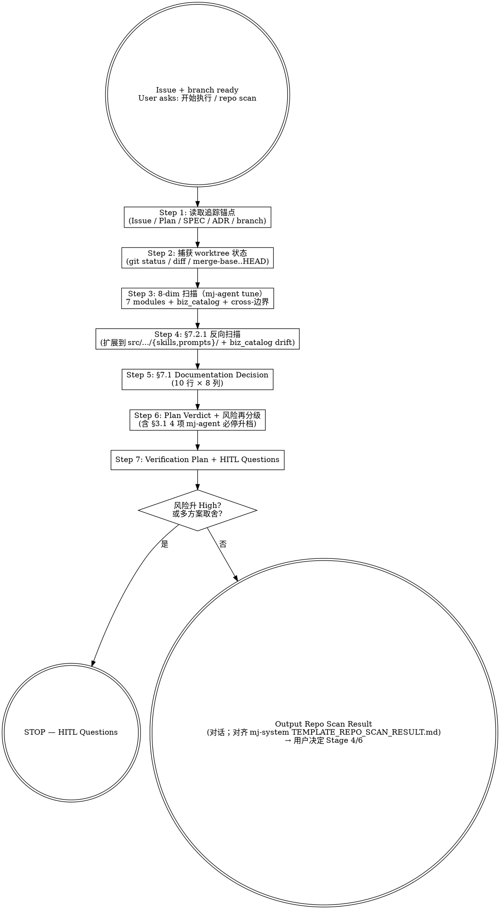

# mj-agent Flow — Repo Scan (HITL Stage 3)

## Overview

Authoritative orchestrator for HITL Stage 3 — fact-check between Stage 2 (branch created) and Stage 4 (Plan authoring) / Stage 6 (SPEC). Verifies Issue / Plan still holds against current mj-agent repo reality（code, in-source canonical, biz catalog, config, tests, docs），produces Documentation Decision driving subsequent stages.

**Key constraint**: read-only. Scans / reasons / reports — never edits code, prompts, biz_catalog, config, or documents.

**Why this skill exists**:
- §7.2.1 reverse scan (5 改动类型 × grep) and §7.1 10-row decision matrix are easy to miss
- mj-agent 专属：biz_catalog drift detection + runtime SKILL.md/system.md reverse scan（in-source canonical 进入反向扫描目标范围）
- Centralizing here ensures every downstream Plan / SPEC / Implementation has same evidence base

**Reference**:
- `mj-system@docs/rule/[STANDARD]_AI_Engineering_Repo_Scan.md` v1.0（Lite Phase A 占位）
- [[../../../docs/rule/[STANDARD]_MJ_Agent_AI_Engineering_Execution_HITL_Prompt|HITL_Prompt v1.1]] §4.4（Stage 3 prompt）

## Workflow



## When to Run This Skill

**MUST run repo scan**：
- 用户基于已有 GitHub Issue 开始工作
- 用户基于已有 branch / worktree 继续任务
- 用户基于已有 Plan 进入 SPEC 或实现（"按 plan 实施" / "可以编码了吗"）
- 涉及代码 / in-source canonical / biz_catalog / 配置 / docs / CI 中高风险任务

**MAY skip full scan**（仍做最小判断）：

| 场景 | 处理方式 |
|---|---|
| 纯文档拼写 / 格式 / 链接修正 | 扫目标文档 + 索引 + 关联规范 |
| 低风险局部代码修正（typo / docstring / < 50 行单文件） | 扫目标模块 + 测试 + 直接关联文档 |
| 用户只问概念 / 解释代码 | 不进入 Repo Scan |
| PR Review 阶段 | 用 /mj-agent-git-review-pr 或 /mj-agent-flow-self-review（PR-B3+） |

## Step 1: 读取追踪锚点

```bash
# 1. GitHub Issue
branch=$(git branch --show-current)
issue=$(echo "$branch" | grep -oE '[0-9]+' | head -1)
[ -n "$issue" ] && gh issue view "$issue" --json title,body,labels

# 2. 本地 [ISSUE]（canonical 治理产物，Phase D 起首份）
ls docs/issues/[ISSUE]_*.md 2>/dev/null

# 3. Plan / Intake（working 文档）
ls plans/[PLAN]_*.md plans/[INTAKE]_*.md 2>/dev/null

# 4. SPEC（按 mj-agent 模块定位）
git diff --name-only HEAD | grep -oE 'src/mj_agent/[a-z_]+/' | sort -u | \
  while read mod; do ls "docs/design/$(basename "$mod")"/[SPEC]_*.md 2>/dev/null; done

# 5. 相关 ADR
ls docs/adr/[ADR]_*.md
```

**为什么重要**：anchors 是 Documentation Decision 的目标对齐基准；Plan/SPEC 缺失意味着 Stage 4/6 必须先做。

## Step 2: 捕获 worktree 状态

```bash
git status --short
git branch --show-current
git diff --name-only HEAD
git diff --stat HEAD
git diff $(git merge-base develop HEAD)..HEAD --name-only
# 用 merge-base 而非 develop..HEAD（避免 develop advance 引入假 diff）
```

如在 mj-agent 仓根（bare repo）下 → STOP，提示 cd 到具体 worktree。

## Step 3: 8-dim 扫描（mj-agent tune）

| § | 维度 | 检查重点 | 工具 |
|---|---|---|---|
| 6.2 | **mj-agent 7 模块** | agent.py / llm.py / prompts/ / skills/ / tools/{sql,biz_context} / memory / integrations / config / server / ui | Glob `src/mj_agent/**`, Read |
| 6.3 | **API 与 Studio** | LangGraph Studio (langgraph.json) / Chainlit `src/mj_agent/ui.py` / CLI `src/mj_agent/server/cli.py` (typer) | Read |
| 6.4 | **真实数据流（biz 域）** | qcm_catalog.yaml 镜像 / find_biz_context 真实返回 / biz_dws + biz_dwd allowlist | mcp postgres-* / Read qcm_catalog |
| 6.5 | **数据库** | mj-system biz pg 只读消费者（**不**有 schema 演进权；ADR-006/009 红线）；mj-agent-postgres（memory checkpointer）；mj-agent-redis（reserved） | mcp postgres |
| 6.6 | **配置/环境/部署** | `.env` / `.env.example` / `secrets.enc` / `config/secrets/*.yml` / `docker-compose.mj-agent.yml` / `langgraph.json` / DEV/TEST/PROD profile | Read |
| 6.7 | ~~n8n~~ | **跳过**——mj-agent 不用 n8n（与 mj-system 差异） | — |
| 6.8 | **测试与验证** | 5 类 pytest（unit/eval/integration/smoke/contract）+ ruff + mypy strict + python -m compileall | Glob `tests/**` |
| 6.9 | **文档治理** | docs/{rule,adr,assessments,_templates,infrastructure,guide,runbook,issues,design,evaluation,contracts}/ + INDEX.md + CLAUDE.md + CHANGELOG.md | Glob `docs/**` + Read |

> **§6.4 硬规则**：涉及业务字段时 **必须** 读真实列名（`find_biz_context` 返回 / mcp postgres `\d+`）。**不**得仅凭"qcm_xxx 看起来像 numeric"推断。
>
> **§6.5 硬规则**：mj-agent 是 biz pg 只读消费者；任何 schema 修改需求必须返到 mj-system 上游开 Issue（mj-agent 侧不能 V__/R__ migration）。
>
> **§6.6 硬规则**：生产 secret / .env / secrets.enc / CI/CD 发布链路 → 自动升 High + 强制 HITL。

## Step 4: 反向扫描（§7.2.1，hard rule，mj-agent 扩展）

mj-agent **扩展反向扫描目标**：除 mj-system 原 5 类外，新加 in-source canonical 与 biz_catalog 反向扫描。

| 改动类型 | 反向扫描动作 | grep 模板 |
|---|---|---|
| 函数 / 类 / 方法重命名 | grep `docs/**/*.md` + `CLAUDE.md` + **`src/mj_agent/skills/**/SKILL.md`** + **`src/mj_agent/prompts/*.md`** 中 backtick 引用 | `Grep "\`<old_name>\`" docs/ CLAUDE.md src/mj_agent/skills/ src/mj_agent/prompts/` |
| 文件移动 / 路径重组 | grep `docs/**/*.md` + `CLAUDE.md` + INDEX.md + **`src/mj_agent/skills/**/SKILL.md`** + **`src/mj_agent/prompts/*.md`** 旧路径 | `Grep "\`<old/path/file.py>\`" ...` |
| 列名 / 表名 / SQL 对象重命名（**触发 biz_catalog 漂移**） | grep `docs/**/*.md` + qcm_catalog.yaml + skills/safe-sql-analysis SKILL.md curated examples | `Grep "<old_col>" docs/ src/mj_agent/biz_catalog/qcm_catalog.yaml src/mj_agent/skills/` |
| DDD 层重组 / 模块迁移（接口不变） | review SPEC §实现 + GUIDE 代码路径示例 + CLAUDE.md "Architecture" 段 | Read SPEC + Grep |
| 性能 / 内部行为优化（接口不变） | review SPEC 性能段 + RUNBOOK 诊断步骤 + ASSESSMENT 后置评估计划 | Read SPEC + RUNBOOK |
| **biz_catalog mirror 漂移**（mj-agent 专属） | `python scripts/diff_biz_schema.py` 比对 mj-system 上游 STANDARD §2-§4 | scripts/diff_biz_schema.py |
| **runtime SKILL/system.md body 改动**（mj-agent 专属） | 触发 §3.1 必停 HITL；列出受影响 in-source canonical | Direct file diff |

每条命中文档必须列入 Step 5 §7.1 表（Action=`Update`，Existing Target=命中文档，Evidence=grep 命令 + 命中行号）。

未命中也必须显式说明（"已 grep 反扫，无引用" / "不涉及反向扫描 N 类改动"）。

## Step 5: Documentation Decision 矩阵（§7.1）

输出 **完整 10 行**（空行用 `None` 占位）：

| Type | Action | Path | Existing Target | Reason | Evidence | Template Notes | Required Before |
|---|---|---|---|---|---|---|---|
| Plan | Create / Update / None | `plans/[PLAN]_*.md` | <现有路径或无> | <为什么需要> | <Issue / diff / grep 命中> | 6 段：context/scope/拆解/风险/验证/AC | SPEC / Implementation |
| SPEC | Create / Update / None | `docs/design/{module}/[SPEC]_*.md` | … | <新接口/新表/行为变化> | <代码/API/biz_catalog/数据流证据> | TEMPLATE_SPEC.md 9 段；含 EVAL coverage 子段 | Implementation |
| ADR | Create / Update / None | `docs/adr/[ADR]_*.md` | … | <长期架构/数据边界/CI 决策> | <冲突/备选/约束> | TEMPLATE_ADR.md；含 alternatives | SPEC / Implementation |
| RUNBOOK | Create / Update / None | `docs/runbook/[RUNBOOK]_*.md` 或 `docs/infrastructure/**/[RUNBOOK]_*.md` | … | <运维/回滚/排障> | <部署/容器/Studio 证据> | TEMPLATE_RUNBOOK.md 7 段 | PR / Release |
| GUIDE | Create / Update / None | `docs/guide/` 或 `docs/infrastructure/**` | … | <开发者上手/操作路径> | <命令/工作流证据> | TEMPLATE_GUIDE.md CN-numbered | PR |
| STANDARD | Create / Update / None | `docs/rule/[STANDARD]_*_v1.0.md` | … | <长期规则/命名/治理/工程流程> | <规范冲突/重复证据> | MUST/SHOULD/MAY + version 必填 | PR |
| Local ISSUE | Create / Update / None | `docs/issues/[ISSUE]_*.md` | … | <中高风险长期知识锚点> | <证据/根因/影响> | Phase D TEMPLATE_ISSUE.md | Plan |
| ASSESSMENT | Create / Update / None | `docs/assessments/[ASSESSMENT]_*_v1.0.md` | … | <优化后基线对比> | <基线/指标证据> | TEMPLATE_ASSESSMENT.md（Phase D） | Post-implementation |
| CHANGELOG | Update / None | `CHANGELOG.md` | … | <user-visible / release> | <行为/发布证据> | 仅 user-visible 或 release | Commit / PR |
| INDEX | Update / Regenerate / None | `docs/INDEX.md` 或 `docs/**/INDEX.md` | … | <新增/迁移 canonical> | <新文档路径/入口变更> | canonical 入口必须同步 | PR |

**完成判定**：能让 Stage 4 (Plan) / Stage 6 (SPEC) 作者不再回头查证就动笔 → 通过。

## Step 6: Plan Verdict + 风险再分级

### Plan Verdict（必出一项）

```
- Plan still valid          → Stage 4 修订 / Stage 6 SPEC
- Plan needs update         → 列出需写回 Plan 的 §
- Split issue               → 范围过大；建议拆 Issue/PR
- Need spike                → 真实数据流/依赖未知；先小验证
- Need HITL                 → ≥1 高风险问题未确认；走 Step 7
```

### 风险再分级（mj-agent 专属升档）

如本扫描后发现 **§3.1 必停 4 项 mj-agent 专属** 任一被触发 → 自动 High：
- runtime-skill-content-change（src/mj_agent/skills/**/SKILL.md body）
- prompt-version-bump（system.md `version`）
- biz-catalog-sync（qcm_catalog.yaml）
- sql-guardrail-relax（tools/sql/{guardrail,precheck}.py）

```
"Risk escalated: <旧> → High，原因：触及 mj-agent 专属 §3.1 第 N 项 (<触发源>)"
```

## Step 7: Verification Plan + HITL Questions

### Verification Plan

```
- Level A 只读检查:
    uv run ruff check
    uv run mypy src/mj_agent
    uv run pytest tests/unit
    uv run pytest tests/eval
    python -m compileall src
    python scripts/check_wikilinks.py     # 文档变更时
    python scripts/check_frontmatter.py   # 文档变更时
- Level B HITL-confirm:
    uv run pytest tests/integration       # 需 POSTGRES_ANALYST_USER
    uv run pytest tests/smoke -m smoke    # 需 ARK_API_KEY
    uv run mj-agent check
    uv run langgraph dev                  # Studio 探针 H1/H2/H3/R1/R2
    docker compose -f infra/docker/docker-compose.mj-agent.yml up -d
- Checks not run and why:
    <显式说明>
```

### HITL Questions（§3.3 7-段格式）

仅 Risk = Medium/High 或多方案取舍时输出，最多 3-5 个：

```
问题 N：
- 当前观察：
- 不确定点：
- 为什么重要：
- 可选方案：A. / B. / C.
- 我的建议：
- 默认假设：
- 是否必须等待人工确认：是 / 否
```

## Output Format

完整对齐 mj-system `TEMPLATE_REPO_SCAN_RESULT.md`（**对话输出**，不写文件）：

```markdown
## Repo Scan Result
- Decision: <Plan still valid / needs update / Split / Need spike / Need HITL>
- Risk Level: <Low / Medium / High>（如升档：Risk escalated: <旧> → <新>）
- Next Step: <Update Plan / Draft SPEC / Implement / Ask HITL / Create follow-up Issue>

## Current State
- <3-5 句仓库事实摘要>

## Evidence Map
| Area | Evidence | Notes |
| Issue / Plan |  |  |
| Code (mj-agent 7 modules) |  |  |
| API / Studio / Chainlit |  |  |
| Data Source (biz_catalog) |  |  |
| Database (biz pg consumer / mj-agent-postgres) |  |  |
| Config / Secrets |  |  |
| Tests / CI |  |  |
| Docs |  |  |

## Affected Areas
- Modules / Code Paths / Studio / Database / Config / CI-Docker / Docs

## Documentation Decision
<Step 5 完整 10 行表>

## Stale Doc Reverse Scan（§7.2.1，mj-agent 扩展）
- 已扫改动类型：<rename / move / SQL-rename / DDD-restructure / internal-opt / biz_catalog-drift / runtime-canonical-change / N/A>
- 命中文档：<列入 Documentation Decision Update 行 / 无命中 / 不涉及>
- grep 证据：`<命令>`
- biz_catalog drift status：`<scripts/diff_biz_schema.py 输出 / N/A>`

## Plan Verdict
- 是否成立：…
- 需写回 Plan 的内容：…

## Verification Plan
<Step 7 列表>

## HITL Questions
<Step 7 §3.3 格式，0-5 个>

## Next Step Context
- <交给 Stage 4 / 6 / 8 的执行上下文>
```

## What This Skill DOES NOT DO

- ❌ 不修改 repo-tracked 文件（read-only；不动 src / docs / config / biz_catalog）
- ❌ 不创建 Repo Scan Result 独立文档（默认对话输出；如需沉淀，由 mj-agent-doc-author 吸收到 Plan/SPEC/ADR/RUNBOOK/ISSUE）
- ❌ 不替代 mj-agent-flow-intake（Stage 0 vs Stage 3；intake 在 Issue 创建前，repo-scan 在 branch 创建后）
- ❌ 不替代 mj-agent-doc-plan（doc-plan 是 §7.1 子集；本 skill 上位包含全量事实核查）
- ❌ 不进入 Stage 4 Plan / Stage 6 SPEC（Repo Scan Result 输出后由用户决定下游）
- ❌ 不自动 amend Plan / 拆 Issue / 创建 follow-up（仅在 Plan Verdict **建议**）
- ❌ 不替代 mj-agent-flow-scope-drift（Stage 9 实施中检测；本 skill 是 Stage 3 实施前事实核查）

## Sub-skill / Tool Calls

`mj-agent-flow-repo-scan` 编排 read-only 工具，扫描完成后**不主动**调下一阶段 skill：

| Tool / Skill | 用途 |
|---|---|
| Bash `git status` / `diff` / `branch` | Step 2 worktree |
| Bash `gh issue view` | Step 1 Issue |
| Glob / Grep | Step 3 8-dim + Step 4 反向 grep |
| Read | Step 1 anchors / Step 3 真实数据流 / Step 4 SPEC review |
| `python scripts/diff_biz_schema.py` | Step 4 biz_catalog drift |
| mcp postgres-* | Step 3 §6.4 真实表结构（**不**在 prod 跑） |

用户确认 Repo Scan Result 后**由用户决定**调用：

| 后续 skill | 触发条件 |
|---|---|
| `mj-agent-doc-plan`（PR-B4） | Documentation Decision 表有新文档需求 |
| `mj-agent-doc-author`（PR-B4） | 直接进 Stage 6 SPEC/ADR/RUNBOOK |
| `mj-agent-git-issue` | 拆 Issue 或建 follow-up |
| `mj-agent-flow-intake` | Risk 升 High 且范围本质变化 → 重新 Intake |
| `mj-agent-flow-plan` | 进 Stage 4 Plan body 编写 |

## Reference Files

- `mj-system@docs/rule/[STANDARD]_AI_Engineering_Repo_Scan.md` v1.0（Lite Phase A 占位）
- [[../../../docs/rule/[STANDARD]_MJ_Agent_AI_Engineering_Execution_HITL_Prompt|HITL_Prompt v1.1]] §4.4
- [[../../../docs/rule/[STANDARD]_MJ_Agent_Documentation_Meta_Framework|Meta_Framework v2.0]]（Documentation Decision frontmatter / state 规则）
- [[../../../docs/adr/[ADR]_006_Fail_Safe_Reads|ADR-006]] / [[../../../docs/adr/[ADR]_009_Biz_Domain_As_Primary_Data_Source|ADR-009]]（数据边界）
- mj-system `.claude/skills/mj-sys-flow-repo-scan/SKILL.md`（直接派生源）

## Anti-patterns

- **不要** 在 Repo Scan 阶段修改任何 repo-tracked 文件
- **不要** 创建独立 Repo Scan Result.md（违反 §5 规则）
- **不要** 跳过 §7.2.1 反向扫描（mj-agent 扩展含 in-source canonical + biz_catalog）
- **不要** 在 §3.1 必停 4 项触发后还判 Risk = Low/Medium（自动升 High）
- **不要** 用 `develop..HEAD` 算 diff（用 merge-base..HEAD 避免 develop advance 假 diff）

## Handoff to Stage 4 / 6

Repo Scan 完成后输出指引：

```
Repo Scan Result 已输出（对话）。
HITL Gate（Stage 5 Plan 确认）触发条件：Plan Verdict = Need HITL 或 Risk = High
下一步选项（用户决定）：
  → Stage 4 /mj-agent-flow-plan（写 Plan body）
  → Stage 6 /mj-agent-doc-author（直接写 SPEC/ADR/RUNBOOK）
  → 拆 Issue → /mj-agent-git-issue
```
