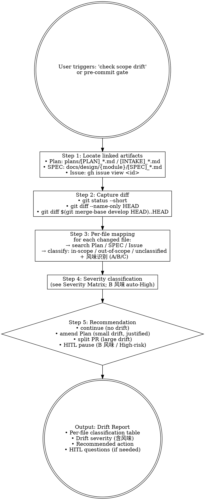

# mj-agent Flow — Scope Drift Gate (HITL Stage 9)

## Overview

17-stage 闭环中**最易遗漏**的 stage（实施跑偏检测）。比对 working tree diff vs linked Plan / SPEC / Issue scope，识别 commit 前的 implementation drift。

**Reference**: [[../../../docs/rule/[STANDARD]_MJ_Agent_AI_Engineering_Execution_HITL_Prompt_v1.0|HITL_Prompt v1.0]] §3.1 必停规则（`实现中 scope 明显扩大`）+ §4.4 Repo Scan 反向扫描原理（drift detection 的对偶）.

## Workflow



## When to Run This Skill

**MUST run scope-drift check before**：
- Commit 一批工作 scope 不清楚时（用户："我改了好多文件，对吗"）
- Push to PR（pre-push gate；mj-agent-flow-self-review Step 2 嵌套调用）
- 从编码切到文档阶段（确认实现范围已收敛）

**MAY skip**：
- Single-file trivial change（rename / typo / 小 docstring）
- 用户明确"I know it's out of scope, ship it anyway"（仍输出报告，但不阻塞）
- 无 linked Plan / SPEC（首次 Repo Scan 阶段；建议先 `/mj-agent-flow-intake` + `/mj-agent-flow-plan`）

## Step 1: Locate Linked Artifacts

```bash
# 1. Plan / Intake（plans/ 下）
ls plans/[PLAN]_*.md plans/[INTAKE]_*.md 2>/dev/null

# 2. SPEC（docs/design/{module}/）
git diff --name-only HEAD | grep -oE 'src/mj_agent/[a-z_]+/' | sort -u | \
  while read mod; do
    spec_dir="docs/design/$(basename "$mod")"
    ls "$spec_dir/[SPEC]_*.md" 2>/dev/null
  done

# 3. Issue（branch name → issue id）
branch=$(git branch --show-current)
issue=$(echo "$branch" | grep -oE '[0-9]+' | head -1)
[ -n "$issue" ] && gh issue view "$issue" --json title,body
```

**Plan / SPEC / Issue 任一缺失** → Step 5 推荐里标"无明确 scope 锚点，建议先建 Plan / 跑 /mj-agent-flow-intake"。

## Step 2: Capture Diff

```bash
git status --short                                              # 概览
git diff --name-only HEAD                                       # 改动清单
git diff --stat HEAD                                            # 改动量
git diff $(git merge-base develop HEAD)..HEAD --name-only       # 与 base 比对（merge-base 风格）
```

> 用 merge-base 而非 `develop..HEAD`：避免 develop 自分支创建后 advance 引入"假 diff"。

## Step 3: Per-File Mapping + 风味识别

对每个改动文件，在 Plan / SPEC / Issue 文本中搜索：

| 搜索关键词 | 含义 |
|---|---|
| 文件路径片段（如 `mj_agent/agent.py`） | 显式提及 → in-scope |
| 文件所在 mj-agent 模块（agent / llm / prompt / skill / sql / db / config / biz_catalog） | 模块级提及 → in-scope |
| 文件类别（`src/`, `tests/`, `docs/`, `infra/docker/`, `.claude/`） | 类别级提及 → in-scope（覆盖性） |
| 完全无匹配 | unclassified → 候选 drift |

**风味识别（mj-agent 专属，per ADR-015 §决策点 3）**：

| 路径 | 风味 |
|---|---|
| `src/mj_agent/{config,server,memory,integrations,tools,...}/` + `tests/` | A 纯代码 |
| `src/mj_agent/skills/**/SKILL.md` 或 `src/mj_agent/prompts/*.md` | **B in-source canonical**（永远 §3.1 必停 HITL） |
| `infra/docker/` + `pyproject.toml` + `langgraph.json` + `qcm_catalog.yaml` + `.env.example` + `scripts/` | C infra |

**输出表格**：

| 改动文件 | 改动类型 | 在 Plan §X | 在 SPEC §Y | 在 Issue scope | 风味 | 归类 |
|---|---|---|---|---|---|---|
| src/mj_agent/agent.py | M | §3.1 ✅ | §FR1 ✅ | ✅ | A | in-scope |
| src/mj_agent/skills/biz-domain-context/SKILL.md | M | — | — | — | **B** | **unclassified + auto-High** |
| docs/design/agent/[SPEC]_xxx.md | A | §4 ✅ | (self) | — | — | in-scope |

## Step 4: Severity Matrix（mj-agent 扩展）

| 场景 | Severity | 行动 |
|---|---|---|
| 0 unclassified | **None** | continue |
| 1-2 unclassified，单一模块，小改 (<50 行) | **Low** | continue + commit message 注明 |
| 3+ unclassified 但同一类别（如全 docs/） | **Low-Medium** | continue + PR description "扩展 scope" 说明 |
| 1+ 跨模块 unclassified | **Medium** | amend Plan + 重新对齐 |
| **B 风味 unclassified**（in-source canonical 改动未在 Plan） | **High（自动）** | **HITL 暂停**；建议先 `/mj-agent-runtime-skill-doc-improve` 或 `/mj-agent-runtime-prompt-version-bump`（PR-C2）propose diff |
| API / SQL guardrail / biz_catalog / public interface 出现在 unclassified | **High** | **HITL 暂停** + 询问拆 PR vs 合并 |
| > 50% 文件 unclassified | **High** | 重新做 `/mj-agent-flow-intake`（scope 显然漂了） |

## Step 5: Recommendation

按 Severity 输出建议：

```markdown
## Drift Report

### Linked Artifacts
- Plan: `plans/[PLAN]_xxx.md`
- SPEC: `docs/design/{module}/[SPEC]_xxx.md`
- Issue: #<id>

### Diff Summary
- Files changed: 12
- Lines: +400 / -50
- Branch: feature/<id>-<desc>

### Per-File Classification
{table from Step 3，含风味列}

### Severity: Medium
### Recommendation: amend Plan
### Rationale
- 3 个 unclassified 文件涉及 mj-agent 内 sql 模块（Plan §3.2 提及 "可能新增 guardrail" 但未具体）
- 建议在 Plan §3.2 加 "新增 SQL guardrail 规则" 行，然后继续

### HITL Questions
（仅 Severity ≥ Medium 时输出；B 风味 auto-High 必输出）
1. **改动 src/mj_agent/skills/biz-domain-context/SKILL.md 是否在原 scope 内？**
   - 当前观察：Plan 未提 SKILL body 改动
   - 风味识别：B in-source canonical（永远 §3.1 必停 HITL）
   - 选项：A. 接受 → 改 Plan + 走 /mj-agent-runtime-skill-doc-improve propose diff（PR-C2）/ B. 不接受 → revert + 拆独立 PR / C. 改 Plan 重对齐
   - 推荐：B（B 风味改动应单独 PR + Domain Expert review）
   - 默认假设：A
   - 必须 HITL：是

### Next Action
- ☐ amend Plan（手动 / 用 /mj-agent-doc-author，PR-B4 落地）
- ☐ revert + 单独 PR（B 风味场景）
- ☐ 在 commit message 注明「scope expand: ...」
- ☐ 继续 commit
```

## What This Skill DOES NOT DO

- ❌ 不自动改 Plan（仅建议；用户决定后调用 mj-agent-doc-author，PR-B4）
- ❌ 不拆 PR（仅建议；用户用 /mj-agent-git-branch 创建新 branch）
- ❌ 不阻塞 commit（仅 High Severity 时建议 HITL；user 可 override）
- ❌ 不替代 PR review（PR review = Stage 15-16）
- ❌ 不调 /mj-agent-flow-self-review（self-review = Stage 11；本 skill = Stage 9，被 self-review Step 2 嵌套调用）

## Sub-skill / Tool Calls

| Tool | 用途 |
|---|---|
| Bash `git status` / `git diff` / `git merge-base` | Step 2 capture diff |
| Bash `gh issue view` | Step 1 locate Issue |
| Read | 读 Plan / SPEC / Issue body |
| Grep | 在 Plan / SPEC / Issue 文本搜文件路径片段 |

## Reference Files

- [[../../../docs/rule/[STANDARD]_MJ_Agent_AI_Engineering_Execution_HITL_Prompt_v1.0|HITL_Prompt v1.0]] §3.1（必停规则之"实现中 scope 明显扩大"）+ §4.4（Repo Scan 反向扫描，drift 的对偶）
- [[../../../docs/adr/[ADR]_015_HITL_Prompt_v1_0_Derivation|ADR-015]] §决策点 3（3 风味分类，本 skill Step 3 风味识别依据）
- `.claude/skills/mj-agent-flow-self-review/SKILL.md`（Stage 11 上游消费者，Step 2 嵌套调本 skill）
- mj-system `.claude/skills/mj-sys-flow-scope-drift/SKILL.md`（直接派生源）

## Anti-patterns

- **不要** 跳过 B 风味识别（in-source canonical 改动 auto-High 是 mj-agent 专属硬约束）
- **不要** 用 `develop..HEAD` 算 diff（用 merge-base..HEAD 避免 develop advance 假 diff）
- **不要** 在 unclassified > 50% 时给 Low（自动升 High，重新 intake）
- **不要** 把 SPEC 缺漏当成 drift 推（SPEC 缺漏归 SPEC Delta，由 self-review §4.9 Rule 5d 处理）

## Handoff

```
Drift Report 已输出。
Severity = None/Low → /mj-agent-flow-self-review 继续（Step 4）
Severity = Medium → 用户决定 amend Plan 或 revert，然后回 self-review
Severity = High → HITL 暂停；B 风味建议先 /mj-agent-runtime-* propose diff（PR-C2）
```
