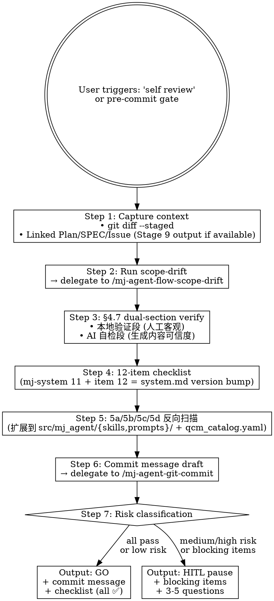

# mj-agent Flow — AI Self-review (HITL Stage 11)

## Overview

Pre-commit gate — verifies generated changes are correct, scoped, ready。Combines `/mj-agent-flow-scope-drift` (Stage 9) with Meta v2.0 §4.7 dual-section discipline（本地验证 / AI 自检 严格不混用）+ mj-agent 12-item checklist + commit message draft via `/mj-agent-git-commit`。

**Reference**: [[../../../docs/rule/[STANDARD]_MJ_Agent_AI_Engineering_Execution_HITL_Prompt|HITL_Prompt v1.1]] §4.9（含 Rule 5a/5b/5c/5d + Rule 11 mj-agent 扩展 + Rule 12 system.md version bump check） + [[../../../docs/rule/[STANDARD]_MJ_Agent_Documentation_Meta_Framework|Meta v2.0]] §4.7（双段约束）.

## Workflow



## When to Run This Skill

**MUST run before**：
- `git commit` for non-trivial changes（>5 files OR >100 lines OR API/DB/secret/in-source canonical 改动）
- Push to PR（pre-push gate）
- After running 本地验证（`/mj-agent-flow-verify` Stage 10 完成后紧接动作）

**MAY skip**：
- Single-file trivial change（rename / typo）
- 用户明确"skip self-review, just commit"（仍记 skip 理由）

## Step 1: Capture Context

```bash
git diff --staged --name-only
git diff --staged --stat
git diff --staged                     # 完整 diff（注意 token 量；大 PR 可分批）
git log -1 --format=%s 2>/dev/null    # 上次 commit 标题（避免重复）
```

定位 Linked artifacts（同 mj-agent-flow-scope-drift Step 1）：
- Plan: `plans/[PLAN]_*.md` / `[INTAKE]_*.md`
- SPEC: `docs/design/{module}/[SPEC]_*.md`
- Issue: `gh issue view <id>`

## Step 2: Run Scope-Drift Check

**Delegate to `/mj-agent-flow-scope-drift`**（嵌套调用）：

输入：当前 staged diff + linked artifacts。
输出：drift report（per-file classification + Severity）。

self-review 把 drift Severity 纳入最终 risk 判断：
- drift Severity = High → self-review Risk = High（必 HITL）
- drift Severity = Medium → self-review Risk ≥ Medium

## Step 3: §4.7 Dual-Section Verify（Meta v2.0）

按 Meta v2.0 §4.7，自检结果**严格分两段**：

### 「本地验证」段（人类客观可重复检查）

| 类别 | 接受？ | 例 |
|---|---|---|
| 测试套件 | ✅ | `uv run pytest tests/unit` 通过 |
| Lint / Typecheck | ✅ | `uv run ruff check` / `uv run mypy src/mj_agent` 通过 |
| Build / Compose | ✅ | `docker compose -f infra/docker/docker-compose.mj-agent.yml up -d` 启动成功 |
| 文件存在性 grep | ✅ | `grep -l "..." src/` 命中预期数量 |
| 文档校验 | ✅ | `python scripts/check_wikilinks.py` / `check_frontmatter.py` 0 violations |
| Studio probe | ✅ | `uv run langgraph dev` H1/H2/H3/R1/R2 矩阵通过 |
| Health probe | ✅ | `uv run mj-agent check` 通过 |
| biz_catalog drift | ✅ | `python scripts/diff_biz_schema.py` 输出 |
| **「代码看起来正常」** | ❌（属 AI 自检） | — |
| **「Claude 已检查」** | ❌（属 AI 自检） | — |

### 「AI 自检」段（生成内容可信度自查）

| 类别 | 接受？ | 例 |
|---|---|---|
| 影响范围核对 | ✅ | scope-drift Severity = None |
| 残留调试代码扫描 | ✅ | grep `print(` / `breakpoint(` / `TODO hack` 在改动文件 |
| 硬编码扫描 | ✅ | grep IP / 密码 / 绝对路径 / `.env` / `secrets.enc` |
| 文档与实现一致 | ✅ | SPEC §FR1 ↔ src 实现 |
| 引用路径有效 | ✅ | wikilink target 在 docs/ 下存在 |
| 与既有规范一致 | ✅ | commit type / branch type 矩阵 / Meta v2.0 frontmatter |
| **mj-agent 专属**：runtime SKILL/system.md body 反向扫描结果 | ✅ | 5a 反扫命中数 + 处理决策 |
| **mj-agent 专属**：biz_catalog 镜像状态 | ✅ | scripts/diff_biz_schema.py 是否漂移 |
| **「测试通过」** | ❌（属本地验证） | — |
| **「validator 输出 PASS」** | ❌（属本地验证） | — |

**严重违规**：把测试结果写到 AI 自检段、或把 diff 检查写到本地验证段 → self-review 输出 FAIL。

## Step 4: 12-item Checklist（mj-system 11 + item 12）

| # | 检查项 | 来源 |
|---|---|---|
| 1 | 改动符合 mj-agent 模块边界（agent/llm/prompt/skill/sql/db/config + tests/eval/ci/deps/infra） | mj-agent Architecture |
| 2 | 已读真实数据来源 / 列名 / 数据流（biz_catalog + find_biz_context），未加未要求的预处理 | mj-agent CLAUDE.md "Data boundary" |
| 3 | 无硬编码敏感信息 / IP / 密码 / 绝对路径 / 残留调试代码 / `.env` / `secrets.enc` | 通用 |
| 4 | 文档同步：canonical / working / INDEX / CLAUDE.md allowlist | Meta v2.0 §6.4 |
| 5 | Commit message 符合 `<type>(<scope>): <summary>` v1.0 规范 + 12 scope 闭合 allowlist | Commit Convention v1.0 |
| 6 | Branch × commit type 矩阵正确（5 branch × 7 type；mj-agent 不含 optimization） | Commit Convention §5.2 |
| 7 | scope-drift Severity = None / Low（如 ≥ Medium，必先 HITL） | mj-agent-flow-scope-drift 输出 |
| 8 | 本地验证段 ≠ AI 自检段（§4.7 严格不混用） | self-review §3 |
| 9 | 用户可感知变更 → CHANGELOG `[Unreleased]` 区块更新（feat/fix/perf 必更；docs/test/infra 视情） | Commit Convention 规则 |
| 10 | 无 PR description 字段缺失 | mj-agent-git-pr / 5 PR templates |
| 11 | 已 grep 文档大改后 stale references（CLAUDE.md "Documentation Maintenance" 规则；mj-agent 扩展含 src/mj_agent/{skills,prompts}/） | HITL_Prompt §4.9 Rule 5a |
| **12**（mj-agent 专属） | system.md `version` bump 时 `eval_references` 同步审查；in-source canonical 改动同步开 EVAL backlog ticket（§4.15 Rule 11） | HITL_Prompt §4.7 Rule 12 + §4.15 Rule 11 |

## Step 5: 5a/5b/5c/5d 反向扫描（mj-agent 扩展）

按 [[../../../docs/rule/[STANDARD]_MJ_Agent_AI_Engineering_Execution_HITL_Prompt|HITL_Prompt]] §4.9 Rule 5（拆 5a/5b/5c/5d）+ mj-agent 扩展（5a 反扫目标含 in-source canonical）：

### 5a: 既有文档失真扫描

基于 git diff 中 rename / move / delete / SQL-rename / DDD-restructure / internal-opt / **in-source canonical body change** / **biz_catalog drift**，按 mj-system Repo_Scan §7.2.1（Lite Phase A 占位）反扫：

```bash
# 扫描目标（mj-agent 扩展）
docs/**/*.md
CLAUDE.md
src/mj_agent/skills/**/SKILL.md         # mj-agent 扩展
src/mj_agent/prompts/*.md               # mj-agent 扩展
src/mj_agent/biz_catalog/qcm_catalog.yaml  # mj-agent 扩展（biz_catalog drift）
```

```bash
# 例：函数 / 类 / 列名重命名
Grep "`<old_name>`" docs/ CLAUDE.md src/mj_agent/skills/ src/mj_agent/prompts/

# 例：文件路径重组
Grep "`<old/path/file.py>`" docs/ CLAUDE.md src/mj_agent/skills/

# 例：biz_catalog drift
python scripts/diff_biz_schema.py
```

每条命中文档列入 PR description（Update 行）；不涉及时显式记"不涉及反向扫描"。

### 5b: 新文档创建确认

比对 Repo Scan §7.1 Documentation Decision 表 Action=Create 行，确认对应 Plan/SPEC/ADR/RUNBOOK/GUIDE/STANDARD/Local ISSUE/ASSESSMENT 已创建并填 frontmatter（schema 按 Meta v2.0 §4.3 / §4.4）。

### 5c: INDEX / CLAUDE.md / CHANGELOG 同步

- `docs/INDEX.md` 同步：A5 校验
- `CLAUDE.md` allowlist 检查：Meta v2.0 §6.4
- `CHANGELOG.md` `[Unreleased]`：feat/fix/perf 必更

### 5d: SPEC Delta Check

若本任务创建 / 更新 SPEC，对比最终 diff、验证结果、review/CI 发现，判断 SPEC 是否遗漏关键契约 / 配置 / 错误处理 / 幂等 / 回滚 / 验证 / 可观测性。

无漏项 → `SPEC Delta: None`
有漏项 → `SPEC Delta: SPEC-CONTRACT @ §4.2`（mj-system SPEC 编写指南 §6 短码，Lite Phase A 占位）

不涉及 SPEC → "不涉及 SPEC Delta"

## Step 6: Commit Message Draft

**Delegate to `/mj-agent-git-commit`**（PR-B1 落地），输出：
- 单 commit / 多 commit 拆分建议
- 每个 commit message：`<type>(<scope>): <一句话摘要>` + body（如需）
- 排除文件检查（.env / secrets.enc / `*.pem` / 临时调试文件）

## Step 7: Risk Classification & Output

| Risk | 触发条件 | Output |
|---|---|---|
| **Low** | 12 项 checklist 全 ✅；scope-drift = None；diff < 100 行 | GO + commit message |
| **Medium** | 1-2 项 checklist ⚠️；或 scope-drift = Low/Medium；或多模块影响 | GO + 提示重点核对 ⚠️ 项 |
| **High** | 任一 checklist ❌；或 scope-drift = High；或 §3.1 必停 4 项触发；或 in-source canonical 改动未走 §3.1 HITL | **HITL pause** + 3-5 questions |

**HITL questions 格式**：参 [[../../../docs/rule/[STANDARD]_MJ_Agent_AI_Engineering_Execution_HITL_Prompt|HITL_Prompt]] §3.3 7-段格式。

## Output Format Example

```markdown
## Self-Review Report

### Linked Artifacts
- Plan: plans/[PLAN]_xxx.md
- SPEC: docs/design/{module}/[SPEC]_xxx.md
- Issue: #<id>

### Diff Summary
- Files: 9
- Lines: +145 / -22
- Branch: feature/<id>-<desc>

### Scope-Drift（from /mj-agent-flow-scope-drift）
- Severity: Low
- 8/9 in-scope, 1 unclassified（CHANGELOG note）

### §4.7 Dual-Section
**本地验证**：
- ✅ uv run ruff check — 0 issues
- ✅ uv run mypy src/mj_agent — Success
- ✅ uv run pytest tests/unit — 87 passed
- ✅ python scripts/check_wikilinks.py — 0 violations

**AI 自检**：
- ✅ scope-drift Severity = Low
- ✅ 无残留 print/breakpoint 调试代码
- ✅ SPEC §FR1.2 ↔ src/<module>/<file>.py:230 一致
- ✅ wikilink target 存在
- ✅ commit type `feat` 符合 feature/* 矩阵
- ✅ 5a 反扫无命中 / 不涉及（mj-agent 扩展含 src/.../skills/ + prompts/）
- ✅ biz_catalog drift status: clean
- ✅ commit message draft 无硬编码

### 12-item Checklist
- [x] 1. mj-agent 模块边界
- [x] 2. 真实数据来源
- [x] 3. 无敏感信息
- [x] 4. 文档同步
- [x] 5. Commit message v1.0 规范 + 12 scope allowlist
- [x] 6. Branch × commit type
- [x] 7. scope-drift OK
- [x] 8. 双段不混用
- [x] 9. CHANGELOG（feat → 已加）
- [x] 10. PR description 字段
- [x] 11. stale references（5a 已扫，含 mj-agent 扩展）
- [x] 12. system.md version bump 检查（不涉及）

### SPEC Delta
- SPEC Delta: None（本任务不涉及 SPEC）

### Risk: Low
### Recommendation: GO

### Commit Message Draft（from /mj-agent-git-commit）
\`\`\`
feat(skill): add mj-agent-flow-self-review (Stage 11 self-review skill)

Co-Authored-By: Claude Opus 4.7 (1M context) <noreply@anthropic.com>
\`\`\`

### HITL Questions
（无 — risk = Low）
```

## What This Skill DOES NOT DO

- ❌ 不 auto-commit（仅输出 commit message draft；user 决定 commit 时机）
- ❌ 不 push（push = Stage 13 by /mj-agent-git-push）
- ❌ 不替代 PR review（PR review = Stage 15-16）
- ❌ 不修复发现的问题（仅报告；user 决定后调对应 skill）
- ❌ 不调 /mj-agent-flow-post-merge（post-merge = Stage 17）

## Sub-skill Calls

| Sub-skill | 何时调用 |
|---|---|
| `/mj-agent-flow-scope-drift` | Step 2 嵌套调，获取 drift report |
| `/mj-agent-git-commit` | Step 6 生成 commit message draft（按 v1.0 规范） |

## Reference Files

- [[../../../docs/rule/[STANDARD]_MJ_Agent_AI_Engineering_Execution_HITL_Prompt|HITL_Prompt v1.1]] §4.9（Rule 5a/5b/5c/5d + Rule 11/12 mj-agent 专属）
- [[../../../docs/rule/[STANDARD]_MJ_Agent_Documentation_Meta_Framework|Meta v2.0]] §4.7（双段约束）
- [[../../../docs/rule/[STANDARD]_MJ_Agent_Commit_Message_Convention|Commit Convention v1.0]]（type/scope 矩阵）
- `.github/PULL_REQUEST_TEMPLATE/{feature,bugfix,documentation,maintain,hotfix}.md`（5 PR templates）
- `.claude/skills/mj-agent-flow-scope-drift/SKILL.md`（Stage 9 子例程）
- `.claude/skills/mj-agent-git-commit/SKILL.md`（Stage 12 子例程）
- mj-system `.claude/skills/mj-sys-flow-self-review/SKILL.md`（直接派生源）

## Anti-patterns

- **不要** 把测试结果写到 AI 自检段（违反 §4.7 双段）
- **不要** 跳过 5a 反扫（mj-agent 扩展含 in-source canonical + biz_catalog）
- **不要** 在 in-source canonical 改动未走 §3.1 HITL 时直接 GO（强制 High Risk）
- **不要** 在 12 项 checklist 任一 ❌ 时给 GO（必 HITL）
- **不要** 在 system.md `version` bump 时跳过 item 12（HITL_Prompt §4.7 Rule 12）

## Handoff to mj-agent-git-commit + Stage 12

```
Self-Review GO 后：
  → /mj-agent-git-commit 用 Step 6 commit message draft 落 commit
  → /mj-agent-git-push（Stage 13）pre-push checklist + 双推
```
