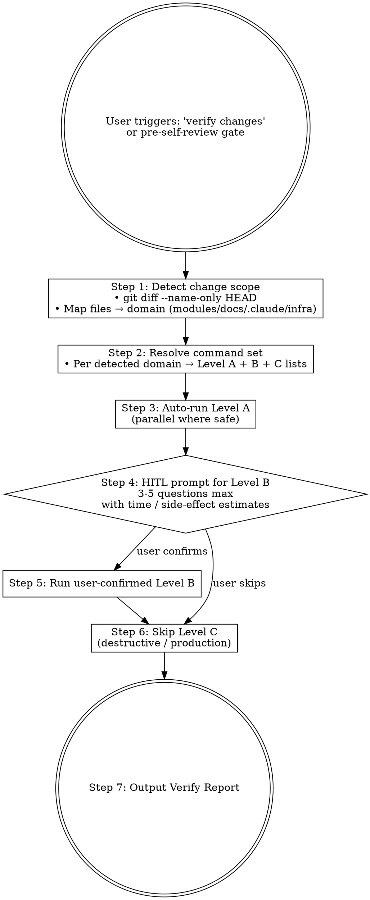

# mj-agent Flow — Local Verification (HITL Stage 10)

## Overview

Pre-self-review gate — auto-runs **Level A read-only checks** for detected change scope，HITL-confirms **Level B side-effecting checks**。Designed to give `/mj-agent-flow-self-review`（Stage 11）a complete「本地验证」段（execution-loop §6 双段约束；实操矩阵见 §5）without manual command typing。

**Reference**: [[../../../sdd/workflows/execution-loop|execution-loop]] §5（Level A / Level B 命令矩阵）+ [CLAUDE.md "Commands"](../../../CLAUDE.md) 段（uv-based 命令）。

## Workflow



## When to Run This Skill

**MUST run before**：
- `git commit` for non-trivial changes（after coding, before mj-agent-flow-self-review）
- Push to PR（pre-push gate）

**MAY skip**：
- 纯文档拼写修正（仅跑 wikilinks + frontmatter，无需 verify skill）
- 单 typo / rename
- 用户明确"我手动验证"

## Step 1: Detect Change Scope

```bash
git diff --name-only HEAD
git diff --stat HEAD
```

按文件路径推断 domain：

| 路径前缀 | Domain | 关键 verify 命令池 |
|---|---|---|
| `src/mj_agent/agent.py` | agent | ruff + mypy + pytest unit + Studio probe |
| `src/mj_agent/llm.py` | llm | ruff + mypy + smoke（Ark API key 测试） |
| `src/mj_agent/prompts/*.md` | prompt（**B 风味**） | smoke + Studio probe（LLM 行为对比） |
| `src/mj_agent/skills/*/SKILL.md` | skill（**B 风味**） | smoke + Studio probe |
| `src/mj_agent/tools/sql/{guardrail,execute,introspect,precheck}.py` | sql | ruff + mypy + pytest unit + integration |
| `src/mj_agent/integrations/mj_system_db.py` | db | ruff + mypy + pytest integration（需 POSTGRES_ANALYST_USER） |
| `src/mj_agent/config.py` | config | ruff + mypy + mj-agent check |
| `src/mj_agent/biz_catalog/qcm_catalog.yaml` | biz_catalog（**B 风味边缘**） | scripts/diff_biz_schema.py + pytest eval |
| `tests/{unit,eval,integration,smoke,contract}/` | tests | 对应 pytest band |
| `docs/` | docs | wikilinks + frontmatter |
| `.claude/skills/` | claude-skills | （仅检查 frontmatter A12 描述质量；A12-A14 自检）
| `docker/` | infra（**C 风味**） | docker compose config + mj-agent check + compose up/down 排练 |
| `pyproject.toml` / `uv.lock` | deps | uv lock + uv sync |
| `.github/workflows/` | ci | yamllint（如配置） |
| `langgraph.json` | langgraph | Studio probe 必跑 |

> 多 domain 命中 → 各自独立运行 verify。

## Step 2: Command Matrix（Level A / B / C，mj-agent tune）

按 [[../../../sdd/workflows/execution-loop|execution-loop]] §5。

### Level A — 完全只读（自动可调）

```bash
# 通用
git status --short
git diff --stat HEAD

# Application（按 detected scope）
uv run ruff check                          # 全仓 lint
uv run mypy src/mj_agent                   # strict 类型检查
uv run pytest tests/unit                   # unit tests（无外部依赖）
uv run pytest tests/eval                   # eval tests（seed schema + Component check，无 DB）
python -m compileall src                   # 解析检查

# Docs（如 docs/ 改动）
python scripts/check_wikilinks.py
python scripts/check_frontmatter.py

# .claude/skills/（如该路径改动）
# A12 description quality 人工自检（≥ 200 chars / 正向触发 / "Do not use for" 反向触发段）

# biz_catalog（如改动）
python scripts/diff_biz_schema.py          # 与 mj-system 上游 STANDARD §2-§4 比对

# Docker（仅检查 config，不启动）
docker --version
docker compose --version
docker compose -f docker/compose.yaml config   # 校验 yaml
```

### Level B — 局部写入 / 外部依赖（HITL-confirm 后调）

```bash
# Application（需 POSTGRES_ANALYST_USER 或 ARK_API_KEY）
uv run pytest tests/integration            # 需 live biz DB
uv run pytest tests/smoke -m smoke         # 需 live biz DB + Ark API
uv run pytest tests/contract -m contract   # 需 DB creds

# Health probe
uv run mj-agent check                      # DB + LLM creds 健康（Docker healthcheck 等价）

# Studio probe（需 .env + Ark API key + biz pg consumer access）
uv run langgraph dev                       # 起 Studio；用户手动跑 H1/H2/H3/R1/R2 矩阵
# 详见 docs/runbook/dev_studio_walkthrough.md

# Compose lifecycle
docker compose -f docker/compose.yaml up -d
docker compose -f docker/compose.yaml ps
docker compose -f docker/compose.yaml logs --tail=50
docker compose -f docker/compose.yaml down

# uv lock（如 pyproject.toml 改动）
uv lock
uv sync
```

### Level C — 破坏性 / 生产（绝不自动调用）

```bash
# 绝不在 verify skill 内自动调：
docker compose -f docker/compose.yaml down -v   # 删 volume（清 mj-agent-postgres 数据）
# 任何对 mj-system biz pg 的 write 操作（mj-agent 是只读消费者；ADR-006 / ADR-009 红线）
# .env / secrets.enc 改动（手工 + 加密）
# 任何 prod profile 操作
```

## Step 3: Auto-run Level A

```bash
# 按 detected domain 选 Level A 命令并行（safe parallelism）
# 输出每条：✅ PASS（exit=0）/ ❌ FAIL（exit≠0）+ 关键 stdout 片段
```

> **Parallelism**：多个只读命令可并行（如 ruff + mypy + check_wikilinks）；不并行写命令。

## Step 4: HITL Prompt for Level B

按 [[../../../sdd/workflows/execution-loop|execution-loop]] §3.3 7-段格式，最多 3-5 问：

```markdown
### Level B HITL（待确认）

1. **跑 pytest tests/integration?**
   - 当前观察：src/mj_agent/integrations/mj_system_db.py 改动
   - 不确定点：是否需 live biz DB 验证
   - 为什么重要：仅 ruff/mypy 不能验证 DB 连接行为
   - 选项：A. 跑 integration（~2-5 min；需 POSTGRES_ANALYST_USER） / B. 跳过 / C. 仅跑 contract
   - 推荐：A（DB-touching 改动需端到端验证）
   - 默认假设：B（跳过；如 .env 缺 POSTGRES_ANALYST_USER）

2. **Studio probe?**
   - 当前观察：src/mj_agent/skills/biz-domain-context/SKILL.md body 改动（**B 风味**）
   - 不确定点：是否需 manual LLM 行为对比
   - 选项：A. 跑 langgraph dev + H1/H2/H3/R1/R2 矩阵（~10 min） / B. 跳过 / C. 仅跑 smoke 自动化对比
   - 推荐：A（B 风味改动 LLM 行为）
   - 默认假设：A
```

## Step 5: Run User-confirmed Level B

```bash
# 仅运行 user 选 A 的命令
# 输出每条：✅ PASS / ❌ FAIL + 时长 + 关键输出
```

## Step 6: Skip Level C

```markdown
### Level C 跳过（按设计）

- ☐ docker compose down -v（删 mj-agent-postgres volume）
- ☐ mj-system biz pg write（红线，永禁）
- ☐ .env / secrets.enc 改动（手工流程）
- ☐ prod profile 操作
```

## Step 7: Output Verify Report

```markdown
## Verify Report

### Detected Scope
- 改动文件：12（src/mj_agent: 8 / docs: 2 / .claude/skills: 2）
- Domain：agent + sql + docs + claude-skills
- 推断风味：A 纯代码（src/）+ docs（docs/）+ engineering-workflow（.claude/skills/）
- 推断 verify 范围：scope=src+docs+claude, level=readonly+optional-DB

### Level A 自动执行（7/7 PASS, 18.4s）
- ✅ uv run ruff check — 0 issues (3.2s)
- ✅ uv run mypy src/mj_agent — Success: no issues (4.1s)
- ✅ uv run pytest tests/unit — 87 passed (6.0s)
- ✅ uv run pytest tests/eval — 12 passed (2.1s)
- ✅ python -m compileall src — All compiled (1.0s)
- ✅ python scripts/check_wikilinks.py — 0 violations (0.5s)
- ✅ python scripts/check_frontmatter.py — 58 docs all pass (0.8s)

### Level B HITL 询问（2 个）
（见 Step 4 模板）

### Level C 跳过
- ☐ down -v / biz pg write / secrets / prod

### Recommendation
- ☐ User 确认 Level B 1+2 → 继续 verify
- ☐ User 跳过 Level B → 仅 Level A 7/7 PASS，可继续 self-review

### Next Action
verify 报告应填入 mj-agent-flow-self-review 的「本地验证」段（execution-loop §6 双段；实操矩阵见 §5；Stage 11）。
```

## What This Skill DOES NOT DO

- ❌ 不调用其他 skill（直接 Bash；避免进其他 skill 的交互流程）
- ❌ 不自动调 Level C（破坏性 / 生产）
- ❌ 不替代 mj-agent-flow-self-review（self-review = Stage 11；verify = Stage 10）
- ❌ 不替代 PR review（PR review = Stage 15-16）
- ❌ 不修复 verify 失败（仅报告；user 决定后修复）
- ❌ 不输出「AI 自检」段内容（verify 输出只属「本地验证」段，按 execution-loop §6 双段约束）
- ❌ 不跑 mj-system biz pg write（红线）

## Direct Bash Calls（No Sub-skill Delegation）

verify skill 直接执行 Bash，不 delegate（避免它们的交互流程）：

| Tool | 用途 |
|---|---|
| Bash `git diff` / `git status` | Step 1 detect scope |
| Bash `uv run ruff` / `mypy` / `pytest` | Step 3 Level A application |
| Bash `python -m compileall` / `python scripts/check_wikilinks.py` / `check_frontmatter.py` | Step 3 Level A docs / parse |
| Bash `python scripts/diff_biz_schema.py` | Step 3 Level A biz_catalog drift |
| Bash `docker --version` / `compose config` | Step 3 Level A docker config check |
| Bash `uv run pytest tests/{integration,smoke,contract}` | Step 5 Level B controllers |
| Bash `uv run mj-agent check` / `uv run langgraph dev` | Step 5 Level B health + Studio |
| Bash `docker compose ... up -d / ps / logs / down` | Step 5 Level B compose lifecycle |
| Bash `uv lock` / `uv sync` | Step 5 Level B deps（pyproject.toml 改动） |

## Reference Files

- [[../../../sdd/workflows/execution-loop|execution-loop]] §5（Level A/B 命令矩阵）
- [[../../../CLAUDE.md|CLAUDE.md]] "Commands" 段（uv-based 命令）
- [[../../../docs/runbook/dev_studio_walkthrough|dev_studio_walkthrough]]（Studio H1/H2/H3/R1/R2 探针）
- [[../../../sdd/workflows/execution-loop|execution-loop]] §6（本地验证 vs AI 自检 双段；实操矩阵见 §5）
- `.claude/skills/mj-agent-flow-self-review/SKILL.md`（Stage 11 下游消费者）
- `.claude/skills/mj-agent-flow-scope-drift/SKILL.md`（Stage 9 上游）
- `tests/{unit,eval,integration,smoke,contract}/`（5 类测试 entry）
- `scripts/diff_biz_schema.py`（biz_catalog drift 检测）
- `scripts/check_wikilinks.py` / `check_frontmatter.py`（doc 校验）
- mj-system `.claude/skills/mj-sys-flow-verify/SKILL.md`（直接派生源）

## Anti-patterns

- **不要** 自动跑 Level C（删 volume / 改 secret）
- **不要** 跨 Level 把 Level B 写到「本地验证」自动跑（HITL-confirm 必须）
- **不要** 把 verify 输出塞到「AI 自检」段（违反 execution-loop §6 双段约束）
- **不要** 在 mj-system biz pg 上跑 write 操作（ADR-006 / ADR-009 红线）
- **不要** 跳过 B 风味（in-source canonical 改动）的 Studio probe / smoke 验证

## Handoff to mj-agent-flow-self-review

```
Verify Report 已输出（对话）。
下一步：调用 `/mj-agent-flow-self-review`（PR-B3）执行 Stage 11 双段 + 11-item checklist。
verify 输出应填入 self-review 的「本地验证」段。
```
