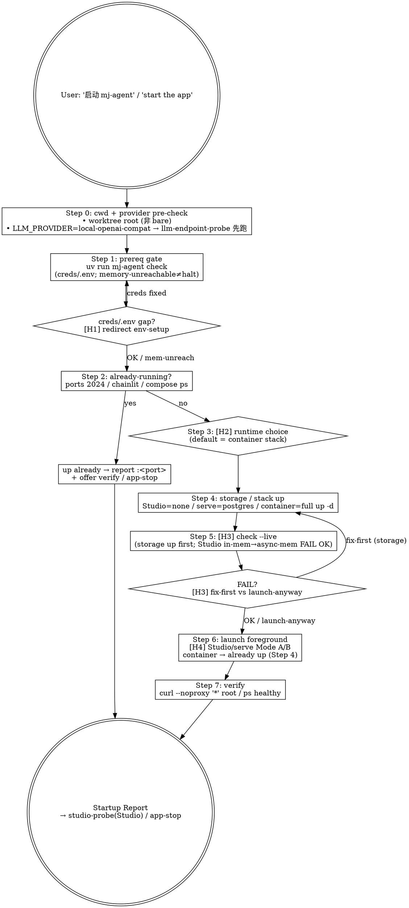

# mj-agent Infra — App Start

## Overview

Ordered **START** orchestrator for the mj-agent local-dev app runtime — the reversible
counterpart to `/mj-agent-infra-app-stop`. **Stage 10 sub** of the 17-stage 执行闭环（本地拉起
runtime 做验证 / 演示）；也可作为纯 dev 起服的独立入口。

**infra 家族分工**：原 6 个 infra skill 供给/销毁 **capacity**（secrets / containers / storage /
endpoints——名词）；本 skill（+ `app-stop`）操作 **runtime**（launch / stop 进程——动词）。本
skill **不重新实现** 下游能力，而是把它们缝成一条有序启动路径：

```text
[env-setup 已就绪] -> THIS-SKILL -> {container stack up-d | langgraph dev | mj-agent serve}
                       ├─ (缺 creds) -> /mj-agent-infra-env-setup
                       ├─ (DGX provider) -> /mj-agent-infra-llm-endpoint-probe
                       ├─ (storage) -> /mj-agent-infra-docker-compose
                       └─ verify -> /mj-agent-infra-studio-probe | /mj-agent-infra-app-stop
```

> **Native origin（非 mj-system 镜像）**：mj-system 的 `ops-*` 家族在 mj-agent 被 ADR-016
> §Decision 1 有意去掉；本 skill 只借鉴"需要一个统一起服动作"这一问题识别，方案（步骤 / HITL
> 粒度 / 端口 / 命令）全按 mj-agent 自身栈 native 设计，归入既有 `infra` 家族（名字匹配
> `check_claude_skill_contracts.py` 硬编码的 5-family regex → 0 WARN，无需 ADR / validator 改动）。

**Reference**:
- [[../../../src/mj_agent/server/cli.py|server/cli.py]]（`serve` / `check [--live]` 实现；`serve` 用
  `subprocess.call` spawn 一个 chainlit **子进程**——`app-stop` 的 tree-kill 依据）
- [[decisions/ADR-027_LLM_Provider_Abstraction|ADR-027]]（`ark` vs `local-openai-compat`；DGX 前置）
- [[decisions/ADR-026_Multi_Environment_Compose_Profile|ADR-026]]（4-file profile；容器栈 -f 链）
- [[../../../sdd/workflows/execution-loop|sdd/workflows/execution-loop]] §5（Level A/B 验证矩阵；
  Level C 破坏性见 `/mj-agent-flow-verify`）+ [[../../../policies/ai-agent|policies/ai-agent]] §4
  （破坏性操作必触 HITL；本 skill 全非破坏 → slim HITL）+
  [[decisions/ADR-034_HITL_Propose_Decide_Apply_Model|ADR-034]]（harness Bash 权限 prompt = 执行拍板）

## When to Use

**MUST run when**：
- 用户说 "启动 mj-agent / 把 app 跑起来 / start the app / launch the agent / 起本地开发环境 / run mj-agent locally / serve the UI"
- 需要按顺序拉起 runtime（prereq → storage → check → launch → verify）而不是记一串命令

**MAY skip when**：
- 只想跑单条 compose 命令（`up -d` / `ps` / `logs`）→ 直接 `/mj-agent-infra-docker-compose`
- 只做数据边界 walkthrough（H1/H2/H3/R1/R2）→ Studio 已起时直接 `/mj-agent-infra-studio-probe`
- 环境尚未 setup（无 `.env` / 无 `uv sync`）→ 先 `/mj-agent-infra-env-setup`（本 skill Step 1 会兜住并回导）

**MUST NOT use for**：
- ❌ secret / `.env` bootstrap + `uv sync` + offline check → /mj-agent-infra-env-setup
- ❌ 低层 compose up/ps/logs/down primitive → /mj-agent-infra-docker-compose
- ❌ Studio 数据边界 walkthrough H1/H2/H3/R1/R2 → /mj-agent-infra-studio-probe
- ❌ DGX endpoint 探针 → /mj-agent-infra-llm-endpoint-probe
- ❌ 停止运行中的 app → /mj-agent-infra-app-stop
- ❌ 破坏性 docker 清理 / volume+image wipe → /mj-agent-infra-env-teardown

## Workflow



> **Shell 说明**：下方 `powershell` 块里的 **PS cmdlet**（`Get-NetTCPConnection` / `Get-Process` /
> `Select-String`）须在 user 的 PowerShell 终端跑，或 Claude 的 Bash tool（git-bash）用
> `powershell.exe -NoProfile -Command '…'`（单引号包裹避免 `$var` 提前展开）执行；`docker` / `curl` /
> `uv` / `taskkill` / `netstat` 是 exe，git-bash 可直跑（同 `mj-agent-infra-env-setup` §"Bash tool 调用 PowerShell"）。

### Step 0 — cwd + provider pre-check *(Level A)*

```powershell
# 必须在 mj-agent worktree 根（非 bare repo 根）
git rev-parse --is-inside-work-tree     # 期望 true；false → /mj-agent-git-branch §Bare Worktree Health Check

# provider 检测（决定是否需要 DGX 隧道前置）
Select-String "^LLM_PROVIDER=" .env
```

如 `.env` 中 `LLM_PROVIDER=local-openai-compat`（DGX vLLM/SGLang/Ollama）→ **必须先**跑
`/mj-agent-infra-llm-endpoint-probe` 验证 endpoint 可达。DGX endpoint 只绑 loopback，消费侧必须由
**owner 在自己终端**起 SSH 隧道（`host.docker.internal:18000`；ssh-manager tunnel 有 bug——转发即
reset，Claude 起不了）。隧道不通时 `check --live` / launch 全 fail，浪费时间。

如 `LLM_PROVIDER=ark`（默认）→ 跳过；Ark endpoint 由 lazy init + `mj-agent check` 覆盖。

### Step 1 — Prereq gate via `mj-agent check` *(Level A；[H1] on creds/.env gap)*

```powershell
uv run mj-agent check      # creds presence + 一次 sync memory-pg ping + .env drift（不打 biz/LLM）
```

**注意**：默认 `check` 会做一次 memory-pg 同步 ping（`cli.py:_memory_sync_ping`），**不是纯 offline**——
storage 容器没起时会报 `memory DB unreachable`。据此把结果分三类处理：

- **creds/config 缺口**（`POSTGRES_ANALYST_USER not set` / `ARK_API_KEY not set` /
  `MJ_AGENT_MEMORY_USER not set` / `[DRIFT]` / `[MISSING]`）→ **[H1] Redirect（info）**：引导
  `/mj-agent-infra-env-setup`。两个解密脚本 `scripts/setup-env.ps1` +
  `.claude/scripts/setup-mcp-secrets.ps1` 需 **交互口令（TTY）**，Claude 的 Bash tool 供不了——**必须
  user 在自己 PowerShell 终端跑**。修好前 **不 launch**。
- **`memory DB unreachable` 但 creds 齐**（cold start / 刚 `app-stop` 完，postgres 还没起）→ **预期、非
  缺口**：不 halt、不去 env-setup，直接进 Step 4 起 storage（Studio in-memory 则连 memory pg 都不需要）。
- **`CHECK OK`** → 进 Step 2。

### Step 2 — Already-running detection *(Level A)*

```powershell
# host-run runtimes（Studio :2024 / host Chainlit serve 默认 :8000——以 mj-agent check 打印的 chainlit host:port 为准）
Get-NetTCPConnection -LocalPort 2024,8000 -State Listen -EA SilentlyContinue |
  Select-Object LocalPort, OwningProcess

# container stack（dev profile 示例 -f 链；host 端口 8001→容器 8000）
docker compose --env-file .env -f docker/compose.yaml -f docker/compose.override.yml ps
```

目标已在跑 → 报 "already running at :<port>" + offer `curl` verify（Step 7）/ `/mj-agent-infra-app-stop`；
**不 double-launch**（重复起会 `Address already in use` / `port is already allocated`）。

### Step 3 — Runtime choice *([H2] Choice)*

若用户措辞已点名运行时（"起 Studio" / "serve" / "compose up"）→ 跳过，直接用该运行时。否则
**[H2] AskUserQuestion**，**默认 = 容器栈**（见 §Runtime Matrix）。

### Step 4 — Storage / stack bring-up *(just RUN；Bash prompt gates)*

**必须在 Step 5 `check --live` 之前**（否则 memory/biz 探针对着没起的 storage 必 FAIL）：

| 运行时 | 本步动作 |
|---|---|
| LangGraph Studio | 无——in-memory checkpointer + 直连 biz pg（不需 compose；连 memory pg 都不用） |
| Chainlit `serve`（host） | `docker compose … up -d mj-agent-postgres`（`AsyncPostgresSaver` 依赖 memory pg） |
| Container stack（默认） | **全栈 `up -d`**（= 容器栈的 launch；起 postgres + mj-agent；或委托 `/mj-agent-infra-docker-compose`） |

> 容器栈在**本步**就 `up -d` 起全栈（**不留到 Step 6**）——这样 Step 5 `check --live` 能对着已起的 stack 跑。

### Step 5 — `check --live` gate *([H3] on FAIL；default-run；skippable)*

```powershell
uv run mj-agent check --live    # provider-aware：async memory(#283) + biz SELECT 1 + 1-token LLM；SKIP≠FAIL
```

打印 summary（`profile` / `biz host:port` / `memory db` / **`chainlit host:port`** / `llm provider
(endpoint=…)`）——**`chainlit host:port` 揭示真实 serve 端口**（Step 7 verify 用）。默认跑；user 说
"skip" 可跳（SKIP 不算 FAIL）。

> **Studio in-memory**：Studio 用 in-memory checkpointer、**不接 mj-agent-postgres**，所以 async-memory
> 探针 FAIL/SKIP 对 Studio **属预期、非阻塞**（biz + LLM 探针仍有意义）。
> **容器栈**：host 侧 `check --live` 验的是 host 能否触达 deps；容器**自身 healthcheck**（内部 `mj-agent
> check`）才是权威——host 侧若因 .env 指向容器内 hostname 而 FAIL，看 `docker compose ps` healthy 即可。

任一**实质 FAIL** → **[H3] Confirm（conditional）**：报 FAIL 明细，问 **先修**（回 Step 4 起 storage / 修
endpoint）还是 **照样 launch**（如只跑 Studio in-memory，memory FAIL 可忽略）。

### Step 6 — Launch foreground *([H4] launch-mode choice；foreground runtimes only)*

**容器栈**：**已在 Step 4 `up -d` 起了**——本步跳过（无 [H4]；`up -d` 即容器栈的 launch）。

**前台服务器（Studio / Chainlit serve）**：**[H4] AskUserQuestion** 选启动模式：

- **Mode A（你的终端跑）**：skill 打印命令交 user 在自己终端执行 → skill 轮询端口 verify。
  持久（不随会话结束）、user 拥有日志 + Ctrl-C。命令：
  ```powershell
  uv run langgraph dev            # Studio → :2024
  uv run mj-agent serve           # Chainlit → :8000（或 --host / --port 覆写；见 check 打印的端口）
  ```
- **Mode B（Claude 后台起）**：`Bash run_in_background` 起服 → Claude 自动 verify。**记录 bg-shell id
  + 绑定端口**，交给 `/mj-agent-infra-app-stop`（它用此 id/端口精准定位，再以端口 owner `taskkill /T /F`
  树杀——单停 bg-shell 未必连带 kill chainlit 子进程）。短命——绑定会话，会话结束即随之而去。

> `mj-agent serve` 是 typer→`subprocess.call([python, -m, chainlit, run, …])`，即父 typer 进程
> spawn 一个 chainlit **子进程**——所以 Mode B 停止需 **tree-kill**（`app-stop` 负责），单 PID kill
> 会遗留孤儿 chainlit。

### Step 7 — Verify *(Level A)*

```powershell
# host-run：轮询根路径（--noproxy '*' 绕开 Clash/v2ray 系统代理的 localhost-502 陷阱）
curl --noproxy '*' -fsS -o $null -w "HTTP %{http_code}`n" http://localhost:<port>/
#   Studio → :2024 ；host Chainlit serve → :8000（或 check 打印端口）

# container：健康 + 根路径
docker compose --env-file .env -f docker/compose.yaml -f docker/compose.override.yml ps   # 期望 healthy
curl --noproxy '*' -fsS -o $null -w "HTTP %{http_code}`n" http://localhost:8001/           # 容器 Chainlit
```

轮询直到 200 或超时。发 Startup Report（见 §Output Format）。handoff：**若起的是 Studio** →
`/mj-agent-infra-studio-probe`（深度 H1/H2/H3/R1/R2 走查；Studio-specific @ `:2024/studio`）；**容器栈 /
Chainlit serve** → 同套 H1-R2 问题可直接在 Chainlit UI（`:8001` / `:8000`）手动走（studio-probe 绑
`langgraph dev`，对 Chainlit 不适用）；停止 → `/mj-agent-infra-app-stop`。

## §Runtime Matrix

| Runtime | Command | Needs compose? | Checkpointer | Launch-mode gate? | Verify |
|---|---|---|---|---|---|
| **Container stack**（默认） | `docker compose --env-file .env -f docker/compose.yaml -f docker/compose.override.yml up -d` | Yes（全栈） | `AsyncPostgresSaver` | No（恒 `up -d`） | `ps` healthy + `localhost:8001/` |
| LangGraph Studio | `uv run langgraph dev` | No | in-memory | Yes（A/B） | `:2024` root（UI `:2024/studio`） |
| Chainlit host | `uv run mj-agent serve` | postgres only | `AsyncPostgresSaver` | Yes（A/B） | configured chainlit port root（默认 `:8000`；`mj-agent check` 打印真值） |

> **端口澄清**：host-run Chainlit `serve` 默认绑 `127.0.0.1:8000`（`config.py` `chainlit_host/port`
> 默认；`.env` `CHAINLIT_HOST/PORT` 可覆写）。容器栈的 Chainlit 走端口映射 host `:8001` → 容器
> `:8000`（`docker/compose.yaml`）。二者都是 "chainlit" 但端口不同：一个 host 直起，一个容器映射。

## §HITL 介入场景

| ID | 类型 | 触发 | 行为 |
|---|---|---|---|
| **H1** | Redirect（info） | Step 1 `mj-agent check` 报 **creds/.env 缺口**（≠ memory-unreachable） | 报缺口 + 引导 `/mj-agent-infra-env-setup`；password 脚本交 user 自跑；不 launch（memory-unreachable 则进 Step 4 起 storage，不触 H1） |
| **H2** | Choice | Step 3 运行时未由措辞确定 | `AskUserQuestion` 选运行时（默认 = 容器栈） |
| **H3** | Confirm（conditional） | Step 5 `check --live` 出现 FAIL | 报 FAIL + 问先修还是照样 launch |
| **H4** | Choice | Step 6 且选了前台服务器 | `AskUserQuestion` 选启动模式 A（你终端跑）/ B（Claude 后台） |

> **slim HITL**：非破坏性命令（`compose up` / `check --live` / launch）**不加**额外
> AskUserQuestion——由 harness Bash 权限 prompt 当执行拍板（随 `docker-compose` / `studio-probe`
> 惯例；ADR-034 + `sdd/workflows/execution-loop` §5 Level B）。AskUserQuestion 只保留给**真选择**
> （H2 运行时 / H4 启动模式）+ **条件确认**（H3 `check --live` FAIL）。本 skill 全程 **无 Level C
> 破坏性操作**。

## What This Skill DOES NOT DO

- ❌ 不替代 `/mj-agent-infra-env-setup`（secret / `.env` / `uv sync`；本 skill 只在 Step 1 兜住并回导）
- ❌ 不替代 `/mj-agent-infra-docker-compose`（低层 up/ps/logs/down；本 skill 委托它做 storage）
- ❌ 不替代 `/mj-agent-infra-studio-probe`（H1/H2/H3/R1/R2 数据边界走查；本 skill 只拉起 + 根路径 verify）
- ❌ 不替代 `/mj-agent-infra-llm-endpoint-probe`（DGX 4 步探针；本 skill Step 0 只做路由）
- ❌ 不停止 app（用 `/mj-agent-infra-app-stop`）
- ❌ 不做任何破坏性清理（`down -v` / `--rmi local` 归 `/mj-agent-infra-env-teardown`）
- ❌ 不改 `src/mj_agent/**` / `docker/compose.*` 结构（C 风味 infra 改动 → `/mj-agent-flow-implement`）
- ❌ 不替 owner 起 DGX SSH 隧道（owner 终端专属；Claude 起不了）

## Sub-skill / Tool Calls

| Tool | 用途 |
|---|---|
| Bash `git rev-parse --is-inside-work-tree` | Step 0 cwd |
| Bash `uv run mj-agent check [--live]` | Step 1 creds/.env gate / Step 5 live gate |
| Bash `Get-NetTCPConnection -LocalPort … -State Listen` | Step 2 host 端口探测 |
| Bash `docker compose … ps` | Step 2 容器探测 / Step 7 verify |
| Bash `docker compose … up -d [mj-agent-postgres]` | Step 4 storage + 容器栈 launch |
| Bash `uv run langgraph dev` / `uv run mj-agent serve`（Mode B：`run_in_background`） | Step 6 前台 launch |
| Bash `curl --noproxy '*' -fsS http://localhost:<port>/` | Step 7 根路径 verify |
| AskUserQuestion | H2 运行时选择 / H3 `check --live` FAIL 决策 / H4 启动模式 |

## Output Format

```markdown
## App Start Report

### Environment
- cwd: <worktree 根> ；LLM provider: <ark / local-openai-compat（endpoint=…）>
- Prereq gate (`mj-agent check`): ✅ OK / ❌ <缺口 → env-setup>

### Runtime
- Chosen: <container stack / Studio / Chainlit serve>
- Launch mode（前台时）: <A 你的终端 / B Claude 后台（bg-shell id=<id>, port=<port>）>
- Storage: <none / mj-agent-postgres up / full stack up>

### check --live（如跑）
- async memory: <PASS/SKIP/FAIL> ；biz db: <…> ；llm round-trip: <…>
- chainlit host:port = <127.0.0.1:8000 …>（真实 serve 端口）

### Verify
- curl --noproxy '*' http://localhost:<port>/ → HTTP <code>
- container: <ps healthy 摘要>

### Next Action
- 深度数据边界走查：Studio → /mj-agent-infra-studio-probe ；容器/Chainlit → 同套 H1-R2 在 Chainlit UI 手动走
- 停止 → /mj-agent-infra-app-stop
```

## Reference Files

- [[../../../src/mj_agent/server/cli.py|server/cli.py]]（`serve` chainlit 子进程 + `check [--live]` 探针）
- [[../../../src/mj_agent/config.py|config.py]]（`chainlit_host=127.0.0.1` / `chainlit_port=8000` 默认）
- [[../../../docker/compose.yaml|docker/compose.yaml]] + `.override.yml`（容器栈 -f 链 + 8001→8000 映射）
- [[decisions/ADR-008_Co_Deployment_With_Upstream_Warehouse|ADR-008]]（独立 compose project）
- [[decisions/ADR-026_Multi_Environment_Compose_Profile|ADR-026]]（4-file profile -f 链）
- [[decisions/ADR-027_LLM_Provider_Abstraction|ADR-027]]（ark / local-openai-compat；DGX 前置）
- [[decisions/ADR-034_HITL_Propose_Decide_Apply_Model|ADR-034]]（harness Bash prompt = 执行拍板）
- [[../../../sdd/workflows/execution-loop|sdd/workflows/execution-loop]] §5（Level A/B 验证矩阵；Level C 见 `/mj-agent-flow-verify`）+
  [[../../../policies/ai-agent|policies/ai-agent]] §4（破坏性必触 HITL；本 skill slim）
- 上下游 skill：`/mj-agent-infra-env-setup`（prereq）/ `-docker-compose`（storage）/
  `-llm-endpoint-probe`（DGX）/ `-studio-probe`（深度验证）/ `-app-stop`（对偶停止）

## Anti-patterns

- ❌ 不在 Step 2 探测到已运行时仍 double-launch（会 `Address already in use` / `port is already allocated`）
- ❌ 不跳过 Step 0 provider 检测就在 DGX 模式 launch（endpoint 不通 → 全 fail）
- ❌ 不替 owner 起 DGX SSH 隧道（owner 终端专属；ssh-manager tunnel 转发即 reset）
- ❌ 不给非破坏性命令（`up -d` / `check --live` / launch）加多余 AskUserQuestion（Bash prompt 已是拍板）
- ❌ 不用裸 `curl`（漏 `--noproxy '*'`）验 localhost（Clash/v2ray 会 502）
- ❌ 不把 host Chainlit serve 的 `:8000` 与容器栈的 `:8001` 混同（一个 host 直起、一个端口映射）
- ❌ 不在本 skill 内做 `down -v` / `--rmi local`（破坏性 → `/mj-agent-infra-env-teardown`）

## Handoff

```
App 已拉起（<runtime> @ :<port>）。
下一步：
- 深度数据边界走查（H1/H2/H3/R1/R2）：Studio → /mj-agent-infra-studio-probe（@ `:2024`）；容器/Chainlit → 同套问题在 Chainlit UI 手动走
- 停止（非破坏性）→ /mj-agent-infra-app-stop
- 破坏性清理（删 volume/镜像）→ /mj-agent-infra-env-teardown
- 进入 17-stage 闭环 → /mj-agent-flow-intake
```
