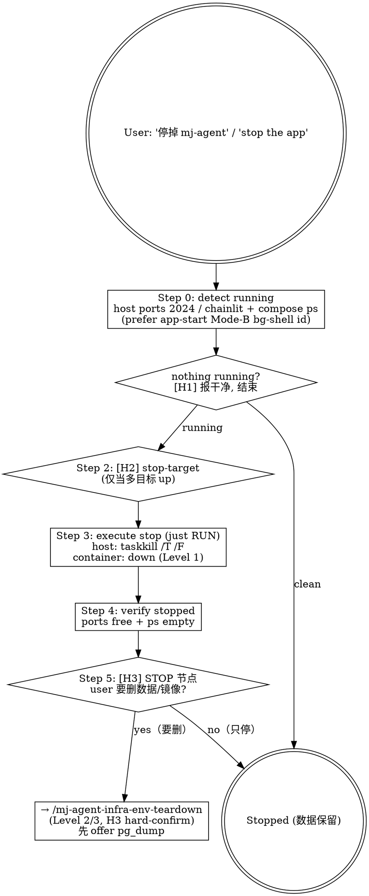

# mj-agent Infra — App Stop

## Overview

Graceful, **non-destructive STOP** of the running mj-agent local-dev app runtime — the reversible
counterpart to `/mj-agent-infra-app-start`. **Stage 17 sub** of the 17-stage 执行闭环（收工释放本地
runtime）；也可随时独立停服。**所有数据保留**（volumes / 镜像 / checkpointer 历史全在）。

**净新能力 = 停 host-run 进程**：`app-start` 的 Mode B（或 user 手动）起的 `langgraph dev`（:2024）/
`mj-agent serve`（configured chainlit port）是 **host 进程**——`env-teardown` 只拆 Docker，
`studio-probe` 明确拒杀 Studio 进程，此前**无 skill owns 停 host 进程**。容器路径这里只是 Level-1
`down`（保留 volumes + 镜像）。

```text
[app-start 起的 runtime] -> THIS-SKILL(非破坏停止) -> stopped
                                     └─ (要删数据/镜像) -> /mj-agent-infra-env-teardown（Level 2/3, 破坏性）
                                     └─ (删前想备份) -> /mj-agent-infra-storage-stack（pg_dump）
```

> **`env-teardown` 边界**：本 skill 只做 Level-1 停止（`down` 保留 volume+镜像 / host 进程 kill）。
> **删 volume（`down -v`）/ 删本地镜像（`--rmi local`）= 破坏性**，本 skill **拒做**，转
> `/mj-agent-infra-env-teardown`（它自带 Level 2/3 + H3 hard-confirm）。

**Reference**:
- [[../../../src/mj_agent/server/cli.py|server/cli.py]]（`serve` = typer `subprocess.call` spawn 一个
  chainlit **子进程**——单 PID kill 会遗留孤儿；必须 tree-kill）
- [[../../../sdd/workflows/execution-loop|sdd/workflows/execution-loop]] §7（Stage 17 收尾）+ §5（Level A/B 验证矩阵；Level C 破坏性见 `/mj-agent-flow-verify`）
- [[../../../policies/ai-agent|policies/ai-agent]] §4（破坏性操作必触 HITL——本 skill 用 STOP 节点把
  破坏性动作挡在 `env-teardown`）+ [[decisions/ADR-034_HITL_Propose_Decide_Apply_Model|ADR-034]]（Bash prompt = 执行拍板）

## When to Use

**MUST run when**：
- 用户说 "停掉 mj-agent / 关掉 app / stop the app / 关闭本地开发环境 / 把 Studio 停了 / 停掉 serve"
- 收工要释放本地 runtime（host 进程 + / 或容器栈），但**保留数据**

**MAY skip when**：
- 没有任何 runtime 在跑（Step 0 检测到干净 → [H1] 直接告知"无需停止"）
- 想彻底重置 / 删数据 / 删镜像 → 直接 `/mj-agent-infra-env-teardown`（Level 2/3）

**MUST NOT use for**：
- ❌ 破坏性 docker 清理 / volume wipe / 本地镜像删除 → /mj-agent-infra-env-teardown Level 2/3
- ❌ 低层 compose down primitive → /mj-agent-infra-docker-compose
- ❌ 启动 app → /mj-agent-infra-app-start
- ❌ 删数据前的 pg_dump 备份 → /mj-agent-infra-storage-stack

## Workflow



> **Shell 说明**：下方 `powershell` 块里的 **PS cmdlet**（`Get-NetTCPConnection` / `Get-Process`）须在
> user 的 PowerShell 终端跑，或 Claude 的 Bash tool（git-bash）用 `powershell.exe -NoProfile -Command '…'`
> 包裹；`taskkill` / `docker` 是 exe，git-bash 可直跑（同 `mj-agent-infra-env-setup` §"Bash tool 调用 PowerShell"）。

### Step 0 — Detect running *(Level A)*

**优先**：若 `app-start` 以 Mode B 起服并记录了 bg-shell id + 端口 → 用它精准定位进程/端口（省去
port-hunt）；**实际停止仍走 Step 3 的 `taskkill /T /F`**——单 KillShell 掉 bg-shell 未必连带 kill
uv→python→chainlit 子树、会留孤儿。否则按端口找 owner：

```powershell
# host 进程（Studio :2024 / host Chainlit serve 默认 :8000——以 mj-agent check 的 chainlit host:port 为准）
$pids = Get-NetTCPConnection -LocalPort 2024,8000 -State Listen -EA SilentlyContinue |
        Select-Object -Expand OwningProcess -Unique
$pids | ForEach-Object { Get-Process -Id $_ -EA SilentlyContinue | Select-Object Id, ProcessName, Path }

# container stack（profile-aware -f 链，同 env-teardown Step 0；dev 示例）
docker compose --env-file .env -f docker/compose.yaml -f docker/compose.override.yml ps
```

> **profile -f 链**：test/prod 换 overlay（`compose.test.yml` / `compose.prod.yml`）——必须与当初
> `up` 的 -f 链一致（compose 通过 name + -f 计算服务集合）。

### Step 1 — [H1] early-exit *(Info)*

无 host 进程 + 无运行容器 → "无运行中的 app，无需停止"，结束。

### Step 2 — [H2] stop-target choice *(only if ambiguous)*

若同时有 **多个** 可停目标（如 Studio 进程 + 容器栈都在跑）→ **[H2] AskUserQuestion** 选：host 进程 /
容器 Level-1 `down` / both。若**只有一个**目标 → 跳过，直接进 Step 3。

### Step 3 — Execute stop *(just RUN；Bash prompt gates)*

**host 进程 → tree-kill**（`/T` 连子进程，`/F` 强杀）：

```powershell
taskkill /PID <pid> /T /F
```

> **为何 tree-kill 而非 `Stop-Process -Id`**：`mj-agent serve` = typer 父进程 `subprocess.call` 起一个
> chainlit 子进程（`cli.py`）；单 PID kill 会**遗留孤儿 chainlit** 继续占端口。`taskkill /T` 杀整棵树。
>
> **诚实说明**：Windows 上对**别的进程**没有干净的 SIGTERM——"graceful" 现实上就是 force-kill
> （`/F`）。若在跑 query，尽量先在 UI 上 stop 当前 session 再杀。

**container stack → Level-1 `down`**（保留 volumes + 镜像；同 up 的 -f 链）：

```powershell
docker compose --env-file .env -f docker/compose.yaml -f docker/compose.override.yml down
#   ⚠ 不带 -v（保留 mj-agent-postgres-data → checkpointer 历史安全）；不带 --rmi
#   若 down 卡住（healthcheck 进程未优雅退出）→ 60s 后 docker kill 兜底：
#   docker kill mj-agent mj-agent-postgres mj-agent-redis ; 再 down
```

### Step 4 — Verify stopped *(Level A)*

```powershell
# 端口已释放（期望空）
Get-NetTCPConnection -LocalPort 2024,8000,8001 -State Listen -EA SilentlyContinue

# 容器已停（期望无 mj-agent* running）
docker compose --env-file .env -f docker/compose.yaml -f docker/compose.override.yml ps
```

### Step 5 — [H3] STOP 节点 / 破坏性边界

user 若还想 **删数据 / 删镜像**（`down -v` = checkpointer 数据永久丢失 / `--rmi local` = 删本地
`mj-agent:0.1` 镜像）→ **本 skill 拒做破坏性动作**，走 STOP 节点转交：

```
STOP 节点 — 删 volume（down -v）/ 删本地镜像（--rmi local）是破坏性、不可逆操作，本 skill 不做。
建议：(a) 若在意 memory checkpointer 数据 → 先 /mj-agent-infra-storage-stack 跑 pg_dump 备份（**仅 dev profile**；prod 备份走 volume snapshot，见 storage-stack）；
      (b) 再 /mj-agent-infra-env-teardown（Level 2/3，自带 H3 hard-confirm 明示丢失项）。
确认继续（转交 env-teardown）？(yes / no)
```

> 本 skill **只**负责非破坏停止；破坏性 teardown 由 `/mj-agent-infra-env-teardown` 拥有其自己的
> H3 hard-confirm（Level 2 删 volume / Level 3 删镜像），不在本 skill 内执行。

## §HITL 介入场景

| ID | 类型 | 触发 | 行为 |
|---|---|---|---|
| **H1** | Info | 无运行进程 / 容器 | 报干净，结束 |
| **H2** | Choice | 多个可停目标 | `AskUserQuestion` 选停 host / 容器 / both（仅一个目标时跳过） |
| **H3** | STOP-node / Redirect | user 要删数据 / 镜像 | 拒做破坏性 → `/mj-agent-infra-env-teardown`（含 H3 hard-confirm）；先 offer pg_dump 备份 |

> **slim HITL**：Step 3 的 `taskkill` / Level-1 `down` 是非破坏（数据保留），**不加**额外
> AskUserQuestion——由 harness Bash 权限 prompt 当执行拍板（ADR-034；随 `env-teardown` /
> `docker-compose` 惯例）。AskUserQuestion 只保留给 H2（多目标歧义）；H3 是破坏性边界的 STOP 节点。

## §Troubleshooting

| 症状 | 可能原因 | 修复 |
|---|---|---|
| `taskkill` 报 `ERROR: The process "<pid>" not found` | 进程已退（或 bg-shell 已随会话结束） | 无害；Step 4 verify 端口已释放即可 |
| 杀了 typer 父进程但端口仍占 | 漏了 `/T`——chainlit 子进程成孤儿 | 用 `taskkill /PID <pid> /T /F`；或按端口重找 owner 再杀 |
| `Access is denied`（taskkill） | 进程属别的用户 / 需提权 | 在 owner 自己的终端跑 `taskkill`（本机进程）；勿盲目提权 |
| `docker compose down` 卡在 stopping | mj-agent healthcheck 进程未优雅退出 | 60s 后 `docker kill mj-agent`（+ postgres/redis）再 `down`（同 env-teardown §Troubleshooting） |
| `network mj-system-backend-network: removing` 警告 | 该 external network 归 mj-system | 忽略（compose 自动跳过 external network；ADR-008 边界） |
| down 后端口仍 LISTENING | -f 链与 up 时不一致 → 部分停止 | 用与 up 相同的 profile -f 链重跑 `down` |

## What This Skill DOES NOT DO

- ❌ 不做 `down -v`（删 volume）/ `--rmi local`（删镜像）——破坏性，归 `/mj-agent-infra-env-teardown`
- ❌ 不替代 `/mj-agent-infra-docker-compose`（低层 down primitive；本 skill 是 runtime 停止编排）
- ❌ 不启动 app（用 `/mj-agent-infra-app-start`）
- ❌ 不做 pg_dump 备份（Step 5 只 offer 转交 `/mj-agent-infra-storage-stack`）
- ❌ 不删 mj-system 的 mj-system-backend-network（external；归 mj-system）
- ❌ 不改 `src/mj_agent/**` / `docker/compose.*` 结构

## Sub-skill / Tool Calls

| Tool | 用途 |
|---|---|
| Bash `Get-NetTCPConnection -LocalPort … -State Listen` + `Get-Process` | Step 0 host 进程探测 / Step 4 verify |
| Bash `docker compose … ps` | Step 0 容器探测 / Step 4 verify |
| Bash `taskkill /PID <pid> /T /F` | Step 3 host tree-kill |
| Bash `docker compose … down`（+ `docker kill` 兜底） | Step 3 容器 Level-1 停止 |
| AskUserQuestion | H2 多目标选择（H3 STOP 节点用文案 + yes/no，不必 AskUserQuestion） |

## Reference Files

- [[../../../src/mj_agent/server/cli.py|server/cli.py]]（`serve` chainlit 子进程 → tree-kill 依据）
- [[../../../docker/compose.yaml|docker/compose.yaml]] + `.override.yml`（-f 链 + 8001→8000 映射）
- [[decisions/ADR-008_Co_Deployment_With_Upstream_Warehouse|ADR-008]]（独立 compose project；external network 边界）
- [[decisions/ADR-034_HITL_Propose_Decide_Apply_Model|ADR-034]]（Bash prompt = 执行拍板）
- [[../../../sdd/workflows/execution-loop|sdd/workflows/execution-loop]] §7（Stage 17）+ §5（Level A/B；Level C 见 `/mj-agent-flow-verify`）
  + [[../../../policies/ai-agent|policies/ai-agent]] §4（破坏性必触 HITL）
- 对偶 / 下游 skill：`/mj-agent-infra-app-start`（起服）/ `-env-teardown`（破坏性 Level 2/3）/
  `-storage-stack`（pg_dump 备份）/ `-docker-compose`（低层 down）

## Anti-patterns

- ❌ 不用 `Stop-Process -Id`（单 PID）杀 `mj-agent serve`——会遗留孤儿 chainlit 子进程占端口；用 `taskkill /T`
- ❌ 不谎称 "graceful shutdown"——Windows 上对别的进程现实是 force-kill（`/F`）；诚实标注
- ❌ 不在本 skill 内跑 `down -v` / `--rmi local`（破坏性 → STOP 节点转 `env-teardown`）
- ❌ 不忘 profile -f 链一致（错 -f 链 = 部分停止 / 端口仍占）
- ❌ 不删 `mj-system-backend-network`（external；归 mj-system；compose 自动跳过但要告知）
- ❌ 不删前不 offer 备份（Step 5 破坏性转交前先 offer pg_dump，防误丢 checkpointer 数据）

## Handoff

```
App 已停（数据保留：volumes + 镜像 + checkpointer 历史全在）。
下一步：
- 重新起 → /mj-agent-infra-app-start（volumes 在，秒起）
- 彻底重置 / 删数据 / 删镜像 → /mj-agent-infra-env-teardown（Level 2/3，含 H3 hard-confirm）
- 删前备份 memory checkpointer → /mj-agent-infra-storage-stack（pg_dump）
```
