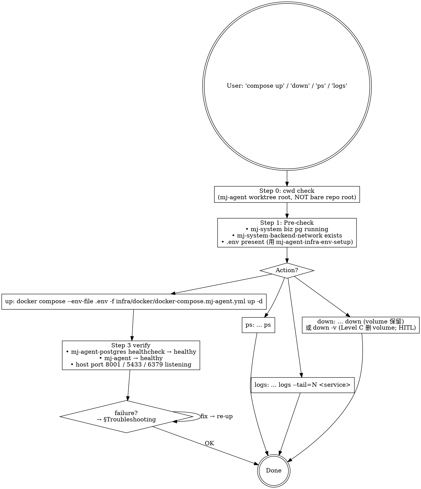

# mj-agent Infra — Docker Compose

## Overview

包装 `infra/docker/docker-compose.mj-agent.yml` 的 lifecycle 操作（up / ps / logs / down）+ 启停 pre-checks + troubleshooting。**Stage 8 sub C-flavor** of HITL_Prompt 17-stage 闭环。

mj-agent 是 **独立 compose project**（ADR-008，post storage-stack PR）—— 与 mj-system 解耦：
- 自带 project name `mj-agent`（Docker Desktop / Portainer 单独可见）
- 自带 storage stack（mj-agent-postgres + mj-agent-redis）on private `mj-agent-storage` bridge
- 仅以 consumer 身份接 mj-system 的 `mj-system-backend-network`（external: true）访问 biz pg

**3 services**：

| Service | 用途 | Port (host:container) |
|---|---|---|
| `mj-agent` | Chainlit UI + agent runtime | 8001:8000 |
| `mj-agent-postgres` | langgraph AsyncPostgresSaver memory checkpointer | 5433:5432 |
| `mj-agent-redis` | reserved（未 wire Python client；session cache / streaming buffer / rate limit 候选） | 6379:6379 |

> **不**与 mj-system 端口冲突（mj-app 8000 / mj-postgres 5432 / mj-system 无 redis）。

## When to Use

**MUST run when**：
- 用户说"起 mj-agent compose / mj-agent stack 启动 / compose up"
- 用户说"停 / down / 清理 mj-agent stack"
- 用户说"compose ps / compose logs"查看容器状态
- compose 启动失败需 troubleshoot

**MAY skip when**：
- 仅本地 dev mode（uv run langgraph dev）—— 不需要 compose stack（直接连 mj-system biz pg；用 /mj-agent-infra-studio-probe）
- mj-agent check 仅 creds 健康探针 → /mj-agent-infra-env-setup

**MUST NOT use for**：
- ❌ env / secret 配置 → /mj-agent-infra-env-setup
- ❌ Studio probe → /mj-agent-infra-studio-probe
- ❌ postgres init script / redis schema 修改 → /mj-agent-infra-storage-stack
- ❌ 修改 docker-compose.mj-agent.yml 结构（A 风味纯代码；C 风味 infra Step 3c per ADR-015 §决策点 3 → /mj-agent-flow-implement）
- ❌ mj-system biz pg 操作（lifecycle 归 mj-system）

## Workflow



## Step 0: cwd Check

```powershell
# 必须在 mj-agent worktree 内（任一）；不可在 bare repo 根
git rev-parse --is-inside-work-tree   # 期望: true
git worktree list
```

如返回 false → 见 mj-agent-git-branch §Bare Worktree Health Check。

## Step 1: Pre-check（compose up 前）

```powershell
# 1. mj-system biz pg running（mj-agent 是 consumer）
docker network ls --filter name=mj-system-backend-network
# 期望返回 1 行：mj-system-backend-network

docker ps --filter name=mj-system-postgres --format "table {{.Names}}\t{{.Status}}"
# 期望：mj-system-postgres / Up X (healthy)

# 2. .env 已配置（含 4 secrets）
Test-Path .env
@("POSTGRES_ANALYST_USER","POSTGRES_ANALYST_PASSWORD","ARK_API_KEY") | ForEach-Object {
    if (-not (Get-Content .env | Select-String "^$_=" -Quiet)) {
        Write-Warning "$_ missing in .env — run /mj-agent-infra-env-setup first"
    }
}

# 3. host ports 8001 / 5433 / 6379 不被占用
netstat -ano | findstr "8001 5433 6379"
# 期望：空（或无 LISTENING 行）
```

如 pre-check 任一 fail → STOP；指示用户修复（参 §Troubleshooting）。

## §Profile Matrix（PR-1 / ADR-025 4-file 分层）

mj-agent compose 拆 4 文件；profile 选择决定 `-f` 链：

| Profile | `-f` 链（**全部显式**） | 注入 | 适用主机 |
|---|---|---|---|
| **dev** | `-f docker-compose.mj-agent.yml -f docker-compose.override.yml` | `MJ_CONFIG_PROFILE=dev`、`POSTGRES_DEV_HOST=mj-postgres`、`build:` 本地 Dockerfile | 本地开发机 |
| **test** | `-f docker-compose.mj-agent.yml -f docker-compose.test.yml` | `MJ_CONFIG_PROFILE=test`、`POSTGRES_TEST_HOST=mj-postgres`、Harbor pull、8C/12G | 192.168.0.179 |
| **prod** | `-f docker-compose.mj-agent.yml -f docker-compose.prod.yml` | `MJ_CONFIG_PROFILE=prod`、`POSTGRES_PROD_HOST=mj-postgres`、Harbor pull、4C/12G、json-file logging、`MJ_DEBUG=false` | 192.168.0.106 |

> **重要**：dev 也用显式 `-f base -f override` 链。原因：本仓 compose 文件在 `infra/docker/` 子目录 + 用 `-f` 显式 base，docker compose 的 `override.yml` auto-load 行为**不生效**（auto-load 仅在 cwd default 模式 `docker compose up`/`docker-compose.yml` 同目录场景触发）。让 dev/test/prod 命令保持一致 `-f base -f overlay`，反而更可读。
>
> **DGX 算力消费侧**：不需要新 compose 文件；任一 profile 下在 `.env` 设 `LLM_PROVIDER=local-openai-compat` + `LLM_BASE_URL=http://192.168.0.189:8000/v1` 即可；DGX endpoint 健康用 `/mj-agent-infra-llm-endpoint-probe`。

## Step 2: Action

### Up（启动）

按 profile 选 -f 链（**dev 也用显式 -f base -f override**）：

```powershell
# DEV
docker compose --env-file .env -f infra/docker/docker-compose.mj-agent.yml `
               -f infra/docker/docker-compose.override.yml up -d

# TEST (在 192.168.0.179 主机)
docker compose --env-file .env -f infra/docker/docker-compose.mj-agent.yml `
               -f infra/docker/docker-compose.test.yml up -d

# PROD (在 192.168.0.106 主机)
docker compose --env-file .env -f infra/docker/docker-compose.mj-agent.yml `
               -f infra/docker/docker-compose.prod.yml up -d
```

> **不**带 `--build`（默认；dev override 已声明 build；如改 Dockerfile 才加 `--build`）
> **不**带 env var（standalone pattern；project_directory 自动 = compose 文件所在目录 `infra/docker/`）
> dev 显式 `-f override`：本仓 compose 文件在 `infra/docker/` 子目录 + 用 `-f` 指定 base，override.yml auto-load 不生效（per docker compose 默认行为）
> **lint 验证**（不实际 up）：`docker compose -f ... -f ... config` 解析配置无报错

### PS（状态）

```powershell
# dev（同 up 的 -f 链）
docker compose --env-file .env -f infra/docker/docker-compose.mj-agent.yml `
               -f infra/docker/docker-compose.override.yml ps

# test/prod 同理替换 overlay 文件
```

期望：

```
NAME                  STATUS         PORTS
mj-agent              Up X (healthy) 0.0.0.0:8001->8000/tcp
mj-agent-postgres     Up X (healthy) 0.0.0.0:5433->5432/tcp
mj-agent-redis        Up X           0.0.0.0:6379->6379/tcp
```

### Logs

```powershell
# 全部服务最近 50 行（dev 示例；test/prod 同理替换 overlay）
docker compose --env-file .env -f infra/docker/docker-compose.mj-agent.yml `
               -f infra/docker/docker-compose.override.yml logs --tail=50

# 特定服务（如 mj-agent / mj-agent-postgres）
docker compose --env-file .env -f infra/docker/docker-compose.mj-agent.yml `
               -f infra/docker/docker-compose.override.yml logs --tail=100 -f mj-agent
```

### Down（停止；保留 volume）

```powershell
# dev（同 up 的 -f 链）
docker compose --env-file .env -f infra/docker/docker-compose.mj-agent.yml `
               -f infra/docker/docker-compose.override.yml down

# test/prod 同理替换 overlay
```

> **不**带 `-v`（保留 mj-agent-postgres-data volume；下次 up 不丢 memory checkpointer 数据）
> **同 -f 链规则**：down 必须用与 up 相同的 -f 链（compose 通过 name + -f 计算服务集合）

### Down -v（**Level C 破坏性 — HITL-confirm only**）

```powershell
# 删 volume；mj-agent-postgres / mj-agent-redis 数据全清
docker compose --env-file .env -f infra/docker/docker-compose.mj-agent.yml `
               -f infra/docker/docker-compose.override.yml down -v
```

⚠️ **STOP 节点**：不允许自动跑 `down -v`（per /mj-agent-flow-verify Level C）；必须 user 显式确认。建议 prompt：

```
Level C 破坏性操作 — `down -v` 会删 mj-agent-postgres + mj-agent-redis volume，langgraph memory checkpointer 数据全部丢失。
确认继续？(yes / no)
```

## Step 3: Verify（up 后）

```powershell
# 1. 容器 healthy（dev 示例 -f 链；test/prod 替换 overlay）
docker compose --env-file .env -f infra/docker/docker-compose.mj-agent.yml `
               -f infra/docker/docker-compose.override.yml ps
# 期望全部 healthy

# 2. host port listening
netstat -ano | findstr "8001 5433 6379"
# 期望 LISTENING

# 3. Chainlit 根路径可达（host 端到端；`--noproxy '*'` 绕过开发机系统代理 if any，避免 Clash/v2ray 等代理 502 localhost）
curl --noproxy '*' -fsS -o $null -w "HTTP %{http_code}`n" http://localhost:8001/
# 期望 HTTP 200；如 5xx 且容器内 `python urllib` 200 → 走 §Troubleshooting "host curl 502 但浏览器正常"行

# 4. mj-agent-postgres 可连
docker exec mj-agent-postgres psql -U mj_agent_app -d mj_agent_memory -c "\dt"
# 期望：langgraph AsyncPostgresSaver tables（如 checkpoints / writes）
```

## §Troubleshooting

| 症状 | 可能原因 | 修复 |
|---|---|---|
| `network mj-system-backend-network not found` | mj-system stack 没起 | 先去 mj-system 仓 `docker compose up -d` 起 mj-system 栈 |
| `port is already allocated` (8001/5433/6379) | 之前 mj-agent stack 没干净 down，或其他进程占端口 | `netstat -ano \| findstr <port>` → kill 占用进程；或先 `down` 当前 stack |
| `mj-agent-postgres unhealthy` | postgres-init 脚本失败 / volume 状态损坏 | `docker compose logs mj-agent-postgres`；如 init failed → `down -v` + 重 up（**HITL**：确认愿意丢数据） |
| `mj-agent unhealthy` | analyst RO creds 错 / Ark API key 错 / mj-system biz pg 不可达 | `docker compose logs mj-agent`；如 creds 错 → 重跑 /mj-agent-infra-env-setup；如 biz pg 不可达 → 检查 mj-system 是否 up |
| `mj-agent: Permission denied (postgres-init)` | Linux 上 init 脚本无 exec 权限 | `chmod +x infra/docker/postgres-init/*.sh` |
| `mj-agent: ImportError mj_agent` | image 没含 src/ | `docker compose build mj-agent` 重建 |
| `mj-system-backend-network: unable to attach` | mj-system network 没标 `external: true` 或 mj-system 没起 | 检查 docker-compose.mj-agent.yml 的 networks 段；先起 mj-system |
| `error: pull access denied for 8.135.38.175/mj-agent/mj-agent` | TEST/PROD profile 拉 Harbor 失败：镜像未推 / Harbor namespace 未创建 / docker login 缺 | (a) 先 `docker login 8.135.38.175`；(b) 确认 Harbor 上有 `mj-agent/mj-agent:0.1` tag；(c) 必要时改 image tag 到实际可用 tag |
| dev profile env 没生效（如 `MJ_CONFIG_PROFILE` 仍是 .env 值） | dev 也必须显式 `-f override`；遗漏会导致 profile 配置不注入 | 用 `docker compose --env-file .env -f infra/docker/docker-compose.mj-agent.yml -f infra/docker/docker-compose.override.yml config` 看合并结果；确认 dev `-f` 链含 override.yml |
| test/prod profile 起来后 mj-agent 报 `connection refused mj-postgres:5432` | mj-system 栈没在同主机 up；或 mj-system-backend-network 不存在 | TEST/PROD 主机必须先起 mj-system 栈（mj-postgres healthy + mj-system-backend-network 存在）；mj-agent 只是 consumer |
| host curl 502 但浏览器正常 + 容器内 `python urllib` 200 | host shell `HTTP_PROXY` / `HTTPS_PROXY` / `ALL_PROXY` 未排除 localhost（Clash / v2ray 系统代理常见）；浏览器有 implicit localhost bypass、curl 无条件走代理 | 单次：`curl --noproxy '*' http://localhost:8001/`；持久：`$env:NO_PROXY="localhost,127.0.0.1,::1"`（PowerShell）/ `export NO_PROXY=localhost,127.0.0.1,::1`（bash）；mj-agent 容器健康，不需 restart；详见 `docs/runbook/dev_deployment.md` §4 |

## Output Format

```markdown
## Compose Lifecycle Report

### Action: <up / ps / logs / down / down -v>

### Pre-check
- ✅ mj-system biz pg running
- ✅ mj-system-backend-network exists
- ✅ .env 4 secrets present
- ✅ host ports 8001/5433/6379 free

### Result
- Container status: <ps 输出>
- Healthcheck: <healthy / unhealthy with logs>
- Port listening: <netstat 输出>

### Issues（如有）
- <问题 + 修复指引>

### Next Action
- 进入 dev → /mj-agent-infra-studio-probe（uv run langgraph dev 直连 biz pg；不一定需要 compose）
- compose-based dev → http://localhost:8001（Chainlit UI）
- 进入 17-stage 闭环 → /mj-agent-flow-intake
```

## What This Skill DOES NOT DO

- ❌ 不替代 /mj-agent-infra-env-setup（env / secret 配置）
- ❌ 不替代 /mj-agent-infra-studio-probe（uv run langgraph dev + H1/H2/H3/R1/R2 矩阵；与 compose 互补）
- ❌ 不替代 /mj-agent-infra-storage-stack（postgres init script / redis schema 内部）
- ❌ 不修改 `infra/docker/docker-compose.mj-agent.yml` 结构（C 风味；用 /mj-agent-flow-implement Step 3c）
- ❌ 不操作 mj-system biz pg（lifecycle 归 mj-system；ADR-008 + ADR-009 边界）
- ❌ 不自动跑 Level C `down -v`（HITL-confirm only）
- ❌ 不替代 mj-agent check（health probe；用 /mj-agent-infra-env-setup Step 5）

## Sub-skill / Tool Calls

| Tool | 用途 |
|---|---|
| Bash `docker compose -f ...` | Step 2 lifecycle |
| Bash `docker network ls` / `docker ps` | Step 1 pre-check |
| Bash `netstat -ano \| findstr` | Step 1 + Step 3 port check |
| Bash `docker exec mj-agent-postgres psql` | Step 3 verify postgres |
| Bash `docker compose logs` | Troubleshooting |
| AskUserQuestion | `down -v` Level C HITL-confirm |

## Reference Files

- [[../../../infra/docker/docker-compose.mj-agent.yml|infra/docker/docker-compose.mj-agent.yml]]（target file，含 services / networks / volumes / healthcheck 全配置）
- [[../../../infra/docker/Dockerfile|Dockerfile]]（mj-agent service build context）
- [[../../../infra/docker/entrypoint.sh|entrypoint.sh]]
- [[../../../infra/docker/postgres-init/01-bootstrap-mj-agent-memory.sh|postgres-init/01-bootstrap-mj-agent-memory.sh]]（mj-agent-postgres 启动 hook；详见 /mj-agent-infra-storage-stack）
- [[../../../infra/docker/README.md|infra/docker/README.md]]（compose 详细说明，如有）
- [[../../../docs/adr/[ADR]_008_Co_Deployment_With_Upstream_Warehouse|ADR-008]]（独立 compose project + mj-system-backend-network external 边界）
- [[../../../docs/runbook/dev_studio_walkthrough|dev_studio_walkthrough]]（dev mode 替代方案：uv run langgraph dev，不依赖 compose）
- [[../../../docs/rule/[STANDARD]_MJ_Agent_AI_Engineering_Execution_HITL_Prompt|HITL_Prompt v1.1]] §4.7 Rule 13（compose 改动后必排练 up/down，记录 PR）+ §4.8 Level B / Level C 命令矩阵
- mj-system upstream `mj-sys-ops-env-{setup,teardown}/SKILL.md`（间接派生源；mj-agent 简化为本 skill 的 lifecycle 段 + 独立 compose 项目；不实现 ETL 编排）

## Anti-patterns

- ❌ 不在 mj-agent root 之外路径调用（compose -f path 是相对路径，cwd 错则路径解析错）
- ❌ 不与 mj-system compose chain（即不 `docker compose -f mj-system/.../docker-compose.yml -f infra/docker/docker-compose.mj-agent.yml up`；这是 storage-stack PR / hotfix #43 之前的旧模式，已被 standalone pattern 取代）
- ❌ 不带 `--no-deps` 跳依赖（depends_on 是设计意图：mj-agent 等 mj-agent-postgres healthy 才起）
- ❌ 不自动跑 `down -v`（必 HITL-confirm；删 volume = 丢 langgraph memory checkpointer 数据）
- ❌ 不修改 mj-system 的 mj-system-backend-network（external: true 设计；mj-agent 仅 attach；lifecycle 归 mj-system）
- ❌ 不 expose mj-agent-postgres 给 mj-system biz pg（双向隔离：mj-agent 仅 consumer biz pg；biz pg 不访问 mj-agent-postgres）

## Handoff

```
Compose lifecycle 完成。
下一步：
- compose-based dev → http://localhost:8001 (Chainlit UI)
- dev-mode dev → /mj-agent-infra-studio-probe (uv run langgraph dev；不依赖 compose)
- storage 内部操作 → /mj-agent-infra-storage-stack
- 进入 17-stage 闭环 → /mj-agent-flow-intake
- compose 改动（结构）→ /mj-agent-flow-implement Step 3c (C 风味)
```
