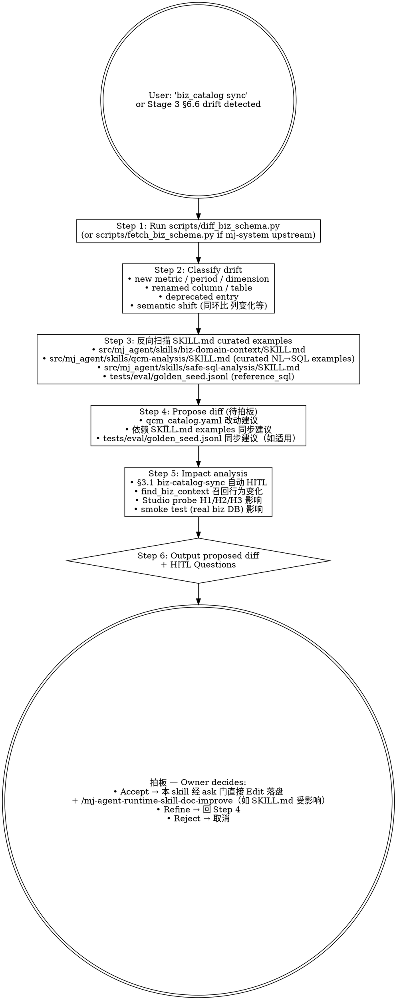

# mj-agent Runtime — Biz Catalog Sync

## Overview

**Propose → 拍板 → apply**（ADR-034）：检测 + 报告 mj-agent `qcm_catalog.yaml` 与 mj-system 上游 `[STANDARD]_Biz_DWS_Naming_Stability.md` §2-§4 的漂移，包装 `scripts/diff_biz_schema.py` + `scripts/fetch_biz_schema.py`，propose diff + 反扫 SKILL.md curated examples 中受影响的 metric / period / dimension 名；**Owner 拍板后由本 skill 经 settings.json `ask` 权限门直接 Edit `qcm_catalog.yaml` 落盘**（不再 read-only、不再要 Owner 手动粘贴）。

**Why this skill exists**：

- `src/mj_agent/biz_catalog/qcm_catalog.yaml` 是 mj-system 上游 STANDARD §2-§4 的**镜像**，被 `find_biz_context` tool 在 runtime 召回
- mj-system 上游 STANDARD 演化（如新增 metric、改列名、调时间维）若 mj-agent 镜像不同步 → `find_biz_context` 返回错误业务语义 → LLM 决策偏差
- B 风味（in-source canonical 边缘）改动；触 §3.1 必停面 biz-catalog-sync（B 风味永远 HITL）
- Stage 8 sub by `/mj-agent-flow-implement`（C 风味或 B 风味边缘）

**hard constraint**: 本 skill **先 propose diff + impact analysis + 依赖反扫，落盘前必须过 `OWNER_APPROVAL_REQUIRED` 停点**（工具中立停点，v5 §5.3；Claude Code 载体 = AskUserQuestion + settings `ask` 权限 prompt，Codex 载体 = AGENTS.md 自守 prose 停点 + 可审计批准记录）；拍板后由本 skill 直接 Edit `src/mj_agent/biz_catalog/qcm_catalog.yaml` 落盘——catalog 是 mj-system 上游镜像，不加上游不存在的 entry。

## When to Use

**MUST run when**：

- 用户提到 mj-system 上游 STANDARD §2-§4 演化（新增 metric / period / dimension / 同环比列 / 信号表 / 维表 join key）
- 用户要"同步 biz_catalog / 检测 catalog drift / mirror mj-system §2-§4"
- Stage 3 Repo Scan §6.6 检测到 biz_catalog drift
- execution-loop §4.1 的 Stage 3 映射（Repo Scan 反向扫描；历史源 HITL_Prompt §4.4 §6）发现 qcm_catalog.yaml 改动

**MAY skip when**：

- 仅 yaml comment 修改（不改 metric / period / dimension）
- mj-agent biz_catalog 仅文件 reformat（不改语义）

**MUST NOT use for**：

- ❌ 跳过本 skill 的 propose + 反扫、未经 Owner 拍板盲改 qcm_catalog.yaml
- ❌ 改 SKILL.md → `/mj-agent-runtime-skill-doc-improve`（B 风味）
- ❌ 改 system.md → `/mj-agent-runtime-prompt-version-bump`
- ❌ SQL guardrail / precheck 调整（tools/sql/{guardrail,precheck}.py；这是 A 风味纯代码，§3.1 必停面 sql-guardrail-relax 由 /mj-agent-flow-implement 处理）
- ❌ mj-system 上游 STANDARD 编辑（出 mj-agent 仓 governance）

## Workflow（propose → 拍板 → apply）



## Step 1: Run diff_biz_schema.py

```bash
# 比对当前 qcm_catalog.yaml vs mj-system 上游 STANDARD §2-§4
uv run python scripts/diff_biz_schema.py

# 如需 fetch 上游最新（CI 模式或本地 mj-system clone）
uv run python scripts/fetch_biz_schema.py --upstream-path D:/workspace/.../mj-system/develop/docs/rule/[STANDARD]_Biz_DWS_Naming_Stability.md
```

`diff_biz_schema.py` 输出（按 mj-agent 实际脚本约定）：
- 新增 metric / period / dimension 清单
- renamed columns 清单（含 mapping）
- deprecated entries 清单
- semantic shifts（如同环比列定义变化）

如脚本返回 0 + 输出 "No drift" → 跳过后续；输出"Drift detected" → 进 Step 2。

## Step 2: Classify Drift

| 漂移类型 | 影响 |
|---|---|
| **新增 metric**（如新加 `qcm_xxx_daily_total`） | qcm_catalog.yaml 加 entry；可能 SKILL examples 加例 |
| **新增 period**（如 weekly / monthly_quarterly） | qcm_catalog.yaml 加 entry；safe-sql-analysis SKILL 时间谓词模板可能改 |
| **新增 dimension**（如新增 join key） | qcm_catalog.yaml 加 entry；qcm-analysis curated examples 可能加 JOIN 范例 |
| **renamed column** | qcm_catalog.yaml mapping 改；SKILL.md curated examples + golden_seed.jsonl reference_sql 可能含命中 |
| **deprecated entry** | qcm_catalog.yaml entry 标 deprecated；SKILL.md examples 移除 / 替代 |
| **semantic shift** | 重审 SKILL.md curated examples；可能 system.md hard rule 调整 |

## Step 3: 反向扫描

```bash
# 1. biz-domain-context skill (find_biz_context 召回主体)
grep -E '<old metric/period/dim name>' src/mj_agent/skills/biz-domain-context/SKILL.md

# 2. qcm-analysis skill (curated NL→SQL examples)
grep -E '<old column or table name>' src/mj_agent/skills/qcm-analysis/SKILL.md

# 3. safe-sql-analysis skill (SQL 写法守则)
grep -E '<old column or table name>' src/mj_agent/skills/safe-sql-analysis/SKILL.md

# 4. golden_seed.jsonl (reference_sql for evaluations)
grep -E '<old column or table name>' tests/eval/golden_seed.jsonl

# 5. system.md (硬规则中如有 column reference)
grep -E '<old column or table name>' src/mj_agent/prompts/system.md

# 6. SQL guardrail BIZ_ALLOWED_DWD_TABLES（如 biz_dwd 表 renamed）
grep -E 'BIZ_ALLOWED_DWD_TABLES|<old biz_dwd table>' src/mj_agent/tools/sql/guardrail.py
```

输出每条命中：file:line + 引用内容；判定是否 living（直接更新到新名）/ frozen（保旧名 + 注释为何保留）。

## Step 4: Propose Diff（待拍板）

### qcm_catalog.yaml 改动建议

```yaml
# Proposed diff for src/mj_agent/biz_catalog/qcm_catalog.yaml

# 新增 metric
metrics:
+ qcm_xxx_daily_total:
+   description: <from mj-system §2 entry>
+   period_columns:
+     daily: data_date
+   dimension_join_keys:
+     institution: tenant_id

# renamed column 示例
metrics:
  qcm_yyy:
-   period_columns: { daily: stat_date }
+   period_columns: { daily: data_date }
```

### 依赖 SKILL.md 同步建议（B 风味；建议走 /mj-agent-runtime-skill-doc-improve）

```markdown
## SKILL.md Cross-update Required

如 Owner 拍板本 diff，以下 SKILL.md 可能需要同步：

- src/mj_agent/skills/qcm-analysis/SKILL.md（行 NN）：curated example 含 `<old col>` → 改 `<new col>`
- src/mj_agent/skills/biz-domain-context/SKILL.md（行 NN）：metric 列表含 `<old metric>` → 加 `<new metric>` 或 deprecate

建议：Owner 拍板后本 skill 落盘 qcm_catalog.yaml，立即 /mj-agent-runtime-skill-doc-improve <skill> 同步 SKILL.md（避免 catalog 与 examples 漂移）
```

### tests/eval/golden_seed.jsonl 同步（如适用）

```jsonl
# 如 reference_sql 含 renamed column → propose update line N
```

## Step 5: Impact Analysis

```markdown
## Impact Analysis

- **Stage 8 B 风味边缘触发**：本改动是 biz_catalog 镜像漂移修复 → §3.1 必停面 biz-catalog-sync 强制 HITL
- **EVAL backlog ticket auto-issue**：per execution-loop §7.3 Rule 11（如 SKILL.md 同步改动也触；qcm_catalog 单独不触，但建议绑定 SKILL diff）
- **find_biz_context 召回行为变化**：<具体；如"`qrynum` 业务问题召回时新增 dws_qcm_xxx_daily_total 候选">
- **Studio probe 影响**：
  - H1（biz_dws 表查询）：<预期；如新表加入 list_biz_tables 输出>
  - H2（最近 7 天趋势）：<预期；如 column rename 影响生成 SQL>
  - H3（Top 10 机构月度）：<预期；如 dimension join key 变化影响 JOIN>
- **smoke test 影响**：<list affected golden_seed.jsonl 用例；可能需 update reference_sql>
- **mj-system 上游 STANDARD 版本对位**：<本次同步对位 mj-system §2-§4 的哪个版本 / commit>

## HITL Questions（Domain Expert + 项目负责人 review）

per execution-loop §3.3 7-段格式：

问题 1: <方案 / 风险 / 边界>
- 当前观察：mj-system 上游 STANDARD §2 新增 metric `qcm_xxx`
- 不确定点：是否本次 PR 同步 / 拆 follow-up / 拒绝并 issue 给 mj-system
- 为什么重要：catalog 漂移会让 LLM 业务回答错
- 可选方案：A. 本 PR 同步 / B. follow-up PR / C. 拒绝（mj-system upstream 还在 draft）
- 我的建议：A
- 默认假设：B
- 是否必须等待人工确认：是
```

## Step 6: Output（HITL pause）

输出 proposed diff + 反扫 + impact + HITL Questions，**停在 `OWNER_APPROVAL_REQUIRED` 等 Owner 拍板**（Claude Code 载体：AskUserQuestion）：

- **Accept** → 本 skill 经 settings.json `ask` 权限门**直接 Edit `qcm_catalog.yaml` 落盘**（Owner 在 `ask` prompt 二次批准）+ /mj-agent-runtime-skill-doc-improve 同步 SKILL.md（如适用）→ /mj-agent-flow-self-review Stage 11
- **Refine** → 回 Step 4
- **Reject** → 取消，记录 review notes（可能开 follow-up issue 给 mj-system 上游）

## Output Format

```markdown
## Biz Catalog Sync Report — qcm_catalog.yaml

### Target
- File: src/mj_agent/biz_catalog/qcm_catalog.yaml
- Upstream reference: mj-system [STANDARD]_Biz_DWS_Naming_Stability §2-§4
- Last sync version / commit: <如有记录>

### Drift Detection（scripts/diff_biz_schema.py）
- 新增 metric: <list>
- 新增 period: <list>
- 新增 dimension: <list>
- renamed columns: <mapping>
- deprecated entries: <list>
- semantic shifts: <list>

### Reverse Scan
- biz-domain-context SKILL.md: <命中清单>
- qcm-analysis SKILL.md: <命中清单>
- safe-sql-analysis SKILL.md: <命中清单>
- golden_seed.jsonl: <命中行号 + reference_sql 影响>
- system.md: <命中清单>
- SQL guardrail BIZ_ALLOWED_DWD_TABLES: <如适用>

### Proposed Diff to qcm_catalog.yaml
<yaml diff>

### Cross-update Required for SKILL.md / golden_seed.jsonl
<列出 dependent file diff suggestions>

### Impact Analysis
<per Step 5；含 Studio probe matrix + smoke test 影响>

### HITL Questions
<per Step 5；Domain Expert + 项目负责人 review pending>

### Next Action（HITL pause）
- ☐ Domain Expert review
- ☐ Owner 拍板 Accept → 本 skill 经 ask 门直接 Edit qcm_catalog.yaml
- ☐ 同步 SKILL.md → /mj-agent-runtime-skill-doc-improve（如适用）
- ☐ 同步 golden_seed.jsonl → 拍板后 AI Edit
- ☐ Refine → 调 Step 4
- ☐ Reject → 取消（可能开 issue 给 mj-system upstream）
```

## What This Skill DOES NOT DO

- ❌ **未经 Owner 拍板就 Edit / Write 到 src/mj_agent/biz_catalog/qcm_catalog.yaml**（拍板后才落盘；ADR-034 propose→拍板→apply）
- ❌ 不修改 SKILL.md → /mj-agent-runtime-skill-doc-improve
- ❌ 不修改 system.md → /mj-agent-runtime-prompt-version-bump
- ❌ 不修改 SQL guardrail / precheck（A 风味；/mj-agent-flow-implement 处理）
- ❌ 不修改 mj-system 上游 STANDARD（出 mj-agent 仓 governance）
- ❌ 不替代 Stage 3 Repo Scan §6.6（仅在 drift detected 后 propose；Repo Scan 决定是否 sync）
- ❌ 不跑 EVAL（待 Phase D）
- ❌ 不自动 commit（HITL 后由 /mj-agent-git-commit）

## Sub-skill / Tool Calls

| Tool | 用途 |
|---|---|
| Bash `uv run python scripts/diff_biz_schema.py` | Step 1 drift detection |
| Bash `uv run python scripts/fetch_biz_schema.py` | Step 1 fetch upstream（如适用） |
| Read | Step 3 反向扫描 SKILL.md / system.md / golden_seed.jsonl / guardrail.py |
| Grep | Step 3 反向扫描 |
| AskUserQuestion | Step 6 HITL Questions |

> Edit / Write 仅在 Owner 拍板后调用（ADR-034 propose→拍板→apply）。

## Reference Files

- [[../../../decisions/ADR-034_HITL_Propose_Decide_Apply_Model|ADR-034]]（runtime propose→拍板→apply 约束；supersede ADR-015 §决策点 4 read-only 残留）
- [[../../../sdd/workflows/execution-loop|execution-loop]] §3.1 必停面 biz-catalog-sync + §4.1 的 Stage 3 映射（biz_catalog drift detection in Repo Scan；历史源 HITL_Prompt §4.4 §6.6）+ §4.1 的 Stage 8 映射（B 风味永远 HITL；历史源 HITL_Prompt §4.7 Rule 9）
- [[decisions/ADR-009_Biz_Domain_As_Primary_Data_Source|ADR-009]]（biz 域 only；catalog 是其实现）
- src/mj_agent/biz_catalog/qcm_catalog.yaml（target file）
- src/mj_agent/biz_catalog/{loader,finder}.py（catalog 加载入口；本 skill 不动这些）
- src/mj_agent/skills/biz-domain-context/SKILL.md（find_biz_context 召回主体；反扫目标）
- src/mj_agent/skills/qcm-analysis/SKILL.md（curated NL→SQL examples）
- src/mj_agent/skills/safe-sql-analysis/SKILL.md（SQL 写法守则）
- tests/eval/golden_seed.jsonl（reference_sql；可能需同步）
- scripts/diff_biz_schema.py（drift detection 主脚本）
- scripts/fetch_biz_schema.py（fetch upstream STANDARD）
- mj-system 上游：`docs/rule/[STANDARD]_Biz_DWS_Naming_Stability.md` §2-§4（mirror source）

## Anti-patterns

- ❌ **未经 Owner 拍板就直接 Edit src/mj_agent/biz_catalog/qcm_catalog.yaml**（拍板后才落盘；ADR-034）
- ❌ 不绕过 §3.1 必停面 biz-catalog-sync（每次 catalog drift 都 HITL；不能"小改直接走"）
- ❌ 不在 catalog yaml 加 mj-system 上游不存在的 entry（catalog 是镜像；不允许 mj-agent 私自加）
- ❌ 不跳过 Step 3 反向扫描（catalog 改动如不同步 SKILL.md → LLM 召回与 examples 矛盾）
- ❌ 不放宽 ADR-009 biz 域 only（catalog 不应加 biz_ods / biz_ads / ops_* 内容）
- ❌ 不替代 Studio probe（仅 propose；实际行为验证 /mj-agent-infra-studio-probe）

## Handoff

```
Proposed Diff 已输出（HITL pause）。
HITL 通过后：
- 本 skill 拍板后经 ask 门直接写 qcm_catalog.yaml（大改时 /mj-agent-doc-author 带 Q-B1 协助）
- /mj-agent-runtime-skill-doc-improve <skill> 同步 SKILL.md（如反扫命中）
- 拍板后 AI Edit tests/eval/golden_seed.jsonl（如 reference_sql 命中）
- /mj-agent-infra-studio-probe 跑 H1/H2/H3 验证 find_biz_context 召回行为
- /mj-agent-flow-self-review Stage 11
- PR description 含 execution-loop §7.3 Rule 11 EVAL backlog（如 SKILL/system 同步改动也触；catalog 单独不触但绑定 SKILL diff 时触）
- /mj-agent-git-commit + /mj-agent-git-push + /mj-agent-git-pr
```
