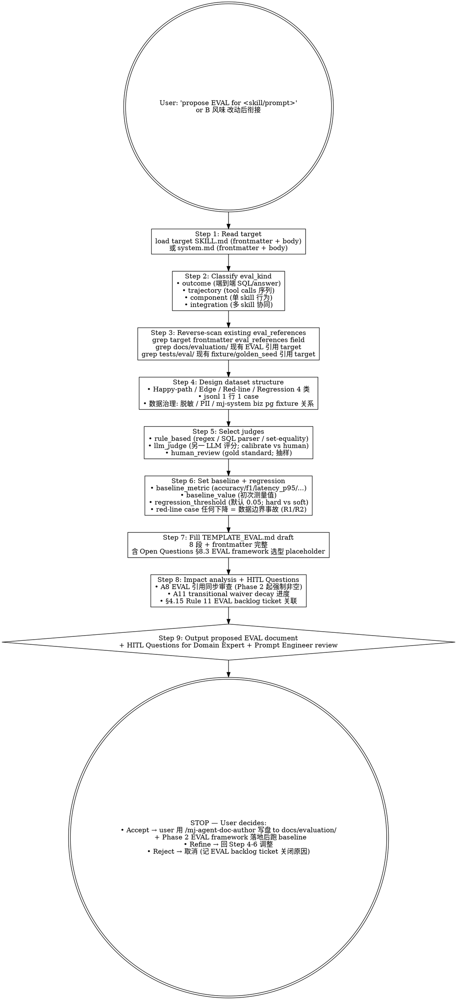

# mj-agent Runtime — EVAL Baseline

## Overview

**Read-only by design**：propose EVAL baseline design（填好的 `TEMPLATE_EVAL.md` 草稿）for mj-agent in-source canonical change（src/mj_agent/skills/<name>/SKILL.md 或 src/mj_agent/prompts/system.md）；user 接受后才写盘到 `docs/evaluation/`。这是 mj-agent **Track B in-source canonical 配套 EVAL 守门人** skill，per ADR-015 §决策点 4 runtime 硬约束 + HITL_Prompt §3.1 必停 10/13（runtime-skill-content-change / prompt-version-bump）+ §4.7 Rule 9（B 风味永远 HITL）+ §4.15 Rule 11（PR merge 后 EVAL backlog ticket 自动开单）+ Agent_Side v1.1 §4 + §7.1 A8/A11（transitional waiver；Phase 2 EVAL framework 落地后强制）。

**Why this skill exists**：

- src/mj_agent/skills/**/SKILL.md body 与 prompts/system.md 改动 → silent failure 风险（错答案 / 幻觉 / 业务漂移）；EVAL 是唯一可量化捕获手段
- A11 transitional waiver decay：Phase 2 EVAL framework 落地后，state: active 的 SKILL/PROMPT 必须有非空 `eval_references`；本 skill 帮 B 风味改动方在 PR review 前就把 EVAL 草稿就绪
- TEMPLATE_EVAL.md（Phase D PR-D1 落地）8 段 + 4 子类（outcome/trajectory/component/integration）+ 3 judge 类型（rule_based / llm_judge / human_review）—— 选什么子类、什么 judge、baseline metric 量级、regression threshold 选 0.05 还是其他，需要按 target 量身设计
- §4.15 Rule 11：merge 后自动开 EVAL backlog ticket，但"开单"不等于"已设计"——本 skill 把 ticket 转化为可 review 的 EVAL 草稿
- Phase 2 EVAL framework 选型（pytest-based vs 独立 runner / judge model 选什么 / run frequency）尚未决议；**本 skill 框架无关**：只产生 TEMPLATE_EVAL.md 文档草稿，框架决议落地后由 PR-D2-enforcement 跑实际测试

**hard constraint**: 本 skill 永远不直接调用 Edit/Write 到 `docs/evaluation/` 或 `tests/eval/`；不直接 run pytest tests/eval；不修改任何 in-source canonical（src/mj_agent/skills/**/SKILL.md / prompts/system.md / biz_catalog/qcm_catalog.yaml）。仅产生 proposed EVAL document（基于 TEMPLATE_EVAL.md 8 段填空版）+ HITL Questions for Domain Expert + Prompt Engineer review；user 接受后用 /mj-agent-doc-author 写盘。

## When to Use

**MUST run when**：

- 用户在 Stage 8 (B-flavor) Implementation 后要为本次 in-source canonical 改动设定 EVAL baseline
- 用户提到 "propose EVAL / EVAL baseline / set EVAL / A11 EVAL 准备 / transitional waiver decay / TEMPLATE_EVAL fill-in / B 风味 EVAL 准备"
- /mj-agent-runtime-skill-doc-improve 或 /mj-agent-runtime-prompt-version-bump propose diff 后 user 接受 → 自然衔接到本 skill
- HITL_Prompt §4.15 Rule 11 EVAL backlog ticket 触发后，要从"开单"推进到"草稿就绪"
- Phase 2 EVAL framework 落地（PR-D2-enforcement 启动）前，把现有 9 个 in-source SKILL + system.md 的 eval_references 草稿先备齐

**MAY skip when**：

- 仅 frontmatter typo（如 owner 字段拼写）→ 不触 §3.1 必停，不需要新 baseline
- 仅 markdown formatting（缩进 / 空格）—— substantive change rule 不触 `updated`，不需要新 baseline
- target 已有 active EVAL 且 baseline_value 仍在 regression_threshold 内 → 重用现有 EVAL，不开新

**MUST NOT use for**：

- ❌ 直接 run pytest / 跑实际 EVAL（read-only by design 硬约束；EVAL framework 落地由 PR-D2-enforcement）
- ❌ 直接 Edit docs/evaluation/ 写盘（read-only by design）
- ❌ 改 src/mj_agent/skills/**/SKILL.md → /mj-agent-runtime-skill-doc-improve
- ❌ 改 system.md → /mj-agent-runtime-prompt-version-bump
- ❌ 改 qcm_catalog.yaml → /mj-agent-runtime-biz-catalog-sync
- ❌ 设计 / 决议 EVAL framework 选型本身（pytest-based vs 独立 runner，judge model 选什么）→ PR-D2-enforcement 工作；本 skill 框架无关
- ❌ 改 .claude/skills/SKILL.md（engineering-workflow track；不同 schema）→ /mj-agent-doc-author

## Workflow（Read-only）



## Step 1: Read Target

```python
# Track B in-source canonical (frontmatter + body)
from mj_agent.skills import load_skill, load_skill_meta
from mj_agent.prompts import load_prompt, load_prompt_meta

# Skill case
meta = load_skill_meta("biz-domain-context")
body = load_skill("biz-domain-context")

# Prompt case
meta = load_prompt_meta("system")
body = load_prompt("system")
```

或直接 Read tool 读 `src/mj_agent/skills/<name>/SKILL.md` / `src/mj_agent/prompts/system.md`（含 frontmatter + body；本 skill 自己解析 eval_references / version / 五段式各段）。

## Step 2: Classify eval_kind

| eval_kind | 适用场景 | mj-agent 例 | 推荐 judge |
|---|---|---|---|
| **outcome** | 仅评估最终输出（SQL / answer / 业务结论） | "用户问最近 7 天查询量趋势 → 期望 SQL 含 stat_date >= 7d 谓词" | rule_based（SQL parser）+ human_review |
| **trajectory** | 评估 tool calls 序列 / 决策路径 | "用户问 biz_dws 表 → 期望 trajectory: find_biz_context → list_biz_tables（不直接 execute_sql）" | rule_based（trajectory diff）+ llm_judge |
| **component** | 评估某 SKILL / PROMPT body 单点行为，不端到端 | "biz-domain-context skill body 五段式 Common patterns 是否含 dim_xxx 表 example" | rule_based（grep）+ human_review |
| **integration** | 评估跨 skill / 跨 stage 协同 | "Studio probe H1/H2/H3 全套通过率（多 skill 协同）" | rule_based + llm_judge + human_review（叠加） |

**输出**：选 1-2 个子类（可叠加）；说明理由。

## Step 3: Reverse-Scan Existing eval_references

```bash
# 1. target frontmatter eval_references
grep -A5 "^eval_references:" src/mj_agent/skills/<name>/SKILL.md
grep -A5 "^eval_references:" src/mj_agent/prompts/system.md

# 2. docs/evaluation/ 是否已有 EVAL 引用 target
grep -r "target_skill: <name>" docs/evaluation/ 2>/dev/null
grep -r "target_skill: \"<name>\"" docs/evaluation/ 2>/dev/null

# 3. tests/eval/ 现有 fixture
ls tests/eval/*.json* tests/eval/*.py 2>/dev/null
grep -r "<name>" tests/eval/ 2>/dev/null

# 4. golden_seed.jsonl 关系
test -f tests/eval/golden_seed.jsonl && head -3 tests/eval/golden_seed.jsonl
```

输出每条命中：file:line + 引用内容；判断是新设计 EVAL 还是扩展现有 EVAL。

## Step 4: Design Dataset Structure

按 TEMPLATE_EVAL.md §3.2 4 类样本：

| 类别 | 数量建议 | 来源 | mj-agent 专属考虑 |
|---|---|---|---|
| **Happy-path** | 10-30 | 手工编写 / 真实分析师问题（脱敏） | 含 biz_dws 9 表覆盖 + biz_dwd 2 白名单表 |
| **Edge cases** | 5-15 | 已知 bug fix / corner cases | biz_catalog drift 后的 dim_xxx 命中边界 |
| **Red-line（mj-agent 专属）** | 5-10 | R1 biz_ods 拒绝 / R2 导出全部 / SQL guardrail 越界尝试 | **必须包含**；任何 red-line 退步 = 数据边界事故 |
| **Regression** | 累计（每个历史 incident +1） | 历史 incident 复现 | POSTMORTEM 文档关联 |

**dataset_path**：`docs/evaluation/datasets/<filename>.jsonl`（per TEMPLATE_EVAL §3.1）

**数据治理**（per TEMPLATE_EVAL §3.3）：
- 脱敏：dataset 含真实业务问题时必脱敏（去除 tenant 名 / 真实 institution_id / 个人信息）
- PII：mj-agent 不应处理 PII；dataset 不含
- mj-system biz pg 数据样本（如 fixture 需要）：仅在 dev profile 跑；不在 prod 上跑（per ADR-006/008）
- golden_seed.jsonl 关系：`tests/eval/golden_seed.jsonl` 是 reference_sql 集合，可作 EVAL 输入子集

## Step 5: Select Judges

按 TEMPLATE_EVAL.md §4：

| Judge | 适用 eval_kind | 可靠度 | 速度 | mj-agent 推荐 |
|---|---|---|---|---|
| **rule_based** | outcome（exact）/ component | 高（确定性） | 快 | SQL parser（sqlglot AST）/ regex / set-equality；mj-agent 必选基础 |
| **llm_judge** | outcome（fuzzy）/ trajectory / integration | 中（需校准） | 中 | 用 deepseek-v3（model_binding）或 stronger judge model（待 PR-D2 决议） |
| **human_review** | outcome（subjective）/ integration | 高（gold standard） | 慢 | 抽样 ≥10% cases；Domain Expert 评分 |

**推荐叠加**：mj-agent 高风险场景（red-line / B 风味 active 改动）应至少 2 judge 类型互补，最佳 3 类全开。

**校准（如用 llm_judge）**：跑 ≥20-shot calibration on representative sample vs human grading；不同 judge 输出冲突时优先级：human_review > rule_based > llm_judge。

**Judge prompt template**（per TEMPLATE_EVAL §4.2）：填写时保留对 mj-agent 数据边界（ADR-006/009）的安全打分维度。

## Step 6: Set Baseline + Regression

### baseline_metric

按 target 性质选：

| target 性质 | 推荐 metric |
|---|---|
| outcome eval_kind, SQL 正确性 | accuracy（exact match 后 normalized）+ pass_rate |
| trajectory eval_kind | trajectory_match_rate / step_F1 |
| component eval_kind | component_pass_rate（rule_based gate 通过率） |
| integration eval_kind, Studio 矩阵 | suite_pass_rate / latency_p95 |
| LLM 输出质量 | custom_judge_score（1-5 平均） |

### baseline_value

**注意**：本 skill 不跑实际 EVAL，所以 baseline_value 只能填 placeholder（`<TBD; Phase 2 EVAL framework 落地后实测>`）；user 接受后跑实测填回。Phase D PR-D2-enforcement 启动后由 EVAL framework 自动测量。

### regression_threshold

| 风险等级 | 默认 threshold |
|---|---|
| Low（普通 SKILL 单段优化） | 0.05（绝对） |
| Medium（system.md hard rule 改） | 0.03（绝对） |
| High / red-line case | 0（任何下降都阻断 = 数据边界事故；hard regression） |

### Hard vs Soft regression（per TEMPLATE_EVAL §6.2）

- **Hard**：metric 下降 ≥ threshold 或 red-line case 通过率下降 → 阻断 PR / 触 §3.1 必停 HITL
- **Soft**：metric 下降 < threshold 但 > 0 / latency 上升但 outcome 不变 → WARN，可 user override

## Step 7: Fill TEMPLATE_EVAL.md Draft

复制 `docs/_templates/TEMPLATE_EVAL.md`（Phase D PR-D1 落地）填入：

```yaml
---
type: eval
domain: EVAL
summary: <20-60 字摘要：本 EVAL 评估 <target>，采用 <eval_kind>，baseline=<placeholder>>
tags: [eval]
created: <today>
updated: <today>
state: draft
version: v1.0
track: agent
derives_from: ""
owner: <Domain Expert + Prompt Engineer>
eval_kind: <Step 2 选定>
target_skill: <Step 1 target name>
dataset_path: docs/evaluation/datasets/<filename>.jsonl
baseline_metric: <Step 6 选定>
baseline_value: 0.0  # placeholder; Phase 2 EVAL framework 落地后实测
regression_threshold: <Step 6 选定>
judges: [<Step 5 选定 list>]
---
```

8 段 body 填空（per TEMPLATE_EVAL.md §1-§8），重点关注：
- §1.3 eval_kind 4 子类 选择理由（Step 2 输出）
- §3.2 样本规模 + 来源（Step 4 输出）
- §4.1-§4.3 Judge 类型 + prompt + 校准（Step 5 输出）
- §5.3 Baseline 测量条件（model_binding / SKILL.md version / biz pg state 紧耦合）
- §6 hard vs soft regression（Step 6 输出）
- §8.3 EVAL framework 选型 Open Questions（pytest-based vs 独立 runner / judge model / run frequency；占位 PR-D2-enforcement 决议）

**filename**：`docs/evaluation/<eval_kind>_<target_name>_v1.0.md`（如 `outcome_biz-domain-context_v1.0.md`）

## Step 8: Impact Analysis + HITL Questions

```markdown
## Impact Analysis

- **A8 EVAL 引用同步审查**（per Agent_Side v1.1 §7.1 A8）：target 的 eval_references frontmatter field 应在本 EVAL 写盘后 append 本文件路径
- **A11 transitional waiver decay 进度**：当前 transitional / Phase 2 强制；本 EVAL 落地推进 1 个 target 进入 active EVAL coverage
- **§4.15 Rule 11 EVAL backlog ticket**：merge 后自动开的 issue → 关联本 EVAL；issue 应 close 当 baseline_value 实测填回 active state
- **Phase 2 EVAL framework 选型 unblock**：本 EVAL 草稿 dataset / judge prompt / regression criteria 框架无关；framework 选型决议（PR-D2-enforcement）后即可挂上跑
- **关联 SKILL/PROMPT version**：target 的 frontmatter `version` 字段应同步 bump（per ADR-011）；如未 bump → propose 同步 bump 建议
- **关联 SPEC/RUNBOOK**：如本 EVAL 由某 SPEC 触发 → 在 §1.2 关联

## HITL Questions（Domain Expert + Prompt Engineer review；per HITL_Prompt §3.3 7-段格式）

问题 1: eval_kind 选择 + 子类叠加是否合理？
- 当前观察：选了 <list>
- 不确定点：是否需要再叠加 <候选>
- 为什么重要：选错子类 → judge 选不对 → 假阳性 / 假阴性
- 可选方案：A. 仅 outcome；B. outcome + component；C. 4 类全开
- 我的建议：<具体>
- 默认假设：<具体>
- 是否必须等待人工确认：是

问题 2: red-line case 数量 + 设计是否覆盖 mj-agent 数据边界（R1 biz_ods 拒绝 / R2 导出全部 / SQL guardrail 越界）？
- 当前观察：设计了 N 条 red-line case
- 不确定点：是否漏 ADR-006 4 层中的某层 / ADR-009 biz 域边界
- 为什么重要：red-line 任何退步 = 数据边界事故（不是普通 regression）
- 可选方案：...
- ...

问题 3: judge 选择（rule_based / llm_judge / human_review 叠加）+ judge prompt 校准方法
- ...

问题 4: regression_threshold 量级（0.05 vs 0.03 vs 0）+ Hard vs Soft 分界
- ...
```

## Step 9: Output Proposed EVAL Document + HITL

输出 STOP at this step — **不**自动调用 /mj-agent-doc-author 写盘。等 user：

- **Accept** → user 复制 EVAL 文档 → 用 /mj-agent-doc-author 写盘到 `docs/evaluation/<filename>.md` → 同步 update target frontmatter `eval_references` field（用 /mj-agent-runtime-skill-doc-improve 或 /mj-agent-runtime-prompt-version-bump propose diff 路径，避免直接 Edit src/）
- **Refine** → 回 Step 4-6 调整
- **Reject** → 取消，记录 review notes（可选写到 plans/[INTAKE]_*.md 或 EVAL backlog ticket close 原因）

## Output Format

```markdown
## EVAL Baseline Report — <target name>

### Target
- File: src/mj_agent/skills/<name>/SKILL.md 或 src/mj_agent/prompts/system.md
- Current frontmatter: state=<state>, version=<version>, eval_references=<list 或 TODO>
- Body 五段式 quality（如 SKILL）/ hard rule 数量（如 system.md）: <briefly>

### eval_kind 分类
| Kind | 选 ✓ | 理由 |
|---|---|---|
| outcome | ✓/✗ | <具体> |
| trajectory | ✓/✗ | <具体> |
| component | ✓/✗ | <具体> |
| integration | ✓/✗ | <具体> |

### Reverse Scan
- target frontmatter eval_references: <现状>
- docs/evaluation/ 现有引用 target: <命中清单>
- tests/eval/ 现有 fixture: <清单>
- golden_seed.jsonl 关系: <如适用>

### Dataset Design
| 类别 | 计划数量 | 来源 | mj-agent 专属考虑 |
|---|---|---|---|
| Happy-path | <N> | <source> | <biz_dws/biz_dwd 表覆盖度> |
| Edge cases | <N> | <source> | <具体> |
| **Red-line（必含）** | <N> | <source> | <R1/R2/guardrail 覆盖> |
| Regression | <N> | <POSTMORTEM 关联> | <具体> |

dataset_path: docs/evaluation/datasets/<filename>.jsonl

### Judge Selection
| Judge | 选 ✓ | 适用 case | 校准方法 |
|---|---|---|---|
| rule_based | ✓/✗ | <具体> | <SQL parser / regex 等> |
| llm_judge | ✓/✗ | <具体> | <model + N-shot calibration> |
| human_review | ✓/✗ | <具体> | <Domain Expert 抽样 % > |

### Baseline + Regression
- baseline_metric: <选定>
- baseline_value: <TBD; Phase 2 EVAL framework 落地后实测>
- regression_threshold: <0.05 / 0.03 / 0> (<理由>)
- Hard regression cases: <list>
- Soft regression cases: <list>

### Proposed EVAL Document（DRAFT）

filename: docs/evaluation/<eval_kind>_<target_name>_v1.0.md

[填好的 TEMPLATE_EVAL.md 8 段 + frontmatter — full content here]

### Impact Analysis
<per Step 8>

### HITL Questions
<per Step 8 7-段格式>

### Next Action（HITL pause）
- ☐ Domain Expert + Prompt Engineer review
- ☐ User accept → /mj-agent-doc-author 写盘 to docs/evaluation/<filename>.md
- ☐ User accept → 同步 propose target frontmatter eval_references update（via /mj-agent-runtime-skill-doc-improve / -prompt-version-bump）
- ☐ Phase 2 EVAL framework 落地后跑 baseline 实测（PR-D2-enforcement）
- ☐ Refine → 调 Step 4-6
- ☐ Reject → 关联 EVAL backlog ticket close 原因
```

## What This Skill DOES NOT DO

- ❌ **不直接调用 Edit / Write 到 docs/evaluation/ 或 tests/eval/**（read-only by design 硬约束；ADR-015 §决策点 4）
- ❌ 不直接 run pytest tests/eval（不跑实际 EVAL；Phase 2 EVAL framework 落地由 PR-D2-enforcement）
- ❌ 不修改 in-source canonical（src/mj_agent/skills/**/SKILL.md / prompts/system.md / biz_catalog/qcm_catalog.yaml）—— 这是 sibling runtime-* skill 工作
- ❌ 不设计 / 决议 EVAL framework 选型（pytest-based vs 独立 runner / judge model / run frequency）—— 那是 PR-D2-enforcement 工作；本 skill 框架无关
- ❌ 不修改 .claude/skills/SKILL.md → /mj-agent-doc-author（不同 track + schema）
- ❌ 不自动 commit（HITL 后由 /mj-agent-git-commit）
- ❌ 不替代 Domain Expert + Prompt Engineer review（仅产生 review 材料）
- ❌ 不取代 §4.15 Rule 11 自动开单（本 skill 是开单后 → 草稿就绪 阶段）

## Sub-skill / Tool Calls

| Tool | 用途 |
|---|---|
| Read | Step 1 读 target SKILL.md / system.md（含 frontmatter） |
| Bash `python -c "from mj_agent.skills import load_skill_meta; ..."` | Step 1 通过 loader API（带 frontmatter strip） |
| Grep | Step 3 反向扫描 eval_references / docs/evaluation/ / tests/eval/ |
| Bash `ls tests/eval/`, `head -3 tests/eval/golden_seed.jsonl` | Step 3 现有 fixture / golden_seed 现状 |
| AskUserQuestion | Step 9 HITL Questions（Domain Expert + Prompt Engineer review） |

> **不**调用 Edit / Write（read-only by design）。
> **不**调用 pytest / EVAL runner（不跑实际 EVAL）。

## Reference Files

- [[../../../docs/_templates/TEMPLATE_EVAL|TEMPLATE_EVAL.md]]（Phase D PR-D1 落地；本 skill 直接消费此模板填空）
- [[../../../docs/adr/[ADR]_015_HITL_Prompt_v1_0_Derivation|ADR-015]] §决策点 4（runtime 类目硬约束 — 本 skill 是该约束的 reference 实现，第 4 个 runtime-* 兄弟）+ §决策点 5（EVAL backlog ticket auto-issue §4.15 Rule 11）
- [[../../../docs/rule/[STANDARD]_MJ_Agent_AI_Engineering_Execution_HITL_Prompt_v1.0|HITL_Prompt v1.0]] §3.1 必停 10/13（runtime-skill-content-change / prompt-version-bump 触发本 skill）+ §4.7 Rule 9（B 风味永远 HITL）+ §4.13（regression 处理）+ §4.15 Rule 11（EVAL backlog ticket auto-issue）
- [[../../../docs/rule/[STANDARD]_MJ_Agent_Agent_Side_Documentation_Framework_v1.1|Agent_Side v1.1]] §4（EVAL authoring；本 skill 落地的源依据）+ §7.1 A8/A11（EVAL 引用同步审查；transitional waiver decay 进度）
- [[../../../docs/adr/[ADR]_006_Fail_Safe_Reads|ADR-006]] / [[../../../docs/adr/[ADR]_009_Biz_Domain_As_Primary_Data_Source|ADR-009]]（数据边界；red-line case 设计依据 R1/R2 + 4 层 guardrail）
- [[../../../docs/adr/[ADR]_011_Doc_Versioning_And_Archive_Convention|ADR-011]]（version bump + archive workflow；EVAL 自身 versioning + target version 紧耦合）
- 兄弟 read-only-by-design skills:
  - [[../mj-agent-runtime-skill-doc-improve/SKILL|mj-agent-runtime-skill-doc-improve]]（B 风味 SKILL 改动 → 衔接本 skill）
  - [[../mj-agent-runtime-prompt-version-bump/SKILL|mj-agent-runtime-prompt-version-bump]]（system.md 改动 → 衔接本 skill）
  - [[../mj-agent-runtime-biz-catalog-sync/SKILL|mj-agent-runtime-biz-catalog-sync]]（qcm_catalog.yaml 改动 → 通常不直接触本 skill；除非 SKILL.md 同步引用 dim_xxx 改动）
- src/mj_agent/skills/{biz-domain-context,qcm-analysis,safe-sql-analysis,query-writing,query-optimization,monthly-report,probe-fixture,biz-schema-exploration,mj-ddd-semantics}/SKILL.md（9 现有 in-source SKILL；本 skill 服务对象）
- src/mj_agent/prompts/system.md（system prompt；本 skill 服务对象）
- tests/eval/golden_seed.jsonl（reference_sql 集合；可作 EVAL 输入子集）

## Anti-patterns

- ❌ **永远不直接 Edit docs/evaluation/ 或 tests/eval/**（read-only by design；违反此约束 = 违反 ADR-015 §决策点 4）
- ❌ 不跑实际 EVAL（pytest tests/eval / 自定义 runner）—— 那是 PR-D2-enforcement 工作；本 skill 是 framework-independent 设计阶段
- ❌ 不跳过 Step 3 反向扫描（缺这步 → 重复设计 EVAL / 漏覆盖现有 fixture）
- ❌ 不跳过 Step 8 Impact Analysis（缺这步 → reviewer 没法判定 baseline 量级 + threshold 合理性）
- ❌ 不在 dataset 加 PII / 真实 tenant 信息 / 真实 institution_id（即便是 propose draft 也不能；reviewer 看到时仍是泄露）
- ❌ 不 propose baseline_value 实数（read-only；只能填 `<TBD>` placeholder；实测在 PR-D2-enforcement 跑）
- ❌ 不 propose 修改 EVAL framework 选型（pytest-based vs 独立 runner / judge model / run frequency 是 PR-D2-enforcement 决议；本 skill 在 §8.3 Open Questions 仅占位）
- ❌ 不替代 Domain Expert + Prompt Engineer review（人工评分 / red-line case 设计 / judge prompt 校准必须 expert review）
- ❌ 不替代 §4.15 Rule 11 EVAL backlog auto-issue（本 skill 在 issue 之后；issue close 条件是 baseline_value 实测进 active state）

## Handoff

```
Proposed EVAL Document 已输出（HITL pause）。
HITL 通过后：
- /mj-agent-doc-author（带 Q-B1 mj-agent 专属节点；选 docs/evaluation/<filename>.md 路径）正式写盘
- 同步 propose target frontmatter eval_references update：
  - 如 target = SKILL → /mj-agent-runtime-skill-doc-improve 跑 Step 4 frontmatter 段（避免直接 Edit src/）
  - 如 target = system.md → /mj-agent-runtime-prompt-version-bump 跑 frontmatter 段
- /mj-agent-flow-self-review (Stage 11) 自检
- /mj-agent-git-commit + /mj-agent-git-push + /mj-agent-git-pr
- PR description 注明：(a) §4.15 Rule 11 EVAL backlog ticket 关联 close 条件；(b) Phase 2 EVAL framework 落地后跑 baseline 实测计划
- Phase 2 EVAL framework 落地（PR-D2-enforcement）后由该 PR / framework runner 自动跑 baseline_value 实测 → state: draft → state: active → A11 transitional waiver decay 推进 1 个 target
```
