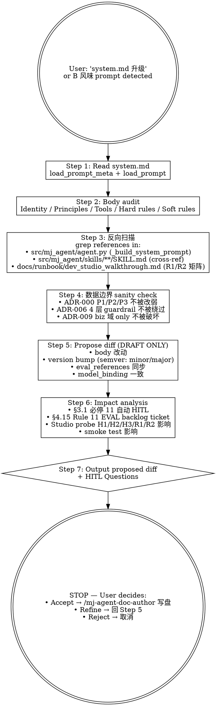

# mj-agent Runtime — Prompt Version Bump

## Overview

**Read-only by design**：propose diff + version bump 走查 for `src/mj_agent/prompts/system.md`；user 接受后才写盘。这是 mj-agent 专属的 **Track B in-source PROMPT 守门人** skill，per ADR-015 §决策点 4 + HITL_Prompt §3.1 必停 11（prompt-version-bump）+ §4.7 Rule 9。

**Why this skill exists**：

- system.md body 字面注入每次 LLM 调用的 system prompt
- ADR-000 P1/P2/P3 数据边界原则在此实现 → 改一行可能破坏数据治理
- ADR-006 SQL guardrail 4 层中 L2 semantics 由 system.md + SKILL.md 共同实现
- version bump 必同步 eval_references；Phase D 起强制（A8 PROMPT EVAL coupling）

**hard constraint**: 本 skill 永远不直接调用 Edit/Write 到 `src/mj_agent/prompts/system.md`。仅 propose diff + version 升级建议 + impact analysis。

## When to Use

**MUST run when**：

- 用户要改 / 升级 / 优化 mj-agent system prompt（src/mj_agent/prompts/system.md）
- 用户提到"system.md 升级 / prompt version bump / 升 v1.7 → v1.8"
- ADR-000 P1/P2/P3 数据边界原则有调整
- system.md 现有 hard rule 要紧 / 放宽（如 v1.3 收紧 R1/R2 行为）
- HITL_Prompt §4.7 Stage 8 B 风味识别后系统提示改动

**MAY skip when**：

- 仅 frontmatter typo（owner 字段拼写）→ /mj-agent-doc-author（不动 body 不触 §3.1 必停）
- 仅注释（comment）小修

**MUST NOT use for**：

- ❌ 直接 Edit src/mj_agent/prompts/system.md（read-only by design 硬约束）
- ❌ 改 SKILL.md → `/mj-agent-runtime-skill-doc-improve`
- ❌ 改 qcm_catalog.yaml → `/mj-agent-runtime-biz-catalog-sync`
- ❌ 新 prompt 创建（如 Phase 2 拆 system prompt）→ `/mj-agent-doc-author` + TEMPLATE_PROMPT.md

## Workflow（Read-only）



## Step 1: Read system.md

```python
# 通过 loader API（带 frontmatter strip）
from mj_agent.prompts import load_prompt, load_prompt_meta

meta = load_prompt_meta("system")     # frontmatter dict
body = load_prompt("system")           # body only (frontmatter stripped per §7.5)
```

或 Read tool 读 `src/mj_agent/prompts/system.md`。

记录当前 frontmatter：
- `version`: 当前 vX.Y
- `state`: active
- `model_binding`: deepseek-v3（默认）
- `token_budget_estimate`: 当前估值
- `eval_references`: list（A8 transitional waiver 期内可注释 TODO）
- `track`: agent

## Step 2: Body Audit（per Agent_Side §3）

system.md 典型段：

| 段 | 期望内容 |
|---|---|
| **Identity** | mj-agent 内部工具定位；不是公共服务 |
| **Data boundary principles** | ADR-000 P1（最小必要出网）/ P2（通道隔离）/ P3（工具中介） |
| **Tools at disposal** | catalog group（find_biz_context / list_biz_tables / describe_biz_table）+ SQL group（execute_sql）+ 默认调用顺序 |
| **execute_sql guardrails** | L1 regex 单语句 / SELECT-only / schema allowlist；L1b AST precheck（require_time_range / no_select_star / require_limit advisory）；statement_timeout 60s 中文友好提示 |
| **Result envelope** | executed_sql / columns / rows / row_count / truncated / statement_timeout_hit / business_summary / precheck_warnings |
| **Hard rules** | 不可访问 biz_ods（ADR-009）；不导出无界数据（ADR-000 P1）；biz_dwd 仅白名单 |
| **Soft rules / Style guidance** | 中文回答 / 业务摘要附同环比解读 / 反询场景识别 |

**审计输出**：
- ✅ 段齐全 + 与 ADR-000/006/009 一致
- ⚠️ 段缺失（建议补）
- ❌ 与硬约束冲突（必须修）

## Step 3: 反向扫描

```bash
# 1. agent.py _build_system_prompt 是否拼装 system.md
grep "_build_system_prompt\|system.md" src/mj_agent/agent.py

# 2. SKILL.md 是否引用 system.md hard rules
grep -r "system.md\|hard rule\|ADR-000\|P1\|P2\|P3\|ADR-006" src/mj_agent/skills/

# 3. dev_studio_walkthrough §4 H1/H2/H3/R1/R2 矩阵是否捕获本 prompt 行为
grep "H1\|H2\|H3\|R1\|R2\|system.md v" docs/runbook/dev_studio_walkthrough.md

# 4. ADR / SPEC 是否引用本 prompt
grep -r "system.md\|system prompt" docs/adr/ docs/design/
```

输出每条命中：file:line + 引用内容。

## Step 4: 数据边界 Sanity Check（mj-agent 专属硬约束）

**必检**（任一 fail = HITL High，禁止 promote）：

| Check | 期望 | Fail 处理 |
|---|---|---|
| ADR-000 P1 最小必要出网 | system.md 含"反询无界导出"指引 | 改动若放宽此规则 → HITL High，必须 ADR review |
| ADR-000 P2 通道隔离 | system.md 含"DB 通道与 LLM 通道分离"指引 | 同上 |
| ADR-000 P3 工具中介 | system.md 不允许 LLM 直接构造 raw SQL 跳过 guardrail | 同上 |
| ADR-006 4 层 guardrail | system.md L2 semantics 段提示 LLM 不绕过 L1/L1b/L4 | 同上 |
| ADR-009 biz 域 only | system.md 含"不访问 biz_ods / biz_ads / ops_*" hard rule | 同上 |
| biz_dwd allowlist | system.md 含 "biz_dwd 仅 dwd_dim_product_interface / dwd_dim_institution" | 同上 |
| `statement_timeout` 60s 提示 | system.md 含"超时友好中文提示"指引 | 同上 |

如任一 fail → 立即 STOP；输出"violates ADR-XXX 数据边界硬约束 — 不允许放宽"+ HITL High pause。

## Step 5: Propose Diff（DRAFT only）

### Body 改动建议

```markdown
## Proposed Diff for src/mj_agent/prompts/system.md

\`\`\`diff
@@ -L,N +L,N @@
- <旧 line>
+ <新 line>
\`\`\`

### Rationale
- <为什么改>
- <影响范围>
- <预期 LLM 行为变化>
- <Studio probe H1/H2/H3/R1/R2 矩阵预期变化>
```

### Version Bump（semver）

| 改动性质 | bump | 例 |
|---|---|---|
| Patch（拼写 / 注释 / 排版）| **不**bump（per substantive change rule） | 仅刷新 `updated` field |
| Minor（hard rule 调整 / 新增 soft rule / 风格变化） | minor: v1.7 → v1.8 | 如 v1.3 收紧 R1/R2 |
| Major（重写 system prompt 架构 / 数据边界变更） | major: v1.x → v2.0 | 罕见；通常需 ADR |

### Frontmatter Updates

```yaml
version: <bumped>
updated: <YYYY-MM-DD>
eval_references:
  - "[EVAL]_..."   # Phase D 起强制；当前 transitional waiver 可写 ["TODO Phase 2"]
model_binding: deepseek-v3   # 跨模型升级时 bump
token_budget_estimate: <new estimate>   # 显著变化时更新
```

## Step 6: Impact Analysis

```markdown
## Impact Analysis

- **Stage 8 B 风味触发**：本改动是 in-source PROMPT body 修改 → §3.1 必停 11 强制 HITL
- **EVAL backlog ticket auto-issue**：per HITL_Prompt §4.15 Rule 11，PR merge 后自动开
- **Studio probe 影响**：
  - H1（biz_dws 表查询）：<预期保持/变化>
  - H2（最近 7 天趋势）：<预期>
  - H3（Top 10 机构月度）：<预期>
  - **R1（biz_ods 拒绝）**：<必保不弱化；如改动触此线 → STOP HITL High>
  - **R2（导出全部数据）**：<必保 0-call 反询；如改动触此线 → STOP HITL High>
- **smoke test 影响**：<list affected smoke 用例>
- **A8 PROMPT EVAL 引用**：<当前 transitional waiver；frontmatter eval_references 注释 TODO 或 Phase D 起强制非空>

## HITL Questions（Domain Expert + Prompt Engineer review）

参 HITL_Prompt §3.3 7-段格式：

问题 1: <方案 / 风险 / 边界>
- 当前观察：
- 不确定点：
- 为什么重要：
- 可选方案：A. / B. / C.
- 我的建议：
- 默认假设：
- 是否必须等待人工确认：是
```

## Step 7: Output（HITL pause）

输出 STOP — 不自动写盘。等 user 决定：

- **Accept** → /mj-agent-doc-author（带 Q-B1 节点）写盘 → /mj-agent-flow-self-review Stage 11
- **Refine** → 回 Step 5
- **Reject** → 取消，记录 review notes

## Output Format

```markdown
## Prompt Version Bump Report — system.md

### Target
- File: src/mj_agent/prompts/system.md
- Current frontmatter: version=v1.7, state=active, model_binding=deepseek-v3, eval_references=<list 或 TODO>
- Body audit: <段齐全？><与 ADR-000/006/009 一致性>

### Body Audit
| 段 | 状态 | 评级 | 备注 |
|---|---|---|---|
| Identity | ✅/⚠️/❌ | A/B/C | <具体> |
| Data boundary (ADR-000) | ... | ... | ... |
| Tools at disposal | ... | ... | ... |
| execute_sql guardrails | ... | ... | ... |
| Result envelope | ... | ... | ... |
| Hard rules | ... | ... | ... |
| Soft rules / Style | ... | ... | ... |

### Reverse Scan
- agent.py _build_system_prompt: <命中行号 / 集成方式>
- SKILL.md cross-ref: <命中清单>
- dev_studio_walkthrough §4: <R1/R2 矩阵 cited>
- ADR / SPEC cross-ref: <命中清单>

### 数据边界 Sanity Check
| Check | Status | Notes |
|---|---|---|
| ADR-000 P1 | ✅/❌ | ... |
| ADR-000 P2 | ✅/❌ | ... |
| ADR-000 P3 | ✅/❌ | ... |
| ADR-006 4 layer | ✅/❌ | ... |
| ADR-009 biz 域 only | ✅/❌ | ... |
| biz_dwd allowlist | ✅/❌ | ... |
| statement_timeout 60s | ✅/❌ | ... |

### Proposed Diff
<unified diff>

### Frontmatter Proposed Updates
- version: v1.7 → v1.8（minor; <reason>）
- updated: <date>
- eval_references: <如适用>
- model_binding: <如适用>
- token_budget_estimate: <如适用>

### Impact Analysis
<per Step 6；含 Studio probe matrix>

### HITL Questions
<per Step 6；Domain Expert + Prompt Engineer review pending>

### Next Action（HITL pause）
- ☐ Domain Expert + Prompt Engineer review
- ☐ User accept → /mj-agent-doc-author 写盘
- ☐ Refine → 调 Step 5
- ☐ Reject → 取消
```

## What This Skill DOES NOT DO

- ❌ **不直接调用 Edit / Write 到 src/mj_agent/prompts/system.md**（read-only by design 硬约束；ADR-015 §决策点 4）
- ❌ 不修改 SKILL.md → /mj-agent-runtime-skill-doc-improve
- ❌ 不修改 qcm_catalog.yaml → /mj-agent-runtime-biz-catalog-sync
- ❌ 不修改 src/mj_agent/agent.py / tools/ / integrations/ / config.py（A 风味，纯代码）
- ❌ 不替代 Studio probe（仅 Impact analysis 列预期；实际探针由 /mj-agent-infra-studio-probe）
- ❌ 不跑 EVAL（待 Phase D `/mj-agent-runtime-eval-baseline`）
- ❌ 不自动 commit（HITL 后由 /mj-agent-git-commit）
- ❌ 不放宽 ADR-000 / ADR-006 / ADR-009 数据边界（任一 fail = HITL High，禁止 promote）

## Sub-skill / Tool Calls

| Tool | 用途 |
|---|---|
| Read | Step 1 读 system.md / Step 3 反向扫描 |
| Bash `python -c "from mj_agent.prompts import load_prompt_meta; ..."` | Step 1 通过 loader API |
| Grep | Step 3 反向扫描 |
| AskUserQuestion | Step 7 HITL Questions |

> **不**调用 Edit / Write（read-only by design）。

## Reference Files

- [[../../../docs/adr/[ADR]_015_HITL_Prompt_v1_0_Derivation|ADR-015]] §决策点 4（runtime 类目硬约束）
- [[../../../docs/rule/[STANDARD]_MJ_Agent_AI_Engineering_Execution_HITL_Prompt|HITL_Prompt v1.0]] §3.1 必停 11 + §4.7 Rule 9 + §4.15 Rule 11（EVAL backlog）
- [[../../../docs/rule/[STANDARD]_MJ_Agent_Agent_Side_Documentation_Framework|Agent_Side v1.1]] §3（PROMPT authoring：version / model_binding / token_budget_estimate / eval_references / supersedes）+ §7.3（frontmatter strip 契约）
- [[../../../docs/adr/[ADR]_000_Data_LLM_Boundary_Principles|ADR-000]]（P1/P2/P3 不可放宽）
- [[../../../docs/adr/[ADR]_006_Fail_Safe_Reads|ADR-006]]（4 层 guardrail）
- [[../../../docs/adr/[ADR]_009_Biz_Domain_As_Primary_Data_Source|ADR-009]]（biz 域 only）
- [[../../../docs/runbook/dev_studio_walkthrough|dev_studio_walkthrough]]（H1/H2/H3/R1/R2 矩阵；评估 system.md 改动行为变化）
- src/mj_agent/prompts/system.md（target file）
- src/mj_agent/prompts/__init__.py（load_prompt / load_prompt_meta API）
- src/mj_agent/agent.py:_build_system_prompt（system.md 拼装入口）

## Anti-patterns

- ❌ **永远不直接 Edit src/mj_agent/prompts/system.md**（read-only by design）
- ❌ 不放宽 ADR-000 P1/P2/P3 / ADR-006 4 层 guardrail / ADR-009 biz 域 only（必 HITL High + 必 ADR review）
- ❌ 不在 system.md body 加 hardcoded credentials / API keys（reviewer 看到时仍是泄露）
- ❌ 不跳过 Step 4 数据边界 sanity check（缺这步 review 会反复挑战）
- ❌ 不替代 Studio probe（仅 propose；实际验证 /mj-agent-infra-studio-probe）
- ❌ patch-only 改动 bump version（违反 substantive change rule；仅刷新 updated）
- ❌ minor / major bump 不同步 eval_references（A8 PROMPT EVAL coupling；Phase D 强制；当前 TODO 占位仍可接受）

## Handoff

```
Proposed Diff 已输出（HITL pause）。
HITL 通过后：
- /mj-agent-doc-author（带 Q-B1）写盘 → /mj-agent-flow-self-review Stage 11
- /mj-agent-infra-studio-probe 跑 H1/H2/H3/R1/R2 验证行为变化（mandatory for system.md changes）
- 如 SKILL.md 同步改：/mj-agent-runtime-skill-doc-improve
- PR description 含 §4.15 Rule 11 EVAL backlog ticket
- /mj-agent-git-commit + /mj-agent-git-push + /mj-agent-git-pr
```
