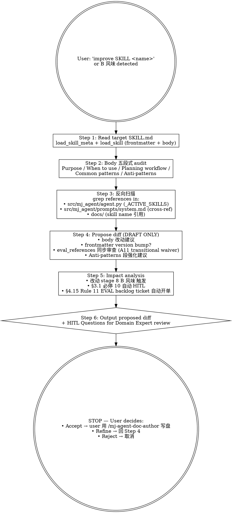

# mj-agent Runtime — SKILL Doc Improve

## Overview

**Read-only by design**：propose diffs for `src/mj_agent/skills/<name>/SKILL.md` body content；user 接受后才写盘。这是 mj-agent 专属的 **Track B in-source canonical 守门人** skill，per ADR-015 §决策点 4 runtime 类目硬约束 + HITL_Prompt §3.1 必停 10（runtime-skill-content-change）+ §4.7 Rule 9（B 风味永远 HITL）。

**Why this skill exists**：

- src/mj_agent/skills/**/SKILL.md body 是 LLM runtime 上下文的字面输入 —— 字面修改 = 行为修改
- Sliding "silent failure" 风险：错答案 / 幻觉 / 业务决策偏差
- 必须 Domain Expert + Prompt Engineer review，不能仅 SWE
- 自动化 Edit 难以校验语义正确（与代码不同，文档语义无 type checker）

**hard constraint**: 本 skill 永远不直接调用 Edit/Write 到 `src/mj_agent/skills/**`。仅产生 proposed diff + impact analysis，user 接受后用 /mj-agent-doc-author 或手动 Edit 落盘。

## When to Use

**MUST run when**：

- 用户要升级 / 改进 / 优化 mj-agent in-source SKILL.md（src/mj_agent/skills/<name>/SKILL.md body）
- 用户提到 "skill 五段式 / improve runtime SKILL / B 风味 / propose diff for SKILL"
- 用户要把 query-writing 类老 skill body 升级到 Agent_Side §2.1 五段式（Purpose / When to use / Planning workflow / Common patterns / Anti-patterns）
- HITL_Prompt §4.7 Stage 8 B 风味识别后

**MAY skip when**：

- 仅 frontmatter typo（如 owner 字段拼写）→ 直接 /mj-agent-doc-author 编辑（不动 body 不触 §3.1 必停）
- 仅 markdown formatting（缩进 / 空格）—— substantive change rule 不触 `updated`

**MUST NOT use for**：

- ❌ 直接 Edit src/mj_agent/skills/**/SKILL.md（read-only by design 硬约束）
- ❌ 改 system.md → `/mj-agent-runtime-prompt-version-bump`
- ❌ 改 qcm_catalog.yaml → `/mj-agent-runtime-biz-catalog-sync`
- ❌ 改 .claude/skills/SKILL.md（engineering-workflow track；不同 schema）→ `/mj-agent-doc-author`

## Workflow（Read-only）



## Step 1: Read Target SKILL.md

```python
# 通过 mj-agent loader API（带 frontmatter strip）
from mj_agent.skills import load_skill, load_skill_meta

meta = load_skill_meta("<skill-name>")     # frontmatter dict
body = load_skill("<skill-name>")           # body only (frontmatter stripped per §7.5)
```

或直接 Read tool 读 `src/mj_agent/skills/<name>/SKILL.md`（含 frontmatter + body；本 skill 自己解析）。

## Step 2: Body 五段式 Audit（per Agent_Side §2.1）

| 段 | 期望内容 | Audit 检查 |
|---|---|---|
| **Purpose** | 1-2 段，能力的目的；回答"这个 skill 在做什么" | 长度 100-300 字；不复述 frontmatter |
| **When to use** | 触发条件 / 用例 / 反例；为读 SKILL.md 的 LLM 提供"是否选用本 skill"判定依据 | 含正向触发 + 负向触发；具体场景 ≥3 |
| **Planning workflow** | 步骤思考 / 计划；让 LLM 在执行前先规划 | 编号步骤 ≥3；含决策点 |
| **Common patterns** | 典型模式 / 范例 / "黄金路径"；可含示例代码 / 输入输出 | ≥1 example；含真实 mj-agent 业务场景（如 biz_dws 表查询） |
| **Anti-patterns** | 应避免的错误模式；与 Common patterns 对照 | ≥3 反例；与 Common patterns 对位 |

**审计输出**：
- ✅ 段齐全 + 内容质量 OK
- ⚠️ 段缺失 / 内容偏弱（建议改进）
- ❌ 段错位 / 矛盾内容（必须修）

## Step 3: 反向扫描

```bash
# 1. agent.py 是否在 _ACTIVE_SKILLS 中加载本 skill
grep "<skill-name>" src/mj_agent/agent.py
# 期望命中（如 "biz-domain-context", "qcm-analysis", "safe-sql-analysis"）

# 2. system.md 是否有 cross-ref
grep "<skill-name>" src/mj_agent/prompts/system.md

# 3. docs/ 是否有 SKILL.md cited
grep -r "<skill-name>" docs/

# 4. 其他 SKILL.md 互相 cross-ref
grep -r "<skill-name>" src/mj_agent/skills/
```

输出每条命中：file:line + 引用内容；有命中说明改 body 也要同步改 cross-ref。

## Step 4: Propose Diff（DRAFT only）

### Body 改动建议

```markdown
## Proposed Diff for src/mj_agent/skills/<name>/SKILL.md

### Diff (unified format)

\`\`\`diff
@@ -L,N +L,N @@
- <旧 line>
+ <新 line>
\`\`\`

### Rationale

- <为什么改>
- <影响范围>
- <预期 LLM 行为变化>
```

### Frontmatter（如适用）

按 ADR-011 + Agent_Side §2 + Meta v2.1 §5：
- 实质改动 → bump `version`（如 v0.1 → v0.2 或 v0.1 → v1.0）
- `updated` field 刷新到当前日期
- `eval_references` field 同步审查（A11 transitional waiver；当前可注释 TODO；Phase D 起强制非空）

### Anti-patterns 段强化（B 风味专属）

mj-agent 专属硬约束（参 ADR-015 §决策点 4；本 skill 自己也含此约束）：

```markdown
## Anti-patterns

- ❌ Do NOT bypass biz_catalog（qcm_catalog.yaml）真实业务语义
- ❌ Do NOT 提示 LLM 用 SELECT * 或 跳过 require_time_range（违反 ADR-006 SQL guardrail）
- ❌ Do NOT 在 SKILL body 内嵌 hardcoded credentials / API key
- ❌ Do NOT 跨过 ADR-009 数据边界（仅 biz 域 + biz_dwd 白名单）
```

## Step 5: Impact Analysis

```markdown
## Impact Analysis

- **Stage 8 B 风味触发**：本改动是 in-source canonical body 修改 → §3.1 必停 10 强制 HITL
- **EVAL backlog ticket auto-issue**：per HITL_Prompt §4.15 Rule 11，PR merge 后自动开 follow-up issue 跟踪
- **预期 LLM 行为变化**：<具体；如 "biz_dws 表查询时新增同环比字段优先建议"，"<场景>下的回答风格变化">
- **smoke test 影响**：<如适用；list affected smoke 用例>
- **Studio probe 矩阵影响**：<如 H1/H2/H3/R1/R2 涉及本 skill；建议 PR 跑 /mj-agent-infra-studio-probe>
- **A11 EVAL 引用**：<当前 transitional waiver；frontmatter eval_references 注释 TODO 或 Phase D 起强制>

## HITL Questions（Domain Expert + Prompt Engineer review）

per HITL_Prompt §3.3 7-段格式：

问题 1: <方案选择 / 风险 / 边界>
- 当前观察：
- 不确定点：
- 为什么重要：
- 可选方案：A. / B. / C.
- 我的建议：
- 默认假设：
- 是否必须等待人工确认：是
```

## Step 6: Output Proposed Diff + HITL

输出 STOP at this step — **不**自动调用 /mj-agent-doc-author 写盘。等 user：

- **Accept** → user 复制 diff → 用 /mj-agent-doc-author 或手动 Edit 写盘 → /mj-agent-flow-self-review 接 Stage 11
- **Refine** → 回 Step 4 调整
- **Reject** → 取消，记录 review notes（可选写到 plans/[INTAKE]_*.md）

## Output Format

```markdown
## SKILL Doc Improve Report — <skill-name>

### Target
- File: src/mj_agent/skills/<name>/SKILL.md
- Current frontmatter: state=<state>, version=<version>, eval_references=<list 或 TODO>
- Body 五段式 audit: <段齐全？> <质量评级>

### Body 五段式 Audit
| 段 | 状态 | 评级 | 备注 |
|---|---|---|---|
| Purpose | ✅/⚠️/❌ | A/B/C | <具体> |
| When to use | ... | ... | ... |
| Planning workflow | ... | ... | ... |
| Common patterns | ... | ... | ... |
| Anti-patterns | ... | ... | ... |

### Reverse Scan
- agent.py _ACTIVE_SKILLS: <命中? 行号>
- system.md cross-ref: <命中清单>
- docs/ cited: <命中清单>
- 其他 SKILL.md cross-ref: <命中清单>

### Proposed Diff
<unified diff format>

### Frontmatter Proposed Updates
- version: <old> → <new>
- updated: <date>
- eval_references: <如适用>

### Impact Analysis
<per Step 5>

### HITL Questions
<per Step 5；Domain Expert + Prompt Engineer review pending>

### Next Action（HITL pause）
- ☐ Domain Expert + Prompt Engineer review
- ☐ User accept → /mj-agent-doc-author 写盘
- ☐ Refine → 调 Step 4
- ☐ Reject → 取消
```

## What This Skill DOES NOT DO

- ❌ **不直接调用 Edit / Write 到 src/mj_agent/skills/**（read-only by design 硬约束；ADR-015 §决策点 4）
- ❌ 不修改 src/mj_agent/agent.py / tools/ / integrations/（这些是 A 风味，纯代码）
- ❌ 不修改 system.md → /mj-agent-runtime-prompt-version-bump
- ❌ 不修改 qcm_catalog.yaml → /mj-agent-runtime-biz-catalog-sync
- ❌ 不修改 .claude/skills/SKILL.md → /mj-agent-doc-author（不同 track + schema）
- ❌ 不跑 EVAL（待 Phase D `/mj-agent-runtime-eval-baseline`）
- ❌ 不自动 commit（HITL 后由 /mj-agent-git-commit）
- ❌ 不替代 Domain Expert review（仅产生 review 材料）

## Sub-skill / Tool Calls

| Tool | 用途 |
|---|---|
| Read | Step 1 读 SKILL.md（带 frontmatter）/ Step 3 反向扫描读 agent.py / system.md / docs |
| Bash `python -c "from mj_agent.skills import load_skill_meta; ..."` | Step 1 通过 loader API（带 frontmatter strip） |
| Grep | Step 3 反向扫描 |
| AskUserQuestion | Step 6 HITL Questions（Domain Expert review） |

> **不**调用 Edit / Write（read-only by design）。

## Reference Files

- [[../../../docs/adr/[ADR]_015_HITL_Prompt_v1_0_Derivation|ADR-015]] §决策点 4（runtime 类目硬约束 — 本 skill 是该约束的 reference 实现）
- [[../../../docs/rule/[STANDARD]_MJ_Agent_AI_Engineering_Execution_HITL_Prompt_v1.0|HITL_Prompt v1.0]] §3.1 必停 10 + §4.7 Rule 9（B 风味永远 HITL）+ §4.15 Rule 11（EVAL backlog ticket）
- [[../../../docs/rule/[STANDARD]_MJ_Agent_Agent_Side_Documentation_Framework_v1.1|Agent_Side v1.1]] §2.1（五段式 body）+ §2.4（EVAL coupling A11）+ §7.3（frontmatter strip 契约）
- [[../../../docs/adr/[ADR]_006_Fail_Safe_Reads|ADR-006]] / [[../../../docs/adr/[ADR]_009_Biz_Domain_As_Primary_Data_Source|ADR-009]]（数据边界；body Anti-patterns 强化依据）
- [[../../../docs/adr/[ADR]_011_Doc_Versioning_And_Archive_Convention|ADR-011]]（version bump + archive workflow）
- src/mj_agent/skills/{biz-domain-context,qcm-analysis,safe-sql-analysis,query-writing,query-optimization,monthly-report,probe-fixture,biz-schema-exploration,mj-ddd-semantics}/SKILL.md（9 现有 in-source SKILL；本 skill 改进对象）
- src/mj_agent/skills/__init__.py（load_skill / load_skill_meta API）

## Anti-patterns

- ❌ **永远不直接 Edit src/mj_agent/skills/** （read-only by design；违反此约束 = 违反 ADR-015 §决策点 4 + HITL_Prompt §3.1 必停 10）
- ❌ 不跳过 Step 5 Impact Analysis（缺这步 PR review 时 Domain Expert 没法判定）
- ❌ 不跳过 §3.1 必停 HITL（每次 B 风味改动都触发；不能"低风险 typo 直接走"）
- ❌ 不在 SKILL body 加 hardcoded credentials / API keys（即便是 propose diff 也不能；reviewer 看到时仍是泄露）
- ❌ 不替代 EVAL baseline 设定（那是 Phase D `/mj-agent-runtime-eval-baseline`；本 skill 仅 review 现有 eval_references 字段）

## Handoff

```
Proposed Diff 已输出（HITL pause）。
HITL 通过后：
- /mj-agent-doc-author（带 Q-B1 mj-agent 专属节点）正式写盘 → /mj-agent-flow-self-review (Stage 11)
- 如 system.md / qcm_catalog.yaml 同步改：参 /mj-agent-runtime-prompt-version-bump / /mj-agent-runtime-biz-catalog-sync
- 如 EVAL 引用要补：Phase D `/mj-agent-runtime-eval-baseline`（PR-D2）
- PR description 注明 §4.15 Rule 11 EVAL backlog ticket 已开
- /mj-agent-git-commit + /mj-agent-git-push + /mj-agent-git-pr
```
