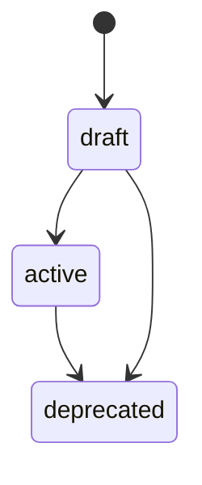

> **DEPRECATED** — Superseded by the v2.0 trio (`Meta_Framework_v2.0`,
> `Code_Side_Documentation_Framework_v1.0`, `Agent_Side_Documentation_Framework_v1.0`).
> See `docs/INDEX.md` for current canonical references. Frozen refs in archive/,
> plans/, and ASSESSMENT docs continue to point here intentionally.

# MJ-Agent 文档管理体系框架

> **适用范围**：mj-agent 项目文档治理 v1.1 体系（Phase 0 Foundation 起生效）
> **目标受众**：开发 / 运维 / 项目负责人 / AI Agent
> **版本**：v1.1
> **最后更新**：2026-04-25
> **派生自**：[[STANDARD]_Documentation_Management_Framework_v5.0|mj-system 文档管理框架 v5.0]]（仅作血统参考，本标准自包含）
> **取代**：[[../archive/rule/[DEPRECATED]_[STANDARD]_MJ_Agent_Documentation_Management_Framework_v1.0|Framework v1.0]]（已归档；见 [[../adr/[ADR]_011_Doc_Versioning_And_Archive_Convention|ADR-011]] 阐述演进决策）

---

## 目录

1. [设计目标](#1-设计目标)
2. [三层文档模型](#2-三层文档模型)
3. [类型与目录](#3-类型与目录)
4. [命名与 Frontmatter](#4-命名与-frontmatter)
5. [状态与生命周期](#5-状态与生命周期)
6. [索引与引用规则](#6-索引与引用规则)
7. [自动校验与 PR 集成](#7-自动校验与-pr-集成)
8. [迁移与落地规则](#8-迁移与落地规则)
9. [Domain 枚举](#9-domain-枚举)
10. [快速操作清单](#10-快速操作清单)

---

## 1 设计目标

> [!NOTE]
> v1.0 的目标：把 mj-system v5.0 已经被验证的治理哲学（三层、最小状态机、自动化优先、生成优于手工）完整继承过来，再针对 Agent 工程特有的一等公民（Skills、Prompts、Evals、Tool Contracts）扩展 4 类 canonical 文档，填补行业空白。

### 1.1 核心原则

| 原则 | 说明 |
|------|------|
| **真实资产优先** | 规则必须覆盖仓库里真实存在并持续使用的文档类型 |
| **目录即职责** | 文档所在层级决定治理强度，避免所有 `.md` 一刀切 |
| **真相源最小化** | 同一条元数据只保留一个权威来源 |
| **流程与文档解耦** | PR 审核、任务完成、发布等流程状态不写入通用文档状态 |
| **生成优先于手工维护** | `INDEX.md` 视为生成物 |
| **in-source 治理** | Agent 运行时加载的 `SKILL.md` 和 `prompts/*.md` 纳入 canonical 治理范围，源码与文档同一真相 |

### 1.2 v1.0 相对 mj-system v5.0 的增量

| 主题 | mj-system v5.0 | mj-agent v1.0 |
|------|----|----|
| canonical 类型 | 8 类（GUIDE/ADR/SPEC/RUNBOOK/POSTMORTEM/STANDARD/ISSUE/ASSESSMENT） | 8 继承 + **4 新增（SKILL/PROMPT/EVAL/CONTRACT）** |
| canonical 位置 | 仅 `docs/**` | `docs/**` + **`src/mj_agent/skills/**/SKILL.md`** + **`src/mj_agent/prompts/*.md`** |
| Domain 枚举 | ETL 生态（AEC/DQV/QCM/QVL...） | **Agent 生态（AGENT/SKILL/PROMPT/TOOL/GUARDRAIL/MEMORY/EVAL/GATEWAY/INTEGRATION/UI/OPS/SYS/SEC/OBS/DATA）** |
| 合并门禁 | A1-A6 | A1-A6 继承 + **A7-A10 新增** |
| 运行时 loader | 无约束 | **必须剥离 YAML frontmatter 后返回 body**（§7.5） |

### 1.3 生效边界

本标准定义 **v1.1 目标态**。v1.0 已归档至 `docs/archive/rule/`（详见 [[../adr/[ADR]_011_Doc_Versioning_And_Archive_Convention|ADR-011]] 阐述演进决策）；mj-agent 仍处于 Phase 0，`docs/` 目录从零新建，不存在 v4.5 或更早版本的迁移遗留。因此：

- **立即生效**：本文档自身以及 Phase 0 已交付的所有 canonical 文档
- **v1.1 相对 v1.0 的增量**：§4.2 强制 filename `_vX.Y` 后缀（适用于 `version` 必填类型）；新增 §5.6 定义 Major.Minor 版本演进流程与 `docs/archive/` 归档机制（HITL 触发，A3 模式 = git branch + PR review）；§5.5 in-source canonical 例外说明；§3.6 增加 archive 子目录用途行
- **Phase 0 不引入的**：`[EVAL]`/`[POSTMORTEM]`/自动校验器/生成式 INDEX——推迟到 Phase 0.5/Phase 1/Phase 2（见 §8）

---

## 2 三层文档模型

### 2.1 目录结构

```text
mj-agent/
├── README.md
├── CONTRIBUTING.md
├── CHANGELOG.md
├── GLOSSARY.md
├── CLAUDE.md
├── docs/                              # canonical 层
│   ├── INDEX.md
│   ├── _templates/
│   ├── adr/
│   ├── api/
│   ├── assessments/
│   ├── contracts/                     # v1.0 新增：[CONTRACT] 默认目录
│   ├── design/
│   │   ├── agent/
│   │   ├── gateway/                   # Phase 2
│   │   ├── memory/                    # Phase 2
│   │   ├── prompts/                   # 历史/实验 PROMPT 版本
│   │   ├── skills/                    # skill 目录索引与跨 skill 模式
│   │   └── ui/                        # Phase 1/3
│   ├── evaluation/                    # v1.0 新增：[EVAL] 默认目录
│   ├── guide/
│   ├── infrastructure/
│   ├── issues/
│   ├── postmortem/
│   ├── rule/
│   ├── runbook/
│   └── archive/
│       └── legacy/
├── plans/                             # working 层
├── src/mj_agent/
│   ├── skills/<name>/SKILL.md         # canonical (in-source)
│   └── prompts/*.md                   # canonical (in-source)
└── evaluation/                        # Phase 2+ 数据集与 judge 代码
```

### 2.2 三层定义

| 层级 | 路径 | 作用 | 强治理 | 示例 |
|------|------|------|-----|------|
| **Canonical** | `docs/**`（排除 `archive/legacy/`）+ `src/mj_agent/skills/**/SKILL.md` + `src/mj_agent/prompts/*.md` | 项目权威文档 | 是 | `[STANDARD]`、`[SKILL]`、`[ADR]` |
| **Working** | `plans/**` | 任务计划 | 否，轻治理 | `[PLAN]_Phase0_LangGraph_Studio_Walkthrough.md` |
| **Legacy** | `docs/archive/legacy/**` | 历史材料 | 否，仅保留可读性 | 暂无 |

### 2.3 in-source canonical 的设计理由

Agent runtime 从 `src/mj_agent/skills/` 和 `src/mj_agent/prompts/` 加载 SKILL.md 与 prompt 文件作为 system prompt 的组成部分。把它们"复制"到 `docs/` 会产生**双份真相源**，带来同步漂移风险。

本标准的选择是把治理范围**扩展到 `src/`**：这两类文件留在 `src/`，但同样要求符合 canonical frontmatter 和合并门禁（见 §4.6、§7.5）。这与 Anthropic 官方 skills 仓库（在 SKILL.md 内使用 YAML frontmatter）的做法一致。

### 2.4 分层规则

| 规则 | 正确 | 错误 |
|------|------|------|
| 权威文档进 canonical | `docs/rule/[STANDARD]_Commit_Message_Convention.md` | `plans/[STANDARD]_Commit_Message_Convention.md` |
| 运行时 skill 进 in-source canonical | `src/mj_agent/skills/query-writing/SKILL.md` | `docs/design/skills/[SKILL]_Query_Writing.md` |
| 任务计划进 working | `plans/[PLAN]_Phase0_Studio_Walkthrough.md` | `docs/plans/...` |
| 历史材料进 legacy | `docs/archive/legacy/<file>.md` | `docs/postmortem/<legacy-report>.md` |

---

## 3 类型与目录

### 3.1 根目录特殊文件

| 文件 | 职责 |
|------|------|
| `README.md` | 项目入口和快速启动 |
| `CONTRIBUTING.md` | 协作与提交流程 |
| `CHANGELOG.md` | 版本变更日志（发布时更新） |
| `GLOSSARY.md` | 术语表（按需创建） |
| `CLAUDE.md` | AI 高频上下文缓存 |

### 3.2 Canonical 类型总览

| 类型 | 目录 | 可变性 | 核心问题 | 继承/新增 |
|------|------|--------|----------|---------|
| `[GUIDE]` | `docs/guide/`、`docs/api/`、`docs/design/{subsystem}/`、`docs/infrastructure/**/` | 可维护 | 如何上手 / 操作 | 继承 |
| `[ADR]` | `docs/adr/`、`docs/design/{subsystem}/` | 基本不可变 | 为什么做出某决策 | 继承 |
| `[SPEC]` | `docs/design/{subsystem}/` | 可维护 | 应该如何设计实现 | 继承 |
| `[RUNBOOK]` | `docs/runbook/`、`docs/infrastructure/**/` | 可维护 | 线上/运维如何执行 | 继承 |
| `[POSTMORTEM]` | `docs/postmortem/` | 不可变 | 事故如何发生与改进 | 继承 |
| `[STANDARD]` | `docs/rule/`、`docs/api/`、`docs/infrastructure/**/` | 可维护 | 项目规则标准 | 继承 |
| `[ISSUE]` | `docs/issues/` | 可追加 | 延后问题与影响 | 继承 |
| `[ASSESSMENT]` | `docs/assessments/` | 基本不可变 | 一轮优化的对比评估 | 继承 |
| **`[SKILL]`** | **`src/mj_agent/skills/<name>/SKILL.md`**（主） + `docs/design/skills/`（目录索引与跨 skill 模式） | 可维护 | Agent 能力的声明式规格 | **新增** |
| **`[PROMPT]`** | **`src/mj_agent/prompts/*.md`**（当前版） + `docs/design/prompts/`（历史/实验版） | 可维护，版本化 | 行为契约 | **新增** |
| **`[EVAL]`** | `docs/evaluation/` | 可维护 | 评估规格、数据集、基线 | **新增** |
| **`[CONTRACT]`** | `docs/contracts/` | 可维护，版本化 | 工具接口与跨服务契约 | **新增** |

### 3.3 Working 类型

| 类型 | 目录 | 作用 |
|------|------|------|
| `[PLAN]` | `plans/` | 任务拆解、阶段性执行计划 |

### 3.4 Agent 专属类型详述

#### 3.4.1 `[SKILL]`

- **目的**：声明一个 agent 能力单元（触发时机、工具依赖、规划工作流、典型模式与反模式）
- **物理位置**：`src/mj_agent/skills/<skill_name>/SKILL.md`，文件名固定为 `SKILL.md`（无 `[SKILL]_` 前缀，因为**目录名即 skill 身份**）
- **目录索引**：`docs/design/skills/INDEX.md` 汇总所有 skill 的一句话摘要（从各 SKILL.md frontmatter 的 `summary` 取）
- **运行时契约**：Agent loader 必须剥离 frontmatter 后把 body 注入 system prompt（见 §7.5）

#### 3.4.2 `[PROMPT]`

- **目的**：记录系统 prompt 或任务 prompt 的当前版本与历史演进
- **物理位置**：
  - 当前活跃版：`src/mj_agent/prompts/<name>.md`
  - 被取代的旧版 / 实验版：`docs/design/prompts/[PROMPT]_<Name>_vX.Y.md`
- **版本化**：通过 frontmatter `version` 字段。新版 active 时，旧版 state 同步改 `deprecated` 并移到 `docs/design/prompts/`
- **运行时契约**：同 SKILL，loader 剥离 frontmatter

#### 3.4.3 `[EVAL]`

- **目的**：描述一个评估（规格 + 数据集位置 + 评委策略 + 基线指标）
- **物理位置**：`docs/evaluation/[EVAL]_<Kind>_<Target>_<Description>_vX.Y.md`
- **evaluation/ 数据集代码**：实际的 `.jsonl` 数据集和 judge Python 代码留在仓库根的 `evaluation/` 目录，由本文档通过 `dataset_path` 字段引用

#### 3.4.4 `[CONTRACT]`

- **目的**：正式定义工具接口或跨服务契约（输入/输出、错误模式、SLO、版本策略）
- **物理位置**：`docs/contracts/[CONTRACT]_<Kind>_<Name>_vX.Y.md`
- **机器可读契约**：通过 `schema_ref` 字段指向 JSON Schema / OpenAPI / Protobuf 文件；`state: active` 时必填（A10）

### 3.5 目录归属优先级

当一份文档可能同时落入多个目录时，按以下优先级判断：

1. **Agent 专属**：进入对应专属目录（`src/mj_agent/skills/**/SKILL.md`、`src/mj_agent/prompts/*.md`、`docs/evaluation/`、`docs/contracts/`）
2. **子系统专属**：进入 `docs/design/{agent|gateway|memory|prompts|skills|ui}/`
3. **基础设施专属**：进入 `docs/infrastructure/{domain}/`
4. **跨子系统 API 约定**：进入 `docs/api/`
5. **跨领域通用规则**：进入 `docs/rule/`
6. **跨领域操作指南**：进入 `docs/guide/`

### 3.6 新目录准入规则

| 规则 | 说明 |
|------|------|
| canonical 顶级目录新增必须修改本框架 | 防止 `docs/` 顶层膨胀 |
| `src/` 内 canonical 范围只有 skills/ 与 prompts/ | 其他源码目录不受文档治理（见 §7.5） |
| working 层仅允许 `plans/` | 任务计划统一聚合 |
| legacy 层禁止作为新文档默认落点 | 仅用于迁移和存档 |
| `docs/archive/<subdir>/` 仅作版本退役搬迁目的 | 由 §5.6.2 流程触发；不可作为新文档默认落点；与 `docs/archive/legacy/` 并存（后者用于 pre-framework 历史归档） |

---

## 4 命名与 Frontmatter

> [!NOTE]
> 本章定义 **字段语义**（必填字段、取值约束、专属字段）。YAML 语法（缩进、引号、多行、日期格式、GitHub 渲染行为）见 [[STANDARD]_GitHub_Markdown|GitHub Markdown 规范 v1.0]] §13。

### 4.1 文件命名

Canonical 文档命名通用模式：

```text
[TYPE][_Subject]_Description[_vX.Y].md
```

特例与专属格式：

| 类型 | 命名格式 | 示例 |
|------|----------|------|
| `[ADR]` | `[ADR]_NNN_Decision_Title.md` | `[ADR]_001_Python_Only_Agent_Runtime.md` |
| `[ISSUE]` | `[ISSUE]_NNN_DomainAbbr_Description.md` | `[ISSUE]_001_SKILL_Query_Writing_Schema_Hint_Drift.md` |
| `[SKILL]` | `SKILL.md`（固定；目录名为 skill 名） | `src/mj_agent/skills/query-writing/SKILL.md` |
| `[PROMPT]` 当前版 | `<prompt_name>.md`（无前缀） | `src/mj_agent/prompts/system.md` |
| `[PROMPT]` 历史版 | `[PROMPT]_<Name>_vX.Y.md` | `docs/design/prompts/[PROMPT]_System_v0.5.md` |
| `[EVAL]` | `[EVAL]_<Kind>_<Target>_<Description>_vX.Y.md` | `[EVAL]_Outcome_WholeAgent_Golden_Questions_v1.0.md` |
| `[CONTRACT]` | `[CONTRACT]_<Kind>_<Name>_vX.Y.md` | `[CONTRACT]_Tool_SQLExecute_v1.0.md` |
| `[PLAN]` | `[PLAN]_Description.md` | `plans/[PLAN]_Phase0_Studio_Walkthrough.md` |

### 4.2 命名规则

| 规则 | 正确 | 错误 |
|------|------|------|
| 文件名用英文和下划线 | `[GUIDE]_Developer_Onboarding.md` | `[GUIDE]_开发者上手指南.md` |
| 仅在消歧时加 Subject | `[SPEC]_Memory_Store_Schema.md` | `[SPEC]_Agent_Memory_Memory_Store.md` |
| `version` 字段必填的类型，filename 必带 `_vX.Y` 后缀（即使当前只有一版） | `[STANDARD]_X_v1.0.md`、`[CONTRACT]_Tool_SQLExecute_v1.0.md`、`[ASSESSMENT]_X_v1.0.md` | `[STANDARD]_X.md`（缺版本号）、`..._v1.0_final.md` |
| SKILL 目录名全小写带连字符 | `src/mj_agent/skills/query-writing/` | `src/mj_agent/skills/QueryWriting/` |

> [!NOTE]
> 第三行规则适用类型：STANDARD / SPEC / EVAL / CONTRACT / ASSESSMENT（依 §4.3 `version` 字段必填类目）。in-source canonical（SKILL/PROMPT）filename 受 loader 约束不带版本号——见 §5.5 例外说明。版本演进语义（何时 bump、bump 后如何归档）见 §5.6。

### 4.3 Canonical 文档必填 Frontmatter

所有 canonical 文档（含 in-source）必须包含：

```yaml
---
type: standard
domain: SYS
summary: 20-60 字摘要，唯一索引/导航来源
owner: 项目负责人
created: 2026-04-24
updated: 2026-04-24
state: draft
version: v1.0
---
```

| 字段 | 类型 | 说明 |
|------|------|------|
| `type` | 字符串 | 小写英文：`guide / adr / spec / runbook / postmortem / standard / issue / assessment / skill / prompt / eval / contract` |
| `domain` | 字符串 | 见 §9 domain 枚举 |
| `summary` | 字符串 | 索引/导航唯一来源，20-60 字 |
| `owner` | 字符串 | 文档负责人或角色 |
| `created` | 日期 | YYYY-MM-DD，不回写 |
| `updated` | 日期 | 最近实质更新 |
| `state` | 字符串 | `draft / active / deprecated` |
| `version` | 字符串 | `[STANDARD]/[SPEC]/[SKILL]/[PROMPT]/[EVAL]/[CONTRACT]` 必填 |

### 4.4 类型专属字段

| 类型 | 字段 | 说明 |
|------|------|------|
| `[ADR]` | `decision` | `accepted / superseded / rejected` |
| `[ISSUE]` | `priority`、`resolution` | `P0-P3`；`open / fixed / wontfix / obsolete` |
| `[ASSESSMENT]` | `dimensions`、`period` | 评估维度列表和周期 |
| `[POSTMORTEM]` | `trace_ref` | LangSmith run ID 或等价引用，便于事故归因 |
| `[SKILL]` | `activation`（对象，含 `when_to_use` 与 `when_not_to_use`）、`tool_dependencies`（list）、`related_prompts`（list） | 不设 `skill_name`；A7 校验目录名与文档一致 |
| `[PROMPT]` | `model_binding`（字符串，如 `deepseek-v3`）、`eval_references`（list）、`token_budget_estimate`（int，可选）、`supersedes`（list） | 用 `version` 表达版本，不另设 `prompt_version` |
| `[EVAL]` | `eval_kind`（`outcome / trajectory / component / integration`）、`dataset_path`（必填，state=active 时必须存在）、`baseline_metric`（字符串）、`baseline_value`（数值）、`target_skill`（字符串，`whole-agent` 为特殊值）、`judges`（list，可选）、`regression_threshold`（数值，可选） | A9 校验 state=active 时 dataset_path 和 baseline |
| `[CONTRACT]` | `contract_kind`（`tool / cross-service / mcp`）、`parties`（list，如 `[mj-agent, mj-system]`）、`schema_ref`（字符串，state=active 时必填） | A10 校验 state=active 时 schema_ref 必填且指向存在文件 |
| 任意类型 | `supersedes`、`aliases`、`tags` | 可选 |
| `[STANDARD]` | `derives_from` | 可选，标记派生来源（如本标准派生自 mj-system v5.0） |

### 4.5 Working 文档 Frontmatter

`plans/**` 轻量 frontmatter：

```yaml
---
summary: 修复 Phase 0 Studio Walkthrough 中 ADR 引用失效的问题
owner: 开发
created: 2026-04-24
updated: 2026-04-24
state: draft
---
```

Working 文档不强制 `type / domain / version`。

### 4.6 in-source canonical 特殊约束

**`src/mj_agent/skills/<name>/SKILL.md`** 和 **`src/mj_agent/prompts/*.md`** 同时是：

1. Agent 运行时加载的文本（被 loader 读进 system prompt）
2. 受本框架治理的 canonical 文档（必须有完整 frontmatter）

由此衍生的约束：

- **Frontmatter 必须位于文件顶部**（YAML 块 `---\n...\n---`），body 紧跟其后
- **Loader 必须剥离 frontmatter 后返回 body**——否则 YAML 块会泄露到 LLM（见 §7.5 运行时契约）
- **Agent 代码不得依赖 frontmatter 字段做运行时分派**（保持元数据只服务文档工具链）

### 4.7 `derives_from` 字段

用于 `[STANDARD]` 标明派生关系。格式：

```yaml
derives_from: <project>/<branch>@<artifact-or-sha>
```

仅作血统追溯，不建立跨仓库自动同步关系。派生 STANDARD 一旦 active，独立演进。

---

## 5 状态与生命周期

### 5.1 全局状态枚举

| `state` | 含义 | 适用范围 |
|---------|------|----------|
| `draft` | 仍在编写或未准备作为权威参考 | 所有类型 |
| `active` | 当前有效、可以被引用为权威来源 | 所有类型 |
| `deprecated` | 保留查阅价值，但不再维护 | 所有类型 |

### 5.2 生命周期



### 5.3 设计约束

| 规则 | 说明 |
|------|------|
| `state` 只表达"是否为当前权威" | 不表达 PR 流程、任务完成或发布进度 |
| 评审态由 GitHub PR 表达 | 不写入文档 |
| 枚举值使用英文小写 | 降低校验歧义 |

### 5.4 类型专属结果字段

| 类型 | 字段 | 取值 |
|------|------|------|
| `[ADR]` | `decision` | `accepted / superseded / rejected` |
| `[ISSUE]` | `resolution` | `open / fixed / wontfix / obsolete` |

### 5.5 PROMPT / SKILL 的版本化与 deprecated 流转

- 新 prompt 版本在 `src/mj_agent/prompts/<name>.md` 以 `state: draft` 进入；通过 A8 检查（附带 EVAL 引用）后提升为 `active`
- 旧 prompt 版本同时改为 `state: deprecated` 并**移动**到 `docs/design/prompts/[PROMPT]_<Name>_v<old>.md`，保留 `supersedes` 链与最后一次 EVAL 引用
- SKILL 原地版本化（仍在 `src/mj_agent/skills/<name>/SKILL.md`），通过 `version` 字段前进；目录重命名视为替换（旧目录删除或归档）

> [!IMPORTANT]
> in-source canonical（SKILL / PROMPT）的版本演进沿用本节既有规则——PROMPT old 移入 `docs/design/prompts/`，SKILL 原地版本字段前进——**不进入 §5.6 流程**。原因：loader 锁定固定 filename（`SKILL.md` / `<name>.md`），filename 不能 carry version；§5.6 的 git mv + archive 流程不适用。SKILL/PROMPT 的"cite by vintage"由历史 PROMPT 文件（`docs/design/prompts/[PROMPT]_<Name>_vX.Y.md`）承担。

### 5.6 Major.Minor 版本演进与 docs/archive/

适用于 frontmatter `version` 必填的 canonical 类型（STANDARD / SPEC / EVAL / CONTRACT / ASSESSMENT；in-source SKILL / PROMPT 见 §5.5）。

#### 5.6.1 触发：HITL 判断在 PR review 时

不预测、不强制提前分类。所有编辑都在 feature branch 上 in-place 进行（标准 git 流程；正在编辑的文件就是 v_old 的"草稿态"，git diff 即变更可见状态）。判断由作者+reviewer 在 PR review 时共同做出：

- **路由更新**（typo、措辞优化、补充示例、轻量澄清）：merge as-is，git commit 承载历史。`version` 不变，filename 不变。
- **正式版本演进**（语义变化、规则增删、字段调整、触发器变更、对外契约变更）：在合并前，PR 重构为包含 §5.6.2 完整操作；作者以"本次为 vX.Y → vX.Y+1（或 vX → vX+1）正式演进"在 PR 描述中显式声明。

边界判断由 reviewer 把关；不引入 CI 自动判定。**核心原则**：只有 PR review 时才需要做出版本判断，避免在编辑过程中预测未来。

#### 5.6.2 正式演进：在 PR 内执行的文件操作

> [!NOTE]
> **执行时机**：在 §5.6.1 判定为正式演进之后、PR 合并之前。可以是同一 feature branch 上的后续 commits，也可以是 PR review 期间的重构提交。

1. 把 PR 已有编辑的当前文件视作 v_new 内容
2. 用 `git show <PR-base>:<path>` 取出 v_old 快照（即编辑前内容）
3. 把快照写入 `docs/archive/<original-subdir>/[TYPE]_X_v<old>.md`，frontmatter `state: active → deprecated`，并在 body 顶部加状态横幅指向 v_new
4. `git mv docs/<subdir>/[TYPE]_X_v<old>.md docs/<subdir>/[TYPE]_X_v<new>.md`
5. 在 v_new 文件 bump frontmatter `version` 与 `updated`；可选 `supersedes` 字段记录被取代的 v_old 全名
6. 审计 corpus 中所有 `[TYPE]_X_v<old>` 的引用：
   - **Living references**（作者意图"引用项目当前权威"）：更新为 `_v<new>`
   - **Frozen references**（作者意图"引用 vX.Y 当时的具体规则"）：保留 `_v<old>`，目标解析至 archive 副本
7. A4 校验全部 wikilink 与 MD-link 解析；A5 同步 INDEX
8. 若触发 §6.4 allowlist，A6 同步 CLAUDE.md

实际命令模板：

```bash
# 假设 v_old=v1.0、v_new=v1.1、PR base=main
git show main:docs/rule/[TYPE]_X_v1.0.md > docs/archive/rule/[TYPE]_X_v1.0.md
git add docs/archive/rule/[TYPE]_X_v1.0.md
# 手工编辑 archive 副本：state→deprecated，加状态横幅
git mv docs/rule/[TYPE]_X_v1.0.md docs/rule/[TYPE]_X_v1.1.md
# 在 v1.1 上 bump frontmatter version+updated；audit corpus refs
```

> 当 v_old 尚未提交到 base 分支时（例如本规范首次落地时 v1.0 自身仍为 untracked），用普通 `cp` / `mv` 替代 `git show` / `git mv` 即可。

#### 5.6.3 docs/archive/ 的版本归档语义

§3.6 仍约束"legacy 层禁止作为新文档默认落点"。本节定义的 archive 操作是对**已存在 active 文档**的版本退役搬迁，不是新文档落点；不与 §3.6 冲突。

`docs/archive/` 子目录镜像原 canonical 目录结构：

| 原路径 | 归档后路径 |
|---|---|
| `docs/rule/[STANDARD]_X_v1.0.md` | `docs/archive/rule/[STANDARD]_X_v1.0.md` |
| `docs/contracts/[CONTRACT]_X_v1.0.md` | `docs/archive/contracts/[CONTRACT]_X_v1.0.md` |
| `docs/evaluation/[EVAL]_X_v1.0.md` | `docs/archive/evaluation/[EVAL]_X_v1.0.md` |
| `docs/assessments/[ASSESSMENT]_X_v1.0.md` | `docs/archive/assessments/[ASSESSMENT]_X_v1.0.md` |

`docs/archive/legacy/`（§2.1）继续作为 pre-framework 历史归档目的，与本节并存。

#### 5.6.4 Living vs Frozen 引用判断

§5.6.2 步骤 6 区分两类 cross-reference：

| 引用类型 | 作者意图 | 升级行为 | 典型场景 |
|---|---|---|---|
| **Living** | "指向项目当前权威" | bump 时跟随升级到 `_v<new>` | INDEX 行、PR 模板、CLAUDE.md、loader 文档串、其他 STANDARD 间互引 |
| **Frozen** | "锁定 vX.Y 当时的具体规则" | bump 时保持 `_v<old>`，自动解析至 archive 副本 | 历史 ADR 中"当时规范状态"段落、past assessment 引用、postmortem 中"事故时规则"段落 |

判断由发起 bump 的作者在 PR 描述中明确列出每条 living/frozen 决策；reviewer 验证一致性。无单一正确答案——同一份文档的不同句子可分别 living / frozen。

### 6.1 索引职责

| 文件 | 职责 | 阶段 |
|------|------|-----|
| `docs/INDEX.md` | canonical 层总入口 | Phase 0 手写；Phase 2 生成 |
| `docs/**/INDEX.md` | 某目录的局部入口 | 按需，优先生成 |
| `docs/design/skills/INDEX.md` | skill 目录索引（从 `src/mj_agent/skills/*/SKILL.md` 扫描生成） | Phase 1+ |
| `plans/` | 默认不生成全局索引 | 永久 |

### 6.2 索引生成原则

| 规则 | 说明 |
|------|------|
| `INDEX.md` 视为生成物 | 允许脚本按 frontmatter 重建 |
| 摘要取自 `summary` 字段 | 不手工编写多份描述 |
| 文档数由扫描得出 | 不手工维护静态计数 |
| GitHub 渲染页面允许 Markdown 相对链接 | 兼顾 GitHub 与 Obsidian |

### 6.3 链接规则

| 场景 | 推荐写法 |
|------|----------|
| 正文内部引用 | `[[STANDARD]_Commit_Message_Convention\|Commit Message 规范]]` |
| 当前文档目录 | `[4 命名与 Frontmatter](#4-命名与-frontmatter)` |
| INDEX 页面（面向 GitHub） | `[Commit Message 规范](./[STANDARD]_Commit_Message_Convention.md)` |
| 跨类型引用（如 EVAL 引用 SKILL） | `[[SKILL:query-writing]]` 或 `[[../../src/mj_agent/skills/query-writing/SKILL.md]]` |

### 6.4 CLAUDE.md 同步策略

只有以下文档变更要求同步检查 `CLAUDE.md`：

| 类别 | 示例 |
|------|------|
| 全局高频标准 | 本文档、Commit 规范、SQL guardrail 规范 |
| 高频运行信息 | 环境变量、部署入口、默认模型 |
| 项目目录入口 | `docs/INDEX.md`、核心子系统目录位置 |

---

## 7 自动校验与 PR 集成

### 7.1 阻塞式检查（合并门禁）

| 编号 | 检查项 | 适用范围 | 自动化阶段 |
|------|--------|----------|-----------|
| **A1** | 路径和文件名合法 | `docs/**`、`plans/**`、`src/mj_agent/skills/**/SKILL.md`、`src/mj_agent/prompts/*.md` | Phase 2 CI |
| **A2** | Frontmatter schema 完整 | canonical 必填字段；working 轻量字段 | Phase 2 CI |
| **A3** | `state` 与专属字段枚举合法 | 所有受治理文档 | Phase 2 CI |
| **A4** | 内部链接目标存在 | canonical 文档和索引页 | Phase 2 CI |
| **A5** | `INDEX.md` 已同步或可重建 | `docs/**` | Phase 2 CI |
| **A6** | allowlist 文档变更同步检查 `CLAUDE.md` | allowlist 见 §6.4 | Phase 0 PR review |
| **A7** | `[SKILL]` 文档路径 `src/mj_agent/skills/<name>/SKILL.md` 的 `<name>` 等于目录名；目录下存在对应 Python 实现（Phase 1+，`__init__.py` 或 registry 注册） | `[SKILL]` | Phase 0 PR review，Phase 2 CI |
| **A8** | `[PROMPT]` 必填 `version`；当 `state: active` 时 `eval_references` 非空（至少一个 `[EVAL]` 文档引用） | `[PROMPT]` | Phase 0 PR review，Phase 2 CI |
| **A9** | `[EVAL]` 当 `state: active` 时 `dataset_path` 指向存在文件；`baseline_metric` 与 `baseline_value` 必填 | `[EVAL]` | Phase 2 CI（Phase 2 才引入 EVAL） |
| **A10** | `[CONTRACT]` 当 `state: active` 时 `schema_ref` 必填并指向存在文件 | `[CONTRACT]` | Phase 0 PR review，Phase 2 CI |

### 7.2 非阻塞式检查

| 检查项 | 原因 |
|--------|------|
| 长度区间 | 适合告警，不适合硬门禁 |
| 时态一致性 | 需要语义判断，误报成本高 |
| 内容边界 | 适合 review，不适合正则化 |
| 摘要质量 | 需要人工判断 |

### 7.3 PR 模板文档检查项

所有 PR 模板（`.github/PULL_REQUEST_TEMPLATE.md` 和 6 份子模板）追加：

- [ ] 新增/修改的 canonical 文档通过 frontmatter schema 自检
- [ ] 若触发 allowlist，`CLAUDE.md` 已同步检查
- [ ] 新增/修改 `[SKILL]` 时对应 `src/mj_agent/skills/<name>/` Python 实现存在或同 PR 添加
- [ ] 新增/修改 `[PROMPT]` state=active 时 `eval_references` 非空
- [ ] 新增/修改 `[EVAL]` state=active 时 `dataset_path` 存在、baseline 填写
- [ ] 新增/修改 `[CONTRACT]` state=active 时 `schema_ref` 存在
- [ ] 必要的 `INDEX.md` 已同步或重生成
- [ ] 受影响的 Wikilink 已检查

### 7.4 创建新文档最小流程

1. 判断层级：canonical / working / legacy
2. 选择类型（含 4 个新增）与目录
3. 从 `docs/_templates/` 复制对应 TEMPLATE
4. 填写 frontmatter 与正文
5. 更新或重建相关 `INDEX.md`
6. PR 自检 A1-A10 清单

### 7.5 运行时 loader 契约

**硬性约束**：任何加载 in-source canonical 文档（`src/mj_agent/skills/**/SKILL.md`、`src/mj_agent/prompts/*.md`）作为 LLM prompt 输入的代码，**必须**：

1. 使用 `python-frontmatter` 或等价 YAML frontmatter 解析器
2. 把 YAML frontmatter 剥离后，**仅返回 body**
3. 独立提供 `load_<kind>_meta(name)` 接口返回解析后的 frontmatter 字典，供文档工具链使用

本项目的 loader 位于：

- `src/mj_agent/skills/__init__.py` 的 `load_skill()`
- `src/mj_agent/prompts/__init__.py` 的 `load_prompt()`

两者在引入 frontmatter 的同一 PR 内必须完成剥离改造。A11（可选升级）可通过单元测试断言 loader 返回值不以 `---\n` 开头。

### 7.6 `.claude/` 目录

`.claude/`（Claude Code 插件与 marketplace 配置）**不属于**本框架治理范围。A1/A2 显式排除该路径。

---

## 8 迁移与落地规则

### 8.1 Phase 0 当前窗口（本次实施）

mj-agent Phase 0 无历史文档迁移。落地清单：

| 产物 | 路径 |
|------|------|
| 本 STANDARD（当前为 v1.1，v1.0 已归档至 `docs/archive/rule/`） | `docs/rule/[STANDARD]_MJ_Agent_Documentation_Management_Framework_v1.1.md` |
| 4 份紧迫模板 | `docs/_templates/TEMPLATE_{ADR,SKILL,PROMPT,CONTRACT}.md` |
| 手写 INDEX | `docs/INDEX.md` |
| 9 份 ADR（CLAUDE.md 已引用） | `docs/adr/[ADR]_{000,001,002,003,006,008,009,010,011}_*.md`（010 为前一 PR 落地，011 为本 v1.1 同期落地） |
| 为 `SKILL.md` 加 frontmatter | `src/mj_agent/skills/query-writing/SKILL.md` |
| 为 `system.md` 加 frontmatter | `src/mj_agent/prompts/system.md` |
| Loader 剥离改造 | `src/mj_agent/skills/__init__.py`、`src/mj_agent/prompts/__init__.py` |
| 依赖更新 | `pyproject.toml` 增加 `python-frontmatter>=1.1` |
| PR 模板增补 | `.github/PULL_REQUEST_TEMPLATE*.md` |
| CLAUDE.md 追加段落 | 指向新 STANDARD 与 `docs/INDEX.md` |

### 8.2 Phase 0.5 过渡期

- 补 `TEMPLATE_{GUIDE,RUNBOOK}.md`
- 落地 ADR-010/011 和 ADR-004/005/007（按需）
- 落地 `[RUNBOOK]_Dev_Local_Walkthrough.md` 和 `[GUIDE]_Add_A_New_Skill.md`
- 落地 `[CONTRACT]_Tool_SQLExecute_v1.0.md`（等 `tools/sql/guardrail.py` 接口稳定）

### 8.3 Phase 1

- 4 个新 `[SKILL]` 文档（含 `mj-ddd-semantics`）
- `[CONTRACT]_MJ_Agent_To_MJ_System_Biz_Domain_v1.0.md`
- skill 目录索引 `docs/design/skills/INDEX.md` 首次生成

### 8.4 Phase 2

- 引入 `[EVAL]` 类型与首批评估：`[EVAL]_Outcome_WholeAgent_*`、`[EVAL]_Trajectory_*`、`[EVAL]_Component_*`
- 引入 `TEMPLATE_{EVAL,POSTMORTEM,ASSESSMENT}.md`
- 开发自动校验器脚本（或从 mj-system 的 `mj-doc:mj-doc-validate` fork）接 CI
- `INDEX.md` 改为生成产物
- `[SPEC]_LLM_Gateway_v1.0.md` 与 `[RUNBOOK]_Eval_Baseline_Refresh.md`

### 8.5 Phase 3+

- `[SPEC]_Generative_UI_v1.0.md`
- `[STANDARD]_Component_Contracts.md`
- RBAC 相关 `[ADR]` 与 `[SPEC]`
- 按需引入 `[MODEL]` 类型（或作为 EVAL 子类）

---

## 9 Domain 枚举

取代 mj-system 的 ETL 枚举，定义 mj-agent 专属 domain 体系：

| 编号 | Domain | 覆盖范围 | 示例文档 |
|---|---|---|---|
| 1 | `AGENT` | agent 图、编排、状态、生命周期 | `[ADR]_001_Python_Only_Agent_Runtime.md` |
| 2 | `SKILL` | 具体 skill（每个 skill 文档的默认 domain） | `src/mj_agent/skills/query-writing/SKILL.md` |
| 3 | `PROMPT` | system prompt 或 prompt 模式 | `src/mj_agent/prompts/system.md` |
| 4 | `TOOL` | 工具实现（SQL、introspection、analysis） | `[CONTRACT]_Tool_SQLExecute_v1.0.md` |
| 5 | `GUARDRAIL` | 运行时安全（只读、schema 白名单、regex） | `[ADR]_006_Fail_Safe_Reads.md` |
| 6 | `MEMORY` | checkpointer、store、semantic cache | `[SPEC]_Memory_Store_Schema.md` |
| 7 | `EVAL` | 评估数据集、judges、baselines | `[EVAL]_Outcome_WholeAgent_*.md` |
| 8 | `GATEWAY` | LLM Gateway（anonymizer / token guard / audit） | `[SPEC]_LLM_Gateway_v1.0.md` |
| 9 | `INTEGRATION` | 跨仓库契约（mj-system biz 域、marketplace、mj-ops） | `[CONTRACT]_MJ_Agent_To_MJ_System_*.md` |
| 10 | `UI` | 前端（Chainlit Phase 1、CopilotKit Phase 3） | `[SPEC]_Generative_UI_v1.0.md` |
| 11 | `OPS` | 部署、CI/CD、监控 | `[ADR]_008_Co_Deployment_With_MJ_System.md` |
| 12 | `SYS` | 跨领域项目级（本框架、commit 规范、glossary） | 本文档 |
| 13 | `SEC` | 认证、授权、RBAC、多团队 | `[ADR]_Phase4_RBAC_With_Casbin.md` |
| 14 | `OBS` | 观测性、追踪、LangSmith、监控告警 | `[GUIDE]_LangSmith_Trace_Analysis.md` |
| 15 | `DATA` | 数据治理、匿名化、审计日志 | `[ADR]_014_Customer_Data_Anonymization.md` |

Domain 选取原则：
- **单选**：一份文档只归入一个最主要的 domain
- **按主题而非目录**：`[ADR]_003_Progressive_Disclosure` 住在 `docs/adr/`，但 domain 是 `PROMPT`（决策主题是 prompt 加载策略）
- **SEC vs GUARDRAIL**：SEC 管"谁可以做什么"（策略），GUARDRAIL 管"运行时强制"（实现）
- **DATA vs MEMORY**：DATA 管"数据的政策/合规"，MEMORY 管"agent 的记忆系统设计"

---

## 10 快速操作清单

### 10.1 新建 canonical 文档

1. 选类型：继承 8 类或新增 4 类之一
2. 选目录（§3.5 优先级）
3. 从 `docs/_templates/` 复制 TEMPLATE
4. 填 frontmatter 与 body
5. 更新相关 `INDEX.md`
6. 过 A1-A10 自检

### 10.2 新建 SKILL

1. 在 `src/mj_agent/skills/<skill-name>/` 新建目录（名称全小写带连字符）
2. 复制 `docs/_templates/TEMPLATE_SKILL.md` 到 `<dir>/SKILL.md`
3. 填 frontmatter：`version: v0.1`、`state: draft`、`activation`、`tool_dependencies`
4. 填 body：Purpose / When to use / Planning workflow / Common patterns / Anti-patterns
5. 在 Python 层实现或注册（Phase 1+ 引入 skill registry 后统一）
6. PR 过 A7 检查

### 10.3 新建 PROMPT 新版本

1. 在 `src/mj_agent/prompts/<name>.md` 原地更新 body 与 `version`；`state` 置 `draft`
2. 准备至少一个 `[EVAL]` 文档（新建或复用）
3. 在新 prompt 的 frontmatter `eval_references` 列出该 EVAL
4. 运行 eval，记录 baseline
5. PR 中 prompt 改为 `state: active`（过 A8）
6. 旧版 `state: deprecated`、移动到 `docs/design/prompts/[PROMPT]_<Name>_v<old>.md`

### 10.4 新建 EVAL（Phase 2 起）

1. 在 `docs/evaluation/` 用 TEMPLATE_EVAL（Phase 2 模板）
2. 指定 `eval_kind`、`target_skill`（或 `whole-agent`）、`dataset_path`
3. 准备数据集文件（仓库根 `evaluation/datasets/`）
4. 指定 `baseline_metric` 与 `baseline_value`
5. 绑定 judges（如 LLM-judge prompt）
6. PR 过 A9

### 10.5 新建 CONTRACT

1. 在 `docs/contracts/` 用 TEMPLATE_CONTRACT
2. 指定 `contract_kind`、`parties`
3. 配对编写机器可读 schema（JSON Schema / OpenAPI），放在约定位置
4. `schema_ref` 指向该 schema（state=active 时必填）
5. PR 过 A10

---

## 参考

- 派生自：`mj-system/develop/docs/rule/[STANDARD]_Documentation_Management_Framework_v5.0.md`
- 行业对齐：Anthropic Skills（`github.com/anthropics/skills`，SKILL.md + YAML frontmatter）；ADR 标准（`adr.github.io`）
- 工具：`python-frontmatter`（PyPI）、`mj-doc:*` Skills（mj-agentlab-marketplace，Phase 1+ 评估复用）
