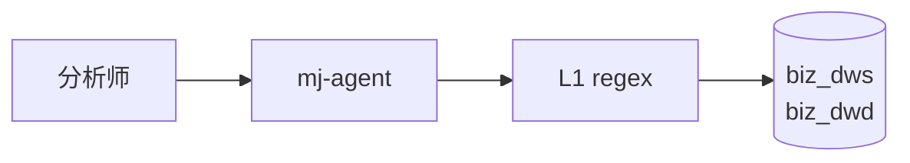

# mj-agent GitHub-Flavored Markdown 编写规范

> **适用范围**：所有 `docs/**` canonical 文档、`plans/**` working 文档、`src/mj_agent/skills/**/SKILL.md` 与 `src/mj_agent/prompts/*.md` 两类 in-source canonical、以及仓库根 `README.md / CHANGELOG.md / CLAUDE.md`。
> **目标受众**：开发 / 文档撰写者 / AI Agent
> **版本**：v1.0
> **最后更新**：2026-04-24
> **与 Framework v1.1 的关系**：本标准管 **语法 / 排版**（怎么写合法的 Markdown 与 YAML）；[[STANDARD]_MJ_Agent_Documentation_Management_Framework_v1.1|Framework v1.1]] §4 管 **字段语义**（哪些字段必填、取值约束）。两篇在各自对应章节互引。

---

## 目录

1. [核心原则](#1-核心原则)
2. [文本格式](#2-文本格式)
3. [标题](#3-标题)
4. [列表](#4-列表)
5. [链接](#5-链接)
6. [代码](#6-代码)
7. [表格](#7-表格)
8. [GitHub Alerts 提示框](#8-github-alerts-提示框)
9. [Mermaid 图表](#9-mermaid-图表)
10. [数学公式](#10-数学公式)
11. [脚注](#11-脚注)
12. [杂项](#12-杂项)
13. [YAML Frontmatter 语法规范](#13-yaml-frontmatter-语法规范)
14. [参考](#14-参考)

---

## 1 核心原则

| 原则 | 说明 |
|------|------|
| **GitHub 渲染优先** | 文档的"基线视觉"是 GitHub 网页端渲染结果。Obsidian、VS Code Preview 等其他渲染器是加分项而非标准 |
| **CommonMark + GFM 基底** | 仅使用 [CommonMark](https://commonmark.org/) 定义的核心语法加 [GitHub Flavored Markdown](https://github.github.com/gfm/) 扩展；不依赖特定工具的方言扩展 |
| **Docs-as-Code** | 文档与代码同仓、同 PR、同 review；Markdown 是源文件，不是排版中间产物 |
| **AI 可读** | 结构（heading 层级、frontmatter 字段）必须可被 `python-frontmatter` 等工具机读；Claude Code 加载器依赖 frontmatter 剥离行为（见 [[STANDARD]_MJ_Agent_Documentation_Management_Framework_v1.1|Framework v1.1]] §7.5） |
| **与 Obsidian 双模共存** | Framework v1.0 §6.3 允许在正文内部使用 Obsidian Wikilink。本标准**不禁用**，但在 §5.4 明确这些语法在 GitHub 侧的降级行为，让作者知情选择 |

> [!IMPORTANT]
> 本标准不覆盖 **内容风格**（用词、语气、信息架构）。那是独立主题，留给未来 `[STANDARD]_Writing_Style.md`。

---

## 2 文本格式

| 效果 | 语法 | 渲染 |
|------|------|------|
| 粗体 | `**粗体**` | **粗体** |
| 斜体 | `*斜体*` | *斜体* |
| 粗斜 | `***粗斜***` | ***粗斜*** |
| 删除线 | `~~删除~~` | ~~删除~~ |
| 行内代码 | `` `code` `` | `code` |

**中英文混排**：英文单词与中文之间 **建议** 留一个空格（如 `mj-agent 项目`），提升可读性；本标准不强制，现有文档不一致可容忍。

**粗体/斜体中的 code**：`**`和 `code` 之间需要在 `**` 外、`` ` `` 内：``**`load_skill()`**`` 渲染为 **`load_skill()`**。

---

## 3 标题

### 3.1 基本规则

- 使用 ATX 风格 `# 标题`，**不用** Setext 风格（`===` / `---` 下划线）
- `#` 与文字之间 **必须** 一个空格：`# 标题`（✅）/ `#标题`（❌，不渲染为标题）
- 每篇文档 **仅一个 H1**；H1 一般等于文件主题
- 同一篇文档内不要跳级（H2 → H4 跳过 H3）

### 3.2 锚点 ID 生成

GitHub 对每个 heading 自动生成锚点 id，规则（摘录自 GFM 实际行为）：

1. 小写化所有 ASCII 字母
2. 空格 → `-`
3. 非字母、数字、连字符、下划线、中文字符的符号被丢弃（括号、逗号、句号等）
4. 中文字符 **保留**（GitHub 支持中文锚点）
5. 连续同名 heading 追加 `-1`、`-2` 作去重后缀

示例：

| Heading 文本 | 生成的锚点 ID |
|------|------|
| `# 核心原则` | `#核心原则` |
| `## 1 核心原则` | `#1-核心原则` |
| `## 3.2 锚点 ID 生成` | `#32-锚点-id-生成` |
| `## Data boundary (L1-L4)` | `#data-boundary-l1-l4` |
| `## ADR-006 Fail-Safe Reads` | `#adr-006-fail-safe-reads` |
| `## 列表` 在同文档出现两次 | 第二个为 `#列表-1` |

> [!WARNING]
> 不要用 `{#custom-id}` 手写锚点 —— GitHub **不渲染** 这种语法，`{#xxx}` 会原样成为 heading 文本的一部分。需要稳定 id 时，请调整 heading 文案。

### 3.3 常见错误

- `# 标题 {#anchor}` —— 手写锚点无效，`{#anchor}` 会被当作 heading 正文
- 同一文档两处完全相同的 H2，导致后者锚点被加 `-1` 后缀，跨文档链接容易断
- 中英文 heading 混用时未留空格（如 `## 3章 Overview`），锚点难预测

---

## 4 列表

### 4.1 无序列表

项目统一使用 `-` 作无序标记（不混用 `*` / `+`）：

```markdown
- 一级项
  - 二级项（缩进 2 空格）
    - 三级项（缩进 4 空格）
```

### 4.2 有序列表

```markdown
1. 第一步
2. 第二步
3. 第三步
```

GFM 会按源文件序号渲染，但为可读性 **建议** 手动写对序号。复杂文档可全部写 `1.`（GFM 会自动递增），以降低后续插入步骤的 diff 成本。

### 4.3 任务列表（GFM）

```markdown
- [ ] 未完成
- [x] 已完成
```

> [!TIP]
> 本仓 `plans/` 与 `.github/PULL_REQUEST_TEMPLATE.md` 大量使用任务列表追踪 PR 检查项。GitHub 在 Issue/PR 页面会把任务列表渲染为可勾选控件。

### 4.4 常见错误

- 嵌套缩进不一致（有时 2 空格、有时 4 空格）导致列表断裂 —— 统一 **2 空格**
- 任务列表中 `[x]` 大写 `[X]`：GitHub 接受，但为一致性用小写
- 有序列表与前一段之间必须有空行，否则不渲染

---

## 5 链接

> [!NOTE]
> 链接写法的 **业务层** 选择（何时用 Wikilink、何时用相对链接）由 [[STANDARD]_MJ_Agent_Documentation_Management_Framework_v1.1|Framework v1.1]] §6.3 定义。本节补充 GitHub 渲染侧的语法细节与降级行为。

### 5.1 相对链接（GitHub 渲染的首选）

```markdown
[文档管理框架](./[STANDARD]_MJ_Agent_Documentation_Management_Framework_v1.1.md)
[ADR-001](../adr/[ADR]_001_Python_Only_Agent_Runtime.md)
```

路径规则：

| 场景 | 写法 | 说明 |
|------|------|------|
| 同目录 | `./file.md` | `./` 推荐显式写出 |
| 上级目录 | `../sibling/file.md` | 相对当前文件 |
| in-source canonical 跨层 | `../../../docs/rule/[STANDARD]_X.md` | 如 `src/mj_agent/skills/query-writing/SKILL.md` 跳 `docs/rule/` |
| 锚点 | `[章节](./file.md#章节锚点)` | 锚点规则见 §3.2 |
| 路径含中文 | 一般 **无需** URL-encode（GitHub 自动处理） | 但路径含空格必须 `%20` |
| 路径含方括号 | 如 `[STANDARD]_X.md`，**无需** 转义 | GFM 对方括号宽容 |

### 5.2 外部链接

```markdown
[GFM 规范](https://github.github.com/gfm/)
<https://github.github.com/gfm/>
```

- 链接文案应描述目标，**不要** 用裸 URL 作文案（不利无障碍阅读）
- 不用 URL shortener（如 `bit.ly`），可读性与审计性都差

### 5.3 锚点与手写 TOC

GitHub 右上角菜单的 `Outline` 可显示自动目录，但：

- PR 视图（Files changed）不展示 Outline
- 移动端不展示 Outline
- 跨文档引用 heading 必须手写锚点

所以本项目惯例 **仍然手写 TOC**（如本文档开头 `## 目录`）。锚点生成规则见 §3.2。

### 5.4 Obsidian Wikilink 在 GitHub 的行为

Framework v1.0 §6.3 允许 **正文内部引用** 使用 Wikilink：

```markdown
见 [[STANDARD]_Commit_Message_Convention|Commit Message 规范]]
见 [[#4 命名与 Frontmatter]]
```

> [!WARNING]
> GitHub Web **不解析** `[[...]]` 语法：会原样显示为文本 `[[STANDARD]_Commit_Message_Convention|Commit Message 规范]]`。
>
> **建议**：
> - **INDEX 类 / 面向新访客的文档**（`README.md`、`docs/INDEX.md`、PR 描述）→ 用相对链接 §5.1
> - **canonical 正文跨文档互引**（ADR ↔ ADR、SKILL ↔ PROMPT）→ 可用 Wikilink，保留 Obsidian 图谱价值；但作者要意识到 GitHub 读者看到的是原文本

### 5.5 `related` frontmatter 字段

frontmatter 中的 `related:` 列表是 **双向链接** 在 GitHub 侧的替代方案（GitHub 不支持反向链接索引）。YAML 语法见 §13；字段何时必填、取值约束见 Framework v1.0 §4。

---

## 6 代码

### 6.1 行内代码

```markdown
使用 `python-frontmatter` 解析 YAML
```

含反引号的内容用 **双反引号** 包裹并留内侧空格：

```markdown
``用 `frontmatter.load(path)` 解析``
```

### 6.2 Fenced 代码块

项目统一使用 **反引号** 作代码围栏。波浪号 `~~~` 仅作为 **嵌套转义** 使用 —— 当文档需要展示含 `` ``` `` 的内容时（如本节示例），外层用 `~~~` 包裹内层 `` ``` ``，是 GFM 唯一的合法嵌套形式。

~~~markdown
```python
def load_skill(name: str) -> str:
    ...
```
~~~

**必须** 标注语言 hint，以启用语法高亮。本项目常用：

| 语言 hint | 场景 |
|------|------|
| `python`、`py` | Python 代码 |
| `bash`、`sh` | Shell 脚本与 CLI 示例 |
| `powershell`、`ps1` | PowerShell 脚本（如 `scripts/setup-env.ps1`） |
| `sql` | SQL 查询 / DDL |
| `yaml` | Frontmatter 或配置 |
| `toml` | `pyproject.toml` 片段 |
| `json` | JSON 配置或示例 |
| `diff` | 展示补丁片段 |
| `text` | 无语法需求的纯文本（目录树、日志） |
| `mermaid` | Mermaid 图表（见 §9） |

### 6.3 长代码示例的规范

**不要** 把长代码整段粘到文档 —— 改用 **文件路径 + 行号** 引用：

```markdown
见 `src/mj_agent/llm.py:35-48` 的错误处理逻辑。
```

好处：代码演化时文档不滞后；读者点击路径可直接在 IDE / GitHub 定位。

### 6.4 常见错误

- 遗漏语言 hint，高亮失效
- 用 `~~~` 围栏 —— CommonMark 允许但本项目统一 `` ``` ``
- 代码块前后缺空行，被并入前段

---

## 7 表格

### 7.1 基本语法

```markdown
| 列 1 | 列 2 | 列 3 |
|------|------|------|
| a    | b    | c    |
```

### 7.2 对齐

| 语法 | 对齐 |
|------|------|
| `:---` | 左（默认） |
| `:---:` | 居中 |
| `---:` | 右 |

### 7.3 特殊字符

- 单元格内 `|` 必须转义：`\|`
- 换行用 `<br>`：`| a <br> 第二行 |`
- 不支持跨行单元格（没有 rowspan / colspan）

### 7.4 使用建议

- **用表格**：枚举、对比、字段定义、状态机取值
- **不用表格**：流程步骤（用有序列表）、长段文字（表格内 HTML `<br>` 很快失控）

### 7.5 常见错误

- 表头分隔行短横线少于 3 个 —— 部分渲染器不识别，GFM 最少 1 个但 **建议 3 个**
- 列数不匹配 —— 多余列被截断，少列用空白补齐，易误读
- 转义 `\|` 遗漏导致整行断列

---

## 8 GitHub Alerts 提示框

GitHub 自 2024 年起原生支持 **5 种** Alert 类型，语法为 blockquote 首行标记：

```markdown
> [!NOTE]
> 补充细节；次要但值得留意。

> [!TIP]
> 优化建议或捷径。

> [!IMPORTANT]
> 必须知道的关键信息。

> [!WARNING]
> 潜在风险或易踩的坑。

> [!CAUTION]
> 危险操作，可能造成不可逆后果。
```

### 8.1 约束

> [!CAUTION]
> GitHub Alerts **不支持**：
> - 折叠（Obsidian 的 `> [!note]-` 折叠语法）
> - 嵌套 Alerts（Alert 内再嵌 Alert）
> - 自定义类型（Obsidian 的 `[!abstract] / [!summary] / [!info] / [!question]` 在 GitHub 渲染为普通 blockquote）

### 8.2 每种类型的使用场景

| 类型 | 场景 | 示例 |
|------|------|------|
| `NOTE` | 背景信息、默认行为说明 | "Phase 0 默认关闭 thinking mode" |
| `TIP` | 可选的优化 | "使用 `uv run` 加速本地启动" |
| `IMPORTANT` | 不遵守会出错但不危险 | "必须走 `load_skill` 读 SKILL.md，不要 `open().read()`" |
| `WARNING` | 易错 / 性能陷阱 | "`SELECT *` 在大表上会超时" |
| `CAUTION` | 可能破坏数据或安全 | "不要把 admin 凭据写入 `.env`" |

### 8.3 从 Obsidian 迁移提示

mj-system 的 Obsidian 标准使用 `> [!abstract]` 作文档摘要。在 mj-agent 中改写为：

- 文档摘要 → 放在 frontmatter `summary:` 字段（机读优先）
- 章节前的语境说明 → 用普通 blockquote（单 `>` 前缀）或 `> [!NOTE]`

---

## 9 Mermaid 图表

GitHub 原生渲染 ` ```mermaid ` 围栏块。官方文档：<https://mermaid.js.org/>。

### 9.1 推荐类型

| 类型 | 用途 |
|------|------|
| `flowchart LR/TB` | 流程、拓扑 |
| `sequenceDiagram` | 交互时序（LLM ↔ tool ↔ DB） |
| `stateDiagram-v2` | 生命周期（见 Framework v1.0 §5.2） |
| `classDiagram` | 数据模型、领域模型 |
| `erDiagram` | 数据库 ER 图 |
| `gantt` | 里程碑与进度 |

### 9.2 示例

~~~markdown

~~~

### 9.3 注意

> [!WARNING]
> GitHub 的 Mermaid 版本相对 [mermaid.live](https://mermaid.live) 有滞后。避免使用最近 3 个月内才进入 mermaid 主线的语法特性；先在 PR preview 确认可渲染。

- `graph` 关键字是旧语法，**用 `flowchart`** 代替
- 中文节点名可以，但含括号、引号时用反引号或双引号包裹：`A["节点 (带括号)"]`

---

## 10 数学公式

GitHub 自 2022-05 起原生支持 LaTeX 数学（基于 MathJax），无需额外插件。

### 10.1 语法

```markdown
行内：$x^2 + y^2 = r^2$
块：

$$
E = mc^2
$$
```

### 10.2 使用注意

> [!NOTE]
> `$...$` 行内数学在 **某些 Markdown 语法附近** 会被误解析。如 `$a_1$ 与 $b_1$` 中的下划线可能被当作斜体。遇到此类情况，**改用块级** `$$...$$`（安全）。

- 块级公式前后 **必须** 空行
- 公式本身遵循 LaTeX 标准；不支持 `\usepackage` 等全局指令

---

## 11 脚注

GFM 支持脚注：

```markdown
这是一段正文[^note1]，后面有更多内容[^源]。

[^note1]: 第一条脚注的定义。
[^源]: 可以用中文标识符；定义通常放文档末尾。
```

- 脚注 id 可为任意字符（数字、英文、中文）
- 定义可放文档任意位置，GitHub 统一在页面底部渲染并生成回跳链接
- 不支持脚注嵌套脚注

---

## 12 杂项

### 12.1 水平分隔线

三个或更多 `-`、`*`、`_` 独占一行（前后各一空行）：

```markdown
---
```

项目统一用 `---`（不用 `***` / `___`）。

### 12.2 块引用

```markdown
> 引用内容
>
> 多段用 `>` 连续前缀
>
> > 嵌套引用
```

纯 `>` 不带 `[!...]` 标识就是普通 blockquote，不触发 Alert 样式。

### 12.3 HTML 注释

```markdown
<!-- 这段话在渲染后不可见，但在源文件和 python-frontmatter 读取时保留 -->
```

用途：
- 模板占位（作者改写前不显示）
- 编辑者之间的备忘
- **不适合** 存放机密 —— 源文件公开可见

### 12.4 内联 HTML

GFM 允许少量内联 HTML（如 `<br>`、`<sub>`、`<kbd>`）。本项目：

- **允许**：`<br>`（表格内换行）
- **允许**：`<details><summary>...</summary>...</details>`（可折叠块，用于 FAQ / 长日志）
- **避免**：`<div>`、`<span>`、CSS style 属性 —— 破坏 Obsidian 兼容性，也不利机读解析

---

## 13 YAML Frontmatter 语法规范

> [!IMPORTANT]
> 本节定义 **YAML 语法**（缩进、引号、多行、日期格式）。字段名、必填字段、字段语义见 [[STANDARD]_MJ_Agent_Documentation_Management_Framework_v1.1|Framework v1.1]] §4.3-4.7。

### 13.1 位置与界定符

```markdown
---
type: standard
summary: ...
---

# 正文从此开始
```

- Frontmatter **必须在文件首行**（不接受 BOM / 空行前置）
- 前后各一行独立的 `---`
- 第二个 `---` 之后建议一空行，再接正文

### 13.2 GitHub 渲染行为

> [!NOTE]
> GitHub Web 页面 **隐藏** frontmatter（从第一个 `---` 到第二个 `---` 之间的内容不显示）；源文件保留原样。
>
> 这意味着：
> - 读者看不到 frontmatter —— 不要把关键读者信息放里面
> - 工具链（`python-frontmatter`、本项目的 `load_skill()` / `load_prompt()`）可正常解析
> - PR diff 视图会完整展示 frontmatter 变更，便于审查

### 13.3 语法规则

| 规则 | ✅ 正确 | ❌ 错误 |
|------|---------|---------|
| 缩进：**2 空格**，不用 tab | `related:\n  - a.md` | tab 或 4 空格 |
| 字符串默认不加引号 | `owner: ranzuozhou` | `owner: "ranzuozhou"`（多余） |
| 含冒号的字符串必须引号 | `title: "mj-agent: 标题"` | `title: mj-agent: 标题` |
| 值**以** `#` / `&` / `*` / `[` / `{` **开头**时必须引号（中部出现无需） | `summary: "[alpha] note"` | `summary: [alpha] note` |
| 列表：**block style**，不用 flow | `tags:\n  - a\n  - b` | `tags: [a, b]` |
| 日期：**ISO-8601 YYYY-MM-DD** | `created: 2026-04-24` | `created: 2026/04/24` / `created: Apr 24, 2026` |
| 布尔：小写 | `tracing: true` | `tracing: True` / `tracing: yes` |
| 空值用显式 `null` 或空字符串 | `schema_ref: null` | `schema_ref:`（歧义） |

### 13.4 多行字符串

**字面量**（保留换行）：

```yaml
description: |
  第一行
  第二行
```

**折叠**（换行折叠为空格）：

```yaml
description: >
  这两行会被渲染成
  一行。
```

> [!TIP]
> `summary` 字段应当短（Framework §4.3 约定 20-60 字），通常用单行字符串；多行只用在 `description` / 长 `notes` 等次要字段。

### 13.5 本文档自身的 frontmatter（dogfooding）

查看本文件开头的 `---` 块 —— 它遵守本节定义的全部规则：

- ✅ 位于文件首行
- ✅ 2 空格缩进
- ✅ 列表 block style
- ✅ 日期 ISO-8601
- ✅ 含特殊字符的 `summary` 不加引号（无冒号、无 YAML 特殊字符）

### 13.6 常见错误

- `tags: [a, b]` —— flow style 可解析但不一致
- `created: 2026/04/24` —— 不被解析为日期
- tab 缩进 —— `python-frontmatter` 直接报错
- `summary: "这是摘要"` —— 引号多余（除非含冒号或其他特殊字符）

---

## 14 参考

### 14.1 上游规范

- [CommonMark 0.31.2](https://commonmark.org/) —— Markdown 基础语法的唯一规范来源
- [GitHub Flavored Markdown Spec](https://github.github.com/gfm/) —— GFM 扩展（表格、任务列表、删除线、自动链接）
- [GitHub Docs — Basic writing and formatting syntax](https://docs.github.com/en/get-started/writing-on-github/getting-started-with-writing-and-formatting-on-github/basic-writing-and-formatting-syntax) —— GitHub 额外支持的 Alerts、Mermaid、数学公式
- [YAML 1.2 Spec](https://yaml.org/spec/1.2.2/) —— Frontmatter 的语法基础

### 14.2 项目内部关联

- [[STANDARD]_MJ_Agent_Documentation_Management_Framework_v1.1|MJ-Agent 文档管理框架 v1.1]] —— frontmatter 字段语义、文档治理规则（§4 / §6.3 / §7.5）
- `docs/_templates/TEMPLATE_*.md` —— 各 canonical 类型的骨架（frontmatter 已符合本标准）
- `CLAUDE.md §Documentation` —— 运行时 loader 对 frontmatter 的消费约束

### 14.3 派生来源

- 派生自：`mj-system/develop/docs/rule/[STANDARD]_Obsidian_Markdown.md`
- 适配思路：砍去 Obsidian-only 语法（`[[wikilink]]` 仍保留但说明 GitHub 行为、`![[embed]]` 删除、`^block-id` 删除、12 种 Callout 收敛为 5 种 Alerts、inline `#tag` 删除）；新增 GFM 特有章节（数学公式、GitHub Alerts 的 5 类型约束、Mermaid 版本滞后说明）。
