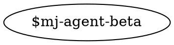

# Codex carrier preface

> **This file is a generated artifact.** It is a deterministic translation of
> `.claude/skills/<this-skill>/SKILL.md` produced by `scripts/sdd/agents_sync.py`;
> never edit it — edit the source through its own gates and re-run sync.
>
> **Semantic difference declaration.** The Claude Code harness primitives this
> body references — `ask`-gates, permission prompts, protected-path prompts,
> `PreToolUse` hooks, `.claude/settings.json`, `guard-git-workflow` — are NOT
> present under your harness. Read every such reference as an AGENTS.md
> self-enforced duty (repo-root `AGENTS.md`, "Self-enforced boundaries"): the
> stop points themselves are tool-neutral; only the carrier differs. Claude
> tool names (Edit / Write / Read / Bash and friends) and Claude
> self-references likewise read as "your own equivalent tool / yourself".
> `OWNER_APPROVAL_REQUIRED` stop points bind you exactly as written.
>
> **Optional skill calls.** Before following any `superpowers:*` or other
> optional-skill reference, run your CURRENT capability discovery: if the skill
> is discoverable, invoke it (`$skill-name` or an explicit "use skill-name");
> if it is not, perform the manual equivalent the body describes. These
> references are not Claude-only and must not be skipped on the assumption
> that they are.
>
> **Peer skills.** `$mj-agent-*` names and `.agents/skills/<name>/SKILL.md`
> paths refer to your native carriers of the same shared skills; dependency
> routes annotated as `codex-route:<edge-id>` blocks carry the registered
> substitute when a target has no carrier.

# mj-agent Alpha

Use `AskUserQuestion` to pick the mode before starting.

> [codex-interaction:site-alpha-mode] Ask the user and wait before continuing — present the prompt, options and default above verbatim; do not continue on your own.

## Decide gate

The Owner gate uses AskUserQuestion for the final call.

> [codex-owner-gate:site-alpha-gate] OWNER_APPROVAL_REQUIRED(declared-contract-change) — present the prompt, options and default above verbatim, ask the Owner, stop, and wait.

## Graph



<!-- codex-route:edge-alpha-beta -->
> Codex route: invoke `$mj-agent-beta` (native carrier; call, always)

## Steps

See [beta source](.agents/skills/mj-agent-beta/SKILL.md), superpowers:brainstorming,
PreToolUse hooks in .claude/settings.json, and Claude tools like Edit.

The prose token /mj-agent-beta here is not an edge.

## Sub-skill Calls

| Sub-skill | when |
|---|---|
| `$mj-agent-beta` | always |

## Handoff

Delegating this to Codex substitute edge-alpha-gamma when needed.

<!-- codex-route:edge-alpha-gamma -->
> Codex route: perform the gamma procedure manually and record the result.

- item $mj-agent-beta call

```
next → Codex substitute edge-alpha-gamma
```
